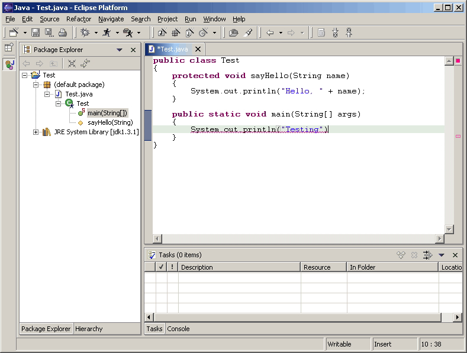
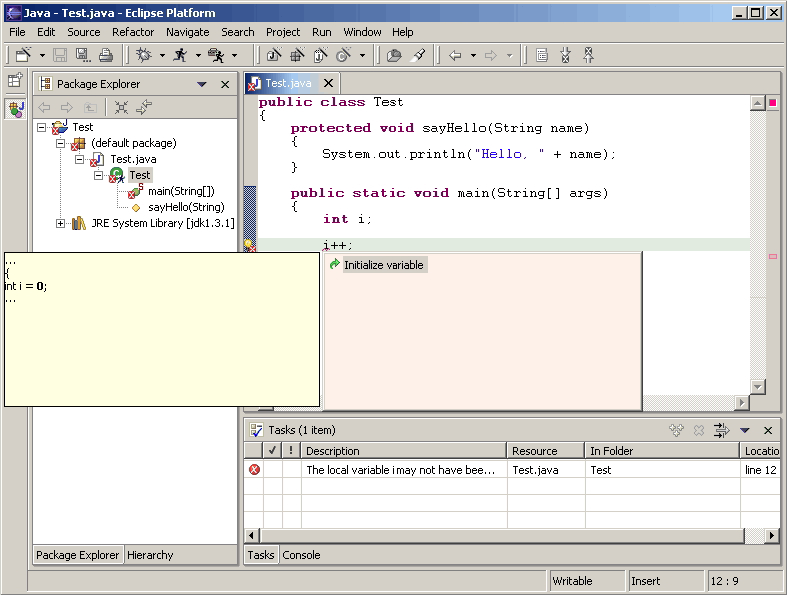
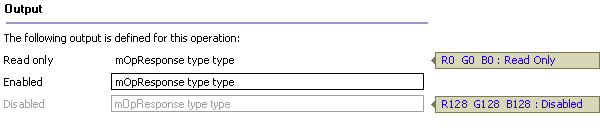

== Best Practices

In this section, we provide examples of best practices for designing and
implementing some common user interactions within the Eclipse platform.

=== Syntax and Compilation Error Handling

When designing editors that provide syntax or compilation checking
support, follow the Java tooling design in the Eclipse platform.

Provide on the fly syntax checking if possible. Use red "squiggle" to
indicate where the potential error is located in the source code. Use a
red box on the side bar on the right side to indicate the approximate
error position in the file. Use a prominent marker on the upper right
hand corner to indicate that the file contains errors or warnings. Use
red color to indicate errors, and use yellow to indicate warnings.

After users perform a save operation, user a more prominent marker on
the left hand side margin to indicate errors and warnings in the file.
When using the mouse pointer to hover over the marker, the description
text should be displayed. In addition, show the icon decorator in the
content editor tab. In the tree view that shows the resource in the
Eclipse workspace, use icon decorator to indicate errors or warnings
associated with this resource, and propagate the icon decorator
indication up to the parents of the resource in the tree view. Finally,
an entry should be added to the Task view to list the errors and
warnings.

image::images/Bp2.gif[bp2]

=== Coding Assistance

In addition to supporting the standard content assist in an editor,
editors should exploit the use of Quick Fixes and Quick Assist. Use the
light bulb marker on the left hand side margin to provide suggestions on
how to fix problems with the source code. Users can click on the light
bulb or use menu:Edit[Quick Fix] menu item to invoke this command.

Even when there are no syntax errors in the file, users should be able
to obtain certain quick assistance with their code using the Quick Fix
mechanism. For example, assigning an expression to a local variable.

image::images/Bp4.gif[bp4]

If an editor is used for writing code in a given programming language,
hyper-linked code support should be enabled. While using the mouse
pointer to hover over the source code, pressing the kbd:[Ctrl] key will turn
the programming language constructs such as class, method, and field
identifiers into clickable links to the corresponding declaration.

image::images/Bp5.gif[bp5]

When possible, a plug-in should provide refactoring support at the
programming language or application development level. For example, if
users rename a method in a Java class, refactoring support should enable
users to automatically find and fix up all references. If users change
the URL for a given resource in a Web application, refactoring support
should enable users to automatically update the references to the
modified URL.

image::images/Bp6.gif[bp6]

=== Context Menu

Here is one suggested process to reason why a menu item should be added
or removed from the context menu. The objective is to reduce the number
of context menu items to *no more than 20*.

. Remove menu items that are not sensitive to selections.
. Remove menu items that are not frequently used.
. Examine the items that are not sensitive to selection but are frequently used. 
  Add at most of 5 of these items back. 
. Remove all disabled menu items, except for clipboard operations such as copy 
  and paste, and team, compare and replace submenus. 
. Remove menu items that are frequently used, selection sensitive, but have a 
  dominant keyboard shortcut key defined, except for clipboard and save 
  operations.

=== Labels, Fonts and Layout for Flat Look Design

For Flat Look design, when using buttons with ellipses (except for the
btn:[More...] button), it should pop up a secondary window which can be a
dialog box or a wizard.

Use Title capitalization for section titles. The distance between
section columns should be 32 pixels.

On pages with listbox on the left hand side, the distance be between the
list box and the right-hand column (e.g., showing properties for a
selected listbox item) should be 10 pixels.

image::images/Flatlook7.gif[flatlook7]

For labels and fields, use RGB value (160, 160, 164) for enabled state,
RBG value (0, 0, 0) for read-only state, and RBG value (128, 128, 128)
for disabled state.

For listbox control, use RBG value (0, 0, 0) for the border to indicate
enabled state, use RBG value (128, 128, 128) for disabled state.

image::images/Flatlook9.gif[flatlook9]

=== Decorators

Enabling and disabling the decorators are extremely useful when the
decorations performed by two or more decorators conflict with each
other. For example, the EGit plug-in might decorate the base image by
superimposing the base image with a custom image while the "Decorate
Example" plug-in might superimpose a different custom image at the same
position thereby conflicting with the EGit plug-in decoration. If the
decoration performed by two different decorators on the same resource
conflict, users should appropriately enable / disable different
decorators to get the required decoration.

==== Implementation Tip
It is very important to design custom decorators that don't conflict
with basic decorations provided by different Eclipse views. For example,
the package explorer view decorates Java files with problem markers (a
problem marker is placed at the bottom left hand corner) if there are
compilation errors. It is a bad practice to decorate resources with
custom decoration exactly at the position of a problem marker and
developers should avoid this. If the custom decoration is performed at
the bottom left corner, then custom decoration and the problem marker
decoration, if any, conflict each other and hence users will not be able
to view the decorations. The solution to the above mentioned problem is
to provide a custom image decoration at the bottom right corner which
does not conflict with the basic image decoration provided by Eclipse.
The top left corner is the second best place although it conflicts with
the binary project decorator. The bottom left and top right should be
avoided as they are decorated outside of the decorator mechanism.