= Component Development

== Commands
A command, which is invoked by a user to carry out some specific
functions, may appear as an item in a menu, or an item in a toolbar. In
reflection of this, it has attributes for the menu or tool item label,
tooltip, and image.

As a plug-in developer, you can contribute commands to the window menu
bar and toolbar, or to individual views and editors. Contribution to the
window is performed using an action set, a set of task oriented commands
which the user can show or hide. Contribution to a view or editor is
performed using individual command.

Here is an illustration of the main areas of contribution.

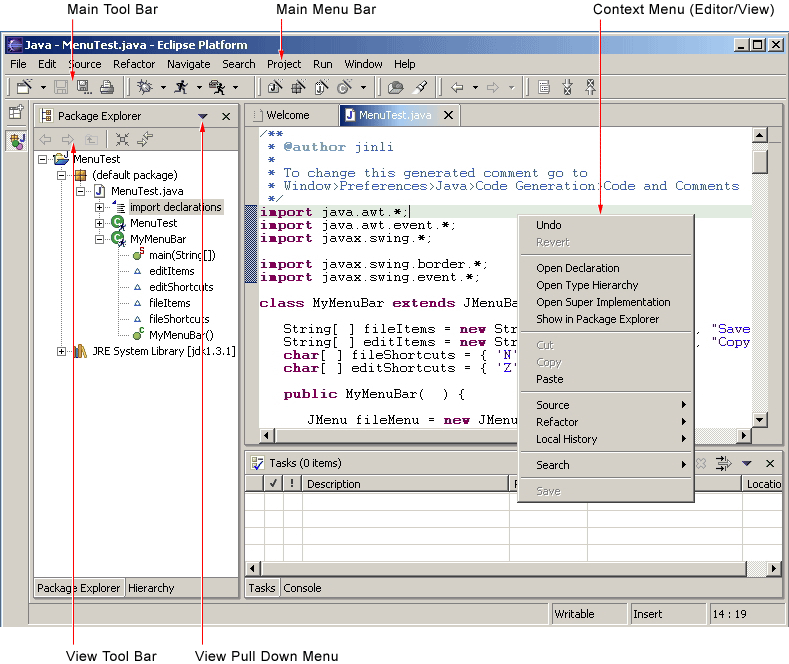

In this section we'll look at general command guidelines. For
information on window, view, or editor specific guidelines, see
xref:#_windows[Windows], xref:#_views[Views], and xref:#_editors[Editors].

=== Appearance

Each command must have a label, tool tip, and image. If the command
appears in a toolbar, the command image will be displayed on all
platforms. If the command appears in a menu, the image will be displayed
on only some platforms, such as Windows® 2000. The label and tool tip
should use Headline style capitalization, as defined in General UI
Guidelines.

Each command must provide one full color image. This image will be
displayed if the mouse is placed over the command. It will also be used
to generate the enabled, disabled, and pressed images which appear in
normal command use. Commands which are contributed in code also have the
option to define explicit images for enabled, disabled, and roll over.
This option can be used for greater control over image appearance.

The following snapshot shows the valid use of Headline capitalization in
a toolbar.

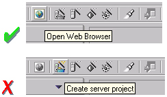

TIP: [guideline3.1]*Guideline 3.1* +
Each command must have a label, tool tip, and full color image. The
label and tool tip must use Headline style capitalization.

The tool tips for a command should describe the __behavior which
occurs__if the command is invoked, independent of the current state. For
push buttons, the label should decribe the result of users pushing the
button. For toggle buttons, it should describe its effect when the item
is toggled on, and the label should not change depending on the state of
the button. In Eclipse, it is recommended that the tool tip
for a command uses the same text as that for the command label. For
instance, in the following snapshot the behavior of the Show Type
Hierarchy button is shown using one tool tips text.

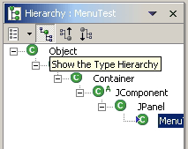

TIP: [guideline3.2]*Guideline 3.2* +
The command tooltip should describe the result of the command, not the
current state of the command. Use the text same as that for the command
label.

For consistency, any command which has a similar behavior to existing
commands in the workbench, should adopt the same terminology.

When creating a resource, the term "New" should be used in an command or
wizard. For instance, "New File", "New Project" and "New Java Class".
The term "Delete" should be used when deleting an existing resource.

When creating an object inside a resource (e.g., a tag in an XML file; a
method or field in a Java class), the term "Add" should be used; the
user is adding something to an existing resource.

TIP: [guideline3.3]*Guideline 3.3* +
Adopt the labeling terminology of the workbench for New, Delete and Add
commands.

=== Enablement

An command should be enabled only if it can be completed successfully.
If this is not the case, the command should be disabled.

TIP: [guideline3.4]*Guideline 3.4* +
An command should be enabled only if it can be completed successfully.

Command enablement should be quick to calculate. If it is too expensive
to calculate the enablement of an command, the command should be
optimistically enabled. If the command is invoked, it should calculate
the real enablement, and show a dialog to the user if it is not
available.

TIP: [guideline3.5]*Guideline 3.5* +
Command enablement should be quick. If command enablement cannot be
quick, enable the command optimistically and display an appropriate
message if the command is invoked, but cannot be completed.

== Dialogs
A dialog is used for modal interaction with the user. It can be used to
solicit information, or provide feedback.

=== Initialization

When a dialog first opens, the initial focus should be given to the
first control where information is required from the user. This control
can be determined by the tab order of controls until a control is found
where information is required. If the dialog provides simple feedback,
or requires simple confirmation from the user, the initial focus may
also be assigned to the default button.

TIP: [guideline4.1]*Guideline 4.1* +
When a dialog opens, set the initial focus to the first input control in
the container. If there are no input controls, the initial focus should
be assigned to the default button.

=== Multiple Item Selection
Slush Bucket widgets (also known as the Twin Box design) should flow
from the left to the right with the source objects on the left and
selected files on the right.

Slush Buckets should also have the following control buttons, in this
order, for moving objects from the source the selected buckets.
[cols=",",]
|=========================================================
|*Button* |*Function*
|Add -> |Add whatever is selected on the left to the right
|<- Remove |Remove selected items from the right
|Add All -> |Add all (whether they are selected or not)
|<- Remove All |Remove all
|=========================================================

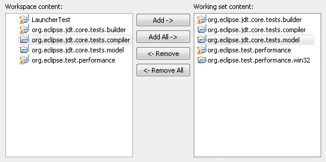

TIP: [guideline4.2]*Guideline 4.2*
Slush Bucket widget (or Twin Box) should flow from left to right with
the source objects on the left hand side. It should have the control
buttons in this order: 'Add ->', '', '

== Wizards

In Eclipse, a wizard is commonly used for the creation of new resources,
resource import, or resource export. It can also be used for the
execution of any task involving a sequential series of steps. A wizard
should be used if there are many steps in the task, and they must be
completed in a specific order.

TIP: [guideline5.1]*Guideline 5.1* +
Use a wizard for any task consisting of many steps, which must be
completed in a specific order.

=== Appearance

At the top of each wizard is a header, containing a banner graphic and a
text area. The banner graphic contains an image representing the wizard
task, and should be created with a white to blue, gray scale palette for
consistency with other banners in Eclipse. These colors also avoid
distracting the user from the important fields of the wizard. The text
area is used to prompt the user for information which is absent, and
display error messages if information is invalid. The presence of the
header, with banner graphic and text area, creates a more polished feel,
and greater perception of quality to the wizard.

At the bottom of each wizard, a Back, Next, Finish, and Cancel button
should appear.

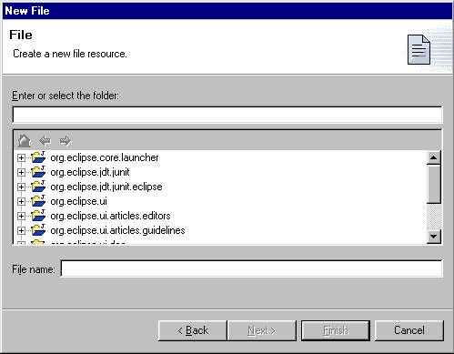

TIP: [guideline5.2]**Guideline 5.2** +
Each wizard must contain a header with a banner graphic and a text area
for user feedback. It must also contain Back, Next, Finish, and Cancel
buttons in the footer.

=== Initialization

When a wizard first opens, the focus should be placed in the first field
requiring information (see Guidelines 3.1). The header should be used to
prompt the user for the first piece of required information.

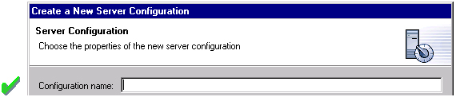

It is not appropriate to display an error message. At this point, the
user hasn't done anything yet.

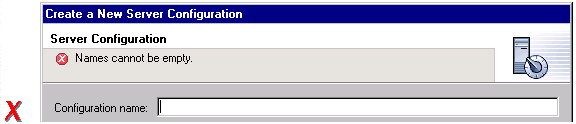

TIP: [guideline5.3]**Guideline 5.3** +
Start the wizard with a prompt, not an error message.

The initial state of the wizard should be derived from the context where
it is opened. For instance, in the New File wizard, the current
workbench selection is examined. If it points to a valid project or
folder, the wizard will pre-populate the parent field with the parent
project or folder name, and put cursor focus in the next field requiring
user input. If the user's selection does not point to a valid parent
project or folder, the wizard will not pre-populate the folder name.
Instead, it will leave the field blank and put the cursor focus in the
field. When the user's selection is on a file, a wizard may also go
through these calculations using the parent folder or project of the
file.

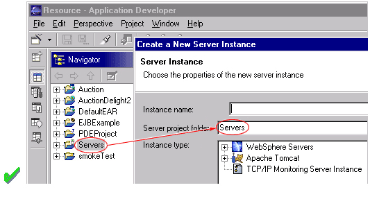

TIP: [guideline5.4]**Guideline 5.4** +
Seed the fields within the wizard using the current workbench state.

=== Validation of Data
Information validation within a wizard should be done in tab order. If
the first required field is empty, an informative prompt should be shown
in the text area, directing the user to fill in the field. If the first
required field is in error, an error message should be shown in the text
area. If the first required field is valid, check the next field, and so
on. The text area should not be used to display more than one prompt or
error at a time.

If dialog information is absent or invalid, the Next or Finish buttons
should be disabled until the situation is resolved. When resolution
occurs, and all of the information has been provided, the Next or Finish
buttons may be enabled.

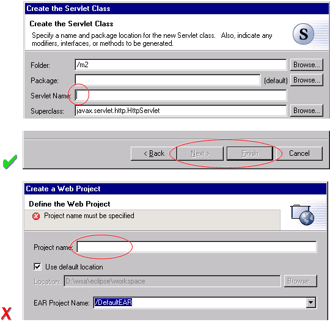

Error messages should be displayed only when user input is invalid.

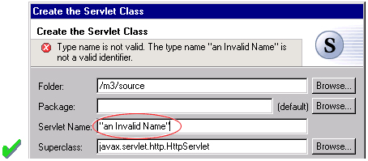

TIP: [guideline5.5]*Guideline 5.5* + 
Validate the wizard data in tab order. Display a prompt when information
is absent, and an error when information is invalid.

TIP: [guideline5.6]*Guideline 5.6* +
Enable the Next / Finish buttons only if all required information in the
dialog is present and valid.

The error messages in a wizard should be intended for the end user, not
the developer. With this in mind, message IDs should never be presented
as part of the error text in the wizard's header area.

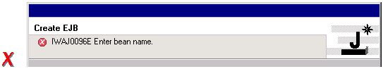

TIP: [guideline5.7]*Guideline 5.7* +
Remove all programming message ID's from wizard text.

=== Browse Buttons
An edit field and "Browse..." button combination should be used whenever
an existing object is referenced within a wizard. The edit field is used
for direct input of the existing object, and the Browse button is used
to browse and select the object from a list of all possible choices.

For instance, in the New Java Class wizard, a "Browse..." button is
placed beside the "Super Class" edit field. If the browse button is
pressed, a Browse Dialog will appear, and the user can select a super
class. This pattern should be used whenever a link will be established
between a new object and an old one. The "Browse..." button should be
located to the right of the edit field.

TIP: [guideline5.8]**Guideline 5.8** +
Use a Browse Button whenever an existing object is referenced in a
wizard.

In the Browse Dialog, invalid choices should not appear. When the dialog
is closed, and focus returns to the parent control, refresh the
enablement state of controls within the dialog. In particular, refresh
the enablement of Next, Finish, and OK buttons.

An example of valid and invalid filtering is shown in the following
snapshot.

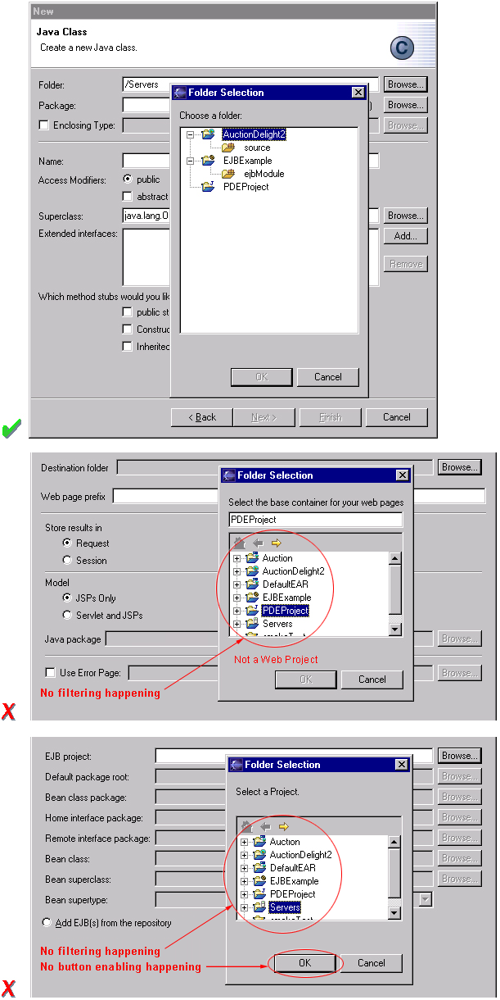

=== Wizard Completion
The New Resource and Import Wizards commonly create new files, folders,
and projects within the workbench. If a single file is created, the
wizard should open the file in an editor in the active page. If more
than one file is created, open the most important, or central file. This
makes it easier to modify and save the file.

Have a readme.html file for every example project, and open that
readme.html automatically upon project creation. This will give users an
immediate overview of the example: what it does, prerequisites,
limitations, steps to take, and so on.

TIP: [guideline5.9]*Guideline 5.9* +
If a new file is created, open the file in an editor. If a group of
files are created, open the most important, or central file in an
editor. Open the readme.html file upon creation of an example project.

If a new project is created, the wizard should change the active
perspective within the workbench to one which is appropriate for the new
project type. In Eclipse v2.1, users are prompted to confirm the switch
to the preferred perspective when creating a new project. To avoid loss
of context, plug-ins should use this, and not automatically switch
without prompting. If users want to switch automatically in the future,
they can choose "Do not show this message again" in the confirmation
dialog.

TIP: [guideline5.10]*Guideline 5.10* +
If a new project is created, prompt users and change the active
perspective to suit the project type.

In either case, where a file, folder, or project is created, the wizard
should select and reveal the new object in the appropriate view. This
provides concrete evidence to the user that, yes, the new object was
created and now exists.

TIP: [guideline5.11]*Guideline 5.11* +
If a new object is created, select and reveal the new object in the
appropriate view.

In many situations, the creation of a resource may involve the creation
of a project or folder to contain the resource. If the containing
project or folder can be created from within the wizard (with a very
reasonable set of defaults), the wizard should allow it. If the creation
of such resources requires detailed user interaction in order for parent
project or folder to be set up correctly, the wizard should not attempt
to do this. Instead, the wizard error text should instruct the user that
"The specified project does not exist".

The EAR Import wizard in IBM's WebSphere Studio is an example where
allowing the user to specify the name of the parent project in place
makes for a much more usable interaction. In this case, based on the
user provided name, the wizard goes off and creates not only the EAR
project itself, but also any web projects, etc., that may be needed as
well.

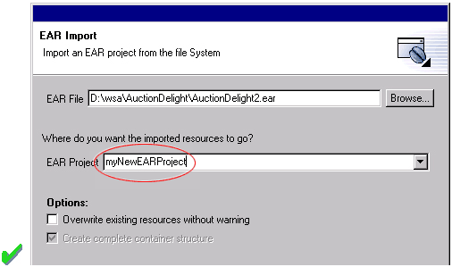

TIP: [guideline5.12]*Guideline 5.12* +
Create folder objects in a wizard if reasonable defaults can be defined.

=== Terminology

Within a creation wizard, if the item being created must be a Project
(not a folder below a project), the term "Project" should be used. If it
can be a folder below the project, the term "Folder" should be used. In
addition, use the "name" suffix (uncapitalized) and no other prefix for
the input field label. For example, use "Project name" or "Folder name"
but not "Project Name" or "Server Project name".

TIP: [guideline5.13]*Guideline 5.13* +
Use the term "Project name" for the input field label when the item must
be a Project; otherwise, use the term "Folder name". Do not qualify the
term.

== Editors

An editor is a visual component within a workbench page. It is used to
interact with the primary content, which may be a document or data
object. In every case, this content is the primary focus of attention
and a reflection of the primary task.

TIP: [guideline6.1]**Guideline 6.1** +
Use an editor to edit or browse a file, document, or other primary
content.

Modifications made in an editor follow an open-save-close lifecycle
model. When an editor first opens, the editor contents should be
unmodified (clean). If the contents are modified, the editor should
communicate this change to the platform. In response, an asterisk will
appear in the editor tab. The modifications should be buffered within
the edit model, until such a time as the user explicitly saves them. At
that point, the modifications should be committed to the model storage.

TIP: [guideline6.2]**Guideline 6.2** +
Modifications made in an editor should follow an open-save-close
lifecycle model.

An editor is document or input-centric. Each editor has an input, and
only one editor can exist for each editor input within a page. This
policy has been designed to simplify part management.

TIP: [guideline6.3]**Guideline 6.3** +
Only one instance of an editor may exist, for each editor input, within
a perspective.

In addition, it should be possible to open a separate instance of an
editor for each different input.

TIP: [guideline6.4]**Guideline 6.4** +
It must be possible to open a separate instance of an editor for each
different input.

=== Appearance

The editor should be labeled with the name of the resource being edited;
not with the name of the editor.

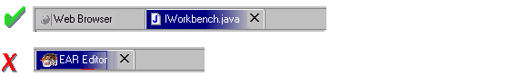

TIP: [guideline6.5]*Guideline 6.5* +
The editor should be labeled with the name of the file, document, or
input being edited.

If the editor contains more than one page, a tab control should be used
for page activation. The use of this control is demonstrated by the
plugin file and html editors.

Tab labels should be kept to one word, and two words at most.

TIP: [guideline6.6]*Guideline 6.6* +
In multipage editors, use a tab control for page activation.Tab labels
should be kept to one word, and two words at most.

=== Menus

An editor may contribute items directly to the window menu bar. All of
the commands available in the editor should be displayed in the window
menu bar, for accessibility and clarity. Exceptions are for the obvious
commands, e.g., basic navigations such as next / previous character,
line, word.

TIP: [guideline6.7]**Guideline 6.7** +
All of the commands, except for the obvious commands, available in the
editor should be added to the window menu bar.

The following format is recommended, to ensure consistency across
Eclipse and better ease of use.
[cols=",,",]
|=======================================================================
|Edit |(one or more editor specific menus) |Window

|Add any object centric commands here |(commands belong to the specific
menus) |Actions to control what you see in the editor.
|=======================================================================

TIP: [guideline6.8]*Guideline 6.8* +
Use the standard format for editor contributions in the window menu bar.

The window menu bar contains a number of global commands, such as Cut,
Copy, and Paste in the Edit menu. These commands target the active part,
as indicated by a shaded title area. If these commands are supported
within an editor, the editor should hook these window commands, so that
selection in the window menu bar or toolbar produces the same result as
selection of the same command in the editor. The editor should not
ignore these commands, and contribute duplicate commands to the window
menu bar or toolbar.

A complete list of the global commands is declared in the
IWorkbenchActionConstants.java (see below).

[source,java]
----
/** 
 * From IWorkbenchActionConstants.
 * Standard global commands in a workbench window.
 */
public static final String [] GLOBAL_ACTIONS = {
    UNDO,
    REDO,
    CUT,
    COPY,
    PASTE,
    PRINT,
    DELETE,
    FIND,
    SELECT_ALL,
    BOOKMARK
};
----

TIP: [guideline6.9]**Guideline 6.9** +
If an editor has support for Cut, Copy, Paste, or any of the global
commands, these commands must be executable from the same commands in
the window menu bar and toolbar.

=== Toolbars

An editor may contribute commands directly to the window toolbar. The
toolbar is used to expose the _most commonly used_ commands in an
editor. Any command which appears in the toolbar must also appear in the
menu, but there is no need to duplicate every command in the menu within
the toolbar.

TIP: [guideline6.10]*Guideline 6.10* +
Fill the editor toolbar with the most commonly used items in the view
menu.

The use of a local toolbar within an editor is contrary to the design of
the workbench. Within the workbench, the toolbar for an editor is shared
with editors of the same type. This reduces the flash which occurs when
you switch between editors, reduces the number of images and commands in
the product, and creates a better feel of integration.

=== Context Menus

A context menu should be used for context sensitive interaction with the
objects in an editor. If an object is selected in an editor, and the
context menu is opened, the context menu should contain only commands
which are appropriate for the selection. Commands which affect the
presentation of the view should not appear in the context menu.

In a text editor, you may assume that there is only one type of
selection: text. In this case, the contents of the context menu will
remain consistent for any selection in the editor.

TIP: [guideline6.11]*Guideline 6.11*
Fill the context menu with selection oriented commands.

For consistency with other editors in Eclipse, each editor should adopt
a common order for commands within the context menu. This format is
shown in the following table. Within this table, each item represents a
category of commands. The categories within the context menu should be
kept distinct from one another through the use of separators.
[cols="",]
|======================
|Undo / Redo, Save
|Add
|Show In
|Cut Copy Paste
|Delete
|Other Plugin Additions
|======================

TIP: [guideline6.12]*Guideline 6.12* +
Use the standard format for editor context menus.

For good spatial navigation, fill the context menu with a fixed set of
commands for each selection type. Once the contents have been defined,
the enablement state of each command should be determined using the
selected object state. In doing so, you establish a consistency which
makes the menu more predictable, and easier to navigate.

TIP: [guideline6.13]*Guideline 6.13* +
Fill the context menu with a fixed set of commands for each selection
type, and then enable or disable each to reflect the selection state.

One of the primary goals for the platform UI is extensibility. In fact,
it is this extensibility which gives you the freedom to add new views,
editors, perspectives, and actions to the platform. Of course,
extensibility is a two way street. While you may wish to extend the
platform, others may wish to extend your view or editor. It is common
for one plug-in to add actions to the menu, toolbar, or context menu of
an editor from another plugin.

In the platform, the menu and toolbar for an editor are automatically
extended by the platform. In contrast, context menu extension is
supported in collaboration between the editor and the platform. To
achieve this collaboration, an editor must register each context menu it
contains with the platform. It should also define an command filter for
each object type in the editor. An command filter makes it easier for
one plug-in to add an command to objects in an editor defined by another
plug-in. The target is described using object type and attributes. For
more information on the implementation of this concept, refer to
http://www.eclipse.org/articles/viewArticle/ViewArticle2.html[Creating
an Eclipse View.]

TIP: [guideline6.14]*Guideline 6.14* +
Register all context menus in the editor with the platform.

TIP: [guideline6.15]*Guideline 6.15* +
Implement an Command Filter for each object type in the editor.

=== Resource Deletion

When a resource is deleted from one of the navigators (e.g., Navigator
view, J2EE view, Data view, or DBA Explorer view in IBM's WebSphere
Studio), the handling of any editor that is currently open on that
resource depends on whether the editor has any unsaved changes.

If the editor does not contain any changes since the resource was last
saved then the editor should be immediately closed.

TIP: [guideline6.16]*Guideline 6.16* +
If the input to an editor is deleted, and the editor contains no
changes, the editor should be closed.

If the editor contains changes to the resource since the resource was
last saved (i.e., it is "dirty"), the editor should give the user a
chance to save their changes to another location, and then close. Here
is a sample of the dialog which should be displayed:

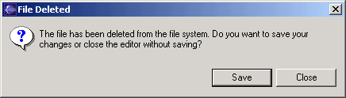

TIP: [guideline6.17]*Guideline 6.17* +
If the input to an editor is deleted, and the editor contains changes,
the editor should give the user a chance to save their changes to
another location, and then close.

=== Unsaved Changes

If the editor contains changes to the resource since the resource was
last saved (i.e., it is "dirty"), an asterisk should be used to prefix
the resource name presented in the editor tab:

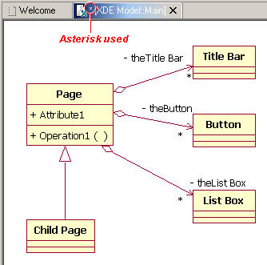

TIP: [guideline6.18]*Guideline 6.18* +
If the resource is dirty, prefix the resource name presented in the
editor tab with an asterisk.

=== Read-Only Files

With a name like "editor", it's not surprising that the issue of
read-only files may cause confusion. If it's read-only, how can you edit
it? In this case, you should fall back to first principles.

NOTE: A view is typically used to navigate a hierarchy of information, open an
editor, or display properties for the active editor. An editor is
typically used to edit or browse a file, document or other input object.

This statement is appropriate whether a file is read-only or not. In
either case, the user should be able to select the file, open it, and
browse the contents within an editor. If the file is read-only, the File
> Save command should be disabled and the File > Save As should be
enabled. In the status bar area, "Read-only" should be shown instead of
the default "Writable" message.

TIP: [guideline6.19]*Guideline 6.19* +
Treat read-only editor input as you would any other input. Enable the
Save As if possible. Display "Read-only" in the status bar area.

=== Integration with Other Views

In Eclipse, there is a special relationship between each editor and the
Outline view. When an editor is opened, the Outline view will connect to
the editor, and ask it for an outline model. If the editor answers an
outline model, that model will be displayed in the Outline view whenever
the editor is active. The outline is used to navigate through the
content, or interact with the edit data at a higher level of
abstraction.

For instance, if you open a .java file in an editor, the structure of
the class is displayed in the Outline view. If you select a method or
field in the outline, the text declaration of that item will be selected
and revealed in the editor. If you select a method or field, and open
the context menu, you can interact with the item as a conceptual unit,
rather than just a bunch of text.

In general, an editor should provide an outline model to the Outline
view if the data within the editor is too extensive to see on a single
screen, and will yield a structured outline. This structured outline
makes it very easy to navigate through objects like a java file or html
file.

TIP: [guideline6.20]*Guideline 6.20* +
If the data within an editor is too extensive to see on a single screen,
and will yield a structured outline, the editor should provide an
outline model to the Outline view.

When an editor has an interaction with the Outline view, notification
about location should be two-way. That is, the user should be able to
select something in the outline and have the editor position updated,
and the user should be able to select something in the editor pane and
have the outline view updated.

A context menu should be available, as appropriate, in the outline view
which should support creation operations as appropriate.

TIP: [guideline6.21]*Guideline 6.21* +
Notification about location between an editor and the Outline view
should be two-way. A context menu should be available in the Outline
view as appropriate.

If the edit model contains errors or warnings, they should be indicated
in the Outline view. An error or warning image should be added to the
item with the error or warning respectively. A container should have a
red X if it there are errors on the container itself, a gray X if any of
its descendents have errors (but not the container itself), and no X if
neither the container nor any of its descendents have errors. For
instance, in the following line, the addFastView method has an error, so
an error image is added to the item and its parent.

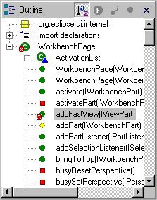 

For this to work, care must be taken to design icons with overlay in
mind, so that glyphs can be applied to the ancestor's icon.

TIP: [guideline6.22]*Guideline 6.22* +
An error or warning image should be added to items with the error or
warning respectively. A container should have a red X if it there are
errors on the container itself, a gray X if any of its descendents have
errors (but not the container itself), and no X if neither the container
nor any of its descendents have errors.

In an editor, task objects are commonly used to mark a location within a
document. Once a task has been created, it appears in the Task view. If
the task is selected, you may reopen the editor at the location defined
in the Task.

TIP: [guideline6.23]*Guideline 6.23* +
If appropriate, implement the "Add Task" feature in your editor.

A bookmark object can also be used mark a location within a document.
Once a bookmark has been created, it appears in the Bookmarks view. If
the bookmark is selected, you may reopen the editor at the location
defined in the Task.

TIP: [guideline6.24]*Guideline 6.24* +
If appropriate, implement the "Add Bookmark" feature in your editor.

=== Line Numbers

Editors with source lines of text should have line numbers, and
optionally column numbers. Editors should also support Navigate -> Goto
Line... menu allowing users to quickly jump to a desired line. The
current line and column numbers should be shown in the status line
(column number is optional). It's optional for the editor to show line
numbers for each line in the editor itself.

TIP: [guideline6.25]*Guideline 6.25*+
Editors with source lines of text should show the current line and
optionally column numbers the status line. It's optional for the editor
to show line numbers for each line in the editor itself.

=== Table Cell Editors

If the editor contains tables with editable cells, a single-click over a
cell should select the current item and put the cell into edit mode. In
edit mode, any dropdowns, buttons, or other controls in the cell should
be rendered upon the single-click.

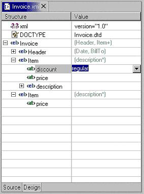

TIP: [guideline6.26]*Guideline 6.26* +
Table cell editors should support the single-click activation model, and
in edit mode, they should render complex controls upon single-click.

In addition, changes should be committed once a user clicks off the cell
or hits ENTER.

The following are examples of good behaviour for a table cell editor:

- when put in edit mode, drop-down appears with current selection active
& highlighted +

- when cursoring through drop-down using arrow keys, it is possible to
move up and down any number of choices and the drop-down stays visible
until user makes an explicit selection +
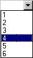

- first letter navigation is supported as a cursoring technique when the
drop-down is visible- supports the "Enter" key as a way of making an explicit selection via
the keyboard when the drop-down is visible- supports the "Esc" key as a way of canceling a selection via the
keyboard when the drop-down is visible- when put in edit mode, the drop-down control (the down-arrow image)
appears with current selection active & highlighted + 
image:images/cell3.png[]

- when put in edit mode, it is possible to arrow key through the choices
to make a selection without needing to invoke the drop-down

TIP: [guideline6.27]*Guideline 6.27* +
Changes made in a table cell editor should be committed when a user
clicks off the cell or hits the "Enter" key. Selection should be
cancelled when user hits the "Esc" key.First letter navigation should be
supported as a cursoring mechanism within a cell.

=== Error Notification

If you are doing keystroke by keystroke validation in an editor, use red
squiggles to underline the invalid content. When users move the mouse
over the red squiggles, display the error text in a fly-over pop up box.

TIP: [guideline6.28]*Guideline 6.28* +
When performing fine-grain error validation in an editor, use red
squiggles to underline the invalid content. When users move the mouse
over the red squiggles, display the error text in a fly-over pop up box.

When the Save command is invoked in an editor, use the Problems view for
showing errors which are persisted.

TIP: [guideline6.29]*Guideline 6.29* +
Use the Problems view to show errors found when the Save command is
invoked.

=== Interaction With External Editors

While a resource is opened within the workbench, if modifications are
made to it outside of the workbench, we recommend the following approach
to handle this situation. When the Save command is invoked in the
editor, users should be prompted to either override the changes made
outside of the workbench, or back out of the Save operation. If desired,
this user prompt can be invoked sooner such as when the editor regains
the focus.

TIP: [guideline6.30]*Guideline 6.30* +
If modifications to a resource are made outside of the workbench, users
should be prompted to either override the changes made outside of the
workbench, or back out of the Save operation when the Save command is
invoked in the editor.

== Views

A view is a visual component within a workbench page. It is used in a
support role for the primary task. You use them to navigate a hierarchy
of information, open an editor, or view properties for the active
editor.

TIP: [guideline7.1]*Guideline 7.1* +
Use a view to navigate a hierarchy of information, open an editor, or
display the properties of an object.

Modifications made in a view should be saved immediately. For instance,
if a file is modified in the Navigator, the changes are committed to the
workspace immediately. A change made in the Outline view is committed to
the edit model of the active editor immediately. For changes made in the
Properties view, if the property is a property of an open edit model, it
should be persisted to the edit model. If it is a property of a file,
persist to file.

In the past, some views have tried to implement an editor style
lifecycle, with a Save command. This can cause confusion. The File menu
within a workbench window contains a Save command, but it applies to
only the active editor. It should not target the active view. This leads
to a situation where the File > Save command is in contradiction to the
Save command within the view.

TIP: [guideline7.2]**Guideline 7.2** +
Modifications made within a view must be saved immediately.

Within a perspective, only one instance of a particular view can be
opened. This policy is designed to simplify part management for a user.
The user opens a view by invoking Perspective > Show View. If, for any
reason, they lose a view, or forget about its existence, they can simply
invoke Perspective > Show view again to make the view visible.

TIP: [guideline7.3]*Guideline 7.3* +
Only one instance of a view may exist in a perspective.

In a multi-tasking world, humans often perform more than one task at a
time. In Eclipse, task separation can be achieved by creating a separate
perspective for each task. In reflection of this, a view must be able to
be opened in more than one perspective. If only one instance of a view
may exist, the ability to multi-task is taken away.

TIP: [guideline7.4]*Guideline 7.4* +
A view must be able to be opened in more than one perspective.

A view can be opened in two ways: by invoking Window > Show View > X
menu, where X is the name of the view, or by invoking another command
within the workbench. For instance, if you select a class in the
Packages view, and invoke Open Type Hierarchy, a Hierarchy view opens
with the class hierarchy for the selection.

It should be possible to open any view from the Window > Show View menu,
either as an explicit item within the menu, or as an item within the
Window > Show View > Other... dialog.

TIP: [guideline7.5]*Guideline 7.5* +
A view can be opened from the Window > Show View menu.

=== Appearance

A view consists of a title area, a toolbar, a pulldown menu, and an
embedded control.

The view label in the title bar must be prefixed with label of the view
in Perspective > Show View menu. Given that it is impossible to change
the entry in the Show View menu, this means you cannot change the name
of a view. However, you can add additional text to the view label, to
clarify the state of the view.

TIP: [guideline7.6]*Guideline 7.6* +
The view label in the title bar must be prefixed with the label of the
view in the Perspective > Show View menu.

In most cases, a view will contain a single control or viewer. However,
it is possible to embed more than one viewer or control in the view. If
these controls are linked, such that selection in one control changes
the input of another, it may be better to separate the view into two.
Users will have greater freedom to open one of the results views, as
their needs arise. Special relationships can also be set up between
these views to support the user task. In addition, this makes it easier
for users to create a new perspective with a diverse set of views.

TIP: [guideline7.7]*Guideline 7.7* +
If a view contains more than one control, it may be advisable to split
it up into two or more views.

=== Initialization

When a view is opened, the input of the view should be derived from the
state of the perspective. The view may consult the window input or
selection, or the state of another view. For instance, if the Outline
view is opened, it will determine the active editor, query the editor
for an outline model, and display the outline model.

TIP: [guideline7.8]*Guideline 7.8* +
When a view first opens, derive the view input from the state of the
perspective.

If the view is used to navigate a hierarchy of resources (i.e., the
Navigator or Packages view), the input of the view may be derived from
the window input. The window input defines the scope of visible
resources within the perspective, and is defined by the user if they
select a resource in the Navigator and invoke Open in New Window. For
instance, if the Navigator view is opened, it will ask its perspective
for the window input. The result is used as the initial input for the
view.

TIP: [guideline7.9]*Guideline 7.9**
If a view displays a resource tree, consider using the window input as
the root of visible information in the view.

=== Menus

Use the view pulldown menu for presentation commands, not
selection-oriented commands. These are commands which affect the
presentation of the view, but not the objects within the view. Do not
put presentation commands in the context menu. For instance, the Sort
and Filter commands within the Navigator view affect the presentation of
resources, but do not affect the resources themselves.

TIP: [guideline7.10]**Guideline 7.10** +
Use the view pulldown menu for presentation commands, not
selection-oriented commands.

For consistency with other views in Eclipse, each view should adopt a
common order for commands within the pulldown menu. This order is shown
in the following table.
[cols="",]
|=======================================================================
|View modes (e.g., the 3 modes in the Hierarchy view)

|[separator required]

|Working sets (e.g., Select/Deselect/Edit Working Set, used in Navigator
and Package Explorer)

|[separator required]

|Sorting

|[optional separator]

|Filtering

|[optional separator]

|View layout (e.g., Horizontal vs. Vertical in Hierarchy view)

|[optional separator]

|Link with Editor

|[separator required]

|Other presentation commands from the view itself

|[separator required]

|Presentation commands from other plug-ins
|=======================================================================

TIP: [guideline7.11]*Guideline 7.11* +
Use the standard order of commands for view pulldown menus.

=== Toolbars
The toolbar is used to expose the most commonly used commands in a view.
Any command which appears in the toolbar must also appear in the menu
(either the context menu or the view menu), but there is no need to
duplicate every command in the menu within the toolbar.

TIP: [guideline7.12]**Guideline 7.12:**  +   
Put only the most commonly used commands on the toolbar. Any command on
a toolbar must also appear in a menu, either the context menu or the
view menu.

=== Context Menus
A context menu should be used for context sensitive interaction with the
objects in a view. If an object is selected in a view, and the context
menu is opened, the context menu should contain only actions which are
appropriate for the selection. Actions which affect the presentation of
the view should not appear in the context menu.

TIP: [guideline7.13]**Guideline 7.13** +
Fill the context menu with selection oriented actions, not presentation
actions.

For consistency with other views in Eclipse, each view should adopt a
common order for commands within the context menu. This order is shown
in the following table. Within this table, each item represents a
category of commands. The categories within the context menu should be
kept distinct from one another through the use of separators.
[cols="",]
|=====================================================================
|New
|Open
|Navigate + Show In
|Cut, Copy, Paste, Delete, Move, Rename and other refactoring commands
|Other Plugin Additions
|Properties
|=====================================================================

The New category contains actions which create new objects. The Open
category contains actions which open the selection in an editor.
Navigate contains actions to refocus the view input, or reveal the view
selection in another view. And the other categories are self
explanatory.

TIP: [guideline7.14]*Guideline 7.14* +
Use the standard order of commands for view context menus.

For good spatial navigation of the menu, fill the context menu with a
fixed set of commands for each selection type. Once the contents have
been defined, the enablement state of each command should be determined
using the selected object state. In doing so, you establish a
consistency which makes the menu more predictable, and easier to
navigate.

TIP: [guideline7.15]*Guideline 7.15* +
Fill the context menu with a fixed set of commands for each selection
type, and then enable or disable each to reflect the selection state.

An object in one view may be visible in many other views or editors. For
instance, a .java file is visible in the Navigator, the Hierarchy view,
and the Packages view. To the user, these objects are all the same,
regardless of location, so the context menu for the .java file should be
the same in each.

Implementation tip: To achieve a consistent context menu, plug-in developers 
which introduce a new object type should contribute commands to the context
menu using an action group(ActionGroup class), a Java class which
populates the context menu. If this approach is used, the action group
can be reused by other views where the same objects appear.

TIP: [guideline7.16]*Guideline 7.16* +
If an object appears in more than one view, it should have the same
context menu in each.

One of the primary goals for the platform UI is extensibility. In fact,
it is this extensibility which gives you the freedom to add new views,
editors, perspectives, and actions to the platform. Of course,
extensibility is a two way street. While you may wish to extend the
platform, others may wish to extend your view or editor. It is common
for one plug-in to add actions to the menu, toolbar, or context menu of
a view from another plugin.

In the platform, the menu and toolbar for a view are automatically
extended by the platform. In contrast, context menu extension is
supported in collaboration between the view and the platform. To achieve
this collaboration, a view must register each context menu it contains
with the platform. It should also define an command filter for each
object type in the view. An command filter makes it easier for one
plug-in to add an command to objects in a view defined by another
plug-in. The command target is described using object type and
attributes. For more information on the implementation of this concept,
refer to
http://www.eclipse.org/articles/viewArticle/ViewArticle2.html[Creating
an Eclipse View.]

TIP: [guideline7.17]*Guideline 7.17* +
Register all context menus in the view with the platform.

TIP: [guideline7.18]*Guideline 7.18* +
Implement an Command Filter for each object type in the view.

=== Integration with the Window Menu Bar and Toolbar

The window menu bar contains a number of global commands, such as Cut,
Copy, and Paste within the Edit menu. These commands target the active
part, as indicated by a shaded title area. If these commands are
supported within a view, the view should hook these window commands, so
that selection in the window menu bar or toolbar produces the same
result as selection of the same command in the view.

A complete list of the global commands and built-in menus as declared in
IWorkbenchActionConstants.java (see below).

- File menu: Revert, Move, Rename, Refresh, Print, Properties 
- Edit menu: Undo, Redo, Cut, Copy, Paste, Delete, Select All, Find/Replace, 
  Add Bookmark, Add Task 
- Navigate menu: Go Into, Back, Forward, Up One Level, Next, Previous, Back
- Forward Project menu: Open Project, Close Project, Build Project, Rebuild 
  Project

TIP: [guideline7.19]*Guideline 7.19* +
If a view has support for Cut, Copy, Paste, or any of the global
commands, these commands must be executable from the same commands in
the window menu bar and toolbar.

Although a view can't directly contribute to the main menubar or toolbar
in Eclipse v2.1, it can still cause commands to appear there using
"action set / part associations" (the actionSetPartAssociations
extension point) which lets you associate action sets with particular
parts (views or editors). For example, the Java tooling in Eclipse uses
this for the Package Explorer. All commands for the view (or editor) should be 
made available on the
main menubar, and only frequently used commands are on the context
menu. In addition, the primary perspective(s) for such views (e.g., the Java
and Java Browsing perspectives) should already have these action sets
associated with the perspective, to improve UI stability.

=== Persistence
One of the primary goals for the platform UI is to provide efficient
interaction with the workspace. In the platform this is promoted by
saving the state of the workbench when a session ends (the workbench is
shut down). When a new session is started (the workbench is opened),
this state is restored, reducing the time required for the user to get
back to work.

If a view has a static input object, in the sense that its input is not
derived from selection in other parts, the state of the view should be
persisted between sessions. If a view has a dynamic or transient input
object, there is no need to persist its state between sessions. Within
the workbench, the state of the Navigator view, including the input and
expansion state, is saved between sessions. For more information on the
implementation of persistence, see
"http://www.eclipse.org/articles/viewArticle/ViewArticle2.html[Creating
an Eclipse View]".

TIP: [guideline7.20]*Guideline 7.20* +
Persist the state of each view between sessions.

=== Interaction with Editors

==== Link with Editor
Navigation views should support "Link with Editor" on the view menu.
This feature works on a per-view setting. If it's expected that users
will toggle it frequently, then it can also go on the toolbar, but this
is not required (the Hierarchy view and the views in the Java Browsing
perspective support it, but don't have it on the toolbar, since they
expect linking to almost always be on). The behaviour of "Link with Editor" is:

* when toggled off, no linking occurs (either view->editor or
editor->view)
* when toggled on, linking occurs in both directions:
** view->editor: when the selection is changed in the view, it brings
any corresponding previously-open editor to front, but does not activate
it (the view must keep focus)
** editor->view: when the user switches between editors, the view
updates its selection to correspond to the active editor
* when turned on, it should immediately synchronize the selection in the
view with the frontmost editor, if applicable
* this is not the same as single click mode -- it does not cause new
editors to be opened
* changing the setting affects only the current view instance, not other
instances of the same type
* the view should persist the state of this setting separately for each
view instance, and also globally (but separately for each view type,
e.g., Navigator and Package Explorer persist their last setting
separately)
* when opening a new instance of the view, it should use the last global
setting
* the default setting (if there's no previously persisted global
setting) is up to the view, but primary navigation views like the
Navigator and Package Explorer default to off

TIP: [guideline7.21]*Guideline 7.21* +
Navigation views should support "Link with Editor" on the view menu

==== Opening an Editor from a View
There exist two main modes for opening an editor from a view: single
click and double click mode. Views should show the following behavior
for opening an editor:

===== Single click open mode

* file closed
** single click opens but does not activate the editor (selects the
element in the editor if possible)
** double click opens and activates the editor (selects the element in
the editor if possible)

* file already open
** single click brings the editor to front but does not activate it
(selects the element in the editor if possible)
** double click activates the editor (selects the element in the editor
if possible)

===== Double click open mode

* file closed
** single click does nothing except selecting the element
** double click opens and activates the editor (selects the element in
the editor if possible)

* file already open
** single click
*** "Link with Editor" off: single click does nothing except selecting
the element
*** "Link with Editor" on: single click brings the editor to front but
does not activate it (selects the element in the editor if possible)
*** no "Link with Editor": up to the view to decide
** double click activates the editor (selects the element in the editor
if possible)

===== Additional rules

* pressing the the 'Enter' key should do the same as a double click
* Next (Ctrl+.) / Previous (Ctrl+,) buttons select the next/previous
element in the view, open (or bring to front) the editor and select the
element in the editor but never activate the editor

'''

== Perspectives

A perspective is a visual container for a set of views and editors
(parts). Different perspectives can have different sets of views open,
but if they both have the same view open, it's shared between them (but
only if they are in the same workbench window). Editors are always all
shared between perspectives in the same window.

A new perspective is opened by invoking Window -> Open Perspective -> X,
where X identifies a particular perspective in Eclipse. The result is a
new perspective in the workbench window with _type_ X. For instance, if
you invoke Window -> Open Perspective -> Resource, a new perspective is
opened with type __Resource__. Eclipse comes with a pre-defined number
of perspective types, such as Resource, Java, and Debug. The perspective
type determines the initial layout of views, and visibility of command
sets within the perspective.

As a plug-in developer, you may contribute new perspective types to
Eclipse. To do this, you must define a perspective extension. Each
extension has a __perspective factory__, a Java class which defines the
initial layout of views, and visibility of command sets within the
perspective. You can also add your own actions or views to an existing
perspective type. For more information on the implementation of these
concepts, see
http://www.eclipse.org/articles/using-perspectives/PerspectiveArticle.html[Using
Perspectives in the Eclipse UI].

A new perspective type should be created when there is a group of
related non-modal tasks which would benefit from a predefined
configuration of commands and views, and these tasks are long lived. A
task oriented approach is imperative. As a development environment,
Eclipse was designed to fulfill the needs of a large product development
team, from product manager to content developer to product tester. It is
fully extensible and may be configured with hundreds of command, wizard,
view and editor extensions. In other words, it may contain a lot of
features you'll never use. To avoid the visual overload and confusion
which would occur if everything was visible in the UI, a perspective can
be used to limit the presentation to a task-oriented set of views and
command sets.

For instance, the task of Java code creation is long lived and complex,
so the creation of a Java perspective is warranted. In Eclipse, the Java
perspective contains an editor area, Packages Explorer view, Hierarchy
view, Tasks view, and Outline view. The Java and Debug command sets are
also visible. Together, these components are useful for a variety of
long lived, Java coding tasks.

It is not appropriate to create a new perspective type for short lived
tasks. For instance, the task of resource check-in is short lived, so it
may be better performed using a view in the current perspective.

TIP: [guideline8.1]*Guideline 8.1* +
Create a new perspective type for long lived tasks, which involve the
performance of smaller, non-modal tasks.

If your plug-in contributes a small number of views, and these augment
an existing task, it is better to add those views to an existing
perspective. For instance, if you create a view which augments the task
of Java code creation, don't create a new perspective. Instead, add it
to the existing Java perspective. This strategy provides better
integration with the existing platform.

TIP: [guideline8.2]*Guideline 8.2* +
If you just want to expose a single view, or two, extend an existing
perspective type.

=== View Layout

If the user opens a new perspective, the initial layout of views will be
defined by the perspective type (i.e., Resource, Java). This layout is
performed in the __perspective factory__, a Java class associated with
the perspective type. When the perspective is initialized, it consists
of an editor area with no additional views. The perspective factory may
add new views, using the editor area as the initial point of reference.

The size and position of each view is controlled by the perspective
factory. These attributes should be defined in a reasonable manner, such
that the user can resize or move a view if they desire it. An important
issue to consider is the overall flow between the views (and editors) in
the perspective. For example, initially the navigation views may be
placed to the left of the editor area, outline views may be placed
either to the right of the editor area or below the navigation view, and
other supporting views may be placed below and to the right of the
editor area.

TIP: [guideline8.3]*Guideline 8.3* +
The size and position of each view in a perspective should be defined in
a reasonable manner, such that the user can resize or move a view if
they desire it. When defining the initial layout, it is important to
consider the overall flow between the views (and editors) in the
perspective.

A perspective should have at least two parts, including the visible
views and the editor area. If this is not the case, then the perspective
should be re-examined to determine if it is better suited as a view or
editor.

TIP: [guideline8.4]*Guideline 8.4* +
If a perspective has just one part, it may be better suited as a view or
editor.

In some scenarios, it may be undesirable to have an editor area within a
perspective. In this case, the perspective factory should hide the
editor area, using the existing java methods. It is not acceptable to
resize the editor area to a point where it is no longer visible. If the
user does open an editor in the perspective, for whatever reason, they
will be unable to see or resize it.

When the editor area is programmatically hidden, if the user opens an
editor in the perspective, the editor area will become visible. The view
that occupied the editor area before will be shrunk. Therefore, it is
important to define a non-empty editor area even when the editor is
programmatically hidden.

TIP: [guideline8.5]*Guideline 8.5* +
If it is undesirable to have an editor area in a perspective, hide it.
Do not resize the editor area to the point where it is no longer
visible.

=== Command Contribution

The perspective factory may add actions to the File > New, Window > Open
Perspective , and Window > Show View menus. It is also possible to add
one or more command sets to the window. In each case, you should choose
commands which are relevant to the task orientation of the perspective.

The File > New menu should be populated with wizards for the creation of
objects commonly used in the task. For instance, in the Java perspective
the File > New menu contains menu items for the creation of packages,
classes, and interfaces.

The Window > Show View menu should be populated with the initial views
in the perspective, as well as any extra views that may be important for
the task at hand. The Navigate > Show In menu should be used to allow
users to navigate in their contents.

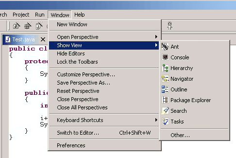 

The application development lifecycle should be considered when
populating the the Window - Open Perspective menu. The development of
most applications follow a well defined lifecycle, from designing /
modeling, to editing / creating, to debugging / testing, to assembling /
deploying. Each perspective will fall into one of these steps. The Open
Perspective menu should be used to link the current perspective to
perspectives that support tasks immediately downstream of the current
one, as well as tasks further upstream, to allow for iterative
development.

For instance, the Java perspective is used in a larger lifecycle,
involving Java and Debug tasks. The Window > Open Perspective menu is
populated with each of these perspectives.

TIP: [guideline8.6]*Guideline 8.6* +
Populate the window menu bar with commands and command sets which are
appropriate to the task orientation of the perspective, and any larger
workflow.

=== Opening a Perspective in Code

A command should open a new perspective only if the user explicitly
states a desire to do so. If the user does not state a desire to do so,
opening a new perspective may cause loss of context for the user.

For instance, imagine a scenario where the user selects an object and
invokes an command. In the perspective where the command is invoked, the
user may have a set of views and editors open. These represent the
working state, or context, of the user. If a new perspective is created,
that context will be left behind, forcing the user to recreate the
context. This is time wasted.

TIP: [guideline8.7]*Guideline 8.7* +
A new perspective should be opened only if the user explicitly states a
desire to do so. In making this statement, the user agrees to leave
their old context, and create a new one.

In some cases, a new perspective is opened as the side effect of another
command. For instance, if users start debugging their application code,
they may be switched to the Debug perspective. If this behavior is
implemented, the user should have the option to turn this behavior off.
The option can be exposed in the command dialog, or within a Preference
page.

TIP: [guideline8.8]*Guideline 8.8* +
If a new perspective is opened as a side effect of another command, the
user should be able to turn this behavior off.

If a new perspective is opened, it may be opened within the current
window, or in a new window. The user controls this option using the
Workbench preferences. If code within a plug-in opens a new perspective,
the plug-in should honor the user preference.

TIP: [guideline8.9]*Guideline 8.9* +
If a new perspective is opened, it should be opened within the current
window, or in a new window, depending on the user preference.

With regard to command contributions applied to the New, Open
Perspective, and Show View menus, the list of wizards, perspectives, and
views added as shortcuts to these menus should be at most 7 plus / minus
2 items.

TIP: [guideline8.10]*Guideline 8.10* +
The list of shortcuts added to the New, Open Perspective, and Show View
menus should be at most 7 plus / minus 2 items.

== Windows

In this section we look at the window menu bar, toolbar, and layout. As
a plug-in developer, you can contribute actions to the menu bar and
toolbar using an __action set__, a set of task oriented actions which
the user can show or hide. You can control the layout of views within a
window by defining a __perspective__. In this section we'll look at
action extension. For more information on perspectives, see
xref:#_perspectives[Perspectives].

=== Actions

Each workbench window contains a menu bar and toolbar. These are
pre-populated by the platform, but a plug-in developer may add
additional items to each. This is done by defining an __action set__, a
set of task oriented actions which the user can show or hide. The
actions within an action set may be distributed throughout the window
menu bar and toolbar.

TIP: [guideline9.1]*Guideline 9.1* +
Use an Action Set to contribute actions to the window menu bar and
toolbar.

The window menu bar contains a number of pulldown menus: File, Edit,
Navigate, Project, Window, and Help. Each of these has a different
purpose, which will be explained in the following paragraphs. For
consistency with the action sets contributed by other plug-ins, the
commands within an action set should conform to the existing
distribution of actions in the window. There is no need to group the
actions in a separate pulldown menu of the menu bar.

The File menu contains file oriented actions, such as Save, Close,
Print, Import, Export and Exit. The contents of the File > New menu are
determined by the perspective type. However, the user may add or remove
items using the Window -> Customize Perspective... menu item. The
contents of the Import and Export dialogs are populated with every
import and export wizard, respectively.

The Edit menu contains editor oriented actions, such as Undo, Redo, Cut,
Copy, and Paste. These actions target the active part (as indicated by a
shaded title bar) . It is very common for an editor to add items to this
menu. However, it is uncommon for an action set to add actions to the
Edit Menu; action sets tend to be global in nature, while the edit menu
targets a specific part, and interaction with the data in that part.

The Navigate menu contains navigational actions such as Go to, Open
Type, Show In, to enable users to browse laterally or drill down in
their code.

The Project menu contains actions which apply to the contents of the
workspace, such as Rebuild All and Open Type. An action set may add
actions which search the entire workspace, generate project info and so
on.

The Window menu contains actions which apply to window management and
system preferences. It also contains the Open Perspective and Show View
submenu which contains actions affecting the state of the window
contents.

TIP: [guideline9.2]*Guideline 9.2* +
Follow the platform lead when distributing actions within an Action Set.

The toolbar contains the most commonly used actions of the menu bar. In
reflection of this, you should contribute actions to the menu bar first,
and then to the toolbar if they will be frequently used.

TIP: [guideline9.3]*Guideline 9.3* +
Contribute actions to the window menu bar first, and then to the window
toolbar if they will be frequently used.

The contents of each action set should be defined using a task oriented
approach. For instance, the Java action set contains actions to create a
new package, class and interfaces. It also contains an command to open
an editor on a class, Goto Type. These form a cohesive set of related
actions, which can be turned on and off by the user, depending on the
active task.

TIP: [guideline9.4]*Guideline 9.4* +
Define each action set with a specific task in mind.

The size of an action set is also important. If an action set is too
large, it will flood the menu or toolbar, and reduce the users ability
to customize the menu and toolbar. At the same time, if an action set is
too small, the user may find customization of the menu and toolbar is
too labor intensive. Break an action set up when it has more than about
7 items.

There is no magic number for the size of an action set, but it should be
carefully designed to contain the smallest possible semantic chunking of
actions. Avoid the temptation to provide only one action set for an
entire plug-in.

TIP: [guideline9.5]*Guideline 9.5*
An action set should contain the smallest possible semantic chunking of
actions. Avoid the temptation to provide only one action set for an
entire plug-in.

An action set can be used to share a set of actions between two or more
views and editors. For instance, a Java Refactor action set may be
applicable to the selection within a Java Editor, an Outline view, and a
Hierarchy View. In this situation the actions can be shared by defining
an action set extension for the workbench. Once this action set has been
defined, it can be automatically included in a perspective by the
perspective developer, or added to a perspective by the user.

An action set should not be used to promote command from a single view
to the window menu bar and toolbar. This simply clutters up the user
interface.

TIP: [guideline9.6]*Guideline 9.6* +
Use an action set to share a set of actions which are useful in two or
more views or editors.

The set of visible command in a window may be changed by invoking Window
> Customize Perspective. Within the resulting dialog, you can add or
remove items from the File > New menu, Window > Open Perspective menu,
or Window > Show View menu. It is also possible to add or remove action
sets. In general, the visible action sets should be controlled by the
user, and should never be changed programmatically. There are two
reasons for this. First, users like to control the environment, not be
controlled. And second, the user is in the best position to understand
the active task, and the appropriate action sets for its completion.

TIP: [guideline9.7]*Guideline 9.7* +
Let the user control the visible action sets. Don't try to control it
for them.

A common example of an command which may be added to an action set is
Navigate > Open Type. This command can be used to open an editor on a
type which is not visible in the current window, and is a form of
lateral navigation. In general, all Open actions which take the form
should be added to the Navigate menu, for consistency.

TIP: [guideline9.8]*Guideline 9.8* +
"Open Object" actions must appear in the Navigate pulldown menu of the
window.

=== Status Bar

If there is a need for a plug-in to show non-modal contextual
information in the status bar area, always use the global status bar.
For example, editors use the global status bar to show the current line
and column number.

TIP: [guideline9.9]*Guideline 9.9* +
Always use the global status bar to display status related messages.

== Properties

A Properties dialog or view is used to view / modify the properties of
an object which are not visible in the normal presentation of that
object. For instance, the Read-Only attribute for a file is modified in
the Properties Dialog. The build path for a Java Project is modified in
the Properties Dialog.

Within Eclipse, there are two ways to edit the properties of an object:

 - in the Properties dialog, and 
 - in the Properties view. 

Each of these is applicable in different situations.

The Properties view is commonly used to edit the properties for a set of
objects in an editor, where quick access to the properties is important,
and you switch from one object to another quickly.

TIP: [guideline10.1]*Guideline 10.1* +
Use the Properties view to edit the properties of an object when quick
access is important, and you will switch quickly from object to object.

The properties for an object should be quick to calculate. If it is too
expensive to calculate the properties for an object, the quick access to
properties offered by the Properties view becomes worthless. In this
situation, where quick access is not possible, a Properties Dialog
should be used.

TIP: [guideline10.2]*Guideline 10.2* +
Use a Properties Dialog to edit the properties of an object which are
expensive to calculate.

In some cases, the properties for an object are dependent upon one
another, such that a change in one will affect another, or even enable /
disable the option to change another. In this situation, a Properties
Dialog may be a better way to represent the semantic link between these
properties.

TIP: [guideline10.3]*Guideline 10.3* +
 Use a Properties Dialog to edit the properties of an object which
contain complex relationships to one another.

When both the Properties view and the Properties Dialog are used to
present and edit properties of an object, the Properties Dialog should
contain the superset of items shown in the Properties view.

TIP: [guideline10.4]*Guideline 10.4* +
Properties Dialog should contain the superset of items shown in the
Properties view.

=== Properties View

==== Summary

For consistency and clarity in Properties, use the standard tabbed view
with proper tab ordering, flexible layout, detailed user assistance,
accurate multi-selection, and no sub-tabs.

==== Problem Description

Across many Eclipse-based products, the Properties view is being used
and presented inconsistently. This inconsistency is problematic for
users who use more than one of these products. Moreover, poor choices
for layout, controls, and labeling can significantly reduce the
effectiveness and efficiency of a Properties view.

==== Best Practice

Use the standard tabbed view for product consistency.::
xref:PropertiesView_Figure[xrefstyle=short] below shows an example. Both tabs 
and a table of Properties should be supported – the tabs for novices, the table 
for experts. Ideally, the tabs and table will be toggled via toolbar control, 
for quick transitions. If there is no toggle and the table will be presented on
the last tab instead, the best name for this tab is “All”. This is a descriptive
and accurate name, and the tabular presentation will help to keep problematic 
items out of the hands of novices.

Tabs should be labeled in order: General, . . . , All.:: 
Every Properties view should feature a General tab, which contains the most
frequently used properties. This will speed up new users as they get oriented. 
The last tab should be named All and contain a table view, if one is supported. 
The middle tabs? They should follow relevant concepts in other products, where 
possible, using similar names and organization. Otherwise, there are no specific
recommendations for middle tabs.

Avoid using sub-tabs when possible.:: 
There are several reasons for this recommendation. First, sub-tabs are not 
easily discoverable by users, since the sub-tabs usually aren't visible unless a
top-level tab is selected. Second, sub-tabs take longer to navigate to, even 
when a user is familiar with them. Finally, sub-tabs add a level of complexity 
that in most cases can be designed around, especially through the use of an 
“All” tab.

A Properties view must be accessible via a context menu for an object or editor.:: 
Allow users to detach or Fastview this view to support an open editor. Such 
support is needed to let users see a large diagram editor and properties at the 
same time. Detached views (via the view context menu) are supported in 
Eclipse 3.1 and beyond and can easily work for Properties. Such views have the 
advantage of persisting across opening and closing, but they have the 
disadvantage of always being on top (obscuring the editor). Another good option 
is to make a Fast View of Properties, so that it can be displayed on top as 
needed.

Tab layout should gracefully adapt to view orientation (horizontal or vertical).:: 
Depending on the other tools that a user works with, screen real estate may 
require opening a Properties view in either orientation. As needed, tab content 
should be laid out dynamically for re-orientation. It is reasonable to design a 
Properties view for a predominant orientation, depending on use case, but the 
less common orientation should be addressed as well.

Dynamic Help and tooltips can clarify fields and data.:: 
Simple properties can initially be confusing for novice users, and complex 
properties can occasionally be confusing even for expert users. Accordingly, 
use Dynamic Help when possible. Field-level Dynamic Help is desirable; 
otherwise, a backup approach is to provide hover help (tooltips).

==== Tips and Tricks

When multiple objects are selected in the editor, follow these
guidelines.

- Display only those properties that are meaningful to the collection of
objects. Any setting changes are applied to all the underlying objects
- Display the common properties of all the selected objects. Where the
property values differ, display the controls associated with those
values using a mixed state.
- If the selected object is a collection of multiple discrete objects
(e.g., a file folder), display the properties of the single grouped
object, instead of a multiple-object property sheet for the discrete
objects.

==== Good Examples

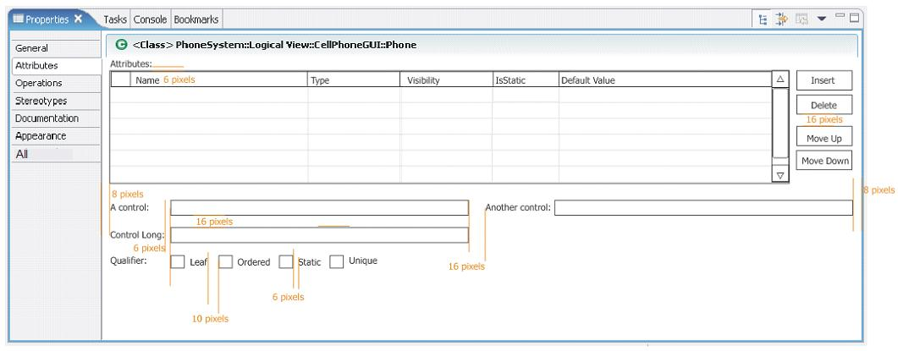

== Widgets

In this section, we will describe some of the recommended designs for
Standard Windows Toolkit (SWT) widgets.

=== Tree and Table

For Tree and Table widgets that have a checkbox associated with a cell
item, users can either select the item or change the checkbox state.
Changing the current selection should not automatically change the check
state of the selected item. However, the current selection should be set
to a given item when its check state is changed (e.g., users click on
the checkbox associated with the item).

TIP: [guideline11.1]*Guideline 11.1* +
For Tree and Table widgets that have a checkbox associated with a cell
item, changing the current selection should not automatically change the
check state of the selected item. However, the current selection should
be set to a given item when its check state is changed.
