= Eclipse UI Guidelines
UI Best Practices Working Group
{version}

__' This document is a working draft. Version 2.1 is the base with 3.x
updates indicated with "(3.x update)".__'

*Nick Edgar, Kevin Haaland, Jin Li and Kimberley Peter, with
contributions from members of the
link:http://wiki.eclipse.org/User_Interface_Best_Practices_Working_Group[User Interface Best
Practices Working Group]*

*Last major revision: November 2007* +
*Convertion into Asciidoc: September 2016*

NOTE: Please use the
https://github.com/eclipse-architecture/ui-best-practices[discussion
page] to add comments instead of embedding them in this document.

:toc:

== Notice
Your feedback can influence the ideas and guidelines described here. If
you have suggestions, please provide us with your feedback on the
mailto:platform-ui-dev@eclipse.org?subject=UI%20Guidelines%20v2.1%20Feedback[UI
mailing list] or on the
https://github.com/eclipse-architecture/ui-best-practices[discussion
page].

== UI Checklist
The xref:_checklist_for_developers[UI Checklist] is a shortlist of the most relevant
and easy to apply Eclipse **User Interface Guidelines**. 
Start by using link:ui_checklist.adoc[this list], referring to the linked guideline items for details, 
then use the <<_checklist_for_developers,Full Checklist>> for additional guidance. 
For comments please use the 
https://github.com/eclipse-architecture/ui-best-practices/issues[UI Best Practices GitHub Issues].

== Introduction
In this document the Eclipse user interface guidelines are defined.

Eclipse is a universal tool platform - an open, extensible IDE for
anything, but nothing in particular. The real value comes from tool
plug-ins that "teach" Eclipse how to work with things - Java™ files, Web
content, graphics, video - almost anything you can imagine. Eclipse
allows you to independently develop tools that integrate with other
people's tools so seamlessly, you won't know where one tool ends and
another starts. The very notion of a tool, as we know it, disappears
completely.

The platform is very flexible and extensible, but this flexibility has a
serious drawback. In particular, there is no way within the program to
ensure user interface consistency between the registered components
within the platform. This document attempts to reconcile this problem,
by defining standard user interface guidelines for the creation of new
components. If these guidelines are adopted within your own tools, it
will lead to greater consistency with the platform and other tools, and
an easier learning curve for your customers.

These guidelines are intended for use by designers and implementors of
an Eclipse user interface extension.

[[the-workbench]]
The Workbench
^^^^^^^^^^^^^

To start out, let's take a look at the Eclipse workbench user interface,
and the various components within it.

The workbench is a collection of windows. Each window contains a menu
bar, a toolbar, a shortcut bar and one or more perspectives.

image::images/workbench_decomposed.png[workbench_decomposed,title="workbench_decomposed"]

A perspective is a visual container for a set of views and content
editors. The views exist wholly within the perspective and are not
shared, but any opened content editors are shared across perspectives.
If two or more perspectives have the same view opened, they share the
same instance of the view although its layout may differ in the
perspectives. For perspectives in different Workbench windows, neither
editors nor views are shared. A perspective is like a page within a
book. It exists within a window along with any number of other
perspectives and, like a page within a book, only one perspective is
visible at any time.

The Workbench's main menu bar usually contains the File, Edit, Navigate,
Project, Window, Help top-level menus. Other top-level menus that are in
between the Edit and Project menu are typically context specific, based
on the current active perspective, front most editor (whether active or
not), and active view..

In the File menu you will find a New submenu, which contains menu items
for Project, Folder, and File creation. The File menu also contains menu
items for Import and Export, which are used to import files into the
Workbench, and export them out again. In the Edit menu, you will find
familiar commands like Cut, Copy, Paste, and Delete. These commands are
known as global commands, and target the active part. In other words, if
the Delete command is invoked with the Navigator active, the actual
implementation is performed by the Navigator. In the Project menu, you
will find project related commands such as Open project, Close project
and Rebuild project are available. In the Run menu, you will find
commands related to running and debugging application code, and
launching external tools such Ant scripts. In the Window menu, you will
find the Open Perspective submenu to open different perspectives to suit
to needs of your development tasks. You will find perspective layout
management menu items. You will also find the Show View submenu to add
views to the current Workbench window. In addition, you will find the
Preferences menu item, which is used to modify the functional
preferences of the Workbench.

As a plug-in developer, you can contribute new views, editors, wizards,
menu, and tool items to the platform. These contributions are defined
using XML, and once registered, integrate seamlessly with the components
which already exist in the platform.

[[projects-folders-and-files]]
Projects, Folders and Files
^^^^^^^^^^^^^^^^^^^^^^^^^^^

Eclipse can be used to create many different kinds of content - Java
files, Web content, graphics, video - almost anything you can imagine.
These objects are stored as regular files within the Eclipse workspace.
The workspace consists of one or more top level projects. Each project
contains a collection of folders and files. These objects are known as
__resources__.

[[getting-started]]
Getting Started
~~~~~~~~~~~~~~~

For most developers, an introduction to the platform can be
overwhelming, and you may ask "where do I get started?". Here are a few
basic guidelines which will help you.

This document is intended for UI designers and developers. With this
audience in mind, we can talk about the two main layers of any
application: the model layer and the user interface layer. In the model
layer of Eclipse, known as the Workspace, is a collection of resources
(projects, folders and files). The user interface, or the Workbench,
defines the presentation for those resources.

As a UI developer, you will also have a model and a presentation. If we
assume that your goal is to make the model visible, through some
presentation, most developers will start out by adding a new view or
editor to the workbench.

In Eclipse, an editor is used to contain the primary content, such as a
document or data object, which users interact with. In every case, this
content is the primary focus of attention and a reflection of the
primary task. To illustrate this concept, let's look at some common
examples.

To do Java programming, the primary task is to create, edit, and debug
Java code. The primary focus is the Java code, so an editor is used to
interact with that code. The navigator, outline, and properties view
exist to support the primary task, but rarely hold your attention for an
extended period of time while you are writing Java code.

To read email, the primary task is to create, send, read, and reply to
email. The primary focus is a particular email message, so an editor is
used to view or reply to an email message. A view may be used to select
an email message to read, and open an editor.

To communicate using instant messaging, the primary task is the
conversation. The primary focus is a particular conversation, so an
editor is used to carry on that conversation. A view may be used to list
people with whom you can initiate a conversation.

To browse the Web, the primary task is reading. The primary focus is a
particular Web page, so an editor is used to browse the Web page.

In each case, the primary task determines the primary focus of
attention. As the primary focus of attention, it deserves a primary
position in the UI (as an editor), and can contribute commands to the
workbench's main menu bar and toolbar.

A view may be used to save your favorite links, and reopen them. At any
time, you may decide to edit the page you are looking at. This causes a
new editor to open. Views are used to support the primary task. You use
them to navigate a hierarchy of information, open an editor, or view
properties for the active part. Each view may have its own local toolbar
and local menu bar.

Once you have added a view or editor, an interesting question arises.
Where did this model come from? In Eclipse, most data is created using a
creation wizard. You may want to add a creation wizard too. And once an
object exists, you may need a way to edit the properties for that object
using a properties page, or the properties dialog.

All of these ideas will be discussed, in detail, in the following
sections.

[[general-ui-guidelines]]
General UI Guidelines
~~~~~~~~~~~~~~~~~~~~~

This document defines UI guidelines that are unique and specific to the
Eclipse platform. It is a supplement to the other standard UI guidelines
such as Microsoft® User Experience, Macintosh Human Interface
Guidelines, and Java Look and Feel Guidelines. You should continue to
consult those guidelines for basic UI design and implementation
recommendations.

It is expected that you already have a basic understanding of the
Eclipse UI architecture and APIs, and the basic UI design principles:
user in control, directness, consistency, forgiveness, feedback,
aesthetics, and simplicity. If you do not currently have the
prerequisite knowledge, please read the relevant documentation first.

**Guideline 1.1**

________________________________________________________________________________
Follow and apply good user interface design principles: user in control,
directness, consistency, forgiveness, feedback, aesthetics, and
simplicity.
________________________________________________________________________________

'''

[[the-spirit-of-eclipse]]
The Spirit of Eclipse
^^^^^^^^^^^^^^^^^^^^^

At its heart, Eclipse is a platform for tool plug-ins. These plug-ins
may be developed by a single team or by a partnership of teams, or the
user may assemble a set of plug-ins from diverse sources. In either
case, the usability of an individual tool, and Eclipse as a whole, will
be positively influenced by user interface consistency.

If you're in doubt about the appropriate look and feel for a tool, look
to the platform first, then the Java development tooling and the Plug-in
Development Environment (PDE) in Eclipse for guidance. In many cases,
the workflow you imagine may already exist in Eclipse. If so, adopt the
platform's workflow and user interface conventions. This will lead to
greater consistency with the platform and other plug-ins, and an easier
learning curve for your customers.

In some scenarios, it may be tempting to ignore the workflow of Eclipse
and implement a "custom" user interface. This interface will almost
certainly stand out like a sore thumb in an integrated environment,
where other tools adopt the platform conventions. You lose the benefit
of past experience, and force your customers to learn new ideas.

Consult the link:#Best%20Practices[Best Practices] section for examples
and more information.

Also, visit the http://www.eclipse.org/newsgroups/index.html[Eclipse
platform newsgroups] to share information with the community.

**Guideline 1.2**

________________________________________________________
Follow the platform lead for user interface conventions.
________________________________________________________

'''

If you decide to reuse the conventions of Eclipse, be careful not to
misappropriate Eclipse specific UI conventions. For instance, the active
part in a workbench window is indicated by a shaded title. The use of
shaded titles within an editor (see below) may be one way to indicate
where the focus is, within that part, but it will also blur the concept
of part activation in the window.

image::images/badHilight.png[badHilight,title="badHilight"]

**Guideline 1.3**

________________________________________________________________________________
Be careful not to mix UI metaphors. It may blur the original concept,
and your own application.
________________________________________________________________________________

'''

Eclipse is an open source project. If you feel your ideas are generally
useful, join the Eclipse community, write a proposal, and work with the
Eclipse community to make Eclipse a better platform for product
development and increase customer satisfaction.

Visit http://www.eclipse.org/[www.eclipse.org] and join the Eclipse UI
mailing list **platform-ui-dev**.

**Guideline 1.4**

________________________________________________________________________________
If you have an interesting idea, work with the Eclipse community to make
Eclipse a better platform for all.
________________________________________________________________________________

'''

[[capitalization]]
Capitalization
^^^^^^^^^^^^^^

Consistent capitalization of text within a plug-in leads to a more
polished feel, and greater perception of quality. Within a dialog or
window, headline capitalization should be applied to all titles, menus,
tooltip, tabs, and push buttons. For example, "Run to Line" can be used
as a menu item label.

Sentence style capitalization should be applied to all check boxes,
radio buttons, and group labels. For example, "Choose an option for the
Java file" can be used as a group label.

**Guideline 1.5**

________________________________________________________________________________
Use Headline style capitalization for menus, tooltip and all titles,
including those used for windows, dialogs, tabs, column headings and
push buttons. Capitalize the first and last words, and all nouns,
pronouns, adjectives, verbs and adverbs. Do not include ending
punctuation.
________________________________________________________________________________

**Guideline 1.6**

________________________________________________________________________________
Use Sentence style capitalization for all control labels in a dialog or
window, including those for check boxes, radio buttons, group labels,
and simple text fields. Capitalize the first letter of the first word,
and any proper names such as the word Java.
________________________________________________________________________________

'''

[[language]]
Language
^^^^^^^^

Eclipse is available on a variety of different platforms, in a variety
of locales. In reflection of the different languages and numeric formats
in each, a localization strategy should be adopted for the text and
images within each plug-in. This involves the separation of all
resources from the source code of a plug-in itself, so that those
resources can be translated to a new locale.

Consult the link:#Best%20Practices[Best Practices] section for examples
and more information.

**Guideline 1.7**

______________________________________________________________
Create localized version of the resources within your plug-in.
______________________________________________________________

'''

[[error-handling]]
Error Handling
^^^^^^^^^^^^^^

If an error occurs in Eclipse, the appropriate response will be
dependent on the context of the error.

Please refer to link:#Wizards[Wizards] section for guidelines on how to
handle user input errors in a wizard.

Please refer to link:#Editors[Editors] section for guidelines on how to
handle errors occurring in an editor.

When an error occurs which requires either an explicit user input or
immediate attention from users, a modal dialog should be used to
communicate the error to the user. This forces the user to notice, and
deal with, the problem.

**Guideline 1.8**

________________________________________________________________________________
When an error occurs which requires either an explicit user input or
immediate attention from users, communicate the occurrence with a modal
dialog.
________________________________________________________________________________

'''

If a programming error occurs in the product, an error dialog should be
used to communicate the occurrence to the user. The error should also be
logged using the workbench error logging facility. This gives the user
an opportunity to restart the platform, uninstall the corresponding
feature, and contact their system administrator.

The plug-in should provide the following information in the detail area
of the error dialog:

* Provider name
* Plug-in name (user friendly name)
* Plug-in ID
* Version

**Guideline 1.9**

________________________________________________________________________________
If a programming error occurs in the product, communicate the occurrence
with a dialog, and log it.
________________________________________________________________________________

[[ui-graphics-3.x-updates]]
UI Graphics (3.x updates)
~~~~~~~~~~~~~~~~~~~~~~~~~

[[overview]]
Overview
^^^^^^^^

The following guide covers user interface (UI) graphics for Eclipse
3.x-based tools. All visual user interface elements created for
Eclipse-based tools follow a common style called the *_Eclipse visual
style_* or **_Eclipse style_**. Any product, tool, or plug-in based on
the http://www.eclipse.org[Eclipse] Workbench Version 3.0 and above
should follow these guidelines to help ensure consistency of visual user
interface elements. Consistency includes visual style, meaning, and
implementation conventions.

*Audience*

These guidelines are for anyone creating Eclipse style user interface
graphics or seeking best practices for their use. This is not a how-to
guide, but you will find instructions for some tasks and a number of
resources to assist in making the graphics. If you are a designer, you
will be interested in the Design, Specifications, and Implementation
sections. If you are a Developer, the Specifications and Implementations
sections will be of most value to you.

[[design]]
Design
^^^^^^

This section provides guidance and tools for creating Eclipse style
icons and wizard graphics.

[[style-design]]
Style & Design
++++++++++++++

This section covers style characteristics and gives guidance for
designing effective Eclipse user interface graphics including topics
such as metaphor, composition, lighting, color and more.

Before beginning to design Eclipse-style icons or wizard banner
graphics, first check if the concept or visual elements have been
covered already. Refer to the link:#Consistency_&amp;_Reuse[Consistency
& Reuse] and link:#Common_Elements[Common Elements] sections for these
elements. If designing an icon or wizard graphic from the start,
consider the underlying concept and how it can best be represented.
There might be an existing metaphor to appropriately convey the concept.

''' Metaphor '''

The purpose of a metaphor is to create meaning. A metaphor will be
meaningful if it is based on ideas the audience is already familiar
with, and if it fits conceptually with the content and context. It
should be clear, easily learned, and readily distinguishable. For
example, project and file folders are used in the Eclipse-based
workspace the same way they are used in the real world to organize and
store project-related information. Since many concepts already have
associated metaphors, use the existing metaphors, and when the concept
allows, create new representations that extend the metaphor.

''' Icons '''

''' Style characteristics '''

The icons should have a clean elegant feel with rich but subtle color
and lighting. They are rendered as if viewed directly from in front, but
have the illusion of three dimensions. This affect is achieved by using
color gradients and an implied light source from the top. A kind of
ambient light is also used to illuminate different parts of each icon,
either to bring out its shape or to emphasize a certain aspect of the
image. Other key features include color gradient outlines to define
edges and strong identifiable shapes with as few combined elements as
possible.

::
  *Lighting*

::
  For most elements, lighting is achieved with simple vertical
  gradients. The gradients go from a lighter color at the top of the
  element to a darker color at the bottom. This approach gives subtle
  form and illuminates basic elements such as files, folders, and other
  rectilinear shapes. For spheres, triangles and more complex forms, an
  additional reflective light source is added near the base of the
  element to give it volume and to ground it in its environment.

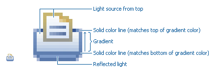

image::images/des_styl_char2.png[des_styl_char2,title="fig:des_styl_char2"]

::
  *Outlines*

  Each element within an individual icon features a single pixel
  keyline. Solid color lines define the top and bottom edges of the
  element, and gradients define the sides. To reinforce the light source
  from the top, the keyline color goes from light at the top to dark
  color at the bottom. The gradient along the sides bridges these light
  and dark colors.

  The color of the outline will vary according to the color of the
  individual element. In the example below, the file has a dark
  grayish-blue base and a light ochre color top. This is a standard
  color outline for this type of object. You will see that other
  elements use standard color outlines as well. Read more about standard
  colors under Color below, and use the link:#Common_Elements[Common
  Elements] design resource for reusable elements.

image::images/des_styl_char3.png[des_styl_char3,title="fig:des_styl_char3"]

::
  *Style differences between types*

::
  *_View_* (includes Perspective and Fast View), *_Model Object_*
  (includes Table), **_Object Overlay_**, **_Progress Indicator_**, and
  *_Diagram_* icons have more saturated color and higher contrast than
  Toolbar, Local Toolbar, and Palette icons. It is important these icons
  stand out as focal points in the user interface because they are key
  indicators of the model. Since there are no tooltips associated with
  object type icons, they are less, or not, accessible to persons with
  low or no vision. Increased saturation and contrast helps compensate
  for this.

::
  **_Toolbar_**, **_Toolbar Wizard_**, **_Local Toolbar_**, and
  *_Palette_* icons have a more subtle approach to color and contrast
  than their object-based counterparts. These icons are more subtle
  because they are reliably present in the user interface and should not
  be distracting. Tooltips for these types of icons make them accessible
  to persons with low or no vision. Additionally, the use of color for
  the outlines, instead of black, means the images are not lost if
  people choose to work in a high-contrast (usually black) accessibility
  mode.

::
  A subset of core reusable elements illustrate this distinction best:
  Project, File, and Database elements each have a rich saturated
  version for the treeview and a light subtle version for the toolbar
  and local toolbar. Look for these differences in other icons within
  the link:#Common_Elements[Common Elements] files.

::
  Here are the Project, File, and Database icons rendered as model
  objects:

image::images/des_styl_types_obj.png[des_styl_types_obj,title="fig:des_styl_types_obj"]

::
  Here are the same icons rendered in the more low-key toolbar style:

image::images/des_styl_types_tool.png[des_styl_types_tool,title="fig:des_styl_types_tool"]

''' Composition '''

Aim for simplicity. Bring focus to the primary function or object within
an icon by using different visual cues, such as color, contrast,
lighting, size and location to differentiate elements. To improve
clarity and reduce visual noise, avoid using too many elements within
any given icon.

The location of individual elements in an icon can have an impact on its
meaning and recognition value. People learn, recognize, and expect
patterns: using a consistent location for visual elements, when
possible, establishes a pattern that is useful for identifying the
object type or function of an individual or set of icons.

::
  *Actions*

::
  Actions in toolbar and local toolbar icons tend to be on the left of
  the icon and identify a command that will be performed on an object or
  set of objects. For example, the following icon represents "Deploy
  Script" on the toolbar. The action "deploy" is represented by a green
  arrow on the left of the script object:

image::images/des_styl_runscpt.png[des_styl_runscpt,title="fig:des_styl_runscpt"]

::
  However, not all actions are located on the left. To convey the
  intended meaning of a concept or to accommodate the context of the
  icon in the user interface, diverging from convention is sometimes
  required. Here are some actions that are notable exceptions to the
  action-on-the-left convention:

::
  *_Create_* or *_New_* is represented by a sparkle in the upper-right
  corner to denote the creation of a sparkling "new" object. The
  sparkle, though an object itself, is a metaphor for creating something
  new. Its location in the icon space is precisely 1 pixel down from the
  top and flush with the right edge of the 16 x 16 icon space. Using
  this exact location ensures a clean uncluttered presentation when seen
  across a number of "new" action icons on the toolbar or in the menu.
  For example:

image::images/des_styl_create2.png[des_styl_create2,title="fig:des_styl_create2"]

::
  **_Import_**, when associated with an object, is represented by an
  arrow in the bottom-right corner facing downward and to the right.
  Location and direction are important here to convey that an object
  will be imported from another location into the workbench. Note that
  its counterpart, **_Export_**, follows the action-on-the-left
  convention with an arrow in the bottom-left corner because this
  location and direction is appropriate for denoting that an object will
  be exported from the workbench to another location.

image::images/des_styl_export.png[des_styl_export,title="fig:des_styl_export"]

::
  *_Open_* is represented by a curved arrow in the upper-right corner of
  the icon. The location, shape, and direction of the arrow indicate
  that the object is being opened. This action is used mostly on book-
  or file-type objects. For example:

image::images/des_styl_open.png[des_styl_open,title="fig:des_styl_open"]

::
  *_Pin_* is represented by a pushpin on the right of the object. The
  "Pin Fast View" icon is located on the right side of a view title bar.
  The location of the icon and the action within the icon indicate the
  side where the view will be pinned—on the right. Because of this
  location, the pin is pointing inward toward the object to be pinned.
  Placing the pin on the left would not work as well given the context
  and literal action of the icon.

::
  *Objects*

::
  Objects are stacked vertically, often in large number, within
  treeviews and lists. Because of this stacking, attention to the
  alignment of objects within the icon design space is important. This
  is particularly true of repeated objects that use the same elements.
  For example, a file or folder used as a base for a series of model
  object images, should be located in the same place within the 16 x 16
  pixel icon space in all of the images within the series. To illustrate
  the difference between aligned and not aligned objects, first, here is
  an example showing the base element—in this case the yellow folder—not
  aligned the same throughout a series of icons. The result is a choppy,
  harder to scan treeview or list:

image::images/des_styl_obj-unalign.png[des_styl_obj-unalign,title="fig:des_styl_obj-unalign"]

::
  Second, here is an example showing the same base folder element
  aligned throughout the set. The result is a clean, easier to scan
  treeview or list:

image::images/des_styl_obj-align.png[des_styl_obj-align,title="fig:des_styl_obj-align"]

::
  *States*

::
  States are the result of a direct of indirect action on an object.
  Once an action is taken on an object, the object reflects that action
  by showing its state. This state is generally shown on the right side
  of the icon. For example, invoking the action "Run on Server" will
  show the server running in the Servers view with a green arrow run
  action on the right side of the server object.

image::images/des_styl_state-start.png[des_styl_state-start,title="fig:des_styl_state-start"]

::
  Stopping the server will show the blue square stop action on the right
  of the server object.

image::images/des_styl_state-stop.png[des_styl_state-stop,title="fig:des_styl_state-stop"]

*Color Palette & Themes*

An entire set of graphical elements, such as icons, wizards and user
assistance graphics, requires a consistent, family-like appearance
across the user interface (UI); contrarily, individual and sub-families
of graphics require differentiation. Color choices can either bring
unity or cause distraction.

Eclipse supports 24 bit color depth, which means that colors used to
create UI graphics can come from outside the defined 8 bit, or 256 color
Eclipse-style palette. However, using the Eclipse-style palette as the
base for applying color to your graphics will help ensure a visual fit
within the Eclipse environment.

To achieve a consistent appearance in graphics across the UI, use a
common color palette as the basis for creating your graphical elements.

::
  Eclipse-based graphics tend to use a common or dominant set of colors:
  Blue and yellow are the base colors, with green, red, brown, purple,
  and beige used for signifying specific object types or functions. Here
  is the palette, with a number of examples of how its different colors
  are used.

image::images/des_colour_pal.png[des_colour_pal,title="fig:des_colour_pal"]

::
  The *_Eclipse-style palette_* contains the core and dominant colors
  used in Eclipse-based icons, wizard banner graphics, and user
  assistance graphics. You can download the palette in the
  https://git.eclipse.org/c/platform/eclipse.platform.images.git/plain/org.eclipse.images/tools/eclipse-style_palette.aco[".aco"],
  https://git.eclipse.org/c/platform/eclipse.platform.images.git/plain/org.eclipse.images/tools/eclipse-style_palette.ai[".ai"]
  and
  https://git.eclipse.org/c/platform/eclipse.platform.images.git/plain/org.eclipse.images/tools/eclipse-style_palette.gpl[".gpl"]
  file format.

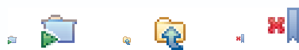

::
  The two dominant colors, *_blue_* and **_yellow_**, bring harmony to
  the overall presentation of the user interface. Themselves
  complementary, blue and yellow form a base on which to apply accent
  colors. These few examples show blue and yellow as the common base for
  different icons, and how other accent colors have been applied to help
  convey a concept.

image::images/des_styl_green.png[des_styl_green,title="fig:des_styl_green"]

::
  *_Green_* is often used to indicate that something is being run or
  initiated, and as a common accent color. The actions "run" and "play"
  are prime examples of how the color green is applied to support a
  concept.

image::images/des_styl_red.png[des_styl_red,title="fig:des_styl_red"]

::
  *_Red_* is used to indicate an error or to signal an alert, but red is
  also used in real-world objects that are typically red.

image::images/des_styl_brown.png[des_styl_brown,title="fig:des_styl_brown"]

::
  *_Brown_* is used less than the other colors mentioned, but it is
  generally associated with specific types of objects: the Java
  "package", "bundle", and the "Enterprise Java Bean (EJB)".

image::images/ddes_styl_purple-alt.png[ddes_styl_purple-alt,title="fig:ddes_styl_purple-alt"]

::
  *_Purple_* is associated with “Web Site" or "Site Project", plugin
  "fragment", and Java "Interface”.

image::images/ddes_styl_beige.png[ddes_styl_beige,title="fig:ddes_styl_beige"]

::
  *_Beige_* is associated with "template" and "generic" objects. While
  not limited to these two object types, beige is usually reserved for
  placeholder or unrealized objects.

::
  ''' Tips and Tricks '''

::
  *1. Use color from existing graphics*
   To quickly make graphics that are consistent with the Eclipse style
  without having to use the palette directly, select colors from
  existing Eclipse-based icons and wizards.

::
  *2. Consider the background*
   When designing an icon, keep in mind the background color it will sit
  on. The various browsers and operating systems allow custom window
  backgrounds that people can set according to their own preferences. It
  is not always possible to know if an icon will be used in different
  places in the user interface, but generally, the background will be
  either white or a warm or cool mid-tone grey. Whether it is white or
  grey will depend on the icon type. **_Model Object_**, **_Object
  Overlay_**, and *_Diagram_* icons are usually on a white background,
  whereas **_Toolbar_**, **_Toolbar Wizard_**, **_Local Toolbar_**, and
  *_Palette_* icons usually sit on a mid-tone grey background.

::
  To achieve the best quality of color and edge treatment, test your
  icons across all known targeted operating system theme backgrounds.
  Modify the icons where needed to work well on most, if not all, of the
  backgrounds. Here is an example of testing a View icon with the
  different operating system theme selection colors, and a set of
  Toolbar icons on a number of known backgrounds:

image::images/des_bkgd_color.png[des_bkgd_color,title="fig:des_bkgd_color"]

::
  Antialiasing the edges is suitable if you know the background color.
  Since knowing the background color is not always possible, using
  medium to dark pixels on the edges will help ensure that the icon
  works well on most backgrounds. Using lighter edge pixels can result
  in poor quality, rough looking edges that do no blend well to the
  background. This is especially true of rounded shapes on dark
  backgrounds. The following example illustrates the effect of using
  lighter pixels on a round icon that sits on a medium to dark color
  background:

image::images/des_styl_bg1.png[des_styl_bg1,title="fig:des_styl_bg1"]

::
  This example shows the same icon on the same background, but with
  darker edge pixels:

image::images/des_styl_bg2.png[des_styl_bg2,title="fig:des_styl_bg2"]

::
  In some special cases, a single icon may appear on multiple
  backgrounds and will need to be designed specifically for each case.

::
  *3. Download the palette*

::
  You can download the palette in the
  https://git.eclipse.org/c/platform/eclipse.platform.images.git/plain/org.eclipse.images/tools/eclipse-style_palette.aco[".aco"],

https://git.eclipse.org/c/platform/eclipse.platform.images.git/plain/org.eclipse.images/tools/eclipse-style_palette.ai[".ai"]
and
https://git.eclipse.org/c/platform/eclipse.platform.images.git/plain/org.eclipse.images/tools/eclipse-style_palette.gpl[".gpl"]
file format.

::
  If you are using The GIMP, you can download the eclipse palette in the
  https://git.eclipse.org/c/platform/eclipse.platform.images.git/plain/org.eclipse.images/tools/eclipse-style_palette.gpl[".gpl"]
  file format.

::
  To load the palette in Adobe Photoshop, open the "Swatches" palette
  and choose "Load Swatches..."; then navigate to where you saved the
  https://git.eclipse.org/c/platform/eclipse.platform.images.git/plain/org.eclipse.images/tools/eclipse-style_palette.aco
  "eclipse-style_palette.aco"] palette.

::
  To load the palette in Adobe Illustrator, first save the

https://git.eclipse.org/c/platform/eclipse.platform.images.git/plain/org.eclipse.images/tools/eclipse-style_palette.ai["eclipse-style_palette.ai"]
palette in the Adobe Illustrator > Presets > Swatches folder. If you
have Adobe Illustrator already open, you will need to restart it after
adding this file. Once you restart Illustrator, go to Windows > Swatch
Libraries and choose the "eclipse-style_palette.ai" palette from the
list.

::
  To use the palette in The GIMP open the "Palettes" dialog and choose
  "Import Palette" entry from the context menu.

::
  The
  https://git.eclipse.org/c/platform/eclipse.platform.images.git/plain/org.eclipse.images/tools/eclipse-style_palette.gpl[".gpl"]
  file format can also be used in Inkscape. Just copy the palette file
  into the user's profile into the "/~/.config/inkscape/palettes"
  folder.

::
  Save your images with the palette as a base

::
  In Adobe Photoshop, when an image is complete and ready to be saved to
  GIF, index the image to "exact" color. This indexing preserves all of
  the colors the graphic was created with, including any colors you have
  added that are not contained in the base palette.

::
  In The GIMP, simply Save As GIF.

::
  *Related Information*

::
  This information replaces that provided in the Eclipse UI Guidelines
  2.1, in the section titled “Visual Design – Icon Palettes” (Guidelines
  2.2-2.4):
  http://www.eclipse.org/articles/Article-UI-Guidelines/Index.html

::
  The GIMP User Manual is available online at: http://www.gimp.org/docs/

''' Wizard Banner Graphics '''

''' Style characteristics '''

Like the Eclipse-style icons, wizard banner graphics have a clean
presentation that is achieved by using rich but not overpowering color,
a one-point perspective to show the elements clearly, subtle color
gradients and soft lighting techniques to give the images a subtle
three-dimensional form. Wizard banner graphics have the attribute of
being larger than the icons, which allows for application of a more
intricate, illustrative rendering style with more complex lighting.

::
  *Lighting*

::
  Lighting for the wizard banner graphics can be a simple unidirectional
  source or a complex multidimensional source, depending on the shape of
  the elements in the graphic. Unlike the icons, where the light source
  tends to come directly from above, the wizard graphics are lit mainly
  from the top left, have variable lighting that is tailored to each
  graphic, and have the added visual dimension of a cast shadow. The
  three-dimensional look is achieved by using color blends and gradients
  in Adobe Illustrator to render the highlights, mid-tones, shadows, and
  reflected light.

image::images/des_styl_wiz_lighting.png[des_styl_wiz_lighting,title="fig:des_styl_wiz_lighting"]

::
  *Shadow*

::
  For rectilinear objects, such as folders and files, an additional
  light source is implied from the left-front of the graphic, casting a
  shadow to the right of the graphic. This shadow is angled backward—to
  the right-back—at 45 degrees. When designing these types of graphics,
  consider the space the shadow will require by locating the graphical
  elements on the left side of the designated image area.

image::images/des_styl_wiz_shadow1.png[des_styl_wiz_shadow1,title="fig:des_styl_wiz_shadow1"]

::
  Spherical objects have a different shadow treatment than their
  rectangular counterparts. The shadow is positioned directly below the
  object and is elliptical in shape. The sphere touches the shadow,
  which has the effect of grounding the sphere to the surface below. Use
  this type of shadow for spherical and flat-bottomed round objects,
  such as the "Java Method" sphere and "Service" bell, which are
  centered in the designated image area.

image::images/des_styl_wiz_shadow2.png[des_styl_wiz_shadow2,title="fig:des_styl_wiz_shadow2"]

::
  Floating objects have a similar shadow to spherical objects in that
  the shadow is also elliptical in shape and positioned below the
  object. However, unlike the shadow for spherical objects, it does not
  touch the object. The object floats above the surface and casts a
  shadow directly below it. Use this type of shadow for elements that
  are centered and floating within the designated image area.

image::images/des_styl_wiz_shadow3.png[des_styl_wiz_shadow3,title="fig:des_styl_wiz_shadow3"]

::
  *Outlines*

::
  Each element within an individual wizard graphic has a keyline to
  define its outer edges. Solid color lines define the top and bottom
  edges of the element. Gradients define the sides, going from a dark
  color at the bottom to a light color at the top. This approach applies
  to most common objects. However, there are many wizard graphics that
  are defined with flat color instead of gradients. Whether a gradient
  or flat color is used, choose an outline color that works well with
  the color of the element it defines. This is usually mid-tone color
  related to the dominant color used within the element. The following
  examples use established outline treatments and colors. Standard
  outline colors exist for many elements. To read more about the
  standard colors, see Color below, and use the
  link:#Common_Elements[Common Elements] design resource for reusable
  elements.

::
  Here is an example of a gradient used to define the edges of a wizard
  graphic:

image::images/des_styl_wiz_outline1.png[des_styl_wiz_outline1,title="fig:des_styl_wiz_outline1"]

::
  Here is an example of a flat outline used to define the edges of a
  wizard graphic:

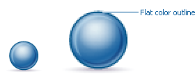

''' Composition '''

Composition of elements within wizard graphics follows most of the same
practices described for icons. There are a few wizard-specific
compositional concerns to be aware of for actions, objects, and states:

::
  *Actions*

::
  Actions in wizard banner graphics are generally shown in the same
  location as they are in the icon that launches them. A notable
  exception is the "create" sparkle, which is not shown at all in the
  wizard banner image. When in the toolbar wizard, the action is to
  create a specific kind of object. However, once in the wizard, the
  object is in the process of being created so the action is no longer
  necessary.

::
  *Objects*

::
  Objects, when overlapping, need to be clearly separated to ensure a
  legible image. The technique used in wizard banner graphics is to put
  a light glow around the front-most object.

::
  *States*

::
  States of objects, once in the wizard, change to what the state will
  be once the object is created. The most common example of this is the
  folder state: it is closed when in a toolbar wizard icon, but open
  when in a wizard banner graphic because it will be open once in a
  treeview or list view.

''' Color '''

Wizard graphic colors are based on the icons that launch them. The
colors used to create a toolbar wizard icon, for instance, should be the
same colors used to create its wizard banner counterpart. To download
and use the color palette for creating wizard graphics, see the
*link:#Color_Palette_&amp;_Themes[Color Palette & Themes]* section above
under Icons.

As with the icons, wizard banner graphics fall under a limited set of
color categories. These color categories are established for most
elements and should be reused for like elements to maintain consistency,
meaning, and identity. The following examples show how the different
categories of color are applied to wizard banner graphics.

image::images/des_styl_wiz_blueyellow.png[des_styl_wiz_blueyellow,title="fig:des_styl_wiz_blueyellow"]

::
  *_Blue_* and **_yellow_**, as with the icons, are the two dominant
  colors and are used as a basis for many user interface graphics.

image::images/des_styl_wiz_green.png[des_styl_wiz_green,title="fig:des_styl_wiz_green"]

::
  **_Green_**, as with the icons, is often used to indicate that
  something is being run or initiated, and as a common accent color. The
  actions "run" and "play" are primary examples of how green is applied
  to support the concept.

image::images/des_styl_wiz_red.png[des_styl_wiz_red,title="fig:des_styl_wiz_red"]

::
  **_Red_**, as with the icons, is used to indicate an error or to
  signal an alert. It is also used for images that are typically red,
  such as a thermometer.

image::images/des_styl_wiz_brown.png[des_styl_wiz_brown,title="fig:des_styl_wiz_brown"]

::
  **_Brown_**, as with the icons, is used to a lesser extent than the
  other colors noted, but it is generally associated with very specific
  types of objects. These objects are the Java "package", "bundle", and
  the "Enterprise Java Bean (EJB)".

image::images/des_styl_wiz_purple.png[des_styl_wiz_purple,title="fig:des_styl_wiz_purple"]

::
  **_Purple_**, as with the icons, is associated with Java "Interface",
  plugin "fragment", and "Web Site" or "Site Project".

image::images/des_styl_wiz_beige.png[des_styl_wiz_beige,title="fig:des_styl_wiz_beige"]

::
  **_Beige_**, as with the icons, is associated with "template" and
  "generic" objects. While not limited to these two object types, beige
  is usually reserved for placeholder or unrealized objects.

::
  *Background color*

::
  The background for wizard banners is part of the final graphic. It is
  a light blue curvilinear element that does not vary. However, the
  background color of the banner area does vary from one operation
  system and theme to another.

::
  Previous to Eclipse 3.3, all wizard banner graphics were in GIF
  format, which meant that the blue curvilinear element blended to a
  white background that was part of the final cut image. This worked
  well on standard Windows and OSX themes that have a white banner
  background, but not on Linux flavors that have a grey banner
  background. Fortunately, Eclipse now supports the PNG graphic format
  and all Eclipse Project (SDK) wizard banner graphics have been
  converted to PNG so that graphic blends to whatever background color
  it sits on.

* Guideline 2.1 (3.x update)*

____________________________________________________________
Follow the visual style established for Eclipse UI graphics.
____________________________________________________________

* Guideline 2.2 (3.x update) *

________________________________________________________________________
Use a common color palette as the basis for creating graphical elements.
________________________________________________________________________

'''

[[consistency-reuse]]
Consistency & Reuse
+++++++++++++++++++

This section encourages consistency and reuse of existing graphical
elements, and shows the core icon and wizard concepts currently in the
tools.

In the development of the Eclipse style graphical elements, a visual
language was formed to describe a variety of concepts in the user
interface. These concepts are now represented by a large selection of
tiny visual signs that many have come to know through using
Eclipse-based tools.

In order to ensure a consistent visual experience, a common
understanding of concepts across the tools, and to minimize confusion,
we encourage you to re-use Eclipse-style graphical elements whenever
possible.

''' Re-using graphical elements '''

A great many icons and wizard graphics have already been created in the
Eclipse visual style, so there is a good chance that the elements you
might need already exist. Samples of existing core concepts for icons
and wizard graphics are shown below. Each of these elements carries with
it a specific meaning, so care should be taken when using them to ensure
consistent meaning is maintained. A more extensive collection of common
visual elements can be found on the link:#Common_Elements[Common
Elements] page.

''' Core icon concepts '''

image::images/des_cons_core-icons.png[des_cons_core-icons,title="des_cons_core-icons"]

Click Media:core_icon_concepts.zip[ *here*] or on the image above to
download the "core_icon_concepts.psd".

''' Core wizard graphic concepts '''

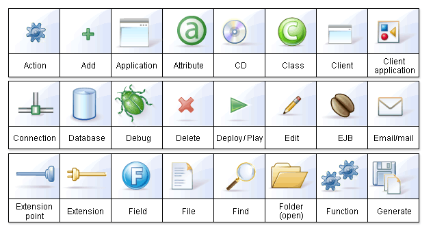

Click Media:core_wizard_concepts.zip[ *here*] or on the image above to
download the "core_wizard_concepts.ai" and the
"core_wizard_concepts.psd" files.

* Guideline 2.3 *

________________________________________________________________________________
Re-use the core visual concepts to maintain consistent representation
and meaning across Eclipse plug-ins.
________________________________________________________________________________

'''

[[common-elements]]
Common Elements
+++++++++++++++

This section provides a library of graphical elements that have already
been developed for Eclipse-based tools. This extensive selection of
common elements provides not only a base for creating new icons and
wizard graphics, but for reusing existing ones as they are. Used in
conjunction with the core concepts shown in the Consistency & Reuse
section, this library will enable efficient creation of graphical
elements and promote consistency throughout the user interface.

''' Icon elements '''

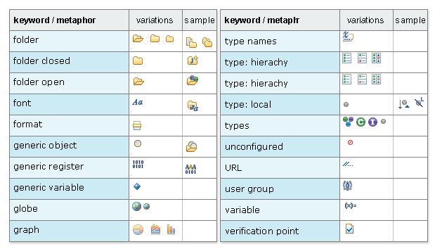

::
  Click Media:common_icon_elements.zip[ *here*] to download the
  “common_icon_elements_eclipse-proj.psd” for Eclipse Project icons and
  the "common_icon_elements_eclipse-tools.psd" file for a subset of
  icons related to Eclipse-based tools.

''' Wizard elements '''

image::images/des_common_wiz.png[des_common_wiz,title="fig:des_common_wiz"]

::
  Click Media:common_wizard_elements.zip[ *here*] to download the
  "common_wizard_elements.ai" vector-based file for designing wizard
  banner graphics and the "common_wizard_elements.psd" raster-based file
  for cutting them.

* Guideline 2.4 *

________________________________________________________________________________
Re-use existing graphics from the Common Elements library or other
Eclipse-based plugins.
________________________________________________________________________________

'''

[[states]]
States
++++++

This section describes the use of enabled and disabled icons in the user
interface. It also provides instructions and an automated action set for
creating the disabled state of your enabled color icons, a useful tool
when producing a large volume of icons.

''' Icon States '''

This section describes the use of enabled and disabled icons in the user
interface. It also provides instructions and an automated action set for
creating the disabled state of your enabled color icons, a useful tool
when producing a large volume of icons.

::
  ''' Enabled state '''
   The enabled icon state is the color version of all toolbar, toolbar
  wizard, and local toolbar icons. This state indicates that a command
  is active and available for use. Information on creating the enabled
  color version of these icons can be found under
  *link:#Style_&amp;_Design[Style & Design]* above.

::
  ''' Disabled state '''
   The disabled icon state is a dimmed version of the enabled color
  toolbar, toolbar wizard, and local toolbar icons. This state indicates
  that a command is inactive and not available for use. The following
  image shows a set of disabled toolbar icons beside the enabled state.
  Note that the disabled versions are not strictly grayscale, they
  retain a hint of color from the original icon. This is achieved by
  adjusting the saturation and lightness as you will see in the
  automated action below:

image::images/des_states_enab-disab.png[des_states_enab-disab,title="fig:des_states_enab-disab"]

::
  *NOTE:* It is important to implement the graphical versions of the
  disabled state for toolbar and local toolbar icons. The quality and
  legibility of algorithmically rendered disabled icons is poor and they
  are not consistent with the majority of other tools that use the
  graphical versions.

::
  *Creating the disabled icon state*
   To create this state, you will use the
  "eclipse_disabledrender_R3V6.atn" action in the Eclipse-style Actions
  palette. Click Media:eclipse-style_actions.zip[ *here*] to download
  the Eclipse-style Actions.

1.  Load the "eclipse_disabledrender_R3V6.atn" into the the Adobe
Photoshop Actions palette.
2.  Use the marquee tool to select all the enabled versions of the
toolbar and local toolbar icons you plan to create a disabled state for.
3.  Next, hold the control key and hit the left or right arrow key once,
then let go of the control key and hit the opposite arrow key to bump
the images back into their exact initial position.
4.  Start the "Create Disabled State" action by clicking on the "play"
arrow at the bottom of the Actions palette. A copy of the color icons
will be created and a series of changes will be made to the copies to
make them look disabled. It happens quickly so if you want to
deconstruct it, you will need to enable the dialog boxes to show while
you run the action. These toggles on located on the left side of the
Actions palette.
5.  Once the disabled state is made, there is usually some minor
adjustments required. We recommend you go through each icon and tweak
any pixels that don't look right and to give a consistent treatment to
similar elements.

::
  Here is what the "Create Disabled State" action looks like in the
  Actions palette:

image::images/des_states_disabled-atn.png[des_states_disabled-atn,title="fig:des_states_disabled-atn"]

::
  ''' Toggled states '''
   The toggled state is used on toolbars, local toolbars, and in menus.
  On toolbars and local toolbars, a toggle is represented by a button
  with two physical positions—up and down—which define a state, most
  commonly “on” and “off”. Icons on a toggle button, like the tool tips
  that accompany them, should persist from one state to the next. The
  only thing that changes is the position of the button. For example:

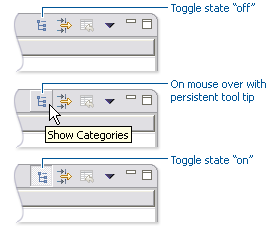

::
  Sometimes a toggle is not a simple on/off state. For example, there
  might be two different ways information can be displayed in a view. In
  this case, two buttons with two separate icons are required. The
  buttons sit beside one another on the local toolbar and when one is
  on, the other is off.

::
  ''' Opened and closed folder states '''
   In the treeview, ideally, folders would be closed when the -/+ widget
  beside the folder icon is in a closed state, as in [+], and opened
  when the -/+ widget beside the folder icon is in an opened state, as
  in [-]. Because Eclipse does not animate opened and closed folder
  states in the treeview, project folders and regular folders are closed
  on the toolbar and local toolbar, but open in wizard banners and in
  treeviews. Here is the reasoning:

::
   On the toolbar, a closed folder represents one that has not been
  created yet.
     In a wizard banner, an open folder represents one that will be created
  in the form of a model object in the treeview.
     In the treeview, an open folder represents one an existing and active
  folder.

::
  One notable exception to open folders in the treeview is when used to
  represent a “group”, as is the case with high-level project groupings
  in the Project Explorer View. These are shown with closed folders.

image::images/des_states_folders.png[des_states_folders,title="fig:des_states_folders"]

*NOTE:* All instructions for creating visual elements are based on using
Adobe Photoshop 7.0 and above and Adobe Illustrator 9.0 and above. If
you use earlier versions of these tools, the instructions may not work
exactly as described.

* Guideline 2.5*

________________________________________________________________________________
Create and implement the graphical versions of the disabled state for
toolbar and local toolbar icons.
________________________________________________________________________________

'''

[[templates]]
Templates
+++++++++

This section provides design files for producing different types of user
interface graphics. A description of the templates and guidance on how
to work with them is provided to help you get started quickly and
working effectively.

All design templates Media:eclipse3.0_UI_Design_resources.zip[ *here*].

This section provides design files for producing different types of user
interface graphics. A description of the templates and guidance on how
to work with them is also provided to help you get started quickly and
working effectively.

Maintaining the simple structure of the templates will facilitate easy
file sharing and efficient production of a large set of graphics for one
tool.

''' Icon Design Template '''

1.  *Populating the template* : Fill out the
Media:eclipse3.0_UI_Design_resources.zip[ *icon_design_template.psd*]
file with the names of all known required icons separated by type, for
example view, toolbar, and model object. Feel free to add or remove rows
as you need them. Each plug-in should have its own separate Photoshop
document (PSD). If you have access to old icon files, these can be
placed into the **orig**. (original) column as a reference or starting
point.
2.  *Designing the icons* : Before beginning to design Eclipse-style
icons or wizard banner graphics, first check if the concept or visual
elements have been covered already. See the
link:#Consistency_&_Reuse[Consistency and Reuse] and
link:#Common_Elements[Common Elements] sections.
+
Create initial passes of your ideas, and then place them in the
template. Up to five different concepts for any given icon can be placed
in the version cells provided, i.e., columns **A**, **B**, **C**, *D*
and **E**.
+
When you are satisfied with the results, mark the icons you think are
the strongest candidates with boxes on the *preferred (black)* layer,
and send to the requester for feedback in the form of a flattened GIF
image.
3.  *Revising the original concept* : It is likely that revisions to the
first pass will be required. If there is room, revised icons can be
placed in the version cells next to the first pass ones. If you run out
of cells or need to erase any previous icon concepts, but do not want to
lose them forever, save a new version of the design file and make space
for new ideas by removing the icons that are not likely to be used.
+
Once the icons have been approved, move the chosen images to the cut
column. To ensure they are positioned properly within the allotted
screen space, turn on the cut layer (pink) in the PSD. For guidance on
size and placement of different types of icons, see the
link:#Icon_Size_&_Placement[Icon Size and Placement] section.
4.  *Creating the disabled versions* : See the link:#States[States]
section for instructions on creating the disabled state for Toolbar and
Local Toolbar icons.
5.  *Cutting the icons* : See the link:#Cutting_Actions[Cutting Actions]
section for instructions on cutting the final images for delivery.
6.  *Marking revised icons* : It is likely that even after the icons
have been cut and delivered to the developer, further revisions will be
required or entirely new icons may be requested. To keep track of which
icons and their instances need to be cut or re-cut, a red box can be
placed around each, using the *cut or re-cut (red)* layer.

''' Wizard Design Template '''

1.  *Populating the vector-based template* : Fill out the vector-based
template Media:eclipse3.0_UI_Design_resources.zip[
vector-wizard_design_template.ai] with the names of all required wizard
banner graphics. As with the Icon Template, you can add or remove rows
to suit the number of graphics you will be creating. If you have access
to the related toolbar wizard icon file, add it to the file as a primary
starting point. If you have access to old wizard graphics, these can be
placed into the **orig**. (original) column as a secondary starting
point.
2.  *Designing the wizard banner graphics* : Before beginning to design
Eclipse-style wizard banner graphics, first check if the toolbar icon
that launches the wizard has been created already. This will provide the
basis of your design. Also, check if any of the visual elements that
will be part of the wizard graphic have been created already in Adobe
Illustrator. See the link:#Consistency_&_Reuse[Consistency and Reuse]
and link:#Common_Elements[Common Elements] sections for existing
elements.
+
The concept for a wizard banner should be closely aligned with, if not
identical to, the toolbar wizard icon that launches the wizard dialog.
Create an initial pass of each image on the *New Wizard graphics* layer,
following the wizard banner stylistic treatment detailed in the
link:#Style_&_Design[Style & Design] section. As with the icons, more
than one pass on the design may be required before coming to the final
design.
+
When you are satisfied with the results, create a JPEG version of the
template and send it to the requestor for feedback. Be sure to include
the toolbar icon that corresponds to the wizard banner graphic as a
reference.
3.  *Transferring vector-based images to the PSD template* : Once the
graphics are approved and ready to be cut, you will need to transfer
them from the AI template to the PSD template. In the AI template, turn
off all layers, except **New Wizard graphics**.Select *File > Save for Web* from the menu. The settings you will need
for this part of the transfer are shown here:
+
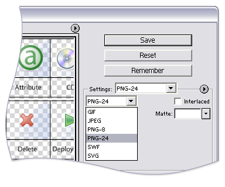
+
The PNG-24 file is temporary and is used to transfer high quality images
from the AI file to the PSD file where you will use an action palette to
cut the files.
4.  *Populating the PSD template* : Fill out the
Media:Eclipse3.0_UI_Design_resources.zip[
eclipse_wizard_design_template.psd] template with Layer Sets for each
wizard banner graphic. Each Layer Set should have a single layer for the
PNG-formatted wizard image. Add Layer Sets as you need them.
+
Open the temporary PNG file and transfer the wizard graphics, one per
layer, to the corresponding Layer Set in the PSD file. Once all of your
wizard graphics are transferred, Save the file. You are ready to cut.
5.  **Cutting the wizard banner graphics**: See the
link:#Cutting_Actions[Cutting Actions] section for instructions on
cutting wizard banner graphics.

* Guideline 2.6*

________________________________________________________________________________
Use the design templates for creating and maintaining UI graphics to
facilitate easy file sharing and efficient production of a large set of
graphics.
________________________________________________________________________________

'''

[[specifications]]
Specifications
^^^^^^^^^^^^^^

This section details technical information you will need to design and
prepare your Eclipse-style graphics for implementation.

[[file-formats]]
File Formats
++++++++++++

This section lists and describes the graphic file formats used for the
different graphic types.

''' GIF - Graphics Interchange Format '''

GIF images are raster-based, can have transparency, and tend to use a
small amount of memory and disk space. Each GIF file contains a color
palette of up to 256 individual colors. This format is most suited to
images that use flat colors or have a limited number of colors. It is
not a suitable format for photographic images.

GIF files use lossless compression, but that may be misleading. A GIF
image is not necessarily identical to original image. Because GIF images
can contain a maximum of 256 colors, images that contain greater than
256 colors must be reduced to 256 colors through quantization (and
optionally, dithering) to approximate the original colors. It is not
necessary to quantize or dither GIF icons that are 16 x 16 pixels
because such icons contain only 256 pixels. The GIF file palette
limitation is, however, something to be aware of when creating larger
images.

''' PNG - Portable Network Graphics '''

PNG is a bitmapped image format that employs lossless data compression.
PNG was created to improve upon and replace the GIF format, as an
image-file format not requiring a patent license. PNG is pronounced
"ping" (/pɪŋ/ in IPA), but can be spoken "P-N-G" (as described at
http://en.wikipedia.org/wiki/PNG). One of the great values of PNG format
is its support for alphas or transparency, allowing bleed through of the
background on which these graphics sit.

PNG is used for the following types of graphics in Eclipse-based
tooling:

* Product
* View (includes Perspective and Fast View)
* Toolbar (includes Toolbar Wizard)
* Local Toolbar
* Model Object
* Object Overlay (includes Underlay)
* Wizard Banner
* Table
* Palette
* Diagram (exceptions noted below under SVG)
* Progress Indicator
* Miscellaneous (there might be exceptions)

''' SVG - Scalable Vector Graphics format '''

SVG is a language for describing both two-dimensional and animated
vector-based graphics in XML. One of its distinguishing attributes is
its scalability: One size of an image will scale nicely to unlimited
sizes. While there is great potential in using SVG for user interface
graphics, especially on palettes and in diagrams, it currently has
limited use in the tooling.

SVG is used for the following types of graphics in Eclipse-based
tooling:

* Diagram (Action Bar only)

In designing graphics for SVG output, use a minimal number of elements
in each image, especially for small 16 x 16 icons. This will help ensure
image clarity, and fewer elements will keep the file size small.

''' BMP - Bit map format '''

BMP is the standard Microsoft Windows raster image format.

BMP is used for the following types of graphics in Eclipse-based
tooling:

* Pointer
* Cursor

''' ICO - Icon format '''

ICO format is used on the Microsoft Windows operating system and is
required for product install and launch icons, including desktop,
treeview, and menu icons.

ICO is used for the following type of graphics in Eclipse-based tooling:

* Product icons (Windows)

''' ICNS - Mac Icon format '''

* Product icons (Mac)

''' XPM - X PixMap format '''

XPM is an ASCII image format that supports transparent color. This image
format is used on Linux and is required for product install and launch
icons, including desktop, treeview, and menu icons.

XPM is used for the following type of graphics in Eclipse-based tooling:

* Product icons (Linux)

''' Resources '''

* Mac
** http://developer.apple.com/documentation/UserExperience/Conceptual/OSXHIGuidelines/index.html?
** http://www.oreillynet.com/pub/a/mac/2001/05/24/aqua_design.html?page=1
* Windows and Mac
** http://www.altuit.com/webs/altuit2/StandaloneBuilderTutorial/BuildingIconsforMacOSXandWindowsXP.htm

*Guideline 2.7*

___________________________________________________
Use the file format specified for the graphic type.
___________________________________________________

'''

[[graphic-types]]
Graphic Types
+++++++++++++

This section describes the different types of graphics that are used in
Eclipse-based tools, and where they are located within the user
interface.

The Eclipse style graphics have been categorized into separate types so
that each can be optimized for its specific location. The majority of
interface graphics are 16 x 16 pixels in size, though there are some
graphic types that come in additional or unconventional sizes suited
specifically to their use. Details on size and placement of the image
see the next subsection on link:#Icon_Size_&amp;_Placement[Icon Size &
Placement]. The following graphic types are described below:

image::images/spec_type_icon.png[spec_type_icon,title="spec_type_icon"]

''' Product '''

::
  The Product icon, also known as the Application icon, represents the
  branding of the product and is always located on the far left of the
  window title bar before the perspective, document, and product name.
  These icons are also used to launch the product from the menu or from
  a desktop or treeview shortcut, and as product identifiers in the
  About screen. Since these icons are intended for use in specific
  places, they are not meant for use on toolbars or in the user
  interface in general.

image::images/spec_type_prod.png[spec_type_prod,title="fig:spec_type_prod"]

::
  *Format:* ICO (Windows), ICNS (Mac), XPM (Linux)

''' Perspective '''

::
  Perspective icons represent different working environments called
  "Perspectives". Each perspective is a set of views and content editors
  with a layout conducive to the tasks associated with that environment.
  The perspective icons allow the user to quickly switch between
  different opened perspectives. By default, these icons are located in
  the top right of the user interface to the right of the main toolbar,
  and have a horizontal orientation. They can also be docked on the top
  left just below the toolbar, keeping a horizontal orientation, or on
  the left of the navigator view with a vertical orientation.

image::images/spec_type_persp.png[spec_type_persp,title="fig:spec_type_persp"]

::
  *Type:* View

::
  *Folder name:* view16

::
  *Size:* 16 x 16 pixels

::
  *Format:* PNG

''' Fast View

::
  Fast View icons allow users to quickly display different views that
  have been created as fast views. These icons are by default located in
  the bottom left of the user interface and have a horizontal
  orientation. They can also be docked with a vertical orientation on
  the left of the navigator view, or on the far right of the user
  interface.

image::images/spec_type_fastview.png[spec_type_fastview,title="fig:spec_type_fastview"]

::
  *Type:* View

::
  *Folder name:* view16

::
  *Size:* 16 x 16 pixels

::
  *Format:* PNG

''' Toolbar '''

::
  Toolbar icons are located on the main toolbar across the top of the
  workbench. They represent actions, and will invoke a command, either
  globally or within the editor.

image::images/spec_type_tool.png[spec_type_tool,title="fig:spec_type_tool"]

::
  *Type:* Toolbar

::
  *Folder names:* etool16 and dtool16

::
  *Size:* 16 x 16 pixels

::
  *Format:* PNG

''' Toolbar Wizard '''

::
  Toolbar wizard icons are found on the main toolbar across the top of
  the workbench as well as in the New wizard dialog list. Selecting one
  of these icons will launch a wizard. The most common type of toolbar
  wizard is for creating "new" objects or resources. These are easily
  recognized by their gold sparkle in the upper right corner of the
  icon. The other common type of toolbar wizard is for generating files.
  These icons are distinguished by two stacked files in front of a
  diskette.

image::images/spec_type_toolwiz.png[spec_type_toolwiz,title="fig:spec_type_toolwiz"]

::
  *Type:* Toolbar

::
  *Folder names:* etool16 and dtool16

::
  *Size:* 16 x 16 pixels

::
  *Format:* PNG

''' View '''

::
  View icons are found on the left side of the titlebar of each view
  within the workbench. These icons indicate each view’s function or the
  type of object a view contains.

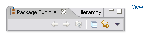

::
  *Type:* View

::
  *Folder name:* view16

::
  *Size:* 16 x 16 pixels

::
  *Format:* PNG

''' Local Toolbar '''

::
  Local toolbar icons are found to the right of the view icon on the
  titlebar of each view within the workbench. They represent actions,
  and invoke commands on objects in only that view. Local toolbar type
  icons are also used in all menus, including main, pull down, and
  context menus.

image::images/spec_type_lcltool.png[spec_type_lcltool,title="fig:spec_type_lcltool"]

::
  *Type:* Local Toolbar

::
  *Folder names:* elcl16 and dlcl16

::
  *Size:* 16 x 16 pixels

::
  *Format:* PNG

''' Model Object '''

::
  Model Object icons are found in tree views, list views, and on editor
  tabs within the workbench. They represent objects and sometimes
  states, but not actions. Examples of model object icons are project
  folders and file types. Note that objects selected in the navigator
  view, such as the Package Explorer in the Java Perspective, have a
  one-to-one relationship with the file open in the Editor View, i.e.,
  the same icon is used in both the navigator view and the Editor tab.
  In contrast, in the Outline View, the model object selected is not
  shown in the Editor, but the selection itself is shown in both the
  Outline View and the source code within the Editor.

::
  One-to-one relationship between model object in treeview and icon in
  Editor tab

image::images/spec_type_obj-lg.png[spec_type_obj-lg,title="fig:spec_type_obj-lg"]

::
  Model object in Outline View is not shown in the Editor, but the
  selection is shown in both views

image::images/spec_type_icon-ol-edit.png[spec_type_icon-ol-edit,title="fig:spec_type_icon-ol-edit"]

::
  *Type:* Model Object

::
  *Folder name:* obj16

::
  *Size:* 16 x 16 pixels

::
  *Format:* PNG

__' Object Overlay (and Underlay)__'

::
  Object overlay icons are decorator elements that are used in tree or
  list views. They are appended to model object icons as signifiers of
  an object type, status, attribute, transition state, multiplicity or
  some sort of change. Underlays are a special type of underlay that go
  under the model object. Like the overlay, they signify some kind of
  change about the model object they append to.

image::images/spec_type_ovr.png[spec_type_ovr,title="fig:spec_type_ovr"]

::
  There are six main types of overlays:

::
  *1. Project Nature* or *Type*

::
  These overlays are displayed in the Navigator and the Package views.
  They are completely superimposed on the model object at the top right
  corner of the 16 x 16 icon space.

::
  Only a few project nature overlay icons have been created to prevent
  crowding in the interface. Project nature overlays quickly identify
  the various types of projects that can be contained in the Navigator
  and mirroring views.

::
  The white keyline border is applied around the image to enhance
  legibility.

::
  *Example:*

image::images/spec_type_ovr-proj-type.png[spec_type_ovr-proj-type,title="fig:spec_type_ovr-proj-type"]

::
  *Type:* Object Overlay

::
  *Folder name:* ovr16

::
  *Size:* 7 x 8 pixels

::
  *Format:* PNG

::
  *2. Auxiliary* or *_Status_*

::
  These overlays are displayed in all tree views. This type of overlay
  is completely superimposed on the model object at the bottom left
  corner of the 16 x 16 icon space.

::
  The auxiliary overlay quickly identifies the status of an object.
  Examples of auxiliary overlays are warning, error, failure, and
  success.

::
  *Example:*

image::images/spec_type_ovr-aux-status.png[spec_type_ovr-aux-status,title="fig:spec_type_ovr-aux-status"]

::
  *Type:* Object Overlay

::
  *Folder name:* ovr16

::
  *Size:* 7 x 8 pixels

::
  *Format:* PNG

::
  *3. Java* or *_Attribute_*

::
  These overlays are displayed in the Outline, Hierarchy, and Package
  views. The Java overlays are appended to the model object icon, so
  they extend the 16 x 16 icon space. They are placed to the right of a
  model object icon, overlapping the 16 x 16 model object space by 3
  pixels. A maximum of 3 java overlays can be put on the model object.

::
  The order in which an overlay appears depends on the order in which it
  has been assigned. In designing Java overlays, it is important to make
  sure the base object icon can support the addition of overlays without
  compromising readability. Note that there are two Java overlays that
  always display at the bottom right corner of the model object:
  Synchronize overlay synchronized (method) and Run overlay run (class).

::
  Java overlays identify attributes of an object. Examples include
  static, final, abstract, and synchronized.

::
  Note: In the Hierarchy and Outline views, the Java overlays are
  appended to the right of the model object as shown in the first
  example below, but in the Package view they are stacked over the model
  object, as shown in the second example.

::
  *Examples:*

::
  Hierarchy and Outline Views:
image:images/spec_type_ovr-java-att.png[spec_type_ovr-java-att,title="fig:spec_type_ovr-java-att"]

::
  Package View:
image:images/spec_type_ovr-java-att2.png[spec_type_ovr-java-att2,title="fig:spec_type_ovr-java-att2"]

::
  *Type:* Object Overlay

::
  *Folder name:* ovr16

::
  *Size:* 7 x 8 pixels

::
  *Format:* PNG

::
  *4. Version Control* or *_Transition-state_*

::
  These overlays are displayed in the Navigator view and in the
  Structure View of the Merge Editor in CVS. When they are displayed in
  the Navigator view, the overlay is completely superimposed on the
  model object at the right of the 16 x 16 icon space.

::
  When the version control overlays are displayed in the Structure View
  of the Merge Editor in CVS, they are appended to the model object, so
  they extend the 16 x 16 space. They are placed to the right of a model
  object icon, overlapping the 16 x 16 model object space by 3 pixels.
  In CVS there is a maximum of 2 overlays on the right of the object.

::
  Version control overlays identify a transition state of an object.
  Examples of these overlays are incoming, outgoing, in conflict, added,
  deleted, and changed.

::
  *Examples:*

::
  Navigator View:

::
  Structure View:
image:images/spec_type_ovr-teamsamp2.png[spec_type_ovr-teamsamp2,title="fig:spec_type_ovr-teamsamp2"]

::
  *Type:* Object Overlay

::
  *Folder name:* ovr16

::
  *Size:* Typically 7 x 8 pixels, though some are larger

::
  *Format:* PNG

::
  *5. Multiplicity*

::
  These overlays are displayed in the treeview of a generator model file
  in the Eclipse Modeling Framework (EMF). These represent
  relationships, such as one to one or one to many within the model.
  This type of overlay spans the width of the model object icon and is
  located at its base so that it does obscure too much of the underlying
  object.

::
  *Example:*

image:images/spec_type_ovr-multsamp.png[spec_type_ovr-multsamp,title="fig:spec_type_ovr-multsamp"]

::
  *Type:* Object Overlay

::
  *Folder name:* ovr16

::
  *Size:* 16 x 6 pixels image size but a final cut size of 16 x 16
  pixels

::
  *Format:* PNG

::
  *6. Underlays*

::
  These are displayed under model objects in the treeview of some tools.
  They signify some kind of change about the object, such as version
  control or generated code. Underlays are typically square in shape,
  with a 2 pixel radius on each corner, and are light in color so they
  are clean and not overstated when seen multiple times in a treeview.

::
  *Example:*

image::images/spec_type_ovr-undersamp.png[spec_type_ovr-undersamp,title="fig:spec_type_ovr-undersamp"]

::
  *Type:* Object Overlay

::
  *Folder name:* ovr16

::
  *Size:* 16 x 16 pixels

::
  *Format:* PNG

''' Table '''

::
  Table icons are a type of model object icon used specifically in
  tables as labels, status indication, or to give additional information
  about the items they accompany in a table row. Although these icons
  are a type of model object, they are created smaller than regular
  model objects in order to fit in the table row without distortion or
  crowding the space.

::
  Table icons shown in context

image::images/spec_type_table_op1.png[spec_type_table_op1,title="fig:spec_type_table_op1"]

::
  *Type:* Table

::
  *Folder name:* obj16

::
  *Size:* They are designed in the 16 x 16 pixel space, but the actual
  image size is no greater than 15 x 14 pixels.

::
  *Format:* PNG

''' Palette '''

::
  Palette icons are located on the palette and most commonly accompany
  diagrams or some editable canvas space. In this context, palette icons
  are either objects that may be added to the canvas, or tools that may
  be used to manipulate objects or draw lines or shapes on the canvas.

::
  Palettes are also used to host reusable elements, such as the Snippets
  view, which contains code snippets for reuse. In this context, double
  clicking on a snippet will either add the snippet directly to the
  source code or invoke an intervening dialog box, which provides the
  user choices about the snippet before it is inserted into their source
  code within the editor. Some code snippets can also be dragged and
  dropped directly into the source code.

::
  Palette icons shown in context

image::images/spec_type_palette.png[ spec_type_palette,title="fig: spec_type_palette"]

::
  *Type:* Palette

::
  *Folder name:* pal

::
  *Size:* Size varies depending on the context of the palette. The
  default size is 16 x 16 pixels but can be changed by the user to "Use
  large icons", which are 24 x 24 pixels in size. There are also rare
  cases where 32 x 32 pixel icons are used on the palette.

::
  *Format:* PNG

''' Diagram '''

::
  Diagram icons come in two subtypes: Canvas and Action Bar. Canvas
  icons are used in the diagram or canvas area. These icons commonly
  represent object types, but can also be used to mark content type or
  to show formatting in the preview mode of an editor. The size of a
  canvas icon depends on its purpose and context. Action Bar icons sit
  on a kind of "mini palette" within the diagram. This mini palette is
  contact sensitive and will be shown only when the cursor hovers over
  or selects a certain type of object in the diagram. For example,
  'fields' and 'types' in a UML Diagram.

::
  Diagram icons shown in context

image::images/spec_type_diagram.png[ spec_type_diagram,title="fig: spec_type_diagram"]

::
  *Type:* Diagram

::
  *Folder name:* dgm

::
  *Size:* Canvas icons may be 16 x 16, 24 x 24, or 32 x 32 pixel in
  size. There are also instances of 15 x 15, 12 x 12, and 10 x 10 pixel
  icons in some Web Tooling diagrams. 15 x 15 and 10 x 10 icons are used
  in site navigation diagrams, and 12 x 12 icons are used in the editor
  preview mode to show content types and formatting.

::
  *Format:* PNG is used for all diagram graphics, except Action Bar
  icons, which are SVG.

''' Progress Indicator '''

::
  The progress indicator icon is located in lower right of user
  interface to the right of the actual progress indicator, which shows
  the linear progress of a process. As shown in the following image, the
  icon is also a button that will open the Progress View.

::
  Progress indicator icon shown in context

image::images/spec_type_progress.png[ spec_type_progress,title="fig: spec_type_progress"]

::
  *Type:* Progress Indicator

::
  *Folder name:* progress

::
  *Size:* 16 x 16 pixels

::
  *Format:* PNG

''' Pointer and Cursor Mask '''

::
  Pointer icons are cursors and each requires a cursor mask. The cursor
  mask is an inverted image, or a complete mask, of the pointer.

::
  Pointer and cursor mask examples

image::images/spec_type_cursor_mask.png[ spec_type_cursor_mask,title="fig: spec_type_cursor_mask"]

::
  *Types:* Pointer and Cursor Mask

::
  *Folder name:* point

::
  *Size:* 32 x 32 pixels

::
  *Format:* BMP

''' Wizard Banner '''

::
  Wizard banner graphics are located on the right side of the wizard
  banner. They visually represent the outcome of the wizard, such as a
  new Java class.

::
  New Java class wizard graphic shown in context

image::images/spec_type_wiz.png[ spec_type_wiz,title="fig: spec_type_wiz"]

::
  *Type:* Wizard Banner

::
  *Folder name:* wizban

::
  *Size:* 75 x 66 pixels

::
  *Format:* PNG

*Guideline 2.8*

________________________________________________________________________________
Use the appropriate graphic type in the location it is designed for
within the user interface.
________________________________________________________________________________

'''

[[icon-size-placement]]
Icon Size & Placement
+++++++++++++++++++++

This section shows the final cut size of each of the different types of
icons, as well as what the placement and drawing area is within the
allotted space.

The majority of Eclipse style icons are designed within an area of 16 x
16 pixels. That is the final cut size of the image. Within that area, a
15 x 15 pixel space is reserved for the image itself, leaving both a
vertical and horizontal line of empty pixels to allow for proper
alignment of the image within the user interface. In the size and
placement images below, the light blue represents the image area and the
bright pink represents the empty pixel area.

If the height and width of the image are an even number of pixels
smaller than 16 x 16 pixels, it is a rule of thumb to center the image
within the 16 x 16 space. For example, a 14 x 14 pixel image will have a
single row of empty pixels on all four sides.

Exceptions to the common 16 x 16 image size are also detailed below. All
sizes are indicated with width before height.

''' Product '''

::
  Product icons occupy the full space allotted for all five sizes: 16 x
  16, 24 x 24, 32 x 32, 64 x 64, and 72 x 72 pixels. This shows how the
  16 x 16 product icon fills the entire space:

________________________________________________________________________________
[cols=",,,,,,,,,,,,,,,,",]
|=======================================================================
|*Image size in allotted space* | | | | | | | | | | | | | | | |*Sample
image in place*

|image:images/spec_size_prod16.png[spec_size_prod16,title="fig:spec_size_prod16"]
| | | | | | | | | | | | | | |
|image:images/spec_size_prod16samp.png[spec_size_prod16samp,title="fig:spec_size_prod16samp"]
|=======================================================================
________________________________________________________________________________

''' Perspective and Fast View '''

::
  The maximum image size is 16 x 16 pixels, but 15 x 15 is recommended.
  If the image is 15 x 15 or smaller, the empty pixels must be on the
  right and bottom, as shown here.

::
  Image size in allotted space

________________________________________________________________________________
[cols=",,,,,,,,,,,,,,,,",]
|=======================================================================
|*Image size in allotted space* | | | | | | | | | | | | | | | |*Sample
image in place*

|image:images/spec_size_persp.png[spec_size_persp,title="fig:spec_size_persp"]
| | | | | | | | | | | | | | |
|image:images/spec_size_perspsamp.png[spec_size_perspsamp,title="fig:spec_size_perspsamp"]
|=======================================================================
________________________________________________________________________________

''' View '''

::
  The maximum image size is 16 x 16 pixels, but 15 x 15 is recommended.
  If the image is 15 x 15 or smaller, the empty pixels must be on the
  left and bottom, as shown here.

________________________________________________________________________________
[cols=",,,,,,,,,,,,,,,,",]
|=======================================================================
|*Image size in allotted space* | | | | | | | | | | | | | | | |*Sample
image in place*

|image:images/spec_size_view.png[spec_size_view,title="fig:spec_size_view"]
| | | | | | | | | | | | | | |
|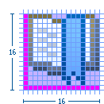
|=======================================================================
________________________________________________________________________________

''' Toolbar, Toolbar Wizard, and Local Toolbar '''

::
  The maximum image size is 16 x 16 pixels, but 15 x 15 is recommended.
  If the image is 15 x 15 or smaller, the empty pixels must be on the
  left and top, as shown here.

________________________________________________________________________________
[cols=",,,,,,,,,,,,,,,,",]
|=======================================================================
|*Image size in allotted space* | | | | | | | | | | | | | | | |*Sample
image in place*

|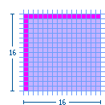
| | | | | | | | | | | | | | |
|image:images/spec_size_toolsamp.png[spec_size_toolsamp,title="fig:spec_size_toolsamp"]
|=======================================================================
________________________________________________________________________________

''' Model Object '''

::
  The maximum image size is 16 x 15 pixels, but 15 x 15 is recommended.
  Model Object icons must be no greater than 15 pixels high. The empty
  pixels must be on the left and bottom, as shown here.

________________________________________________________________________________
[cols=",,,,,,,,,,,,,,,,",]
|=======================================================================
|*Image size in allotted space* | | | | | | | | | | | | | | | |*Sample
image in place*

|image:images/spec_size_obj.png[spec_size_obj,title="fig:spec_size_obj"]
| | | | | | | | | | | | | | |
|image:images/spec_size_objsamp.png[spec_size_objsamp,title="fig:spec_size_objsamp"]
|=======================================================================
________________________________________________________________________________

''' Object Overlay (and Underlay) '''

::
  Most object overlay icons are a maximum image size of 7 x 8 pixels,
  always centered. There are some exceptions to this size, two of which
  are covered here: the "multiplicity" overlay and the "underlay". The
  multiplicity overlay spans the width of the model object to a maximum
  of 16 pixels wide and 6 pixels high. The underlay is a maximum size of
  15 x 16 pixels, though commonly they are a square 15 x 15 pixels in
  size so they are uniform when seen multiple times in the treeview.

::
  Overlay icons should have an outer white keyline surrounding the image
  to clearly separate them from the model object icons that they over
  lay. If there is not enough space to add the white keyline all the way
  around the overlay image, then add the white pixels on only the side
  that will be overlapping the model object. This can be determined by
  finding out what type of overlay it is. See the Graphic Types
  subsection for a sample and description of the different types of
  overlays. For information on how each of the overlays is positioned on
  the model object, see the subsection on Positioning in the UI.

::
  Standard object overlay with a maximum image size of 7 x 8 pixels:

________________________________________________________________________________
[cols=",,,,,,,,,,,,,,,,",]
|=======================================================================
|*Image size in allotted space* | | | | | | | | | | | | | | | |

|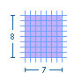
| | | | | | | | | | | | | | | |
|=======================================================================
________________________________________________________________________________

::
  Example of a standard Project Nature—**Type**—object overlay in place:

________________________________________________________________________________
[cols=",,,,,,,,,,,,,,,,",]
|=======================================================================
|*Image size in allotted space* | | | | | | | | | | | | | | | |*Sample
image in place*

|image:images/spec_size_ovr-proj.png[spec_size_ovr-proj,title="fig:spec_size_ovr-proj"]
| | | | | | | | | | | | | | |
|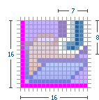
|=======================================================================
________________________________________________________________________________

::
  Example of a standard Auxiliary—**Status**—object overlay in place:

________________________________________________________________________________
[cols=",,,,,,,,,,,,,,,,",]
|=======================================================================
|*Image size in allotted space* | | | | | | | | | | | | | | | |*Sample
image in place*

|image:images/spec_size_ovr-aux.png[spec_size_ovr-aux,title="fig:spec_size_ovr-aux"]
| | | | | | | | | | | | | | |
|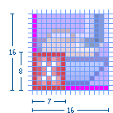
|=======================================================================
________________________________________________________________________________

::
  Example of a standard Java—**Attribute**—object overlay in place:

________________________________________________________________________________
[cols=",,,,,,,,,,,,,,,,",]
|=======================================================================
|*Image size in allotted space* | | | | | | | | | | | | | | | |*Sample
image in place*

|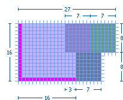
| | | | | | | | | | | | | | |
|image:images/spec_size_ovr-javasamp.png[spec_size_ovr-javasamp,title="fig:spec_size_ovr-javasamp"]
|=======================================================================
________________________________________________________________________________

::
  Example of a standard Version Control—**Transition**-state—object
  overlay in place:

________________________________________________________________________________
[cols=",,,,,,,,,,,,,,,,",]
|=======================================================================
|*Image size in allotted space* | | | | | | | | | | | | | | | |*Sample
image in place*

|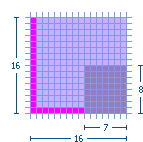
| | | | | | | | | | | | | | |
|image:images/spec_size_ovr-verssamp.png[spec_size_ovr-verssamp,title="fig:spec_size_ovr-verssamp"]
|=======================================================================
________________________________________________________________________________

::
  Example of two stacking Version Control object overlays in place:

________________________________________________________________________________
[cols=",,,,,,,,,,,,,,,,",]
|=======================================================================
|*Image size in allotted space* | | | | | | | | | | | | | | | |*Sample
image in place*

|image:images/spec_size_ovr-cvs.png[spec_size_ovr-cvs,title="fig:spec_size_ovr-cvs"]
| | | | | | | | | | | | | | |
|image:images/spec_size_ovr-cvssamp.png[spec_size_ovr-cvssamp,title="fig:spec_size_ovr-cvssamp"]
|=======================================================================
________________________________________________________________________________

::
  *Multiplicity* object overlay with a maximum image size of 16 x 6
  pixels:

________________________________________________________________________________
[cols=",,,,,,,,,,,,,,,,",]
|=======================================================================
|*Image size in allotted space* | | | | | | | | | | | | | | | |*Sample
image in place*

|image:images/spec_size_ovr-mult.png[spec_size_ovr-mult,title="fig:spec_size_ovr-mult"]
| | | | | | | | | | | | | | |
|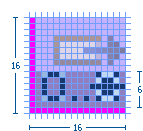
|=======================================================================
________________________________________________________________________________

::
  *Underlay* with a maximum image size of 16 x 15 pixels, but 15 x 15 is
  recommended. The empty pixels must be on the left and bottom, as shown
  here:

________________________________________________________________________________
[cols=",,,,,,,,,,,,,,,,",]
|=======================================================================
|*Image size in allotted space* | | | | | | | | | | | | | | | |*Sample
image in place*

|image:images/spec_size_ovr-under.png[spec_size_ovr-under,title="fig:spec_size_ovr-under"]
| | | | | | | | | | | | | | |
|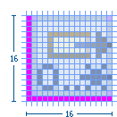
|=======================================================================
________________________________________________________________________________

''' Table '''

::
  The maximum image size is 15 x 14 pixels. Table icons must be no
  greater than 14 pixels high. The empty pixels must be on the top,
  bottom, and left, as shown here.

________________________________________________________________________________
[cols=",,,,,,,,,,,,,,,,",]
|=======================================================================
|*Image size in allotted space* | | | | | | | | | | | | | | | |*Sample
image in place*

|image:images/spec_size_table.png[spec_size_table,title="fig:spec_size_table"]
| | | | | | | | | | | | | | |
|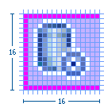
|=======================================================================
________________________________________________________________________________

''' Palette '''

::
  *Standard small (16 x 16) palette icon:* The maximum image size is 16
  x 15 pixels, but 15 x 15 is recommended. Palette icons must be no
  greater than 15 pixels high. The empty pixels must be on the left and
  bottom, as shown here.

________________________________________________________________________________
[cols=",,,,,,,,,,,,,,,,",]
|=======================================================================
|*Image size in allotted space* | | | | | | | | | | | | | | | |*Sample
image in place*

|image:images/spec_size_pal16.png[spec_size_pal16,title="fig:spec_size_pal16"]
| | | | | | | | | | | | | | |
|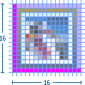
|=======================================================================
________________________________________________________________________________

::
  *Standard large (24 x 24) palette icon:* The maximum image size is 24
  x 23 pixels, but 23 x 23 is recommended. Palette icons must be no
  greater than 23 pixels high. The empty pixels must be on the left and
  bottom, as shown here.

________________________________________________________________________________
[cols=",,,,,,,,,,,,,,,,",]
|=======================================================================
|*Image size in allotted space* | | | | | | | | | | | | | | | |*Sample
image in place*

|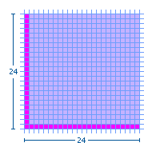
| | | | | | | | | | | | | | |
|image:images/spec_size_pal24samp.png[spec_size_pal24samp,title="fig:spec_size_pal24samp"]
|=======================================================================
________________________________________________________________________________

::
  *Large (32 x 32) palette icon:* The maximum image size is 30 x 30
  pixels with the image centered. The empty pixels are on all four sides
  of the image.

________________________________________________________________________________
[cols=",,,,,,,,,,,,,,,,",]
|=======================================================================
|*Image size in allotted space* | | | | | | | | | | | | | | | |*Sample
image in place*

|image:images/spec_size_pal32.png[spec_size_pal32,title="fig:spec_size_pal32"]
| | | | | | | | | | | | | | |
|image:images/spec_size_pal32samp.png[spec_size_pal32samp,title="fig:spec_size_pal32samp"]
|=======================================================================
________________________________________________________________________________

''' Diagram '''

::
  *Small (10 x 10) canvas icon:* The maximum image size is 10 x 10
  pixels. The image fills the space as required.

________________________________________________________________________________
[cols=",,,,,,,,,,,,,,,,",]
|=======================================================================
|*Image size in allotted space* | | | | | | | | | | | | | | | |*Sample
image in place*

|image:images/spec_size_dgm10.png[spec_size_dgm10,title="fig:spec_size_dgm10"]
| | | | | | | | | | | | | | |
|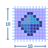
|=======================================================================
________________________________________________________________________________

::
  *Small (12 x 12) canvas icon:* The maximum image size is 12 x 12
  pixels. The image fills the space as required.

________________________________________________________________________________
[cols=",,,,,,,,,,,,,,,,",]
|=======================================================================
|*Image size in allotted space* | | | | | | | | | | | | | | | |*Sample
image in place*

|image:images/spec_size_dgm12.png[spec_size_dgm12,title="fig:spec_size_dgm12"]
| | | | | | | | | | | | | | |
|image:images/spec_size_dgm12samp.png[spec_size_dgm12samp,title="fig:spec_size_dgm12samp"]
|=======================================================================
________________________________________________________________________________

::
  *Small (16 x 16) canvas icon:* The maximum image size is 16 x 15
  pixels, but 15 x 15 is recommended. The empty pixels must be on the
  left and bottom, as shown here.

________________________________________________________________________________
[cols=",,,,,,,,,,,,,,,,",]
|=======================================================================
|*Image size in allotted space* | | | | | | | | | | | | | | | |*Sample
image in place*

|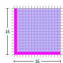
| | | | | | | | | | | | | | |
|image:images/spec_size_dgm16samp.png[spec_size_dgm16samp,title="fig:spec_size_dgm16samp"]
|=======================================================================
________________________________________________________________________________

::
  *Large (24 x 24) canvas icon:* The maximum image size is 24 x 23
  pixels, but 23 x 23 is recommended. The empty pixels must be on the
  left and bottom, as shown here.

________________________________________________________________________________
[cols=",,,,,,,,,,,,,,,,",]
|=======================================================================
|*Image size in allotted space* | | | | | | | | | | | | | | | |*Sample
image in place*

|image:images/spec_size_dgm24.png[spec_size_dgm24,title="fig:spec_size_dgm24"]
| | | | | | | | | | | | | | |
|image:images/spec_size_dgm24samp.png[spec_size_dgm24samp,title="fig:spec_size_dgm24samp"]
|=======================================================================
________________________________________________________________________________

::
  *Large (32 x 32) canvas icon:* The maximum image size is 32 x 32
  pixels, but 30 x 30 is recommended with the image centered. The empty
  pixels are on all four sides of the image.

________________________________________________________________________________
[cols=",,,,,,,,,,,,,,,,",]
|=======================================================================
|*Image size in allotted space* | | | | | | | | | | | | | | | |*Sample
image in place*

|image:images/spec_size_dgm32.png[spec_size_dgm32,title="fig:spec_size_dgm32"]
| | | | | | | | | | | | | | |
|image:images/spec_size_dgm32samp.png[spec_size_dgm32samp,title="fig:spec_size_dgm32samp"]
|=======================================================================
________________________________________________________________________________

''' Progress Indicator '''

::
  The maximum image size is 16 x 15 pixels, but 15 x 15 is recommended.
  Progress indicator icons must be no greater than 15 pixels high. The
  empty pixels must be on the left and bottom, as shown here.

________________________________________________________________________________
[cols=",,,,,,,,,,,,,,,,",]
|=======================================================================
|*Image size in allotted space* | | | | | | | | | | | | | | | |*Sample
image in place*

|image:images/spec_size_prog.png[spec_size_prog,title="fig:spec_size_prog"]
| | | | | | | | | | | | | | |
|image:images/spec_size_progsamp.png[spec_size_progsamp,title="fig:spec_size_progsamp"]
|=======================================================================
________________________________________________________________________________

''' Pointer and Cursor Mask '''

::
  The final size of the pointer and cursor masks is 32 x 32 pixels. The
  actual image size of the pointer is usually fewer than 20 x 20 pixels,
  often 16 x 16 pixels, but can also fill the entire 32 x 32 space.
  There are no empty pixels in the pointer and cursor mask images. Both
  are filled completely with black and white, with the mask being the
  opposite of the pointer or masking it out entirely.

::
  Pointer and cursor mask image sizes shown in the 32 x 32 pixel space:

________________________________________________________________________________
[cols=",,,,,,,,,,,,,,,,",]
|=======================================================================
|*Image size in allotted space* | | | | | | | | | | | | | | | |*Sample
image in place*

|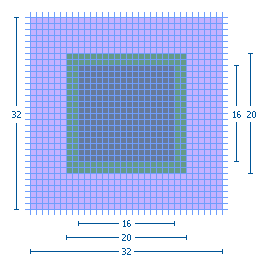
| | | | | | | | | | | | | | |
|image:images/spec_size_pointsamp.png[spec_size_pointsamp,title="fig:spec_size_pointsamp"]
|=======================================================================
________________________________________________________________________________

''' Wizard Banner '''

::
  All wizard banner graphics are designed to fit within a specified
  screen space of 75 x 66 pixels on the right side of the wizard banner.

::
  The actual size of each graphic will vary depending on the elements
  involved, but will generally be around 67 x 50 pixels in size.

::
  Within the banner space allocation, there is no firm rule for where to
  place the wizard graphic. Generally, the graphic is centered
  vertically, and off-center to the left horizontally.

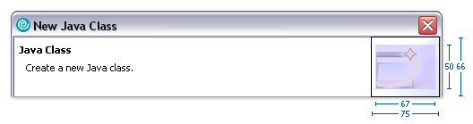

image:images/spec_size_wizsamp.png[spec_size_wizsamp,title="fig:spec_size_wizsamp"]

*Guideline 2.9*

_________________________________________________________________
Follow the specific size specifications for each type of graphic.
_________________________________________________________________

*Guideline 2.10*

________________________________________________________________________________
Cut the graphics with the specific placement shown to ensure alignment
in the user interface.
________________________________________________________________________________

'''

[[implementation]]
Implementation
^^^^^^^^^^^^^^

This section provides automated cutting actions, and conventions for
file and folder naming and structure.

[[cutting-actions]]
Cutting Actions
+++++++++++++++

This section describes the macros for cutting icons, icon overlays, and
wizard banner graphics to get them ready for implementation.

In the process described here for creating icons, we use the term 'cut'
to mean the action of generating the individual .png files for each
icon. This term refers to the fact that the icons are created in a
single original .psd file that contains all the icons for a given
product (the icon_template.psd file), and then the individual icons are
'cut' out of the file into individual files.

To increase the speed and efficiency of cutting hundreds of icons at a
time, a series of cutting actions has been created that, when run in
Adobe Photoshop, will automatically guide you through the cutting
process for each icon in a matter of seconds. All you need to do is
start the action and when prompted, name and save each icon into its
proper folder.

To use these actions, click here to download the
media:eclipse_cutting_R3V6.zip[eclipse_cutting_R3V6.atn] file, and then
load it into the Actions Palette.

''' Cutting 16 x 16 Pixel Icons '''

1.  Make sure that the pink cut layer is turned on, in the psd file.
2.  Play the Dupe and Flatten_main file action to create a new, flat
file. (See A in the Detailed View of Cutting Actions below)
3.  Using the Marquee tool at a fixed size of 16 x 16 pixels, select the
first icon to be cut.
4.  Play the eclipse icon cuts_16s action. The action will then
automatically move through the cutting process. (See B-F below)
5.  When prompted, provide a name for the icon in lower case and click
Save to save it as a Compuserve .png in the folder you specify. (See G)
6.  When you click OK to finish saving the image as either a Normal or
Interlaced .png file, the action then automatically moves the marquee
selection down to the next icon and begins the process all over again.
(See H)

::
  To ensure the last step works properly, make sure the pink cut square
  for each icon is spaced exactly as specified in the
  icon_design_template.psd.

::
  *Detailed View of Cutting Actions*

image::images/imp_cut_icons.png[imp_cut_icons,title="fig:imp_cut_icons"]

''' Cutting 7 x 8 Pixel Object Overlay Icons '''

Follow the steps as laid out above, except cut the icon at 7 x 8 pixels,
using the Eclipse icon cuts_overlays action.

''' Cutting Wizard graphics '''

1.  Ensure that the wizard psd has a path called "wizard cut path" under
*Paths* tab.
2.  Play the Dupe and Flatten_main file action to create a new, flat
file.
3.  Ensure that the layer called "soft curves" is visible.
4.  Ensure that each wizard graphic is in a layer set.
5.  Select the top layer set where you want to being cutting and ensure
all other layer sets are not visible.
6.  Play the Wizard Dupe and crop action to create a new file that is
cropped to 75 x 66 pixels. (See A-C below)
7.  Play the Wizard cut action. The action will then automatically move
through the cutting process from top to bottom in the layers palette.
(See D below)
8.  When prompted, provide a name for the icon in lower case and click
Save to save it as a Compuserve .png in the folder you specify. (See E)
9.  When you click OK to finish saving the image as either a Normal or
Interlaced .png file, the action then automatically delete the current
layer set, and moves to the next one and begins the process all over
again. (See F)

::
  To ensure the last step works properly, make sure each wizard graphic
  is contained in a layer set folder.

::
  *Detailed View of Cutting Actions*

image::images/imp_cut_wizards.png[imp_cut_wizards,title="fig:imp_cut_wizards"]

*Guideline 2.11*

________________________________________________________________________________
Use the cutting actions provided to increase the speed and efficiency of
cutting a large number of graphics.
________________________________________________________________________________

'''

[[naming-conventions]]
Naming Conventions
++++++++++++++++++

This section describes the Eclipse standard for file naming and
guidelines for using suffixes that will help others quickly identify the
graphic type or function.

We recommend that you work with your development contact to establish
file names for each graphic before you begin design work, using the
following guidelines:

''' Abbreviations '''

The file name should be an abbreviation of the full icon name, for
example, the name for the Create DTD Wizard icon might be abbreviated to
"CrtDTD".

''' Case '''

All file names must be in lower case, for example, CrtDTD becomes
"crtdtd".

''' Character length '''

File names should be 10 characters or fewer whenever possible.
Underscores count as a character.

''' Suffixes '''

The file name should end with a suffix that describes its location or
function in the user interface, for example, "crtdtd_wiz.png". See the
table below for suffix suggestions.

''' Multiple sizes '''

Icons that have multiple sizes within one folder, such as multiple
palette icon sizes, are differentiated by adding the icon size to the
suffix. For example, file_pal, file_pal24, file_pal32, where
*_pal represents the default 16 x 16 pixel size and the *_pal24 and
*_pal32 represent larger sizes of the same icon.

''' Suggestions for File Naming Suffixes '''

image::images/name-conv-tabl.jpg[name-conv-tabl.jpg,title="name-conv-tabl.jpg"]

*Guideline 2.12*

________________________________________________________________________________
Abbreviate file name instead of using the full icon name, e.g., New
Interface becomes "newint".
________________________________________________________________________________

*Guideline 2.13*

______________________________________________________________________
Use lower case characters in your file names, e.g., DTD becomes "dtd".
______________________________________________________________________

*Guideline 2.14*

________________________________________________________________________________
Use 10 characters or fewer in your file names if possible (underscores
count as a character).
________________________________________________________________________________

*Guideline 2.15*

________________________________________________________________________________
Use a file name suffix that describes its location or function in the
tool, e.g., newint_wiz, or its size in the case of icons that require
multiple sizes.
________________________________________________________________________________

*Guideline 2.16*

______________________________________
Keep the original file names provided.
______________________________________

'''

[[folder-structure]]
Folder Structure
++++++++++++++++

This section provides the Eclipse standard for folder names and
structure for storing and implementing graphics within your plugin.

Once your graphics are ready for implementation they should be cut and
saved into the folder naming and structure system described below. This
system is based on the Eclipse plug-in folder naming and structure. When
you compress your files for delivery using this system, they can be
easily uncompressed directly into the intended plugin.

::
  1. The name of the first level folder depends on where the plugin
  resides:

::* Eclipse Project components use the *org.eclipse.componentname.ui*
convention for plugin names.

::* Eclipse Tools components use the
*org.eclipse.subprojectname.componentname.ui* convention for plugin
names.

::* IBM components use the *com.ibm.etools.componentname.ui* convention
for plugin names.

::
  ;;
    Substitute the name of the plugin, for example "debugger", for
    "componentname", and the name of the subproject, such as "wst" for
    "subprojectname".

::
  ;;
    To read more about plugin names in Eclipse, see the
    http://help.eclipse.org/help32/index.jsp?topic=/org.eclipse.platform.doc.isv/reference/misc/naming.html[Eclipse
    Platform Naming Conventions] help page.

::
  2. Each plugin that contains user interface graphics requires an
  *icons* folder.

::
  3. Within the *icons* folder, there are separate folders with names
  that indicate the state, type, and in some cases size, of the icons
  within, as described below:

::* The first letter of Toolbar and Local toolbar folder names indicates
the icon state. Use the letter d for disabled, or *e* for enabled.

::* The next 3 to 8 letters signify the icon type: diagram (dgm), local
toolbar (lcl), toolbar (tool), model object (obj), object overlay (ovr),
palette (pal), pointer (point), product (prod), progress indicator
(progress), view and perspective (view), and wizard banner (wizban).

::* The last two digits of the folder name are intended to indicate the
size of the icons within. However, only a small number of folders show
size in the name. These names will persist, but all folder types may now
contain multiple sizes of images, such as 16 x 16 and 24 x 24 pixel
versions of palette icons. The link:#Naming_Conventions[Naming
Conventions] subsection addresses file naming for multiple sizes within
one folder.

::
  The following image shows a complete folder structure for a plug-in:

image::images/imp_folderstruct.png[imp_folderstruct,title="fig:imp_folderstruct"]

image::images/imp_folderstruct_tabl.png[imp_folderstruct_tabl,title="fig:imp_folderstruct_tabl"]

*NOTES:*

\1. For some legacy plug-ins, inside the *icons* folder, there is a
folder called **full**, which then contains these icon type folders.
Find out from your development contact if this extra folder is required.

\2. We recommend that you do not use the *dnd* folder name as it used by
development for drag and drop elements. These are cursor mask icons for
moving views within the application.

*Guideline 2.17*

________________________________________________________________
Follow the predefined directory structure and naming convention.
________________________________________________________________

*Guideline 2.18*

___________________________________________
Keep the original directory names provided.
___________________________________________

*Guideline 2.19*

________________________________________________________________________________
Minimize duplication of graphics within a plugin by keeping all graphics
in one, or few, first level user interface directories.
________________________________________________________________________________

*Guideline 2.20*

______________________________________________________
Use the active, enabled, and disabled states provided.
______________________________________________________

'''

[[component-development]]
Component Development
~~~~~~~~~~~~~~~~~~~~~

[[commands]]
Commands
^^^^^^^^

A command, which is invoked by a user to carry out some specific
functions, may appear as an item in a menu, or an item in a toolbar. In
reflection of this, it has attributes for the menu or tool item label,
tooltip, and image.

As a plug-in developer, you can contribute commands to the window menu
bar and toolbar, or to individual views and editors. Contribution to the
window is performed using an action set, a set of task oriented commands
which the user can show or hide. Contribution to a view or editor is
performed using individual command.

Here is an illustration of the main areas of contribution.

image::images/actionExamples.png[actionExamples,title="actionExamples"]

In this section we'll look at general command guidelines. For
information on window, view, or editor specific guidelines, see
link:#Windows[Windows], link:#Views[Views], and link:#Editors[Editors].

[[appearance]]
Appearance
++++++++++

Each command must have a label, tool tip, and image. If the command
appears in a toolbar, the command image will be displayed on all
platforms. If the command appears in a menu, the image will be displayed
on only some platforms, such as Windows® 2000. The label and tool tip
should use Headline style capitalization, as defined in General UI
Guidelines.

Each command must provide one full color image. This image will be
displayed if the mouse is placed over the command. It will also be used
to generate the enabled, disabled, and pressed images which appear in
normal command use. Commands which are contributed in code also have the
option to define explicit images for enabled, disabled, and roll over.
This option can be used for greater control over image appearance.

The following snapshot shows the valid use of Headline capitalization in
a toolbar.

image::images/tooltipCaps.png[tooltipCaps,title="fig:tooltipCaps"]

**Guideline 3.1**

________________________________________________________________________________
Each command must have a label, tool tip, and full color image. The
label and tool tip must use Headline style capitalization.
________________________________________________________________________________

'''

The tool tips for a command should describe the __behavior which
occurs__if the command is invoked, independent of the current state. For
push buttons, the label should decribe the result of users pushing the
button. For toggle buttons, it should describe its effect when the item
is toggled on, and the label should not change depending on the state of
the button. In Eclipse version 2.1, it is recommended that the tool tip
for a command uses the same text as that for the command label. For
instance, in the following snapshot the behavior of the Show Type
Hierarchy button is shown using one tool tips text.

image::images/goodTooltips.png[goodTooltips,title="goodTooltips"]

**Guideline 3.2**

________________________________________________________________________________
The command tooltip should describe the result of the command, not the
current state of the command. Use the text same as that for the command
label.
________________________________________________________________________________

'''

For consistency, any command which has a similar behavior to existing
commands in the workbench, should adopt the same terminology.

When creating a resource, the term "New" should be used in an command or
wizard. For instance, "New File", "New Project" and "New Java Class".
The term "Delete" should be used when deleting an existing resource.

When creating an object inside a resource (e.g., a tag in an XML file; a
method or field in a Java class), the term "Add" should be used; the
user is adding something to an existing resource.

**Guideline 3.3**

________________________________________________________________________________
Adopt the labeling terminology of the workbench for New, Delete and Add
commands.
________________________________________________________________________________

'''

[[enablement]]
Enablement
++++++++++

An command should be enabled only if it can be completed successfully.
If this is not the case, the command should be disabled.

**Guideline 3.4**

______________________________________________________________________
An command should be enabled only if it can be completed successfully.
______________________________________________________________________

'''

Command enablement should be quick to calculate. If it is too expensive
to calculate the enablement of an command, the command should be
optimistically enabled. If the command is invoked, it should calculate
the real enablement, and show a dialog to the user if it is not
available.

**Guideline 3.5**

________________________________________________________________________________
Command enablement should be quick. If command enablement cannot be
quick, enable the command optimistically and display an appropriate
message if the command is invoked, but cannot be completed.
________________________________________________________________________________

=== Dialogs

A dialog is used for modal interaction with the user. It can be used to
solicit information, or provide feedback.

==== Initialization

When a dialog first opens, the initial focus should be given to the
first control where information is required from the user. This control
can be determined by the tab order of controls until a control is found
where information is required. If the dialog provides simple feedback,
or requires simple confirmation from the user, the initial focus may
also be assigned to the default button.

TIP: [guideline4.1]**Guideline 4.1** +
When a dialog opens, set the initial focus to the first input control in
the container. If there are no input controls, the initial focus should
be assigned to the default button.

==== Multiple Item Selection
Slush Bucket widgets (also known as the Twin Box design) should flow
from the left to the right with the source objects on the left and
selected files on the right.

Slush Buckets should also have the following control buttons, in this
order, for moving objects from the source the selected buckets.
[cols=",",]
|=========================================================
|*Button* |*Function*
|Add -> |Add whatever is selected on the left to the right
|<- Remove |Remove selected items from the right
|Add All -> |Add all (whether they are selected or not)
|<- Remove All |Remove all
|=========================================================

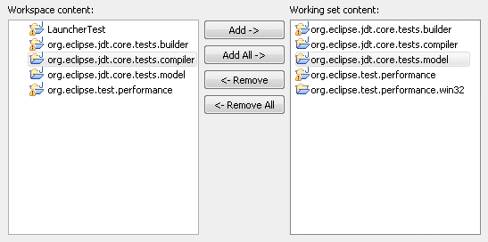

**Guideline 4.2**

________________________________________________________________________________
Slush Bucket widget (or Twin Box) should flow from left to right with
the source objects on the left hand side. It should have the control
buttons in this order: 'Add ->', '', '
________________________________________________________________________________

=== Wizards

In Eclipse, a wizard is commonly used for the creation of new resources,
resource import, or resource export. It can also be used for the
execution of any task involving a sequential series of steps. A wizard
should be used if there are many steps in the task, and they must be
completed in a specific order.

**Guideline 5.1**

________________________________________________________________________________
Use a wizard for any task consisting of many steps, which must be
completed in a specific order.
________________________________________________________________________________

'''

==== Appearance

At the top of each wizard is a header, containing a banner graphic and a
text area. The banner graphic contains an image representing the wizard
task, and should be created with a white to blue, gray scale palette for
consistency with other banners in Eclipse. These colors also avoid
distracting the user from the important fields of the wizard. The text
area is used to prompt the user for information which is absent, and
display error messages if information is invalid. The presence of the
header, with banner graphic and text area, creates a more polished feel,
and greater perception of quality to the wizard.

At the bottom of each wizard, a Back, Next, Finish, and Cancel button
should appear.

image::images/wizardAppearance.png[wizardAppearance,title="wizardAppearance"]

TIP: [guideline5.2]**Guideline 5.2** +
Each wizard must contain a header with a banner graphic and a text area
for user feedback. It must also contain Back, Next, Finish, and Cancel
buttons in the footer.

==== Initialization

When a wizard first opens, the focus should be placed in the first field
requiring information (see Guidelines 3.1). The header should be used to
prompt the user for the first piece of required information.

image::images/goodWizardInit.png[goodWizardInit,title="goodWizardInit"]

It is not appropriate to display an error message. At this point, the
user hasn't done anything yet.

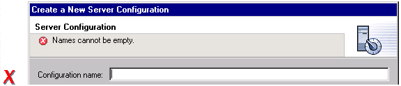

TIP: [guideline5.3]**Guideline 5.3** +
Start the wizard with a prompt, not an error message.

The initial state of the wizard should be derived from the context where
it is opened. For instance, in the New File wizard, the current
workbench selection is examined. If it points to a valid project or
folder, the wizard will pre-populate the parent field with the parent
project or folder name, and put cursor focus in the next field requiring
user input. If the user's selection does not point to a valid parent
project or folder, the wizard will not pre-populate the folder name.
Instead, it will leave the field blank and put the cursor focus in the
field. When the user's selection is on a file, a wizard may also go
through these calculations using the parent folder or project of the
file.

image::images/wizardFieldPopulation.png[wizardFieldPopulation,title="wizardFieldPopulation"]

TIP: [guideline5.4]**Guideline 5.4** +
Seed the fields within the wizard using the current workbench state.

==== Validation of Data
Information validation within a wizard should be done in tab order. If
the first required field is empty, an informative prompt should be shown
in the text area, directing the user to fill in the field. If the first
required field is in error, an error message should be shown in the text
area. If the first required field is valid, check the next field, and so
on. The text area should not be used to display more than one prompt or
error at a time.

If dialog information is absent or invalid, the Next or Finish buttons
should be disabled until the situation is resolved. When resolution
occurs, and all of the information has been provided, the Next or Finish
buttons may be enabled.

image::images/wizardErrorMsgs.png[wizardErrorMsgs,title="wizardErrorMsgs"]

Error messages should be displayed only when user input is invalid.

image::images/wizardErrorMsgs2.png[wizardErrorMsgs2,title="wizardErrorMsgs2"]

**Guideline 5.5**

________________________________________________________________________________
Validate the wizard data in tab order. Display a prompt when information
is absent, and an error when information is invalid.
________________________________________________________________________________

**Guideline 5.6**

________________________________________________________________________________
Enable the Next / Finish buttons only if all required information in the
dialog is present and valid.
________________________________________________________________________________

'''

The error messages in a wizard should be intended for the end user, not
the developer. With this in mind, message IDs should never be presented
as part of the error text in the wizard's header area.

image::images/wizardMsgs.png[wizardMsgs,title="wizardMsgs"]

**Guideline 5.7**

_____________________________________________________
Remove all programming message ID's from wizard text.
_____________________________________________________

'''

==== Browse Buttons
An edit field and "Browse..." button combination should be used whenever
an existing object is referenced within a wizard. The edit field is used
for direct input of the existing object, and the Browse button is used
to browse and select the object from a list of all possible choices.

For instance, in the New Java Class wizard, a "Browse..." button is
placed beside the "Super Class" edit field. If the browse button is
pressed, a Browse Dialog will appear, and the user can select a super
class. This pattern should be used whenever a link will be established
between a new object and an old one. The "Browse..." button should be
located to the right of the edit field.

TIP: [guideline5.8]**Guideline 5.8** +
Use a Browse Button whenever an existing object is referenced in a
wizard.

In the Browse Dialog, invalid choices should not appear. When the dialog
is closed, and focus returns to the parent control, refresh the
enablement state of controls within the dialog. In particular, refresh
the enablement of Next, Finish, and OK buttons.

An example of valid and invalid filtering is shown in the following
snapshot.

image::images/folderSelection.png[folderSelection,title="fig:folderSelection"]

==== Wizard Completion
The New Resource and Import Wizards commonly create new files, folders,
and projects within the workbench. If a single file is created, the
wizard should open the file in an editor in the active page. If more
than one file is created, open the most important, or central file. This
makes it easier to modify and save the file.

Have a readme.html file for every example project, and open that
readme.html automatically upon project creation. This will give users an
immediate overview of the example: what it does, prerequisites,
limitations, steps to take, and so on.

**Guideline 5.9**

________________________________________________________________________________
If a new file is created, open the file in an editor. If a group of
files are created, open the most important, or central file in an
editor. Open the readme.html file upon creation of an example project.
________________________________________________________________________________

'''

If a new project is created, the wizard should change the active
perspective within the workbench to one which is appropriate for the new
project type. In Eclipse v2.1, users are prompted to confirm the switch
to the preferred perspective when creating a new project. To avoid loss
of context, plug-ins should use this, and not automatically switch
without prompting. If users want to switch automatically in the future,
they can choose "Do not show this message again" in the confirmation
dialog.

**Guideline 5.10**

________________________________________________________________________________
If a new project is created, prompt users and change the active
perspective to suit the project type.
________________________________________________________________________________

'''

In either case, where a file, folder, or project is created, the wizard
should select and reveal the new object in the appropriate view. This
provides concrete evidence to the user that, yes, the new object was
created and now exists.

**Guideline 5.11**

________________________________________________________________________________
If a new object is created, select and reveal the new object in the
appropriate view.
________________________________________________________________________________

'''

In many situations, the creation of a resource may involve the creation
of a project or folder to contain the resource. If the containing
project or folder can be created from within the wizard (with a very
reasonable set of defaults), the wizard should allow it. If the creation
of such resources requires detailed user interaction in order for parent
project or folder to be set up correctly, the wizard should not attempt
to do this. Instead, the wizard error text should instruct the user that
"The specified project does not exist".

The EAR Import wizard in IBM's WebSphere Studio is an example where
allowing the user to specify the name of the parent project in place
makes for a much more usable interaction. In this case, based on the
user provided name, the wizard goes off and creates not only the EAR
project itself, but also any web projects, etc., that may be needed as
well.

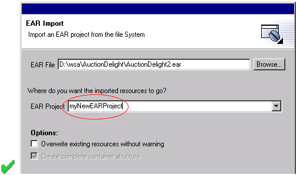

**Guideline 5.12**

________________________________________________________________________
Create folder objects in a wizard if reasonable defaults can be defined.
________________________________________________________________________

'''

[[terminology]]
Terminology
+++++++++++

Within a creation wizard, if the item being created must be a Project
(not a folder below a project), the term "Project" should be used. If it
can be a folder below the project, the term "Folder" should be used. In
addition, use the "name" suffix (uncapitalized) and no other prefix for
the input field label. For example, use "Project name" or "Folder name"
but not "Project Name" or "Server Project name".

**Guideline 5.13**

________________________________________________________________________________
Use the term "Project name" for the input field label when the item must
be a Project; otherwise, use the term "Folder name". Do not qualify the
term.
________________________________________________________________________________

=== Editors

An editor is a visual component within a workbench page. It is used to
interact with the primary content, which may be a document or data
object. In every case, this content is the primary focus of attention
and a reflection of the primary task.

TIP: [guideline6.1]**Guideline 6.1** +
Use an editor to edit or browse a file, document, or other primary
content.

Modifications made in an editor follow an open-save-close lifecycle
model. When an editor first opens, the editor contents should be
unmodified (clean). If the contents are modified, the editor should
communicate this change to the platform. In response, an asterisk will
appear in the editor tab. The modifications should be buffered within
the edit model, until such a time as the user explicitly saves them. At
that point, the modifications should be committed to the model storage.

TIP: [guideline6.2]**Guideline 6.2** +
Modifications made in an editor should follow an open-save-close
lifecycle model.

An editor is document or input-centric. Each editor has an input, and
only one editor can exist for each editor input within a page. This
policy has been designed to simplify part management.

TIP: [guideline6.3]**Guideline 6.3** +
Only one instance of an editor may exist, for each editor input, within
a perspective.

In addition, it should be possible to open a separate instance of an
editor for each different input.

TIP: [guideline6.4]**Guideline 6.4** +
It must be possible to open a separate instance of an editor for each
different input.

==== Appearance

The editor should be labeled with the name of the resource being edited;
not with the name of the editor.

image::images/editorTitles.png[editorTitles,title="fig:editorTitles"]

**Guideline 6.5**

________________________________________________________________________________
The editor should be labeled with the name of the file, document, or
input being edited.
________________________________________________________________________________

'''

If the editor contains more than one page, a tab control should be used
for page activation. The use of this control is demonstrated by the
plugin file and html editors.

Tab labels should be kept to one word, and two words at most.

**Guideline 6.6**

________________________________________________________________________________
In multipage editors, use a tab control for page activation.Tab labels
should be kept to one word, and two words at most.
________________________________________________________________________________

'''

==== Menus

An editor may contribute items directly to the window menu bar. All of
the commands available in the editor should be displayed in the window
menu bar, for accessibility and clarity. Exceptions are for the obvious
commands, e.g., basic navigations such as next / previous character,
line, word.

TIP: [guideline6.7]**Guideline 6.7** +
All of the commands, except for the obvious commands, available in the
editor should be added to the window menu bar.

The following format is recommended, to ensure consistency across
Eclipse and better ease of use.
[cols=",,",]
|=======================================================================
|Edit |(one or more editor specific menus) |Window

|Add any object centric commands here |(commands belong to the specific
menus) |Actions to control what you see in the editor.
|=======================================================================

**Guideline 6.8**

________________________________________________________________________
Use the standard format for editor contributions in the window menu bar.
________________________________________________________________________

'''

The window menu bar contains a number of global commands, such as Cut,
Copy, and Paste in the Edit menu. These commands target the active part,
as indicated by a shaded title area. If these commands are supported
within an editor, the editor should hook these window commands, so that
selection in the window menu bar or toolbar produces the same result as
selection of the same command in the editor. The editor should not
ignore these commands, and contribute duplicate commands to the window
menu bar or toolbar.

A complete list of the global commands is declared in the
IWorkbenchActionConstants.java (see below).

` /**`` * From IWorkbenchActionConstants.`` * Standard global commands in a workbench window.`` */`` public static final String [] GLOBAL_ACTIONS = {`` UNDO,`` REDO,`` CUT,`` COPY,`` PASTE,`` PRINT,`` DELETE,`` FIND,`` SELECT_ALL,`` BOOKMARK`` };`

TIP: [guideline6.9]**Guideline 6.9** +
If an editor has support for Cut, Copy, Paste, or any of the global
commands, these commands must be executable from the same commands in
the window menu bar and toolbar.

==== Toolbars

An editor may contribute commands directly to the window toolbar. The
toolbar is used to expose the _most commonly used_ commands in an
editor. Any command which appears in the toolbar must also appear in the
menu, but there is no need to duplicate every command in the menu within
the toolbar.

**Guideline 6.10**

___________________________________________________________________________
Fill the editor toolbar with the most commonly used items in the view
menu.
___________________________________________________________________________

'''

The use of a local toolbar within an editor is contrary to the design of
the workbench. Within the workbench, the toolbar for an editor is shared
with editors of the same type. This reduces the flash which occurs when
you switch between editors, reduces the number of images and commands in
the product, and creates a better feel of integration.

==== Context Menus

A context menu should be used for context sensitive interaction with the
objects in an editor. If an object is selected in an editor, and the
context menu is opened, the context menu should contain only commands
which are appropriate for the selection. Commands which affect the
presentation of the view should not appear in the context menu.

In a text editor, you may assume that there is only one type of
selection: text. In this case, the contents of the context menu will
remain consistent for any selection in the editor.

**Guideline 6.11**

_______________________________________________________
Fill the context menu with selection oriented commands.
_______________________________________________________

'''

For consistency with other editors in Eclipse, each editor should adopt
a common order for commands within the context menu. This format is
shown in the following table. Within this table, each item represents a
category of commands. The categories within the context menu should be
kept distinct from one another through the use of separators.
[cols="",]
|======================
|Undo / Redo, Save
|Add
|Show In
|Cut Copy Paste
|Delete
|Other Plugin Additions
|======================

**Guideline 6.12**

_________________________________________________
Use the standard format for editor context menus.
_________________________________________________

'''

For good spatial navigation, fill the context menu with a fixed set of
commands for each selection type. Once the contents have been defined,
the enablement state of each command should be determined using the
selected object state. In doing so, you establish a consistency which
makes the menu more predictable, and easier to navigate.

**Guideline 6.13**

________________________________________________________________________________
Fill the context menu with a fixed set of commands for each selection
type, and then enable or disable each to reflect the selection state.
________________________________________________________________________________

'''

One of the primary goals for the platform UI is extensibility. In fact,
it is this extensibility which gives you the freedom to add new views,
editors, perspectives, and actions to the platform. Of course,
extensibility is a two way street. While you may wish to extend the
platform, others may wish to extend your view or editor. It is common
for one plug-in to add actions to the menu, toolbar, or context menu of
an editor from another plugin.

In the platform, the menu and toolbar for an editor are automatically
extended by the platform. In contrast, context menu extension is
supported in collaboration between the editor and the platform. To
achieve this collaboration, an editor must register each context menu it
contains with the platform. It should also define an command filter for
each object type in the editor. An command filter makes it easier for
one plug-in to add an command to objects in an editor defined by another
plug-in. The target is described using object type and attributes. For
more information on the implementation of this concept, refer to
http://www.eclipse.org/articles/viewArticle/ViewArticle2.html[Creating
an Eclipse View.]

**Guideline 6.14**

___________________________________________________________
Register all context menus in the editor with the platform.
___________________________________________________________

**Guideline 6.15**

_______________________________________________________________
Implement an Command Filter for each object type in the editor.
_______________________________________________________________

'''

[[resource-deletion]]
Resource Deletion
+++++++++++++++++

When a resource is deleted from one of the navigators (e.g., Navigator
view, J2EE view, Data view, or DBA Explorer view in IBM's WebSphere
Studio), the handling of any editor that is currently open on that
resource depends on whether the editor has any unsaved changes.

If the editor does not contain any changes since the resource was last
saved then the editor should be immediately closed.

**Guideline 6.16**

________________________________________________________________________________
If the input to an editor is deleted, and the editor contains no
changes, the editor should be closed.
________________________________________________________________________________

'''

If the editor contains changes to the resource since the resource was
last saved (i.e., it is "dirty"), the editor should give the user a
chance to save their changes to another location, and then close. Here
is a sample of the dialog which should be displayed:

image::images/fileDeletedDialog.png[fileDeletedDialog,title="fileDeletedDialog"]

**Guideline 6.17**

________________________________________________________________________________
If the input to an editor is deleted, and the editor contains changes,
the editor should give the user a chance to save their changes to
another location, and then close.
________________________________________________________________________________

'''

[[unsaved-changes]]
Unsaved Changes
+++++++++++++++

If the editor contains changes to the resource since the resource was
last saved (i.e., it is "dirty"), an asterisk should be used to prefix
the resource name presented in the editor tab:

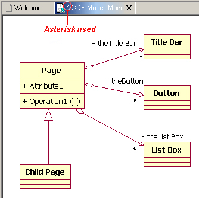

**Guideline 6.18**

________________________________________________________________________________
If the resource is dirty, prefix the resource name presented in the
editor tab with an asterisk.
________________________________________________________________________________

'''

[[read-only-files]]
Read-Only Files
+++++++++++++++

With a name like "editor", it's not surprising that the issue of
read-only files may cause confusion. If it's read-only, how can you edit
it? In this case, you should fall back to first principles.

________________________________________________________________________________
A view is typically used to navigate a hierarchy of information, open an
editor, or display properties for the active editor. An editor is
typically used to edit or browse a file, document or other input object.
________________________________________________________________________________

This statement is appropriate whether a file is read-only or not. In
either case, the user should be able to select the file, open it, and
browse the contents within an editor. If the file is read-only, the File
> Save command should be disabled and the File > Save As should be
enabled. In the status bar area, "Read-only" should be shown instead of
the default "Writable" message.

**Guideline 6.19**

________________________________________________________________________________
Treat read-only editor input as you would any other input. Enable the
Save As if possible. Display "Read-only" in the status bar area.
________________________________________________________________________________

'''

[[integration-with-other-views]]
Integration with Other Views
++++++++++++++++++++++++++++

In Eclipse, there is a special relationship between each editor and the
Outline view. When an editor is opened, the Outline view will connect to
the editor, and ask it for an outline model. If the editor answers an
outline model, that model will be displayed in the Outline view whenever
the editor is active. The outline is used to navigate through the
content, or interact with the edit data at a higher level of
abstraction.

For instance, if you open a .java file in an editor, the structure of
the class is displayed in the Outline view. If you select a method or
field in the outline, the text declaration of that item will be selected
and revealed in the editor. If you select a method or field, and open
the context menu, you can interact with the item as a conceptual unit,
rather than just a bunch of text.

In general, an editor should provide an outline model to the Outline
view if the data within the editor is too extensive to see on a single
screen, and will yield a structured outline. This structured outline
makes it very easy to navigate through objects like a java file or html
file.

**Guideline 6.20**

________________________________________________________________________________
If the data within an editor is too extensive to see on a single screen,
and will yield a structured outline, the editor should provide an
outline model to the Outline view.
________________________________________________________________________________

'''

When an editor has an interaction with the Outline view, notification
about location should be two-way. That is, the user should be able to
select something in the outline and have the editor position updated,
and the user should be able to select something in the editor pane and
have the outline view updated.

A context menu should be available, as appropriate, in the outline view
which should support creation operations as appropriate.

**Guideline 6.21**

________________________________________________________________________________
Notification about location between an editor and the Outline view
should be two-way. A context menu should be available in the Outline
view as appropriate.
________________________________________________________________________________

'''

If the edit model contains errors or warnings, they should be indicated
in the Outline view. An error or warning image should be added to the
item with the error or warning respectively. A container should have a
red X if it there are errors on the container itself, a gray X if any of
its descendents have errors (but not the container itself), and no X if
neither the container nor any of its descendents have errors. For
instance, in the following line, the addFastView method has an error, so
an error image is added to the item and its parent.
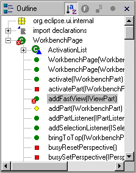 For this to work, care must be taken to design icons with overlay in
mind, so that glyphs can be applied to the ancestor's icon.

**Guideline 6.22**

________________________________________________________________________________
An error or warning image should be added to items with the error or
warning respectively. A container should have a red X if it there are
errors on the container itself, a gray X if any of its descendents have
errors (but not the container itself), and no X if neither the container
nor any of its descendents have errors.
________________________________________________________________________________

'''

In an editor, task objects are commonly used to mark a location within a
document. Once a task has been created, it appears in the Task view. If
the task is selected, you may reopen the editor at the location defined
in the Task.

**Guideline 6.23**

________________________________________________________________
If appropriate, implement the "Add Task" feature in your editor.
________________________________________________________________

'''

A bookmark object can also be used mark a location within a document.
Once a bookmark has been created, it appears in the Bookmarks view. If
the bookmark is selected, you may reopen the editor at the location
defined in the Task.

**Guideline 6.24**

____________________________________________________________________
If appropriate, implement the "Add Bookmark" feature in your editor.
____________________________________________________________________

'''

[[line-numbers]]
Line Numbers
++++++++++++

Editors with source lines of text should have line numbers, and
optionally column numbers. Editors should also support Navigate -> Goto
Line... menu allowing users to quickly jump to a desired line. The
current line and column numbers should be shown in the status line
(column number is optional). It's optional for the editor to show line
numbers for each line in the editor itself.

**Guideline 6.25**

________________________________________________________________________________
Editors with source lines of text should show the current line and
optionally column numbers the status line. It's optional for the editor
to show line numbers for each line in the editor itself.
________________________________________________________________________________

'''

[[table-cell-editors]]
Table Cell Editors
++++++++++++++++++

If the editor contains tables with editable cells, a single-click over a
cell should select the current item and put the cell into edit mode. In
edit mode, any dropdowns, buttons, or other controls in the cell should
be rendered upon the single-click.

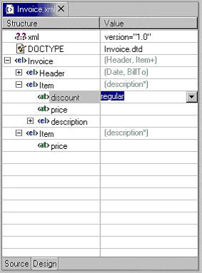

**Guideline 6.26**

________________________________________________________________________________
Table cell editors should support the single-click activation model, and
in edit mode, they should render complex controls upon single-click.
________________________________________________________________________________

'''

In addition, changes should be committed once a user clicks off the cell
or hits ENTER.

The following are examples of good behaviour for a table cell editor:

- when put in edit mode, drop-down appears with current selection active
& highlightedimage::images/cell1.png[cell1,title="fig:cell1"]

- when cursoring through drop-down using arrow keys, it is possible to
move up and down any number of choices and the drop-down stays visible
until user makes an explicit selectionimage::images/cell2.png[cell2,title="fig:cell2"]

- first letter navigation is supported as a cursoring technique when the
drop-down is visible- supports the "Enter" key as a way of making an explicit selection via
the keyboard when the drop-down is visible- supports the "Esc" key as a way of canceling a selection via the
keyboard when the drop-down is visible- when put in edit mode, the drop-down control (the down-arrow image)
appears with current selection active & highlightedimage::images/cell3.png[cell3,title="fig:cell3"]

- when put in edit mode, it is possible to arrow key through the choices
to make a selection without needing to invoke the drop-down

**Guideline 6.27**

________________________________________________________________________________
Changes made in a table cell editor should be committed when a user
clicks off the cell or hits the "Enter" key. Selection should be
cancelled when user hits the "Esc" key.First letter navigation should be
supported as a cursoring mechanism within a cell.
________________________________________________________________________________

'''

[[error-notification]]
Error Notification
++++++++++++++++++

If you are doing keystroke by keystroke validation in an editor, use red
squiggles to underline the invalid content. When users move the mouse
over the red squiggles, display the error text in a fly-over pop up box.

**Guideline 6.28**

________________________________________________________________________________
When performing fine-grain error validation in an editor, use red
squiggles to underline the invalid content. When users move the mouse
over the red squiggles, display the error text in a fly-over pop up box.
________________________________________________________________________________

'''

When the Save command is invoked in an editor, use the Problems view for
showing errors which are persisted.

**Guideline 6.29**

____________________________________________________________________________
Use the Problems view to show errors found when the Save command is
invoked.
____________________________________________________________________________

'''

[[interaction-with-external-editors]]
Interaction With External Editors
+++++++++++++++++++++++++++++++++

While a resource is opened within the workbench, if modifications are
made to it outside of the workbench, we recommend the following approach
to handle this situation. When the Save command is invoked in the
editor, users should be prompted to either override the changes made
outside of the workbench, or back out of the Save operation. If desired,
this user prompt can be invoked sooner such as when the editor regains
the focus.

**Guideline 6.30**

________________________________________________________________________________
If modifications to a resource are made outside of the workbench, users
should be prompted to either override the changes made outside of the
workbench, or back out of the Save operation when the Save command is
invoked in the editor.
________________________________________________________________________________

[[views]]
Views
^^^^^

A view is a visual component within a workbench page. It is used in a
support role for the primary task. You use them to navigate a hierarchy
of information, open an editor, or view properties for the active
editor.

**Guideline 7.1**

________________________________________________________________________________
Use a view to navigate a hierarchy of information, open an editor, or
display the properties of an object.
________________________________________________________________________________

'''

Modifications made in a view should be saved immediately. For instance,
if a file is modified in the Navigator, the changes are committed to the
workspace immediately. A change made in the Outline view is committed to
the edit model of the active editor immediately. For changes made in the
Properties view, if the property is a property of an open edit model, it
should be persisted to the edit model. If it is a property of a file,
persist to file.

In the past, some views have tried to implement an editor style
lifecycle, with a Save command. This can cause confusion. The File menu
within a workbench window contains a Save command, but it applies to
only the active editor. It should not target the active view. This leads
to a situation where the File > Save command is in contradiction to the
Save command within the view.

TIP: [guideline7.2]**Guideline 7.2** +
Modifications made within a view must be saved immediately.

Within a perspective, only one instance of a particular view can be
opened. This policy is designed to simplify part management for a user.
The user opens a view by invoking Perspective > Show View. If, for any
reason, they lose a view, or forget about its existence, they can simply
invoke Perspective > Show view again to make the view visible.

**Guideline 7.3**

_______________________________________________________
Only one instance of a view may exist in a perspective.
_______________________________________________________

'''

In a multi-tasking world, humans often perform more than one task at a
time. In Eclipse, task separation can be achieved by creating a separate
perspective for each task. In reflection of this, a view must be able to
be opened in more than one perspective. If only one instance of a view
may exist, the ability to multi-task is taken away.

**Guideline 7.4**

______________________________________________________________
A view must be able to be opened in more than one perspective.
______________________________________________________________

'''

A view can be opened in two ways: by invoking Window > Show View > X
menu, where X is the name of the view, or by invoking another command
within the workbench. For instance, if you select a class in the
Packages view, and invoke Open Type Hierarchy, a Hierarchy view opens
with the class hierarchy for the selection.

It should be possible to open any view from the Window > Show View menu,
either as an explicit item within the menu, or as an item within the
Window > Show View > Other... dialog.

**Guideline 7.5**

______________________________________________________
A view can be opened from the Window > Show View menu.
______________________________________________________

'''

[[appearance-3]]
Appearance
++++++++++

A view consists of a title area, a toolbar, a pulldown menu, and an
embedded control.

The view label in the title bar must be prefixed with label of the view
in Perspective > Show View menu. Given that it is impossible to change
the entry in the Show View menu, this means you cannot change the name
of a view. However, you can add additional text to the view label, to
clarify the state of the view.

**Guideline 7.6**

________________________________________________________________________________
The view label in the title bar must be prefixed with the label of the
view in the Perspective > Show View menu.
________________________________________________________________________________

'''

In most cases, a view will contain a single control or viewer. However,
it is possible to embed more than one viewer or control in the view. If
these controls are linked, such that selection in one control changes
the input of another, it may be better to separate the view into two.
Users will have greater freedom to open one of the results views, as
their needs arise. Special relationships can also be set up between
these views to support the user task. In addition, this makes it easier
for users to create a new perspective with a diverse set of views.

**Guideline 7.7**

________________________________________________________________________________
If a view contains more than one control, it may be advisable to split
it up into two or more views.
________________________________________________________________________________

'''

[[initialization-2]]
Initialization
++++++++++++++

When a view is opened, the input of the view should be derived from the
state of the perspective. The view may consult the window input or
selection, or the state of another view. For instance, if the Outline
view is opened, it will determine the active editor, query the editor
for an outline model, and display the outline model.

**Guideline 7.8**

________________________________________________________________________________
When a view first opens, derive the view input from the state of the
perspective.
________________________________________________________________________________

'''

If the view is used to navigate a hierarchy of resources (i.e., the
Navigator or Packages view), the input of the view may be derived from
the window input. The window input defines the scope of visible
resources within the perspective, and is defined by the user if they
select a resource in the Navigator and invoke Open in New Window. For
instance, if the Navigator view is opened, it will ask its perspective
for the window input. The result is used as the initial input for the
view.

**Guideline 7.9**

________________________________________________________________________________
If a view displays a resource tree, consider using the window input as
the root of visible information in the view.
________________________________________________________________________________

'''

Menus

Use the view pulldown menu for presentation commands, not
selection-oriented commands. These are commands which affect the
presentation of the view, but not the objects within the view. Do not
put presentation commands in the context menu. For instance, the Sort
and Filter commands within the Navigator view affect the presentation of
resources, but do not affect the resources themselves.

TIP: [guideline7.10]**Guideline 7.10** +
Use the view pulldown menu for presentation commands, not
selection-oriented commands.

For consistency with other views in Eclipse, each view should adopt a
common order for commands within the pulldown menu. This order is shown
in the following table.
[cols="",]
|=======================================================================
|View modes (e.g., the 3 modes in the Hierarchy view)

|[separator required]

|Working sets (e.g., Select/Deselect/Edit Working Set, used in Navigator
and Package Explorer)

|[separator required]

|Sorting

|[optional separator]

|Filtering

|[optional separator]

|View layout (e.g., Horizontal vs. Vertical in Hierarchy view)

|[optional separator]

|Link with Editor

|[separator required]

|Other presentation commands from the view itself

|[separator required]

|Presentation commands from other plug-ins
|=======================================================================

**Guideline 7.11**

___________________________________________________________
Use the standard order of commands for view pulldown menus.
___________________________________________________________

==== Toolbars
The toolbar is used to expose the most commonly used commands in a view.
Any command which appears in the toolbar must also appear in the menu
(either the context menu or the view menu), but there is no need to
duplicate every command in the menu within the toolbar.

TIP: [guideline7.12]**Guideline 7.12:**  +   
Put only the most commonly used commands on the toolbar. Any command on
a toolbar must also appear in a menu, either the context menu or the
view menu.

'''

==== Context Menus
A context menu should be used for context sensitive interaction with the
objects in a view. If an object is selected in a view, and the context
menu is opened, the context menu should contain only actions which are
appropriate for the selection. Actions which affect the presentation of
the view should not appear in the context menu.

TIP: [guideline7.13]**Guideline 7.13** +
Fill the context menu with selection oriented actions, not presentation
actions.

For consistency with other views in Eclipse, each view should adopt a
common order for commands within the context menu. This order is shown
in the following table. Within this table, each item represents a
category of commands. The categories within the context menu should be
kept distinct from one another through the use of separators.
[cols="",]
|=====================================================================
|New
|Open
|Navigate + Show In
|Cut, Copy, Paste, Delete, Move, Rename and other refactoring commands
|Other Plugin Additions
|Properties
|=====================================================================

The New category contains actions which create new objects. The Open
category contains actions which open the selection in an editor.
Navigate contains actions to refocus the view input, or reveal the view
selection in another view. And the other categories are self
explanatory.

**Guideline 7.14**

__________________________________________________________
Use the standard order of commands for view context menus.
__________________________________________________________

'''

For good spatial navigation of the menu, fill the context menu with a
fixed set of commands for each selection type. Once the contents have
been defined, the enablement state of each command should be determined
using the selected object state. In doing so, you establish a
consistency which makes the menu more predictable, and easier to
navigate.

**Guideline 7.15**

________________________________________________________________________________
Fill the context menu with a fixed set of commands for each selection
type, and then enable or disable each to reflect the selection state.
________________________________________________________________________________

'''

An object in one view may be visible in many other views or editors. For
instance, a .java file is visible in the Navigator, the Hierarchy view,
and the Packages view. To the user, these objects are all the same,
regardless of location, so the context menu for the .java file should be
the same in each.

Implementation tip: To achieve a consistent context menu, plug-in developers which
introduce a new object type should contribute commands to the context
menu using an action group(ActionGroup class), a Java class which
populates the context menu. If this approach is used, the action group
can be reused by other views where the same objects appear.

**Guideline 7.16**

________________________________________________________________________________
If an object appears in more than one view, it should have the same
context menu in each.
________________________________________________________________________________

'''

One of the primary goals for the platform UI is extensibility. In fact,
it is this extensibility which gives you the freedom to add new views,
editors, perspectives, and actions to the platform. Of course,
extensibility is a two way street. While you may wish to extend the
platform, others may wish to extend your view or editor. It is common
for one plug-in to add actions to the menu, toolbar, or context menu of
a view from another plugin.

In the platform, the menu and toolbar for a view are automatically
extended by the platform. In contrast, context menu extension is
supported in collaboration between the view and the platform. To achieve
this collaboration, a view must register each context menu it contains
with the platform. It should also define an command filter for each
object type in the view. An command filter makes it easier for one
plug-in to add an command to objects in a view defined by another
plug-in. The command target is described using object type and
attributes. For more information on the implementation of this concept,
refer to
http://www.eclipse.org/articles/viewArticle/ViewArticle2.html[Creating
an Eclipse View.]

**Guideline 7.17**

_________________________________________________________
Register all context menus in the view with the platform.
_________________________________________________________

**Guideline 7.18**

_____________________________________________________________
Implement an Command Filter for each object type in the view.
_____________________________________________________________

'''

==== Integration with the Window Menu Bar and Toolbar

The window menu bar contains a number of global commands, such as Cut,
Copy, and Paste within the Edit menu. These commands target the active
part, as indicated by a shaded title area. If these commands are
supported within a view, the view should hook these window commands, so
that selection in the window menu bar or toolbar produces the same
result as selection of the same command in the view.

A complete list of the global commands and built-in menus as declared in
IWorkbenchActionConstants.java (see below).

``File menu: Revert, Move, Rename, Refresh, Print, Properties Edit menu: Undo, Redo, Cut, Copy, Paste, Delete, Select All,
Find/Replace, Add Bookmark, Add Task Navigate menu: Go Into, Back, Forward, Up One Level, Next, Previous,
Back, Forward Project menu: Open Project, Close Project, Build Project, Rebuild
Project

TIP: [guideline7.19]**Guideline 7.19** +
If a view has support for Cut, Copy, Paste, or any of the global
commands, these commands must be executable from the same commands in
the window menu bar and toolbar.

Although a view can't directly contribute to the main menubar or toolbar
in Eclipse v2.1, it can still cause commands to appear there using
"action set / part associations" (the actionSetPartAssociations
extension point) which lets you associate action sets with particular
parts (views or editors). For example, the Java tooling in Eclipse uses
this for the Package Explorer. All commands for the view (or editor) should be made available on the
main menubar, and only frequently used commands are on the context
menu. In addition, the primary perspective(s) for such views (e.g., the Java
and Java Browsing perspectives) should already have these action sets
associated with the perspective, to improve UI stability.

==== Persistence

One of the primary goals for the platform UI is to provide efficient
interaction with the workspace. In the platform this is promoted by
saving the state of the workbench when a session ends (the workbench is
shut down). When a new session is started (the workbench is opened),
this state is restored, reducing the time required for the user to get
back to work.

If a view has a static input object, in the sense that its input is not
derived from selection in other parts, the state of the view should be
persisted between sessions. If a view has a dynamic or transient input
object, there is no need to persist its state between sessions. Within
the workbench, the state of the Navigator view, including the input and
expansion state, is saved between sessions. For more information on the
implementation of persistence, see
"http://www.eclipse.org/articles/viewArticle/ViewArticle2.html[Creating
an Eclipse View]".

TIP: [guideline7.20]**Guideline 7.20** +
Persist the state of each view between sessions.

==== Interaction with Editors

===== Link with Editor
Navigation views should support "Link with Editor" on the view menu.
This feature works on a per-view setting. If it's expected that users
will toggle it frequently, then it can also go on the toolbar, but this
is not required (the Hierarchy view and the views in the Java Browsing
perspective support it, but don't have it on the toolbar, since they
expect linking to almost always be on). The behaviour of "Link with Editor" is:

* when toggled off, no linking occurs (either view->editor or
editor->view)
* when toggled on, linking occurs in both directions:
** view->editor: when the selection is changed in the view, it brings
any corresponding previously-open editor to front, but does not activate
it (the view must keep focus)
** editor->view: when the user switches between editors, the view
updates its selection to correspond to the active editor
* when turned on, it should immediately synchronize the selection in the
view with the frontmost editor, if applicable
* this is not the same as single click mode -- it does not cause new
editors to be opened
* changing the setting affects only the current view instance, not other
instances of the same type
* the view should persist the state of this setting separately for each
view instance, and also globally (but separately for each view type,
e.g., Navigator and Package Explorer persist their last setting
separately)
* when opening a new instance of the view, it should use the last global
setting
* the default setting (if there's no previously persisted global
setting) is up to the view, but primary navigation views like the
Navigator and Package Explorer default to off

**Guideline 7.21**

___________________________________________________________________
Navigation views should support "Link with Editor" on the view menu
___________________________________________________________________

'''

There exist two main modes for opening an editor from a view: single
click and double click mode. Views should show the following behavior
for opening an editor:

*Single click open mode*

* file closed
** single click opens but does not activate the editor (selects the
element in the editor if possible)
** double click opens and activates the editor (selects the element in
the editor if possible)

* file already open
** single click brings the editor to front but does not activate it
(selects the element in the editor if possible)
** double click activates the editor (selects the element in the editor
if possible)

*Double click open mode*

* file closed
** single click does nothing except selecting the element
** double click opens and activates the editor (selects the element in
the editor if possible)

* file already open
** single click
*** "Link with Editor" off: single click does nothing except selecting
the element
*** "Link with Editor" on: single click brings the editor to front but
does not activate it (selects the element in the editor if possible)
*** no "Link with Editor": up to the view to decide
** double click activates the editor (selects the element in the editor
if possible)

*Additional rules*

* pressing the the 'Enter' key should do the same as a double click
* Next (Ctrl+.) / Previous (Ctrl+,) buttons select the next/previous
element in the view, open (or bring to front) the editor and select the
element in the editor but never activate the editor

'''

[[perspectives]]
Perspectives
^^^^^^^^^^^^

A perspective is a visual container for a set of views and editors
(parts). Different perspectives can have different sets of views open,
but if they both have the same view open, it's shared between them (but
only if they are in the same workbench window). Editors are always all
shared between perspectives in the same window.

A new perspective is opened by invoking Window -> Open Perspective -> X,
where X identifies a particular perspective in Eclipse. The result is a
new perspective in the workbench window with _type_ X. For instance, if
you invoke Window -> Open Perspective -> Resource, a new perspective is
opened with type __Resource__. Eclipse comes with a pre-defined number
of perspective types, such as Resource, Java, and Debug. The perspective
type determines the initial layout of views, and visibility of command
sets within the perspective.

As a plug-in developer, you may contribute new perspective types to
Eclipse. To do this, you must define a perspective extension. Each
extension has a __perspective factory__, a Java class which defines the
initial layout of views, and visibility of command sets within the
perspective. You can also add your own actions or views to an existing
perspective type. For more information on the implementation of these
concepts, see
http://www.eclipse.org/articles/using-perspectives/PerspectiveArticle.html[Using
Perspectives in the Eclipse UI].

A new perspective type should be created when there is a group of
related non-modal tasks which would benefit from a predefined
configuration of commands and views, and these tasks are long lived. A
task oriented approach is imperative. As a development environment,
Eclipse was designed to fulfill the needs of a large product development
team, from product manager to content developer to product tester. It is
fully extensible and may be configured with hundreds of command, wizard,
view and editor extensions. In other words, it may contain a lot of
features you'll never use. To avoid the visual overload and confusion
which would occur if everything was visible in the UI, a perspective can
be used to limit the presentation to a task-oriented set of views and
command sets.

For instance, the task of Java code creation is long lived and complex,
so the creation of a Java perspective is warranted. In Eclipse, the Java
perspective contains an editor area, Packages Explorer view, Hierarchy
view, Tasks view, and Outline view. The Java and Debug command sets are
also visible. Together, these components are useful for a variety of
long lived, Java coding tasks.

It is not appropriate to create a new perspective type for short lived
tasks. For instance, the task of resource check-in is short lived, so it
may be better performed using a view in the current perspective.

**Guideline 8.1**

________________________________________________________________________________
Create a new perspective type for long lived tasks, which involve the
performance of smaller, non-modal tasks.
________________________________________________________________________________

'''

If your plug-in contributes a small number of views, and these augment
an existing task, it is better to add those views to an existing
perspective. For instance, if you create a view which augments the task
of Java code creation, don't create a new perspective. Instead, add it
to the existing Java perspective. This strategy provides better
integration with the existing platform.

**Guideline 8.2**

________________________________________________________________________________
If you just want to expose a single view, or two, extend an existing
perspective type.
________________________________________________________________________________

'''

[[view-layout]]
View Layout
+++++++++++

If the user opens a new perspective, the initial layout of views will be
defined by the perspective type (i.e., Resource, Java). This layout is
performed in the __perspective factory__, a Java class associated with
the perspective type. When the perspective is initialized, it consists
of an editor area with no additional views. The perspective factory may
add new views, using the editor area as the initial point of reference.

The size and position of each view is controlled by the perspective
factory. These attributes should be defined in a reasonable manner, such
that the user can resize or move a view if they desire it. An important
issue to consider is the overall flow between the views (and editors) in
the perspective. For example, initially the navigation views may be
placed to the left of the editor area, outline views may be placed
either to the right of the editor area or below the navigation view, and
other supporting views may be placed below and to the right of the
editor area.

**Guideline 8.3**

________________________________________________________________________________
The size and position of each view in a perspective should be defined in
a reasonable manner, such that the user can resize or move a view if
they desire it. When defining the initial layout, it is important to
consider the overall flow between the views (and editors) in the
perspective.
________________________________________________________________________________

'''

A perspective should have at least two parts, including the visible
views and the editor area. If this is not the case, then the perspective
should be re-examined to determine if it is better suited as a view or
editor.

**Guideline 8.4 **

________________________________________________________________________________
If a perspective has just one part, it may be better suited as a view or
editor.
________________________________________________________________________________

'''

In some scenarios, it may be undesirable to have an editor area within a
perspective. In this case, the perspective factory should hide the
editor area, using the existing java methods. It is not acceptable to
resize the editor area to a point where it is no longer visible. If the
user does open an editor in the perspective, for whatever reason, they
will be unable to see or resize it.

When the editor area is programmatically hidden, if the user opens an
editor in the perspective, the editor area will become visible. The view
that occupied the editor area before will be shrunk. Therefore, it is
important to define a non-empty editor area even when the editor is
programmatically hidden.

**Guideline 8.5**

________________________________________________________________________________
If it is undesirable to have an editor area in a perspective, hide it.
Do not resize the editor area to the point where it is no longer
visible.
________________________________________________________________________________

'''

[[command-contribution]]
Command Contribution
++++++++++++++++++++

The perspective factory may add actions to the File > New, Window > Open
Perspective , and Window > Show View menus. It is also possible to add
one or more command sets to the window. In each case, you should choose
commands which are relevant to the task orientation of the perspective.

The File > New menu should be populated with wizards for the creation of
objects commonly used in the task. For instance, in the Java perspective
the File > New menu contains menu items for the creation of packages,
classes, and interfaces.

The Window > Show View menu should be populated with the initial views
in the perspective, as well as any extra views that may be important for
the task at hand. The Navigate > Show In menu should be used to allow
users to navigate in their contents.

image::images/showViewMenu.png[showViewMenu,title="fig:showViewMenu"] The application development lifecycle should be considered when
populating the the Window - Open Perspective menu. The development of
most applications follow a well defined lifecycle, from designing /
modeling, to editing / creating, to debugging / testing, to assembling /
deploying. Each perspective will fall into one of these steps. The Open
Perspective menu should be used to link the current perspective to
perspectives that support tasks immediately downstream of the current
one, as well as tasks further upstream, to allow for iterative
development.

For instance, the Java perspective is used in a larger lifecycle,
involving Java and Debug tasks. The Window > Open Perspective menu is
populated with each of these perspectives.

**Guideline 8.6**

________________________________________________________________________________
Populate the window menu bar with commands and command sets which are
appropriate to the task orientation of the perspective, and any larger
workflow.
________________________________________________________________________________

'''

[[opening-a-perspective-in-code]]
Opening a Perspective in Code
+++++++++++++++++++++++++++++

A command should open a new perspective only if the user explicitly
states a desire to do so. If the user does not state a desire to do so,
opening a new perspective may cause loss of context for the user.

For instance, imagine a scenario where the user selects an object and
invokes an command. In the perspective where the command is invoked, the
user may have a set of views and editors open. These represent the
working state, or context, of the user. If a new perspective is created,
that context will be left behind, forcing the user to recreate the
context. This is time wasted.

**Guideline 8.7 **

________________________________________________________________________________
A new perspective should be opened only if the user explicitly states a
desire to do so. In making this statement, the user agrees to leave
their old context, and create a new one.
________________________________________________________________________________

'''

In some cases, a new perspective is opened as the side effect of another
command. For instance, if users start debugging their application code,
they may be switched to the Debug perspective. If this behavior is
implemented, the user should have the option to turn this behavior off.
The option can be exposed in the command dialog, or within a Preference
page.

**Guideline 8.8**

________________________________________________________________________________
If a new perspective is opened as a side effect of another command, the
user should be able to turn this behavior off.
________________________________________________________________________________

'''

If a new perspective is opened, it may be opened within the current
window, or in a new window. The user controls this option using the
Workbench preferences. If code within a plug-in opens a new perspective,
the plug-in should honor the user preference.

**Guideline 8.9**

________________________________________________________________________________
If a new perspective is opened, it should be opened within the current
window, or in a new window, depending on the user preference.
________________________________________________________________________________

'''

With regard to command contributions applied to the New, Open
Perspective, and Show View menus, the list of wizards, perspectives, and
views added as shortcuts to these menus should be at most 7 plus / minus
2 items.

**Guideline 8.10**

________________________________________________________________________________
The list of shortcuts added to the New, Open Perspective, and Show View
menus should be at most 7 plus / minus 2 items.
________________________________________________________________________________

[[windows]]
Windows
^^^^^^^

In this section we look at the window menu bar, toolbar, and layout. As
a plug-in developer, you can contribute actions to the menu bar and
toolbar using an __action set__, a set of task oriented actions which
the user can show or hide. You can control the layout of views within a
window by defining a __perspective__. In this section we'll look at
action extension. For more information on perspectives, see
link:#Perspectives[Perspectives].

[[actions]]
Actions
+++++++

Each workbench window contains a menu bar and toolbar. These are
pre-populated by the platform, but a plug-in developer may add
additional items to each. This is done by defining an __action set__, a
set of task oriented actions which the user can show or hide. The
actions within an action set may be distributed throughout the window
menu bar and toolbar.

**Guideline 9.1**

___________________________________________________________________________
Use an Action Set to contribute actions to the window menu bar and
toolbar.
___________________________________________________________________________

'''

The window menu bar contains a number of pulldown menus: File, Edit,
Navigate, Project, Window, and Help. Each of these has a different
purpose, which will be explained in the following paragraphs. For
consistency with the action sets contributed by other plug-ins, the
commands within an action set should conform to the existing
distribution of actions in the window. There is no need to group the
actions in a separate pulldown menu of the menu bar.

The File menu contains file oriented actions, such as Save, Close,
Print, Import, Export and Exit. The contents of the File > New menu are
determined by the perspective type. However, the user may add or remove
items using the Window -> Customize Perspective... menu item. The
contents of the Import and Export dialogs are populated with every
import and export wizard, respectively.

The Edit menu contains editor oriented actions, such as Undo, Redo, Cut,
Copy, and Paste. These actions target the active part (as indicated by a
shaded title bar) . It is very common for an editor to add items to this
menu. However, it is uncommon for an action set to add actions to the
Edit Menu; action sets tend to be global in nature, while the edit menu
targets a specific part, and interaction with the data in that part.

The Navigate menu contains navigational actions such as Go to, Open
Type, Show In, to enable users to browse laterally or drill down in
their code.

The Project menu contains actions which apply to the contents of the
workspace, such as Rebuild All and Open Type. An action set may add
actions which search the entire workspace, generate project info and so
on.

The Window menu contains actions which apply to window management and
system preferences. It also contains the Open Perspective and Show View
submenu which contains actions affecting the state of the window
contents.

**Guideline 9.2**

________________________________________________________________________
Follow the platform lead when distributing actions within an Action Set.
________________________________________________________________________

'''

The toolbar contains the most commonly used actions of the menu bar. In
reflection of this, you should contribute actions to the menu bar first,
and then to the toolbar if they will be frequently used.

**Guideline 9.3**

________________________________________________________________________________
Contribute actions to the window menu bar first, and then to the window
toolbar if they will be frequently used.
________________________________________________________________________________

'''

The contents of each action set should be defined using a task oriented
approach. For instance, the Java action set contains actions to create a
new package, class and interfaces. It also contains an command to open
an editor on a class, Goto Type. These form a cohesive set of related
actions, which can be turned on and off by the user, depending on the
active task.

**Guideline 9.4**

____________________________________________________
Define each action set with a specific task in mind.
____________________________________________________

'''

The size of an action set is also important. If an action set is too
large, it will flood the menu or toolbar, and reduce the users ability
to customize the menu and toolbar. At the same time, if an action set is
too small, the user may find customization of the menu and toolbar is
too labor intensive. Break an action set up when it has more than about
7 items.

There is no magic number for the size of an action set, but it should be
carefully designed to contain the smallest possible semantic chunking of
actions. Avoid the temptation to provide only one action set for an
entire plug-in.

**Guideline 9.5**

________________________________________________________________________________
An action set should contain the smallest possible semantic chunking of
actions. Avoid the temptation to provide only one action set for an
entire plug-in.
________________________________________________________________________________

'''

An action set can be used to share a set of actions between two or more
views and editors. For instance, a Java Refactor action set may be
applicable to the selection within a Java Editor, an Outline view, and a
Hierarchy View. In this situation the actions can be shared by defining
an action set extension for the workbench. Once this action set has been
defined, it can be automatically included in a perspective by the
perspective developer, or added to a perspective by the user.

An action set should not be used to promote command from a single view
to the window menu bar and toolbar. This simply clutters up the user
interface.

**Guideline 9.6**

________________________________________________________________________________
Use an action set to share a set of actions which are useful in two or
more views or editors.
________________________________________________________________________________

'''

The set of visible command in a window may be changed by invoking Window
> Customize Perspective. Within the resulting dialog, you can add or
remove items from the File > New menu, Window > Open Perspective menu,
or Window > Show View menu. It is also possible to add or remove action
sets. In general, the visible action sets should be controlled by the
user, and should never be changed programmatically. There are two
reasons for this. First, users like to control the environment, not be
controlled. And second, the user is in the best position to understand
the active task, and the appropriate action sets for its completion.

**Guideline 9.7**

_______________________________________________________________________________
Let the user control the visible action sets. Don't try to control it
for them.
_______________________________________________________________________________

'''

A common example of an command which may be added to an action set is
Navigate > Open Type. This command can be used to open an editor on a
type which is not visible in the current window, and is a form of
lateral navigation. In general, all Open actions which take the form
should be added to the Navigate menu, for consistency.

**Guideline 9.8**

______________________________________________________________________________
"Open Object" actions must appear in the Navigate pulldown menu of the
window.
______________________________________________________________________________

'''

[[status-bar]]
Status Bar
++++++++++

If there is a need for a plug-in to show non-modal contextual
information in the status bar area, always use the global status bar.
For example, editors use the global status bar to show the current line
and column number.

**Guideline 9.9**

____________________________________________________________________
Always use the global status bar to display status related messages.
____________________________________________________________________

[[properties]]
Properties
^^^^^^^^^^

A Properties dialog or view is used to view / modify the properties of
an object which are not visible in the normal presentation of that
object. For instance, the Read-Only attribute for a file is modified in
the Properties Dialog. The build path for a Java Project is modified in
the Properties Dialog.

Within Eclipse, there are two ways to edit the properties of an object:
in the Properties dialog, and in the Properties view. Each of these is
applicable in different situations.

The Properties view is commonly used to edit the properties for a set of
objects in an editor, where quick access to the properties is important,
and you switch from one object to another quickly.

**Guideline 10.1**

________________________________________________________________________________
Use the Properties view to edit the properties of an object when quick
access is important, and you will switch quickly from object to object.
________________________________________________________________________________

'''

The properties for an object should be quick to calculate. If it is too
expensive to calculate the properties for an object, the quick access to
properties offered by the Properties view becomes worthless. In this
situation, where quick access is not possible, a Properties Dialog
should be used.

**Guideline 10.2**

________________________________________________________________________________
Use a Properties Dialog to edit the properties of an object which are
expensive to calculate.
________________________________________________________________________________

'''

In some cases, the properties for an object are dependent upon one
another, such that a change in one will affect another, or even enable /
disable the option to change another. In this situation, a Properties
Dialog may be a better way to represent the semantic link between these
properties.

**Guideline 10.3**

________________________________________________________________________________
 Use a Properties Dialog to edit the properties of an object which
contain complex relationships to one another.
________________________________________________________________________________

'''

When both the Properties view and the Properties Dialog are used to
present and edit properties of an object, the Properties Dialog should
contain the superset of items shown in the Properties view.

**Guideline 10.4**

________________________________________________________________________________
 Properties Dialog should contain the superset of items shown in the
Properties view.
________________________________________________________________________________

[[widgets]]
Widgets
^^^^^^^

In this section, we will describe some of the recommended designs for
Standard Windows Toolkit (SWT) widgets.

[[tree-and-table]]
Tree and Table
++++++++++++++

For Tree and Table widgets that have a checkbox associated with a cell
item, users can either select the item or change the checkbox state.
Changing the current selection should not automatically change the check
state of the selected item. However, the current selection should be set
to a given item when its check state is changed (e.g., users click on
the checkbox associated with the item).

**Guideline 11.1**

________________________________________________________________________________
For Tree and Table widgets that have a checkbox associated with a cell
item, changing the current selection should not automatically change the
check state of the selected item. However, the current selection should
be set to a given item when its check state is changed.
________________________________________________________________________________

[[standard-components]]
Standard Components
~~~~~~~~~~~~~~~~~~~

In this section we'll look at the standard components which ship with
Eclipse. The Eclipse SDK contains a number of views, including the
Navigator, Outline, Properties, Tasks, and Bookmarks view. Eclipse also
contains a default text editor and a Resource perspective.

As a plug-in developer, you should try to add new actions to the
existing parts. This leads to better integration with the platform, and
the existing knowledge of the user.

**Guideline 12.1**

________________________________________________________________________________
If appropriate, add actions to standard components of Eclipse using the
plug-in registry.
________________________________________________________________________________

'''

When extending the standard components such as the Navigator, Outline,
Properties, Tasks, and Bookmark views, make sure your specialized
components carry over the base component's characteristics (drag and
drop support, keyboard navigation, selection behaviour, etc.)

**Guideline 12.2**

________________________________________________________________________________
If you subclass or copy any of the standard components, always carry
over the standard components' characteristics.
________________________________________________________________________________

[[the-navigator-view]]
The Navigator View
^^^^^^^^^^^^^^^^^^

The Navigator is used to navigate the workspace, create new resources,
modify resources, and open an editor on a resource. Plug-in developers
may contribute new actions to the menu, toolbar, and context menu.
[[adding-actions]]
Adding Actions
++++++++++++++

This is done by adding an extension to the plug-in registry.

**Guideline 13.1**

________________________________________________________________________________
Add actions to the Navigator View menu, toolbar, and context menu using
the plug-in registry.
________________________________________________________________________________

'''

If object contributions are made to the context menu, try to qualify the
target object as much as possible, to avoid adding the command to the
wrong objects in the Navigator. For instance, a Java command may target
IFiles with a .java extension, or IProjects with a Java nature. It will
cause confusion if Java actions appear on non-java objects.

Some actions are a reflection of tool use, rather than object type. For
instance, a repository plug-in may provide actions for file check in,
check out, etc. These actions should appear on the resources in the
Navigator only if the user has actively chosen to use the repository
tool. To control the visibility of these actions, the plug-in should
apply a project nature to the managed resources, and use the project
nature attribute in all context menu contributions.

For more information on command filtering, refer to
http://www.eclipse.org/articles/viewArticle/ViewArticle2.html[Creating
an Eclipse View]. The standard attributes for resources are defined in
IResourceActionFilter.java (see below).

`public interface IResourceActionFilter extends IActionFilter {``        public static final String NAME = "name";``        public static final String EXTENSION = "extension";``        public static final String PATH = "path";``        public static final String READ_ONLY = "readOnly";``        public static final String PROJECT_NATURE = "projectNature";``}`

The standard attributes for project filtering are defined in
IProjectActionFilter.java.

`public interface IProjectActionFilter extends IResourceActionFilter {``        public static final String NATURE = "nature";``        public static final String OPEN = "open";``}`

**Guideline 13.2**

________________________________________________________________________________
Use the attributes defined in IResourceActionFilter.java and
IProjectActionFilter.java to control the visibility of context menu
actions in the Navigator.
________________________________________________________________________________

'''

[[integration-with-other-views-and-editors]]
Integration with Other Views and Editors
++++++++++++++++++++++++++++++++++++++++

In Eclipse, the use of a "Navigate -> Show In" command is a common way
to link the selection in one view to the input of another. For instance,
a "Show in Package Explorer" command is visible in the context menu for
a selected class in the source editor. When invoked, the class in the
source editor is selected and revealed in the Package Explorer view.
This approach should be used as a general, non intrusive pattern for
view or editor linking. It is context sensitive, and reflects the
intentions of the user.

A "Navigate -> Show In Navigator" command should be included in any view
where a resource may appear. If invoked, the command should select and
reveal the resource in the navigator.

**Guideline 13.3**

________________________________________________________________________________
Use a "Navigate -> Show In Navigator" command in each view, to link
resources back to the Navigator.
________________________________________________________________________________

[[the-tasks-view]]
The Tasks View
^^^^^^^^^^^^^^

The Tasks view is used to display the current tasks, errors and warnings
in the workspace. A plug-in developer may contribute new tasks, errors,
and warnings to the workspace, and rely upon the Tasks view to display
those objects. You can also contribute new actions to the menu, toolbar,
and context menu. This is done by adding an extension to the plug-in
registry.

[[adding-tasks]]
Adding Tasks
++++++++++++

A new task, error or warning can be created using the Marker Manager
services from the Core Resources Management plugin.

**Guideline 14.1**

________________________________________________________________________________
Add markers (tasks, errors and warnings) to the Tasks view using the
Marker Manager services from the Core Resources Management plugin.
________________________________________________________________________________

'''

The Tasks view is a table, containing columns for the task image,
completion status, priority, description, resource, and line number. The
description text of each marker should be short and concise, so that it
will fit in the status line of Eclipse.

**Guideline 14.2**

________________________________________________________________________________
The description text of each marker should be short and concise, so that
it will fit in the status line of Eclipse.
________________________________________________________________________________

'''

[[adding-actions-1]]
Adding Actions
++++++++++++++

You can contribute new actions to the menu, toolbar, and context menu.
This is done by adding an extension to the plug-in registry.

**Guideline 14.3**

________________________________________________________________________________
Add actions to the Tasks view menu, toolbar, and context menu using the
plug-in registry.
________________________________________________________________________________

'''

If object contributions are made to the context menu, try to qualify the
target object as much as possible, to avoid adding the command to the
wrong objects in the Tasks view. At an implementation level, each object
in the Tasks view is a __marker__, a general mechanism for associate
notes with a resource. Use the attributes within
IMarkerActionFilter.java to control the visibility of Task object
actions (see below). For more information on command filtering, refer to
http://www.eclipse.org/articles/viewArticle/ViewArticle2.html[Creating
an Eclipse View].

`public interface IMarkerActionFilter extends IActionFilter {``        public static final String TYPE = "type";``        public static final String SUPER_TYPE = "superType";``        public static final String PRIORITY = "priority";``        public static final String SEVERITY = "severity";``        public static final String DONE = "done";``        public static final String MESSAGE = "message";``}`

**Guideline 14.4**

________________________________________________________________________________
Use the attributes defined in IMarkerActionFilter.java to control the
visibility of context menu actions in the Tasks view.
________________________________________________________________________________

'''

[[integration-with-other-views-and-editors-1]]
Integration with Other Views and Editors
++++++++++++++++++++++++++++++++++++++++

In an editor, task objects are commonly used to mark a location within a
document. Once a task has been created, it appears in the Task view. If
this task is selected (via double clicking), you should reopen the
editor at the location defined in the task. The focus should be changed
from the Task view to the editor.

If appropriate, support for the creation of new task objects in an
editor should be implemented by the editor. For more information on
this, see link:#Editors[Editors].
[[adding-f1-help-to-task-view]]
Adding F1 Help to Task View
+++++++++++++++++++++++++++

Plug-ins should support F1 keyboard command and link it to an infopop
that gives a detailed description of the selected item in the Task view.

**Guideline 14.5**

________________________________________________________________________________
Support F1 keyboard command and link it to an infopop that gives a
detailed description of the selected item in the Task view.
________________________________________________________________________________

[[selection-dialogs]]
Selection Dialogs
^^^^^^^^^^^^^^^^^

When you want the user to select items from a given list of items, you
can use the standard selection dialogs available in Eclipse.

[[containerselectiondialog]]
ContainerSelectionDialog
++++++++++++++++++++++++

Use
http://help.eclipse.org/ganymede/topic/org.eclipse.platform.doc.isv/reference/api/org/eclipse/ui/dialogs/ContainerSelectionDialog.html[ContainerSelectionDialog]
when want to select an IContainer (IFolder/IProject) from the workspace.

`    ContainerSelectionDialog dialog = new ContainerSelectionDialog(window.getShell(), null, true, "Select a parent:");``    dialog.setTitle("Container Selection");``    dialog.open();`

You can restrict the resource to be within a project/folder by passing
the respective object as the second parameter for the constructor.

[[resourceselectiondialog]]
ResourceSelectionDialog
+++++++++++++++++++++++

The ContainerSelectionDialog allowed you to select only one resource
that too it should be a container. If you want to select multiple
resources including files, then
http://help.eclipse.org/ganymede/topic/org.eclipse.platform.doc.isv/reference/api/org/eclipse/ui/dialogs/ResourceSelectionDialog.html[ResourceSelectionDialog]
is the one you should be using.

`    ResourceSelectionDialog dialog = new ResourceSelectionDialog(window.getShell(), ResourcesPlugin.getWorkspace().getRoot(), "Select Resource:");``    dialog.setTitle("Resource Selection");``    dialog.open();`

[[resourcelistselectiondialog]]
ResourceListSelectionDialog
+++++++++++++++++++++++++++

The ResourceSelectionDialog is good when you want to present the entire
set of resources under a parent and allow the user to select multiple
resources. But if you have a set of resources and want the user to
select only one from that, then probably you should be using
http://help.eclipse.org/ganymede/topic/org.eclipse.platform.doc.isv/reference/api/org/eclipse/ui/dialogs/ResourceListSelectionDialog.html[ResourceListSelectionDialog].

`    ResourceListSelectionDialog dialog = new ResourceListSelectionDialog(window.getShell(), resourcesArray);``    dialog.setTitle("Resource Selection");``    dialog.open();`

[[elementlistselectiondialog]]
ElementListSelectionDialog
++++++++++++++++++++++++++

The above Dialogs are good to selecting workspace resources. But what if
I have some elements on my own and I want to select from that? The first
dialog you would be using is
http://help.eclipse.org/ganymede/topic/org.eclipse.platform.doc.isv/reference/api/org/eclipse/ui/dialogs/ElementListSelectionDialog.html[ElementListSelectionDialog].
The user can select an element from the set. You have to pass the
elements as an array and supply a label provider to render the element.
The user can filter using wildcards as well.

`    ElementListSelectionDialog dialog = new ElementListSelectionDialog(window.getShell(), new LabelProvider());``    dialog.setTitle("String Selection");``    dialog.setMessage("Select a String (* = any string, ? = any char):");``    dialog.setElements(new Object[] { "one", "two", "three" });``    dialog.open();`

[[listselectiondialog]]
ListSelectionDialog
+++++++++++++++++++

If you want the user to select multiple elements from the given set,
then
http://help.eclipse.org/ganymede/topic/org.eclipse.platform.doc.isv/reference/api/org/eclipse/ui/dialogs/ListSelectionDialog.html[ListSelectionDialog]
is the one to use. It is basically a single column TableViewer with
SWT.CHECK style applied. You have to supply your own ContentProvider and
LabelProvider for the TableViewer. It also has Select All & Deselect All
buttons.

`    ListSelectionDialog dlg = new ListSelectionDialog(window.getShell(), getInput(), getContentProvider(), getLabelProvider(), "Select the Element:");``    dlg.setTitle("Element Selection");``    dlg.open();`

[[checkedtreeselectiondialog]]
CheckedTreeSelectionDialog
++++++++++++++++++++++++++

If you have your items in a tree structure and want to select few
elements from them, then
http://help.eclipse.org/ganymede/topic/org.eclipse.platform.doc.isv/reference/api/org/eclipse/ui/dialogs/CheckedTreeSelectionDialog.html[CheckedTreeSelectionDialog]
is your choice. You have to bring your own content & label provider and
the input.

`    CheckedTreeSelectionDialog dialog = new CheckedTreeSelectionDialog(window.getShell(), getLabelProvider(), getContentProvider());``    dialog.setTitle("Tree Selection");``    dialog.setMessage("Select the elements from the tree:");``    dialog.setInput(getInput());``    dialog.open();`

[[elementtreeselectiondialog]]
ElementTreeSelectionDialog
++++++++++++++++++++++++++

http://help.eclipse.org/ganymede/topic/org.eclipse.platform.doc.isv/reference/api/org/eclipse/ui/dialogs/ElementTreeSelectionDialog.html[ElementTreeSelectionDialog]
is the same as the CheckedTreeSelectionDialog except that it will allow
you to select a single element in the whole tree rather than multiple
elements.

`    ElementTreeSelectionDialog dialog = new ElementTreeSelectionDialog(window.getShell(), getLabelProvider(), getContentProvider());``    dialog.setTitle("Tree Selection");``    dialog.setMessage("Select the elements from the tree:");``    dialog.setInput(getInput());``    dialog.open();`

[[filtereditemsselectiondialog]]
FilteredItemsSelectionDialog
++++++++++++++++++++++++++++

Have you used the Open Type (Ctrl + Shift + T) or Open Resource
(Ctrl+Shift+R) dialog? Its similar to the ElementListSelectionDialog,
but it has more features. It can select multiple items, display a detail
pane about the item that is currently selected, it can even remember
your previous selections; store them in history and present them before
the other choices. To have that functionality, you have to extend the
abstract class
http://help.eclipse.org/ganymede/topic/org.eclipse.platform.doc.isv/reference/api/org/eclipse/ui/dialogs/FilteredItemsSelectionDialog.html[FilteredItemsSelectionDialog]
and provide the necessary implementation.

[[the-preference-dialog]]
The Preference Dialog
^^^^^^^^^^^^^^^^^^^^^

The Preference Dialog is used to edit the global preference for a
feature in the workbench.

A new preference page should be created when you need to expose global
options to the user. For instance, the global preferences for Java
compilation are exposed as a group of preference pages in the Preference
Dialog. If these preferences are changed, they affect the entire Java
plug-in.

**Guideline 15.1**

_______________________________________________________________
Global options should be exposed within the Preferences Dialog.
_______________________________________________________________

'''

A preference page should not be used to expose the local options for a
particular instance of a view, editor, or window. In this situation, the
user will look to the menu and toolbar of the control itself to
customize it. If these options are exposed in the Preference Dialog, it
will blur the location of customization, and confuse the user.

**Guideline 15.2**

________________________________________________________________________________
Expose the preferences for a particular view, editor or window in the
view itself, via a menu or tool item.
________________________________________________________________________________

'''

[[preference-page-design]]
Preference Page Design
++++++++++++++++++++++

In the simplest case, any plug-in which needs to expose an option to the
user will define a single preference page. This preference page should
contain all of the options for the plug-in, until the number of options
starts to overload the page. At that point a nested design for
preference pages should be adopted.

**Guideline 15.3**

____________________________________________________________________________
Start out with a single preference page. Then evolve to more if you need
to.
____________________________________________________________________________

'''

In a nested design, a root preference page is added to the preference
dialog, and then sub pages are added to the root preference page. The
root preference page should never be blank. Instead, it should contain
the most commonly used preferences, or those preferences which have a
wide spread effect upon the plug-in behavior. Beneath the root page, a
sub page should be created for each major chunk of functionality within
the plug-in.

There is no reason to set the focus in a preference page, because focus
is always set to the tree, by the Eclipse platform, after the preference
page is made visible.

**Guideline 15.4**

________________________________________________________________________________
If you create a preference group, use the root page for frequently used
preferences, or those preferences which have wide spread effect.
Specialize within the sub pages. The root preference page should not be
blank.
________________________________________________________________________________

'''

Each new plug-in should integrate its plug-in preferences, wizards, and
views into existing preference, wizard, and view categories where it
makes sense, rather than the blind creation of new categories for
itself.

**Guideline 15.5**

________________________________________________________________________________
Attempt to integrate plug-in preferences, wizards, and views into
existing categories for a new plug-in first, before considering the
creation of a new category.
________________________________________________________________________________

[[the-outline-view]]
The Outline View
^^^^^^^^^^^^^^^^

In Eclipse, there is a special relationship between an editor and the
Outline view. When an editor is opened, the Outline view will connect to
the editor, and ask it for an outline model. If the editor answers an
outline model, that model will be displayed in the Outline view whenever
the editor is active. The outline is used to navigate through the edit
data, or interact with the edit data at a higher level of abstraction.

If you are an editor developer, the relationship between an editor and
the Outline view is important. For more information on the collaboration
between these two, see link:#Editors[Editors].

[[the-properties-view]]
The Properties View
^^^^^^^^^^^^^^^^^^^

The Properties view shows the properties for the active part in the
workbench, or the selection within that part. These properties are
supplied by the active part itself. The Properties view is simply a
container for their presentation.

Within Eclipse, the properties for an object can be exposed using a
Properties dialog, or the Properties view. The Properties view is
commonly used to edit the properties for a set of objects in an editor,
where quick access to the properties is important, and you switch from
one object to another quickly.

For more information on the use of the Properties view, or Properties
dialog, refer to link:#Properties[Properties].

[[the-bookmarks-view]]
The Bookmarks View
^^^^^^^^^^^^^^^^^^

The Bookmarks view is used to bookmark files, and open them quickly. A
plug-in developer may contribute new bookmarks to the workspace, and
rely upon the Bookmarks view to display those bookmarks. You can also
contribute new actions to the menu, toolbar, and context menu. This is
done by adding an extension to the plug-in registry.

In an editor, bookmark objects are commonly used to mark a location
within a document. Once a bookmark has been created, it appears in the
Bookmarks view. If this bookmark is selected, you may reopen the editor
at the location defined in the bookmark.

If appropriate, support for the creation of new bookmark objects should
be implemented by the editor. For more information on this, see
link:#Editors[Editors].

[[the-text-editor]]
The Text Editor
^^^^^^^^^^^^^^^

The Text Editor is commonly used to edit text files. A plug-in developer
can contribute new actions to the menu, toolbar, and context menu. This
is done by adding an extension to the plug-in registry. For more
information on this, see link:#Editors[Editors].

[[the-resource-perspective]]
The Resource Perspective
^^^^^^^^^^^^^^^^^^^^^^^^

The Resource perspective contains a Navigator, Outline, Task view, and
editor area. Plug-in developers may contribute a new command, action
set, or view to the Resource perspective. For more information, refer to
link:#Perspectives[Perspectives].

[[flat-look-design]]
Flat Look Design
~~~~~~~~~~~~~~~~

The Eclipse platform provides a Web user interface, also known as Flat
Look, design alternative for implementing content editors. For example,
the editor in the Eclipse plug-in development environment (PDE)
perspective uses Flat Look.

image::images/flatlook1.png[flatlook1,title="flatlook1"]

The Flat Look design may be more suitable for certain type of user
tasks, and more appealing to certain user profile. However, this design
should not be used just because it provides a different look than the
native platform look and feel. The use of Flat Look design should be
considered in the context of the supported user scenarios. This design
is usually a good fit for extensive property and configuration editing,
such as editing Eclipse's plugin.xml file, and J2EE Web application's
deployment descriptors.

**Guideline 16.1**

________________________________________________________________________________
Use Flat Look design for user scenarios that involve extensive property
and configuration editing.
________________________________________________________________________________

'''

When required, use a "More..." button for navigation purpose (function
similar to a hyperlink).

image::images/flatlook2.png[flatlook2,title="flatlook2"]

On the overview page, initially expand basic or core sections, but
collapse advanced sections. On non-overview pages, provide a "Home" icon
which takes users back to the overview page

image::images/flatlook3.png[flatlook3,title="flatlook3"]

**Guideline 16.2**

________________________________________________________________________________
Have the core sections on the overview page expanded, and provide a
"Home" icon on other pages to take users back to the overview page.
________________________________________________________________________________

'''

Don't use tabs within a Flat Look editor tab. Use an alternative design
or rendering of the tabs.

image::images/flatlook4.png[flatlook4,title="flatlook4"]

When applicable, always provide a "Source" tab. Assign mnemonics for
sections, controls, etc. for keyboard navigation.

image::images/flatlook5.png[flatlook5,title="flatlook5"]

[[editor-and-outline-view-interaction]]
Editor and Outline View Interaction
+++++++++++++++++++++++++++++++++++

Plug-ins that use Flat Look design for content editor should provide
support for full two way interactions between the editor and outline
view.

In the outline view, use grouping elements corresponding to tabs in the
content editor for the organization of the tree view.

image::images/flatlook6.png[flatlook6,title="flatlook6"]

**Guideline 16.3**

________________________________________________________________________________
Use grouping elements corresponding to tabs in the Flat Look content
editor for the organization of the tree view in outline view.
________________________________________________________________________________

[[the-tao-of-resource]]
The Tao of Resource
~~~~~~~~~~~~~~~~~~~

In Eclipse, the notion of a tool disappears. In its place, is the idea
of a universal tool platform - an open, extensible IDE - where tool
plug-ins are added to extend the capabilities of the platform. These
plug-ins "teach" Eclipse how to work with things - java files, web
content, graphics, video - almost anything you can imagine. At an
implementation level, these plug-ins communicate using resources
(projects, folders, and files). The resource is the common medium for
integration between plugins and external tools.

The resource concept was developed for a number of reasons:
1.  Integration between a plug-in from one vendor, and a plug-in from
another, is possible only if there is a common, well known data
abstraction.
2.  Integration with external tools is possible only if everything, at
some level, is a file.

Resources are also important at the UI level. If an object command,
decorator, or property page contribution is made to an IResource, the
platform will ensure that this contribution is visible in any view or
editor where the resource appears. For instance, a .java file will be
visible in the Navigator, the Hierarchy view, and the Packages view. To
the user, the .java file is the same object, regardless of the view
where it appears, so the object appearance, context menu, and properties
should be consistent in each view.

In some cases, the implementation of a particular view or editor may
wrap a resource within another object, for presentation purposes. If the
wrapper is equivalent to a resource, it is important to expose this
equivalence to the platform. If the resource is exposed, the platform
may apply resource contributions to the resource equivalent object. This
ensures presentation consistency for an object in the platform.

The underlying resource for an object is exposed by implementing
IAdaptable on the model object, and answering an
IContributorResourceAdapter. For more information on the implementation
of an IContributorResourceAdapter, refer to Eclipse Corner.

**Guideline 17.1**

________________________________________________________________________________
Expose the resource for resource equivalent model objects using an
IContributorResourceAdapter.
________________________________________________________________________________

[[accessibility]]
Accessibility
~~~~~~~~~~~~~

In a view, editor, or other control, every features should be accessible
using a mouse or the keyboard.

In a dialog or wizard, a shortcut key should be defined for each button
or control. The shortcut key should be displayed with an underline
beneath the appropriate shortcut character.

**Guideline 18.1**

________________________________________________________________________________
All of the features provided by a tool should be accessible using a
mouse or the keyboard.
________________________________________________________________________________

'''

[[standard-accelerators]]
Standard Accelerators
^^^^^^^^^^^^^^^^^^^^^

The Eclipse platform has defined a large number of shortcut keys.
Plug-in developers should make sure that the existing shortcut keys do
not conflict with the shortcut keys defined in the plug-in.
[cols="<,<,<,<,<,<,<",]
|=======================================================================
|*Key* |*\{Key} by itself* |*SHIFT+\{Key}* |*CTRL+\{Key}*
|*CTRL+SHIFT+\{Key}* |*ALT+\{Key}* |*CTRL+ALT+\{Key}*

|A | | |Edit / Select All | | |

|B | | |Project / Build | | |(View) Bookmarks

|C | | |Edit / Copy | | |

|D | | |(JDT editor) Display | | |

|E | | |(JDT editor) Next Problem |(JDT editor) Previous Problem | |

|F | | |Edit / Find / Replace | | |

|G | | | | | |

|H | | |Edit / Search | | |

|I | | | | | |

|J | | | | | |

|K | | | | | |(View) Tasks

|L | | |Edit / Go to Line | | |

|M | | | |(JDT editor) Add Import | |(JDT) Refactor / Move

|N | | |File / New / Other | | |(View) Navigator

|O | | | |(JDT editor) Organize Imports | |(View) Outline

|P | | |File / Print | | |(View) Properties

|Q | | |(JDT editor) Inspect | | |

|R | | | | | |

|S | | |File / Save | |File / Save All |Window / Switch to Editor

|T | | | |(JDT) Open Type | |

|U | | | | | |

|V | | |Edit / Paste | | |

|W | | | | | |

|X | | |Edit / Cut | | |(JDT) Refactor / Extract method

|Y | | |Edit / Redo |(JDT) Refactor / Redo | |

|Z | | |Edit / Undo |(JDT) Refactor / Undo | |

|Space | | |(JDT editor) Content Assist | | |

|Backspace | | | | |Windows: Undo |

|Tab | | |(JDT editor) Shift Right |(JDT editor) Shift Left | |

|Insert | |Windows: Paste |Windows: Copy | | |

|Delete |Edit / Delete |Windows: Cut |Edit / Delete | | |

|Home | | | | | |

|End | | | | | |

|Page Up | | | | | |

|Page Down | | | | | |

|Insert | | | | | |

|Delete | | | | | |

|Hyphen (-) | | | | |Show System Menu |Show View Menu

|Left Arrow | | | | | |

|Right Arrow | | | | | |

|Up Arrow | | | | | |

|Down Arrow | | | | | |

|F1 |Help |Help |Help |Help | |

|F2 |(Navigator view) Rename, (JDT editor) Open JavaDoc | | | | |

|F3 |(JDT editor) Open on Selection | | | | |

|F4 |(JDT editor) Open Type Hierarchy | | |File / Close All |File /
Close |

|F5 |(Navigator view) Refresh, (Properties view) Refresh, (Debug) Step
Into | | | | |

|F6 |(Debug) Step Over | |Next Editor |Previous Editor | |

|F7 |(Debug) Run to Return | |Next View |Previous View | |

|F8 |(Debug) Resume | | | | |

|F9 | | | | | |

|F10 |(Debug) Relaunch last | | | | |

|F11 |(Debug) Debug | |(Debug) Run | | |

|F12 |Activate Editor | |Activate Editor | | |
|=======================================================================

[[best-practices]]
Best Practices
~~~~~~~~~~~~~~

In this section, we provide examples of best practices for designing and
implementing some common user interactions within the Eclipse platform.

[[syntax-and-compilation-error-handling]]
Syntax and Compilation Error Handling
+++++++++++++++++++++++++++++++++++++

When designing editors that provide syntax or compilation checking
support, follow the Java tooling design in the Eclipse platform.

Provide on the fly syntax checking if possible. Use red "squiggle" to
indicate where the potential error is located in the source code. Use a
red box on the side bar on the right side to indicate the approximate
error position in the file. Use a prominent marker on the upper right
hand corner to indicate that the file contains errors or warnings. Use
red color to indicate errors, and use yellow to indicate warnings.

image::images/bp1.png[bp1,title="bp1"]

After users perform a save operation, user a more prominent marker on
the left hand side margin to indicate errors and warnings in the file.
When using the mouse pointer to hover over the marker, the description
text should be displayed. In addition, show the icon decorator in the
content editor tab. In the tree view that shows the resource in the
Eclipse workspace, use icon decorator to indicate errors or warnings
associated with this resource, and propagate the icon decorator
indication up to the parents of the resource in the tree view. Finally,
an entry should be added to the Task view to list the errors and
warnings.

image::images/bp2.png[bp2,title="bp2"]

[[coding-assistance]]
Coding Assistance
+++++++++++++++++

In addition to supporting the standard content assist in an editor,
editors should exploit the use of Quick Fixes and Quick Assist. Use the
light bulb marker on the left hand side margin to provide suggestions on
how to fix problems with the source code. Users can click on the light
bulb or use Edit -> Quick Fix menu item to invoke this command.

image::images/bp3.png[bp3,title="bp3"]

Even when there are no syntax errors in the file, users should be able
to obtain certain quick assistance with their code using the Quick Fix
mechanism. For example, assigning an expression to a local variable.

image::images/bp4.png[bp4,title="bp4"]

'''

If an editor is used for writing code in a given programming language,
hyper-linked code support should be enabled. While using the mouse
pointer to hover over the source code, pressing the Ctrl key will turn
the programming language constructs such as class, method, and field
identifiers into clickable links to the corresponding declaration.

image::images/bp5.png[bp5,title="bp5"]

'''

When possible, a plug-in should provide refactoring support at the
programming language or application development level. For example, if
users rename a method in a Java class, refactoring support should enable
users to automatically find and fix up all references. If users change
the URL for a given resource in a Web application, refactoring support
should enable users to automatically update the references to the
modified URL.

image::images/bp6.png[bp6,title="bp6"]

[[context-menu]]
Context Menu
++++++++++++

Here is one suggested process to reason why a menu item should be added
or removed from the context menu. The objective is to reduce the number
of context menu items to no more than 20.

First, remove menu items that are not sensitive to selections. Second,
remove menu items that are not frequently used. Third,?examine the items
that are not sensitive?to selection but are frequently used. Add at most
of 5 of these items back. Fourth,?remove all disabled menu items, except
for clipboard operations such as copy and paste, and team, compare and
replace submenus. Fifth, remove menu items that are frequently used,
selection sensitive, but have a dominant keyboard shortcut key defined,
except for clipboard and save operations.

[[labels-fonts-and-layout-for-flat-look-design]]
Labels, Fonts and Layout for Flat Look Design
+++++++++++++++++++++++++++++++++++++++++++++

For Flat Look design, when using buttons with ellipses (except for the
"More..." button), it should pop up a secondary window which can be a
dialog box or a wizard.

Use Title capitalization for section titles. The distance between
section columns should be 32 pixels.

On pages with listbox on the left hand side, the distance be between the
list box and the right-hand column (e.g., showing properties for a
selected listbox item) should be 10 pixels.

image::images/flatlook7.png[flatlook7,title="flatlook7"]

'''

For labels and fields, use RGB value (160, 160, 164) for enabled state,
RBG value (0, 0, 0) for read-only state, and RBG value (128, 128, 128)
for disabled state.

image::images/flatlook8.png[flatlook8,title="flatlook8"]

For listbox control, use RBG value (0, 0, 0) for the border to indicate
enabled state, use RBG value (128, 128, 128) for disabled state.

image::images/flatlook9.png[flatlook9,title="flatlook9"]

[[decorators]]
Decorators
++++++++++

Enabling and disabling the decorators are extremely useful when the
decorations performed by two or more decorators conflict with each
other. For example, the CVS plug-in might decorate the base image by
superimposing the base image with a custom image while the "Decorate
Example" plug-in might superimpose a different custom image at the same
position thereby conflicting with the CVS plug-in decoration. If the
decoration performed by two different decorators on the same resource
conflict, users should appropriately enable / disable different
decorators to get the required decoration.

Implementation tip:It is very important to design custom decorators that don't conflict
with basic decorations provided by different Eclipse views. For example,
the package explorer view decorates Java files with problem markers (a
problem marker is placed at the bottom left hand corner) if there are
compilation errors. It is a bad practice to decorate resources with
custom decoration exactly at the position of a problem marker and
developers should avoid this. If the custom decoration is performed at
the bottom left corner, then custom decoration and the problem marker
decoration, if any, conflict each other and hence users will not be able
to view the decorations. The solution to the above mentioned problem is
to provide a custom image decoration at the bottom right corner which
does not conflict with the basic image decoration provided by Eclipse.
The top left corner is the second best place although it conflicts with
the binary project decorator. The bottom left and top right should be
avoided as they are decorated outside of the decorator mechanism

== Checklist For Developers

Here is a checklist for developers who are developing UI plugins. This
_could_ be used for certification purposes.

=== General UI Guidelines

==== The Spirit of Eclipse

TIP: [guideline1.1]*Guideline 1.1* +
Follow and apply good user interface design principles: user in control,
directness, consistency, forgiveness, feedback, aesthetics, and
simplicity.

TIP: [guideline1.2]*Guideline 1.2* +
Follow the platform lead for user interface conventions.

TIP: [guideline1.3]*Guideline 1.3* +
Be careful not to mix UI metaphors. It may blur the original concept,
and your own application.

TIP: [guideline1.4]*Guideline 1.4* +
If you have an interesting idea, work with the Eclipse community to make
Eclipse a better platform for all.

==== Capitalization

TIP: [guideline1.5]*Guideline 1.5* +
Use Headline style capitalization for menus, tooltip and all titles,
including those used for windows, dialogs, tabs, column headings and
push buttons. Capitalize the first and last words, and all nouns,
pronouns, adjectives, verbs and adverbs. Do not include ending
punctuation.

TIP: [guideline1.6]*Guideline 1.6* +
Use Sentence style capitalization for all control labels in a dialog or
window, including those for check boxes, radio buttons, group labels,
and simple text fields. Capitalize the first letter of the first word,
and any proper names such as the word Java.

==== Language
TIP: [guideline1.7]*Guideline 1.7* +
Create localized version of the resources within your plug-in.

==== Error Handling
TIP: [guideline1.8]*Guideline 1.8* +
When an error occurs which requires either an explicit user input or
immediate attention from users, communicate the occurrence with a modal
dialog.

image::images/guidelineCheckbox.png[guidelineCheckbox,title="fig:guidelineCheckbox"]**
Guideline 1.9**

________________________________________________________________________________
If a programming error occurs in the product, communicate the occurrence
with a dialog, and log it.
________________________________________________________________________________

=== UI Graphics

==== Design
TIP: [guideline2.1]*Guideline 2.1* +
Follow the visual style established for Eclipse UI graphics.

TIP: [guideline2.2]*Guideline 2.2* +
Use a common color palette as the basis for creating graphical elements.

TIP: [guideline2.3]*Guideline 2.3* +
Re-use the core visual concepts to maintain consistent representation
and meaning across Eclipse plug-ins.

TIP: [guideline2.4]*Guideline 2.4* +
Re-use existing graphics from the Common Elements library or other
Eclipse-based plugins.

image::images/guidelineCheckbox.png[guidelineCheckbox,title="fig:guidelineCheckbox"]
* Guideline 2.5*

________________________________________________________________________________
Create and implement the graphical versions of the disabled state of
toolbar and local toolbar icons.
________________________________________________________________________________

image::images/guidelineCheckbox.png[guidelineCheckbox,title="fig:guidelineCheckbox"]
* Guideline 2.6*

________________________________________________________________________________
Use the design templates for creating and maintaining UI graphics to
facilitate easy file sharing and efficient production of a large set of
graphics.
________________________________________________________________________________

[[specifications-1]]
Specifications
++++++++++++++

image::images/guidelineCheckbox.png[guidelineCheckbox,title="fig:guidelineCheckbox"]
*Guideline 2.7*

___________________________________________________
Use the file format specified for the graphic type.
___________________________________________________

image::images/guidelineCheckbox.png[guidelineCheckbox,title="fig:guidelineCheckbox"]
*Guideline 2.8*

________________________________________________________________________________
Use the appropriate graphic type in the location it is designed for
within the user interface.
________________________________________________________________________________

image::images/guidelineCheckbox.png[guidelineCheckbox,title="fig:guidelineCheckbox"]
*Guideline 2.9*

_________________________________________________________________
Follow the specific size specifications for each type of graphic.
_________________________________________________________________

image::images/guidelineCheckbox.png[guidelineCheckbox,title="fig:guidelineCheckbox"]
*Guideline 2.10*

________________________________________________________________________________
Cut the graphics with the specific placement shown to ensure alignment
in the user interface.
________________________________________________________________________________

[[implementation-1]]
Implementation
++++++++++++++

image::images/guidelineCheckbox.png[guidelineCheckbox,title="fig:guidelineCheckbox"]
*Guideline 2.11*

________________________________________________________________________________
Use the cutting actions provided to increase the speed and efficiency of
cutting a large number of graphics.
________________________________________________________________________________

image::images/guidelineCheckbox.png[guidelineCheckbox,title="fig:guidelineCheckbox"]
*Guideline 2.12*

________________________________________________________________________________
Abbreviate file name instead of using the full icon name, e.g., New
Interface becomes "newint".
________________________________________________________________________________

image::images/guidelineCheckbox.png[guidelineCheckbox,title="fig:guidelineCheckbox"]
*Guideline 2.13*

______________________________________________________________________
Use lower case characters in your file names, e.g., DTD becomes "dtd".
______________________________________________________________________

image::images/guidelineCheckbox.png[guidelineCheckbox,title="fig:guidelineCheckbox"]
*Guideline 2.14*

________________________________________________________________________________
Use 10 characters or fewer in your file names if possible (underscores
count as a character).
________________________________________________________________________________

image::images/guidelineCheckbox.png[guidelineCheckbox,title="fig:guidelineCheckbox"]
*Guideline 2.15*

________________________________________________________________________________
Use a file name suffix that describes its location or function in the
tool, e.g., newint_wiz, or its size in the case of icons that require
multiple sizes.
________________________________________________________________________________

image::images/guidelineCheckbox.png[guidelineCheckbox,title="fig:guidelineCheckbox"]
*Guideline 2.16*

______________________________________
Keep the original file names provided.
______________________________________

image::images/guidelineCheckbox.png[guidelineCheckbox,title="fig:guidelineCheckbox"]
*Guideline 2.17*

________________________________________________________________
Follow the predefined directory structure and naming convention.
________________________________________________________________

image::images/guidelineCheckbox.png[guidelineCheckbox,title="fig:guidelineCheckbox"]
*Guideline 2.18*

___________________________________________
Keep the original directory names provided.
___________________________________________

image::images/guidelineCheckbox.png[guidelineCheckbox,title="fig:guidelineCheckbox"]
*Guideline 2.19*

________________________________________________________________________________
Minimize duplication of graphics within a plugin by keeping all graphics
in one, or few, first level user interface directories.
________________________________________________________________________________

image::images/guidelineCheckbox.png[guidelineCheckbox,title="fig:guidelineCheckbox"]
*Guideline 2.20*

______________________________________________________
Use the active, enabled, and disabled states provided.
______________________________________________________

[[component-development-1]]
Component Development
^^^^^^^^^^^^^^^^^^^^^

[[commands-1]]
Commands
++++++++

image::images/guidelineCheckbox.png[guidelineCheckbox,title="fig:guidelineCheckbox"]**
Guideline 3.1**

________________________________________________________________________________
Each command must have a label, tool tip, and full color image. The
label and tool tip must use Headline style capitalization.
________________________________________________________________________________

image::images/guidelineCheckbox.png[guidelineCheckbox,title="fig:guidelineCheckbox"]**
Guideline 3.2**

________________________________________________________________________________
The command tooltip should describe the result of the command, not the
current state of the command. Use the text same as that for the command
label.
________________________________________________________________________________

image::images/guidelineCheckbox.png[guidelineCheckbox,title="fig:guidelineCheckbox"]**
Guideline 3.3**

________________________________________________________________________________
Adopt the labeling terminology of the workbench for New, Delete and Add
commands.
________________________________________________________________________________

image::images/guidelineCheckbox.png[guidelineCheckbox,title="fig:guidelineCheckbox"]**
Guideline 3.4**

______________________________________________________________________
An command should be enabled only if it can be completed successfully.
______________________________________________________________________

image::images/guidelineCheckbox.png[guidelineCheckbox,title="fig:guidelineCheckbox"]**
Guideline 3.5**

________________________________________________________________________________
Command enablement should be quick. If command enablement cannot be
quick, enable the command optimistically and display an appropriate
message if the command is invoked, but cannot be completed.
________________________________________________________________________________

[[dialogs-1]]
Dialogs
+++++++

image::images/guidelineCheckbox.png[guidelineCheckbox,title="fig:guidelineCheckbox"]**
Guideline 4.1**

________________________________________________________________________________
When a dialog opens, set the initial focus to the first input control in
the container. If there are no input controls, the initial focus should
be assigned to the default button.
________________________________________________________________________________

image::images/guidelineCheckbox.png[guidelineCheckbox,title="fig:guidelineCheckbox"]**
Guideline 4.2**

________________________________________________________________________________
Slush Bucket widget (or Twin Box) should flow from left to right with
the source objects on the left hand side. It should have the >, >,
________________________________________________________________________________

[[wizards-1]]
Wizards
+++++++

image::images/guidelineCheckbox.png[guidelineCheckbox,title="fig:guidelineCheckbox"]**
Guideline 5.1**

________________________________________________________________________________
Use a wizard for any task consisting of many steps, which must be
completed in a specific order.
________________________________________________________________________________

image::images/guidelineCheckbox.png[guidelineCheckbox,title="fig:guidelineCheckbox"]**
Guideline 5.2**

________________________________________________________________________________
Each wizard must contain a header with a banner graphic and a text area
for user feedback. It must also contain Back, Next, Finish, and Cancel
buttons in the footer.
________________________________________________________________________________

image::images/guidelineCheckbox.png[guidelineCheckbox,title="fig:guidelineCheckbox"]**
Guideline 5.3**

_____________________________________________________
Start the wizard with a prompt, not an error message.
_____________________________________________________

image::images/guidelineCheckbox.png[guidelineCheckbox,title="fig:guidelineCheckbox"]**
Guideline 5.4**

____________________________________________________________________
Seed the fields within the wizard using the current workbench state.
____________________________________________________________________

image::images/guidelineCheckbox.png[guidelineCheckbox,title="fig:guidelineCheckbox"]**
Guideline 5.5**

________________________________________________________________________________
Validate the wizard data in tab order. Display a prompt when information
is absent, and an error when information is invalid.
________________________________________________________________________________

image::images/guidelineCheckbox.png[guidelineCheckbox,title="fig:guidelineCheckbox"]**
Guideline 5.6**

________________________________________________________________________________
Enable the Next / Finish buttons only if all required information in the
dialog is present and valid.
________________________________________________________________________________

image::images/guidelineCheckbox.png[guidelineCheckbox,title="fig:guidelineCheckbox"]**
Guideline 5.7**

_____________________________________________________
Remove all programming message ID's from wizard text.
_____________________________________________________

image::images/guidelineCheckbox.png[guidelineCheckbox,title="fig:guidelineCheckbox"]**
Guideline 5.8**

__________________________________________________________________________
Use a Browse Button whenever an existing object is referenced in a
wizard.
__________________________________________________________________________

image::images/guidelineCheckbox.png[guidelineCheckbox,title="fig:guidelineCheckbox"]**
Guideline 5.9**

________________________________________________________________________________
If a new file is created, open the file in an editor. If a group of
files are created, open the most important, or central file in an
editor. Open the readme.html file upon creation of an example project.
________________________________________________________________________________

image::images/guidelineCheckbox.png[guidelineCheckbox,title="fig:guidelineCheckbox"]**
Guideline 5.10**

________________________________________________________________________________
If a new project is created, prompt users and change the active
perspective to suit the project type.
________________________________________________________________________________

image::images/guidelineCheckbox.png[guidelineCheckbox,title="fig:guidelineCheckbox"]**
Guideline 5.11**

________________________________________________________________________________
If a new object is created, select and reveal the new object in the
appropriate view.
________________________________________________________________________________

image::images/guidelineCheckbox.png[guidelineCheckbox,title="fig:guidelineCheckbox"]**
Guideline 5.12**

________________________________________________________________________
Create folder objects in a wizard if reasonable defaults can be defined.
________________________________________________________________________

image::images/guidelineCheckbox.png[guidelineCheckbox,title="fig:guidelineCheckbox"]**
Guideline 5.13**

________________________________________________________________________________
Use the term "Project name" for the input field label when the item must
be a Project; otherwise, use the term "Folder name". Do not qualify the
term.
________________________________________________________________________________

[[editors-1]]
Editors
+++++++

image::images/guidelineCheckbox.png[guidelineCheckbox,title="fig:guidelineCheckbox"]**
Guideline 6.1**

___________________________________________________________________________
Use an editor to edit or browse a file, document, or other primary
content.
___________________________________________________________________________

image::images/guidelineCheckbox.png[guidelineCheckbox,title="fig:guidelineCheckbox"]**
Guideline 6.2**

________________________________________________________________________________
Modifications made in an editor should follow an open-save-close
lifecycle model.
________________________________________________________________________________

image::images/guidelineCheckbox.png[guidelineCheckbox,title="fig:guidelineCheckbox"]**
Guideline 6.3**

________________________________________________________________________________
Only one instance of an editor may exist, for each editor input, within
a perspective.
________________________________________________________________________________

image::images/guidelineCheckbox.png[guidelineCheckbox,title="fig:guidelineCheckbox"]**
Guideline 6.4**

________________________________________________________________________________
It must be possible to open a separate instance of an editor for each
different input.
________________________________________________________________________________

image::images/guidelineCheckbox.png[guidelineCheckbox,title="fig:guidelineCheckbox"]**
Guideline 6.5**

________________________________________________________________________________
The editor should be labeled with the name of the file, document, or
input being edited.
________________________________________________________________________________

image::images/guidelineCheckbox.png[guidelineCheckbox,title="fig:guidelineCheckbox"]**
Guideline 6.6**

________________________________________________________________________________
In multipage editors, use a tab control for page activation.Tab labels
should be kept to one word, and two words at most.
________________________________________________________________________________

image::images/guidelineCheckbox.png[guidelineCheckbox,title="fig:guidelineCheckbox"]**
Guideline 6.7**

________________________________________________________________________________
All of the commands, except for the obvious commands, available in the
editor should be added to the window menu bar.
________________________________________________________________________________

image::images/guidelineCheckbox.png[guidelineCheckbox,title="fig:guidelineCheckbox"]**
Guideline 6.8**

________________________________________________________________________
Use the standard format for editor contributions in the window menu bar.
________________________________________________________________________

image::images/guidelineCheckbox.png[guidelineCheckbox,title="fig:guidelineCheckbox"]**
Guideline 6.9**

________________________________________________________________________________
If an editor has support for Cut, Copy, Paste, or any of the global
commands, these commands must be executable from the same commands in
the window menu bar and toolbar.
________________________________________________________________________________

image::images/guidelineCheckbox.png[guidelineCheckbox,title="fig:guidelineCheckbox"]**
Guideline 6.10**

___________________________________________________________________________
Fill the editor toolbar with the most commonly used items in the view
menu.
___________________________________________________________________________

image::images/guidelineCheckbox.png[guidelineCheckbox,title="fig:guidelineCheckbox"]**
Guideline 6.11**

_______________________________________________________
Fill the context menu with selection oriented commands.
_______________________________________________________

image::images/guidelineCheckbox.png[guidelineCheckbox,title="fig:guidelineCheckbox"]**
Guideline 6.12**

_________________________________________________
Use the standard format for editor context menus.
_________________________________________________

image::images/guidelineCheckbox.png[guidelineCheckbox,title="fig:guidelineCheckbox"]**
Guideline 6.13**

________________________________________________________________________________
Fill the context menu with a fixed set of commands for each selection
type, and then enable or disable each to reflect the selection state.
________________________________________________________________________________

image::images/guidelineCheckbox.png[guidelineCheckbox,title="fig:guidelineCheckbox"]**
Guideline 6.14**

___________________________________________________________
Register all context menus in the editor with the platform.
___________________________________________________________

image::images/guidelineCheckbox.png[guidelineCheckbox,title="fig:guidelineCheckbox"]**
Guideline 6.15**

_______________________________________________________________
Implement an Command Filter for each object type in the editor.
_______________________________________________________________

image::images/guidelineCheckbox.png[guidelineCheckbox,title="fig:guidelineCheckbox"]**
Guideline 6.16**

________________________________________________________________________________
If the input to an editor is deleted, and the editor contains no
changes, the editor should be closed.
________________________________________________________________________________

image::images/guidelineCheckbox.png[guidelineCheckbox,title="fig:guidelineCheckbox"]**
Guideline 6.17**

________________________________________________________________________________
If the input to an editor is deleted, and the editor contains changes,
the editor should give the user a chance to save their changes to
another location, and then close.
________________________________________________________________________________

image::images/guidelineCheckbox.png[guidelineCheckbox,title="fig:guidelineCheckbox"]**
Guideline 6.18**

________________________________________________________________________________
If the resource is dirty, prefix the resource name presented in the
editor tab with an asterisk.
________________________________________________________________________________

image::images/guidelineCheckbox.png[guidelineCheckbox,title="fig:guidelineCheckbox"]**
Guideline 6.19**

________________________________________________________________________________
Treat read-only editor input as you would any other input. Enable the
Save As if possible. Display "Read-only" in the status bar area.
________________________________________________________________________________

image::images/guidelineCheckbox.png[guidelineCheckbox,title="fig:guidelineCheckbox"]**
Guideline 6.20**

________________________________________________________________________________
If the data within an editor is too extensive to see on a single screen,
and will yield a structured outline, the editor should provide an
outline model to the Outline view.
________________________________________________________________________________

image::images/guidelineCheckbox.png[guidelineCheckbox,title="fig:guidelineCheckbox"]**
Guideline 6.21**

________________________________________________________________________________
Notification about location between an editor and the Outline view
should be two-way. A context menu should be available in the Outline
view as appropriate.
________________________________________________________________________________

image::images/guidelineCheckbox.png[guidelineCheckbox,title="fig:guidelineCheckbox"]**
Guideline 6.22**

________________________________________________________________________________
An error or warning image should be added to items with the error or
warning respectively. A container should have a red X if it there are
errors on the container itself, a gray X if any of its descendents have
errors (but not the container itself), and no X if neither the container
nor any of its descendents have errors.
________________________________________________________________________________

image::images/guidelineCheckbox.png[guidelineCheckbox,title="fig:guidelineCheckbox"]**
Guideline 6.23**

________________________________________________________________
If appropriate, implement the "Add Task" feature in your editor.
________________________________________________________________

image::images/guidelineCheckbox.png[guidelineCheckbox,title="fig:guidelineCheckbox"]**
Guideline 6.24**

____________________________________________________________________
If appropriate, implement the "Add Bookmark" feature in your editor.
____________________________________________________________________

image::images/guidelineCheckbox.png[guidelineCheckbox,title="fig:guidelineCheckbox"]**
Guideline 6.25**

________________________________________________________________________________
Editors with source lines of text should show the current line and
optionally column numbers the status line. It's optional for the editor
to show line numbers for each line in the editor itself.
________________________________________________________________________________

image::images/guidelineCheckbox.png[guidelineCheckbox,title="fig:guidelineCheckbox"]**
Guideline 6.26**

________________________________________________________________________________
Table cell editors should support the single-click activation model, and
in edit mode, they should render complex controls upon single-click.
________________________________________________________________________________

image::images/guidelineCheckbox.png[guidelineCheckbox,title="fig:guidelineCheckbox"]**
Guideline 6.27**

________________________________________________________________________________
Changes made in a table cell editor should be committed when a user
clicks off the cell or hits the "Enter" key. Selection should be
cancelled when user hits the "Esc" key.First letter navigation should be
supported as a cursoring mechanism within a cell.
________________________________________________________________________________

image::images/guidelineCheckbox.png[guidelineCheckbox,title="fig:guidelineCheckbox"]**
Guideline 6.28**

________________________________________________________________________________
When performing fine-grain error validation in an editor, use red
squiggles to underline the invalid content. When users move the mouse
over the red squiggles, display the error text in a fly-over pop up box.
________________________________________________________________________________

image::images/guidelineCheckbox.png[guidelineCheckbox,title="fig:guidelineCheckbox"]**
Guideline 6.29**

________________________________________________________________________
Use the Task view to show errors found when the Save command is invoked.
________________________________________________________________________

image::images/guidelineCheckbox.png[guidelineCheckbox,title="fig:guidelineCheckbox"]**
Guideline 6.30**

________________________________________________________________________________
If modifications to a resource are made outside of the workbench, users
should be prompted to either override the changes made outside of the
workbench, or back out of the Save operation when the Save command is
invoked in the editor.
________________________________________________________________________________

[[views-1]]
Views
+++++

image::images/guidelineCheckbox.png[guidelineCheckbox,title="fig:guidelineCheckbox"]**
Guideline 7.1**

________________________________________________________________________________
Use a view to navigate a hierarchy of information, open an editor, or
display the properties of an object.
________________________________________________________________________________

image::images/guidelineCheckbox.png[guidelineCheckbox,title="fig:guidelineCheckbox"]**
Guideline 7.2**

___________________________________________________________
Modifications made within a view must be saved immediately.
___________________________________________________________

image::images/guidelineCheckbox.png[guidelineCheckbox,title="fig:guidelineCheckbox"]**
Guideline 7.3**

_______________________________________________________
Only one instance of a view may exist in a perspective.
_______________________________________________________

image::images/guidelineCheckbox.png[guidelineCheckbox,title="fig:guidelineCheckbox"]**
Guideline 7.4**

______________________________________________________________
A view must be able to be opened in more than one perspective.
______________________________________________________________

image::images/guidelineCheckbox.png[guidelineCheckbox,title="fig:guidelineCheckbox"]**
Guideline 7.5**

______________________________________________________
A view can be opened from the Window > Show View menu.
______________________________________________________

image::images/guidelineCheckbox.png[guidelineCheckbox,title="fig:guidelineCheckbox"]**
Guideline 7.6**

________________________________________________________________________________
The view label in the title bar must be prefixed with the label of the
view in the Perspective > Show View menu.
________________________________________________________________________________

image::images/guidelineCheckbox.png[guidelineCheckbox,title="fig:guidelineCheckbox"]**
Guideline 7.7**

________________________________________________________________________________
If a view contains more than one control, it may be advisable to split
it up into two or more views.
________________________________________________________________________________

image::images/guidelineCheckbox.png[guidelineCheckbox,title="fig:guidelineCheckbox"]**
Guideline 7.8**

________________________________________________________________________________
When a view first opens, derive the view input from the state of the
perspective.
________________________________________________________________________________

image::images/guidelineCheckbox.png[guidelineCheckbox,title="fig:guidelineCheckbox"]**
Guideline 7.9**

________________________________________________________________________________
If a view displays a resource tree, consider using the window input as
the root of visible information in the view.
________________________________________________________________________________

image::images/guidelineCheckbox.png[guidelineCheckbox,title="fig:guidelineCheckbox"]**
Guideline 7.10**

________________________________________________________________________________
Use the view pulldonw menu for presentation commands, not
selection-oriented commands.
________________________________________________________________________________

image::images/guidelineCheckbox.png[guidelineCheckbox,title="fig:guidelineCheckbox"]**
Guideline 7.11**

___________________________________________________________
Use the standard order of commands for view pulldown menus.
___________________________________________________________

image::images/guidelineCheckbox.png[guidelineCheckbox,title="fig:guidelineCheckbox"]**
Guideline 7.12**

________________________________________________________________________________
Put only the most commonly used commands on the toolbar. Any command on
a toolbar must also appear in a menu, either the context menu or the
view menu.
________________________________________________________________________________

image::images/guidelineCheckbox.png[guidelineCheckbox,title="fig:guidelineCheckbox"]**
Guideline 7.13**

________________________________________________________________________________
Fill the context menu with selection oriented actions, not presentation
actions.
________________________________________________________________________________

image::images/guidelineCheckbox.png[guidelineCheckbox,title="fig:guidelineCheckbox"]**
Guideline 7.14**

__________________________________________________________
Use the standard order of commands for view context menus.
__________________________________________________________

image::images/guidelineCheckbox.png[guidelineCheckbox,title="fig:guidelineCheckbox"]**
Guideline 7.15**

________________________________________________________________________________
Fill the context menu with a fixed set of commands for each selection
type, and then enable or disable each to reflect the selection state.
________________________________________________________________________________

image::images/guidelineCheckbox.png[guidelineCheckbox,title="fig:guidelineCheckbox"]**
Guideline 7.16**

________________________________________________________________________________
If an object appears in more than one view, it should have the same
context menu in each.
________________________________________________________________________________

image::images/guidelineCheckbox.png[guidelineCheckbox,title="fig:guidelineCheckbox"]**
Guideline 7.17**

_________________________________________________________
Register all context menus in the view with the platform.
_________________________________________________________

image::images/guidelineCheckbox.png[guidelineCheckbox,title="fig:guidelineCheckbox"]**
Guideline 7.18**

_____________________________________________________________
Implement an Command Filter for each object type in the view.
_____________________________________________________________

image::images/guidelineCheckbox.png[guidelineCheckbox,title="fig:guidelineCheckbox"]**
Guideline 7.19**

________________________________________________________________________________
If a view has support for Cut, Copy, Paste, or any of the global
commands, these commands must be executable from the same commands in
the window menu bar and toolbar.
________________________________________________________________________________

image::images/guidelineCheckbox.png[guidelineCheckbox,title="fig:guidelineCheckbox"]**
Guideline 7.20**

________________________________________________
Persist the state of each view between sessions.
________________________________________________

image::images/guidelineCheckbox.png[guidelineCheckbox,title="fig:guidelineCheckbox"]**
Guideline 7.21**

____________________________________________________________________
 Navigation views should support "Link with Editor" on the view menu
____________________________________________________________________

[[perspectives-1]]
Perspectives
++++++++++++

image::images/guidelineCheckbox.png[guidelineCheckbox,title="fig:guidelineCheckbox"]**
Guideline 8.1**

________________________________________________________________________________
Create a new perspective type for long lived tasks, which involve the
performance of smaller, non-modal tasks.
________________________________________________________________________________

image::images/guidelineCheckbox.png[guidelineCheckbox,title="fig:guidelineCheckbox"]**
Guideline 8.2**

________________________________________________________________________________
If you just want to expose a single view, or two, extend an existing
perspective type.
________________________________________________________________________________

image::images/guidelineCheckbox.png[guidelineCheckbox,title="fig:guidelineCheckbox"]**
Guideline 8.3**

________________________________________________________________________________
The size and position of each view in a perspective should be defined in
a reasonable manner, such that the user can resize or move a view if
they desire it. When defining the initial layout, it is important to
consider the overall flow between the views (and editors) in the
perspective.
________________________________________________________________________________

image::images/guidelineCheckbox.png[guidelineCheckbox,title="fig:guidelineCheckbox"]**
Guideline 8.4 **

________________________________________________________________________________
If a perspective has just one part, it may be better suited as a view or
editor.
________________________________________________________________________________

image::images/guidelineCheckbox.png[guidelineCheckbox,title="fig:guidelineCheckbox"]**
Guideline 8.5**

________________________________________________________________________________
If it is undesirable to have an editor area in a perspective, hide it.
Do not resize the editor area to the point where it is no longer
visible.
________________________________________________________________________________

image::images/guidelineCheckbox.png[guidelineCheckbox,title="fig:guidelineCheckbox"]**
Guideline 8.6**

________________________________________________________________________________
Populate the window menu bar with commands and command sets which are
appropriate to the task orientation of the perspective, and any larger
workflow.
________________________________________________________________________________

image::images/guidelineCheckbox.png[guidelineCheckbox,title="fig:guidelineCheckbox"]**
Guideline 8.7 **

________________________________________________________________________________
A new perspective should be opened only if the user explicitly states a
desire to do so. In making this statement, the user agrees to leave
their old context, and create a new one.
________________________________________________________________________________

image::images/guidelineCheckbox.png[guidelineCheckbox,title="fig:guidelineCheckbox"]**
Guideline 8.8**

________________________________________________________________________________
If a new perspective is opened as a side effect of another command, the
user should be able to turn this behavior off.
________________________________________________________________________________

image::images/guidelineCheckbox.png[guidelineCheckbox,title="fig:guidelineCheckbox"]**
Guideline 8.9**

________________________________________________________________________________
If a new perspective is opened, it should be opened within the current
window, or in a new window, depending on the user preference.
________________________________________________________________________________

image::images/guidelineCheckbox.png[guidelineCheckbox,title="fig:guidelineCheckbox"]**
Guideline 8.10**

________________________________________________________________________________
The list of shortcuts added to the New, Open Perspective, and Show View
menus should be at most 7 plus / minus 2 items.
________________________________________________________________________________

[[windows-1]]
Windows
+++++++

image::images/guidelineCheckbox.png[guidelineCheckbox,title="fig:guidelineCheckbox"]**
Guideline 9.1**

___________________________________________________________________________
Use an Action Set to contribute actions to the window menu bar and
toolbar.
___________________________________________________________________________

image::images/guidelineCheckbox.png[guidelineCheckbox,title="fig:guidelineCheckbox"]**
Guideline 9.2**

________________________________________________________________________
Follow the platform lead when distributing actions within an Action Set.
________________________________________________________________________

image::images/guidelineCheckbox.png[guidelineCheckbox,title="fig:guidelineCheckbox"]**
Guideline 9.3**

________________________________________________________________________________
Contribute actions to the window menu bar first, and then to the window
toolbar if they will be frequently used.
________________________________________________________________________________

image::images/guidelineCheckbox.png[guidelineCheckbox,title="fig:guidelineCheckbox"]**
Guideline 9.4**

____________________________________________________
Define each action set with a specific task in mind.
____________________________________________________

image::images/guidelineCheckbox.png[guidelineCheckbox,title="fig:guidelineCheckbox"]**
Guideline 9.5**

________________________________________________________________________________
An action set should contain the smallest possible semantic chunking of
actions. Avoid the temptation to provide only one action set for an
entire plug-in.
________________________________________________________________________________

image::images/guidelineCheckbox.png[guidelineCheckbox,title="fig:guidelineCheckbox"]**
Guideline 9.6**

________________________________________________________________________________
Use an action set to share a set of actions which are useful in two or
more views or editors.
________________________________________________________________________________

image::images/guidelineCheckbox.png[guidelineCheckbox,title="fig:guidelineCheckbox"]**
Guideline 9.7**

_______________________________________________________________________________
Let the user control the visible action sets. Don't try to control it
for them.
_______________________________________________________________________________

image::images/guidelineCheckbox.png[guidelineCheckbox,title="fig:guidelineCheckbox"]**
Guideline 9.8**

______________________________________________________________________________
"Open Object" actions must appear in the Navigate pulldown menu of the
window.
______________________________________________________________________________

image::images/guidelineCheckbox.png[guidelineCheckbox,title="fig:guidelineCheckbox"]**
Guideline 9.9**

____________________________________________________________________
Always use the global status bar to display status related messages.
____________________________________________________________________

[[properties-1]]
Properties
++++++++++

image::images/guidelineCheckbox.png[guidelineCheckbox,title="fig:guidelineCheckbox"]**
Guideline 10.1**

________________________________________________________________________________
Use the Properties view to edit the properties of an object when quick
access is important, and you will switch quickly from object to object.
________________________________________________________________________________

image::images/guidelineCheckbox.png[guidelineCheckbox,title="fig:guidelineCheckbox"]**
Guideline 10.2**

________________________________________________________________________________
Use a Properties Dialog to edit the properties of an object which are
expensive to calculate.
________________________________________________________________________________

image::images/guidelineCheckbox.png[guidelineCheckbox,title="fig:guidelineCheckbox"]**
Guideline 10.3**

________________________________________________________________________________
 Use a Properties Dialog to edit the properties of an object which
contain complex relationships to one another.
________________________________________________________________________________

image::images/guidelineCheckbox.png[guidelineCheckbox,title="fig:guidelineCheckbox"]**
Guideline 10.4**

________________________________________________________________________________
 Properties Dialog should contain the superset of items shown in the
Properties view.
________________________________________________________________________________

[[widgets-1]]
Widgets
+++++++

image::images/guidelineCheckbox.png[guidelineCheckbox,title="fig:guidelineCheckbox"]**
Guideline 11.1**

________________________________________________________________________________
For Tree and Table widgets that have a checkbox associated with a cell
item, changing the current selection should not automatically change the
check state of the selected item. However, the current selection should
be set to a given item when its check state is changed.
________________________________________________________________________________

[[standard-components-1]]
Standard Components
^^^^^^^^^^^^^^^^^^^

image::images/guidelineCheckbox.png[guidelineCheckbox,title="fig:guidelineCheckbox"]**
Guideline 12.1**

________________________________________________________________________________
If appropriate, add actions to standard components of Eclipse using the
plug-in registry.
________________________________________________________________________________

image::images/guidelineCheckbox.png[guidelineCheckbox,title="fig:guidelineCheckbox"]**
Guideline 12.2**

________________________________________________________________________________
If you subclass or copy any of the standard components, always carry
over the standard components' characteristics.
________________________________________________________________________________

[[the-navigator-view-1]]
The Navigator View
++++++++++++++++++

image::images/guidelineCheckbox.png[guidelineCheckbox,title="fig:guidelineCheckbox"]**
Guideline 13.1**

________________________________________________________________________________
Add actions to the Navigator View menu, toolbar, and context menu using
the plug-in registry.
________________________________________________________________________________

image::images/guidelineCheckbox.png[guidelineCheckbox,title="fig:guidelineCheckbox"]**
Guideline 13.2**

________________________________________________________________________________
Use the attributes defined in IResourceActionFilter.java and
IProjectActionFilter.java to control the visibility of context menu
actions in the Navigator.
________________________________________________________________________________

image::images/guidelineCheckbox.png[guidelineCheckbox,title="fig:guidelineCheckbox"]**
Guideline 13.3**

________________________________________________________________________________
Use a "Navigate -> Show In Navigator" command in each view, to link
resources back to the Navigator.
________________________________________________________________________________

[[the-tasks-view-1]]
The Tasks View
++++++++++++++

image::images/guidelineCheckbox.png[guidelineCheckbox,title="fig:guidelineCheckbox"]**
Guideline 14.1**

________________________________________________________________________________
Add markers (tasks, errors and warnings) to the Tasks view using the
Marker Manager services from the Core Resources Management plugin.
________________________________________________________________________________

image::images/guidelineCheckbox.png[guidelineCheckbox,title="fig:guidelineCheckbox"]**
Guideline 14.2**

________________________________________________________________________________
The description text of each marker should be short and concise, so that
it will fit in the status line of Eclipse.
________________________________________________________________________________

image::images/guidelineCheckbox.png[guidelineCheckbox,title="fig:guidelineCheckbox"]**
Guideline 14.3**

________________________________________________________________________________
Add actions to the Tasks view menu, toolbar, and context menu using the
plug-in registry.
________________________________________________________________________________

image::images/guidelineCheckbox.png[guidelineCheckbox,title="fig:guidelineCheckbox"]**
Guideline 14.4**

________________________________________________________________________________
Use the attributes defined in IMarkerActionFilter.java to control the
visibility of context menu actions in the Tasks view.
________________________________________________________________________________

image::images/guidelineCheckbox.png[guidelineCheckbox,title="fig:guidelineCheckbox"]**
Guideline 14.5**

________________________________________________________________________________
Support F1 keyboard command and link it to an infopop that gives a
detailed description of the selected item in the Task view.
________________________________________________________________________________

[[the-preference-dialog-1]]
The Preference Dialog
+++++++++++++++++++++

image::images/guidelineCheckbox.png[guidelineCheckbox,title="fig:guidelineCheckbox"]**
Guideline 15.1**

_______________________________________________________________
Global options should be exposed within the Preferences Dialog.
_______________________________________________________________

image::images/guidelineCheckbox.png[guidelineCheckbox,title="fig:guidelineCheckbox"]**
Guideline 15.2**

________________________________________________________________________________
Expose the preferences for a particular view, editor or window in the
view itself, via a menu or tool item.
________________________________________________________________________________

image::images/guidelineCheckbox.png[guidelineCheckbox,title="fig:guidelineCheckbox"]**
Guideline 15.3**

____________________________________________________________________________
Start out with a single preference page. Then evolve to more if you need
to.
____________________________________________________________________________

TIP: [guideline15.4]*Guideline 15.4* +
If you create a preference group, use the root page for frequently used
preferences, or those preferences which have wide spread effect.
Specialize within the sub pages. The root preference page should not be
blank.

image::images/guidelineCheckbox.png[guidelineCheckbox,title="fig:guidelineCheckbox"]**
Guideline 15.5**

________________________________________________________________________________
Attempt to integrate plug-in preferences, wizards, and views into
existing categories for a new plug-in first, before considering the
creation of a new category.
________________________________________________________________________________

[[flat-look-design-1]]
Flat Look Design
^^^^^^^^^^^^^^^^

image::images/guidelineCheckbox.png[guidelineCheckbox,title="fig:guidelineCheckbox"]**
Guideline 16.1**

________________________________________________________________________________
Use Flat Look design for user scenarios that involves extensive property
and configuration editing.
________________________________________________________________________________

image::images/guidelineCheckbox.png[guidelineCheckbox,title="fig:guidelineCheckbox"]**
Guideline 16.2**

________________________________________________________________________________
Have the core sections on the overview page expanded, and provide a
"Home" icon on other pages to take users back to the overview page.
________________________________________________________________________________

image::images/guidelineCheckbox.png[guidelineCheckbox,title="fig:guidelineCheckbox"]**
Guideline 16.3**

________________________________________________________________________________
Use grouping elements corresponding to tabs in the Flat Look content
editor for the organization of the tree view in outline view.
________________________________________________________________________________

[[the-tao-of-resource-1]]
The Tao of Resource
^^^^^^^^^^^^^^^^^^^

image::images/guidelineCheckbox.png[guidelineCheckbox,title="fig:guidelineCheckbox"]**
Guideline 17.1**

________________________________________________________________________________
Expose the resource for resource equivalent model objects using an
IContributorResourceAdapter.
________________________________________________________________________________

[[accessibility-1]]
Accessibility
^^^^^^^^^^^^^

image::images/guidelineCheckbox.png[guidelineCheckbox,title="fig:guidelineCheckbox"]**
Guideline 18.1**

________________________________________________________________________________
All of the features provided by a tool should be accessible using a
mouse or the keyboard.
________________________________________________________________________________

[[glossary]]
Glossary
~~~~~~~~

*Command*::
  A __command__, which is invoked by a user to carry out some specific
  functions, may appear as an item in a menu, or an item in a toolbar.
  In reflection of this, it has attributes for the menu or tool item
  label, tooltip, and image. As a plug-in developer, you can contribute
  commands to the window menu bar and toolbar, or to individual views
  and editors. Contribution to the window is performed using an __action
  set__, a set of task oriented commands which the user can show or
  hide. Contribution to a view or editor is performed using individual
  command.*Bookmarks View*::
  A view used to browse the bookmarks in the workbench.*Editor*::
  An editor is a visual component within a workbench page. It is
  typically used to edit or browse a document or input object. The input
  is identified using an `IEditorInput`. Modifications made in an editor
  part follow an open-save-close lifecycle model (in contrast to a view
  part, where modifications are saved to the workbench immediately).*File*::
  An object in the workspace, analogous to files in the file system.*Folder*::
  A container for files in the workspace.*Navigator View*::
  A view used to browse the files in the workspace*Outline View*::
  A view, commonly used to view the outline of the active editor.*Perspective*::
  A perspective is a visual container for a set of views and editors
  (parts). These parts exist wholly within the perspective and are not
  shared. A perspective is also like a page within a book. It exists
  within a window along with any number of other perspectives and, like
  a page within a book, only one perspective is visible at any time.*Platform*::
  A generic framework for the integration of tools.*Preferences*::
  A Preference Page is used to edit the preferences for a feature in the
  platform.*Project*::
  A group of files and folders within the workspace. Each project maps
  to a corresponding user specified directory in the file system.*Properties View*::
  A view, typically used to browse the properties for an object in the
  active editor or view.*Properties Dialog*::
  A dialog for editing the properties of an object.*Property Page*::
  A page within a Properties Dialog.*Resource*::
  The generic name for projects, folders and files.*Tasks View*::
  A view used to browse the tasks, errors, and warnings within the
  workspace.*View*::
  A view is a visual component within a workbench page. It is typically
  used to navigate a hierarchy of information (like the workspace), open
  an editor, or display properties for the active editor. Modifications
  made in a view are saved immediately (in contrast to an editor part,
  which conforms to a more elaborate open-save-close lifecycle).*Wizard*::
  A Wizard is typically used to create new resources, import resources,
  or export resources.*Workbench*::
  The Workbench provides the user interface structure for Eclipse. The
  purpose of the Workbench is to facilitate the seamless integration of
  tools. These tools contribute to extension points defined by the
  Workbench. The Workbench is responsible for the presentation and
  coordination of the user interface.*Workspace*::
  The various tools plugged in to the Eclipse Platform operate on
  regular files in the user's workspace. The workspace consists of one
  or more top level projects, where each project maps to a corresponding
  user specified directory in the file system. Each project contains a
  collection of folders and files.

[[acknowledgement]]
Acknowledgement
~~~~~~~~~~~~~~~

Screenshots contributed to Eclipse.org and used in this document,
originate from plugins released or under development by the following
teams:

* Java Development Tooling, Eclipse Subproject
* WebSphere® Studio Application Developer, IBM Corporation
* Rational XDE Professional, IBM Corporation.

By agreeing to share selected elements of their user interface designs
(both positive and negative), we feel that these teams have helped make
the UI guidelines stronger.

'''

 Version 2.1 February 2004Copyright© 2001 - 2004 International Business Machine Corporation.Java and all Java-based trademarks and logos are trademarks or
registered trademarks of Sun Microsystems, Inc. in the United States,
other countries, or both.Microsoft, Windows, Windows NT, and the Windows logo are trademarks of
Microsoft Corporation in the United States, other countries, or both.

'''

[[eclipse-v3.x-ui-guidelines-updates-appended]]
Eclipse v3.x UI Guidelines Updates (appended)
---------------------------------------------

(This section needs to be integrated into the above document.)

The following is a draft of ongoing Eclipse v3.x UI Guideline updates.

[[top-ten]]
Top Ten
~~~~~~~

This is a starter set of top ten Eclipse UI Guidelines and Violations.
The purpose of these lists is to be a starting point for Eclipse UI
designers and developers, providing the most important practices to
follow and to avoid, respectively.

To see all considerations to-date go to the
link:Top_Ten_Lists_Working_Page[ Top Ten Lists Working Page].

[[top-ten-eclipse-ui-guidelines]]
Top Ten Eclipse UI Guidelines
+++++++++++++++++++++++++++++

1.  Use the Eclipse look and feel if extending or plugging into Eclipse
2.  Use common SWT controls to get what SWT offers for cross-platform
adaptability and accessibility
3.  Be familiar with APIs for the UIs you are building
4.  Use icons and graphics consistent with the Eclipse style,
decorations, states, and quality
5.  Understand the conventions of the OSs you are developing for
6.  Use understandable messages to help people recover from error
conditions
7.  Don't initiate dialogs or wizards in an error state
8.  Use quick fix and quick assist mechanisms
9.  Reserve time for "polish"

[[top-ten-eclipse-ui-violations]]
Top Ten Eclipse UI Violations
+++++++++++++++++++++++++++++

1.  Low quality graphics or not consistent with the Eclipse style
2.  Poorly organized or sized dialogs and wizards
3.  Useless dialogs
4.  Cryptic error messages
5.  Messages with concatenated strings
6.  Property pages that don't adhere to platform uses (normal and
tabbed)
7.  Assuming more importance than other contributions (see John/Mik
comments below)

[[general-ui-guidelines-2]]
General UI Guidelines
~~~~~~~~~~~~~~~~~~~~~

[[common-error-messages]]
Common Error Messages
^^^^^^^^^^^^^^^^^^^^^

*Summary*

Use the common structure of error messages to help users diagnose and
recover from errors. This will increase user’s self-sufficiency and
reduce support costs for Eclipse-based products.

*Problem Description*

Across Eclipse-based products, error messages are displayed
inconsistently. This inconsistency makes it difficult for users to
understand error conditions, and to diagnose and recover from problems.

*Best Practice*

Eclipse-based products should help users to diagnose the underlying
problem when one of our error messages is displayed. We need to
consolidate, transform or coordinate errors bubbled up through various
sub-systems or dependent components. For example, users would currently
see a (cryptic) SQL error message when they have provided an incorrect
userid or password for a SQL query. In this case, users would have no
idea how to fix this problem or where to look for possible solutions. In
the ideal scenario, if our tools coordinate or transform the error code
returned from DB2, and inform users that there's a problem with the
supplied userid or password, we would provide a good experience for our
users. We should generally leverage the symptom database for diagnoses
and error recovery. One possible approach for the error message
transformation or coordination is this: leverage the common error
message logging facility. That is, use CBE infrastructure in code to log
all error or warning conditions.

*[ TODO: need more detailed info on the Eclipse v3.3 error message
infrastructure...TBD ]*

*Apply the four components of the format for common error messages, to
make these messages easily understood by users and to ensure
consistency.* Each error message should include the following four main
components:

• message ID• message text• explanation• action The *message ID* provides a quick means to distinguish one message from
another. The *message text* briefly describes the problem. The
*explanation* includes the reason that the message was generated and the
condition that caused the message. The *action* suggests ways to resolve
the problem. Error messages are intended for end users; with this in
mind, we should transform programmatic error text into
user-comprehensible description in most cases.

*For error messages shown in the user interface (UI), do not show the
message’s ID, but make it accessible.* UI error messages are intended
for end users, not developers. Therefore we should not intimidate end
users with a (cryptic) message ID that add no immediate value to their
understanding of the error condition. However, we should make the unique
message ID accessible in the detailed explanation of the message, so
that users can search on the Web using the message ID, or submit the ID
to IBM’s support team for further assistance.

*Log each error message shown in the UI to a log file also.* Error or
warning messages shown to end users in the UI should also be logged in a
file, so that these messages can be traced at a later time for diagnosis
and recovery. The CBE infrastructure provides a logging facility for
this purpose.

*For error messages shown in the Console view or logged in files, show
the message ID as the first item and make it a hyperlink to additional
information.* Error messages displayed in the Console view should
continue to show the message ID as the first item, but it should be a
hyperlink to additional information, so that users can diagnose a
problem quickly.

*For error messages shown in the Problems view, exploit the QuickFix
feature to offer solutions to users.* Since limited space is available
in the Problems view, for errors or warnings shown in that view, we
should exploit the QuickFix feature to offer solutions to users where
possible.

*Tips and Tricks*

• When it is not feasible to consolidate, transform or coordinate every
error bubbled up through the various sub-systems or dependent
components, focus work effort on the errors frequently encountered in
typical user scenarios.• Obtain a list of top PMRs from our support team, and address those
errors as a first priority.• Leverage the symptom database, information developers and user
experience designers to transform error text into meaningful and
understandable descriptions for users.• Use contextual information in the Eclipse IDE workbench, such as
currently enabled capabilities, or current user role or persona (e.g.,
Java developer), to scope the error text.
*Good Examples*

*Sample Error Messages in Our Products*

Here are some sample error messages from IBM’s products, to illustrate
the inconsistency among messages and the user’s challenge in
understanding error conditions.

image::images/error_msg1.jpg[error_msg1.jpg,title="error_msg1.jpg"]

image::images/error_msg2.jpg[error_msg2.jpg,title="error_msg2.jpg"]

image::images/error_msg3.jpg[error_msg3.jpg,title="error_msg3.jpg"]

*Here are the good examples*

[ TBD - screen captures ]

*Related Information*

TBD

[[component-development-2]]
Component Development
~~~~~~~~~~~~~~~~~~~~~

[[properties-view]]
Properties View
^^^^^^^^^^^^^^^

*Summary*

For consistency and clarity in Properties, use the standard tabbed view
with proper tab ordering, flexible layout, detailed user assistance,
accurate multi-selection, and no sub-tabs.

*Problem Description*

Across many Eclipse-based products, the Properties view is being used
and presented inconsistently. This inconsistency is problematic for
users who use more than one of these products. Moreover, poor choices
for layout, controls, and labeling can significantly reduce the
effectiveness and efficiency of a Properties view.

*Best Practice*

*Use the standard tabbed view for product consistency.* (Figure 1 below
shows an example.) Both tabs and a table of Properties should be
supported – the tabs for novices, the table for experts. Ideally, the
tabs and table will be toggled via toolbar control, for quick
transitions. If there is no toggle and the table will be presented on
the last tab instead, the best name for this tab is “All”. This is a
descriptive and accurate name, and the tabular presentation will help to
keep problematic items out of the hands of novices.

*Tabs should be labeled in order: General, . . . , All.* Every
Properties view should feature a General tab, which contains the most
frequently used properties. This will speed up new users as they get
oriented. The last tab should be named All and contain a table view, if
one is supported. The middle tabs? They should follow relevant concepts
in other products, where possible, using similar names and organization.
Otherwise, there are no specific recommendations for middle tabs.

*Avoid using sub-tabs when possible.* There are several reasons for this
recommendation. First, sub-tabs are not easily discoverable by users,
since the sub-tabs usually aren't visible unless a top-level tab is
selected. Second, sub-tabs take longer to navigate to, even when a user
is familiar with them. Finally, sub-tabs add a level of complexity that
in most cases can be designed around, especially through the use of an
“All” tab.

*A Properties view must be accessible via a context menu for an object
or editor.* Allow users to detach or Fastview this view to support an
open editor. Such support is needed to let users see a large diagram
editor and properties at the same time. Detached views (via the view
context menu) are supported in Eclipse 3.1 and beyond and can easily
work for Properties. Such views have the advantage of persisting across
opening and closing, but they have the disadvantage of always being on
top (obscuring the editor). Another good option is to make a Fast View
of Properties, so that it can be displayed on top as needed.

*Tab layout should gracefully adapt to view orientation (horizontal or
vertical).* Depending on the other tools that a user works with, screen
real estate may require opening a Properties view in either orientation.
As needed, tab content should be laid out dynamically for
re-orientation. It is reasonable to design a Properties view for a
predominant orientation, depending on use case, but the less common
orientation should be addressed as well.

*Dynamic Help and tooltips can clarify fields and data.* (Dynamic Help
was introduced in Eclipse 3.1.) Simple properties can initially be
confusing for novice users, and complex properties can occasionally be
confusing even for expert users. Accordingly, use Dynamic Help when
possible. Field-level Dynamic Help is desirable; otherwise, a backup
approach is to provide hover help (tooltips).

*Tips and Tricks*

When multiple objects are selected in the editor, follow these
guidelines.

• Display only those properties that are meaningful to the collection of
objects. Any setting changes are applied to all the underlying objects• Display the common properties of all the selected objects. Where the
property values differ, display the controls associated with those
values using a mixed state.• If the selected object is a collection of multiple discrete objects
(e.g., a file folder), display the properties of the single grouped
object, instead of a multiple-object property sheet for the discrete
objects.
*Good Examples*

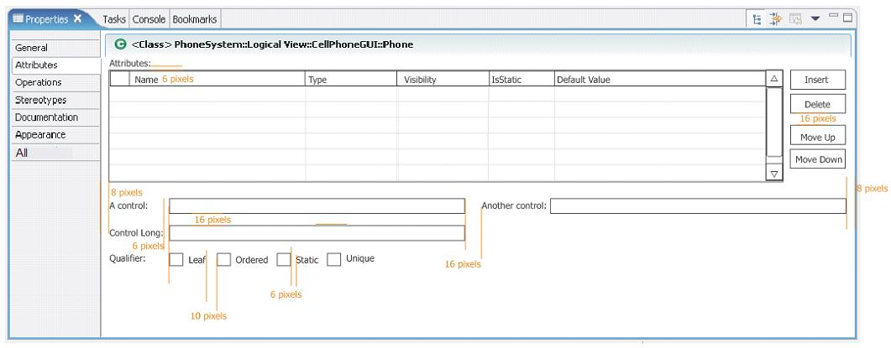

*Figure 1: A tabbed view with recommended control layout.*

*Related Information*

TBD

[[limit-context-menus]]
Limit Context Menus
^^^^^^^^^^^^^^^^^^^

*Summary*

Remove extra items from context menus on objects in editors and views.

*Problem Description*

A context menu provides a quick and convenient way to give a user access
to a great deal of functionality. Unfortunately, it is tempting to add
too much functionality to an object’s context menu. The resulting menus
can become overly long and complicated, which slows down the efficiency
of a user’s work with the product. Moreover, it is possible to create
the same context menu for all objects, regardless of type, within an
editor or view. Such uniformity deprives a user of subtle feedback about
which type of object they are currently working with. Contextual
feedback is needed for a user to have a clear sense of the functionality
of each object type.

*Best Practice*

There are at least three ways to trim an object’s context menu, so that
it will be quick to scan and well targeted at the object.

First, remove menu items that don’t apply to the object at all. This may
sound obvious, but in a complicated product environment, it is easy for
unrelated items to creep into a context menu. Of course, a menu item
that doesn’t apply could be grayed out. But if it never applies, it’s
better to remove the item entirely. For example, it would be confusing
to have a “Run as” item on the context menu of a C++ header (.h) file in
a navigator-style view, since run operations really apply to code
instead.

Second, remove items that apply to only the view or editor as a whole.
While a user may find it convenient to access these items from an
object, it is better to have a “lean and mean” context menu instead –
one that is uncluttered and focuses attention on the object at hand.
Access to actions related to the view or editor as a whole are better
handled by right clicking on the white space outside any object (or by
clicking on the view menu). The user will get a better sense of the view
or editor as a whole, without any confusion about what menu item lives
where. For example, view preferences should not be on the context menu
for an object in that view, but rather on the context menu outside any
object (or in the view menu).

Finally, remove items from an object’s context menu that apply to other,
nearby objects, but not to the specific one in question. The resulting
menus will make more sense to the user, as the actions logically
appropriate to the object will be there, but not actions logically
appropriate to some other type of object. For example, it would be
confusing to have a “Close Project” item on the context menu of a Java
method shown in an explorer view, since import operations apply at the
project level instead.

*Tips and Tricks*

Sometimes there is value in adding a view-specific item to an object’s
context menu, if the action of the menu item can be customized in some
way for the object. For example, a generic “New” menu item might open up
a new editor pre-populated with item(s) related to the selected object.
Be sure to keep the item order on a context menu as similar as possible
for different types of object. This similarity will maximize consistency
for the user.

In cases where it is not possible to reduce the number of items on a
large context significantly, consider using submenus to refactor some
top-level items to the second level.

*Good Examples*

Figure 1: a context-dependent menu tailored for a package in the Outline
View.

Figure 2: a context menu tailored for a class in the Outline View.

Figure 3: a context-independent menu for the Outline View.

*Related Information*

This issue is addressed in the Eclipse UI Guidelines 2.1, in the section
titled “Component Development - Editors” (Guidelines 6.11-6.13).
