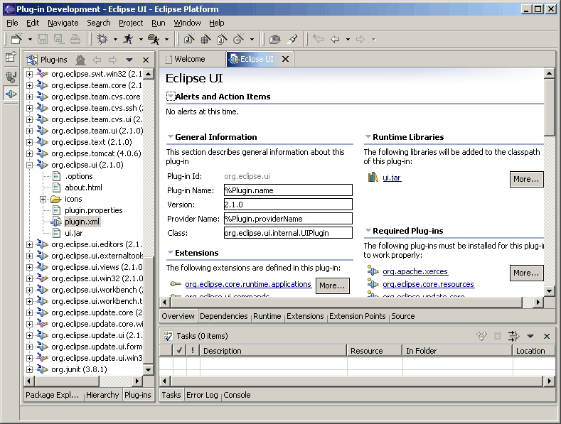
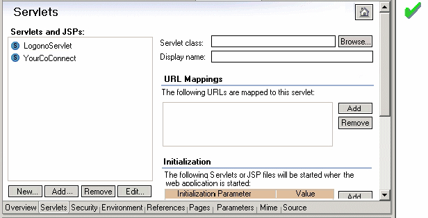
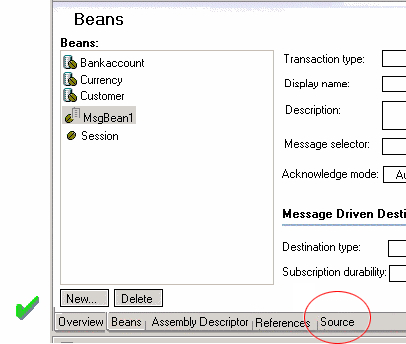

== Flat Look Design

The Eclipse platform provides a Web user interface, also known as Flat
Look, design alternative for implementing content editors. For example,
the editor in the Eclipse plug-in development environment (PDE)
perspective uses Flat Look.

The Flat Look design may be more suitable for certain type of user
tasks, and more appealing to certain user profile. However, this design
should not be used just because it provides a different look than the
native platform look and feel. The use of Flat Look design should be
considered in the context of the supported user scenarios. This design
is usually a good fit for extensive property and configuration editing,
such as editing Eclipse's `plugin.xml` file, and J2EE Web application's
deployment descriptors.

TIP: [[guideline16.1]]*Guideline 16.1* +
Use Flat Look design for user scenarios that involve extensive property
and configuration editing.

When required, use a btn:[More...] button for navigation purpose (function
similar to a hyperlink).

image::images/Flatlook2.gif[flatlook2,title="flatlook2"]

On the overview page, initially expand basic or core sections, but
collapse advanced sections. On non-overview pages, provide a "Home" icon
which takes users back to the overview page

TIP: [[guideline16.2]]*Guideline 16.2* +
Have the core sections on the overview page expanded, and provide a
"Home" icon on other pages to take users back to the overview page.

Don't use tabs within a Flat Look editor tab. Use an alternative design
or rendering of the tabs.

image::images/Flatlook4.gif[flatlook4]

When applicable, always provide a "Source" tab. Assign mnemonics for
sections, controls, etc. for keyboard navigation.

=== Editor and Outline View Interaction

Plug-ins that use Flat Look design for content editor should provide
support for full two way interactions between the editor and outline
view.

In the outline view, use grouping elements corresponding to tabs in the
content editor for the organization of the tree view.

image::images/Flatlook6.gif[flatlook6]

TIP: [[guideline16.3]]*Guideline 16.3* +
Use grouping elements corresponding to tabs in the Flat Look content
editor for the organization of the tree view in outline view.
