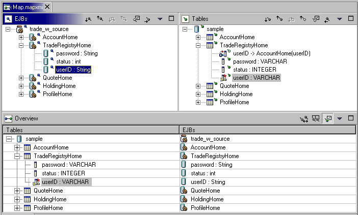

= General UI Guidelines
:sectnums:
:sectnumlevels: 4

This document defines UI guidelines that are unique and specific to the
Eclipse platform. It is a supplement to the other standard UI guidelines
such as 

- https://learn.microsoft.com/en-us/windows/apps/design/[Microsoft® Windows Design Guidelines]
- https://developer.apple.com/design/human-interface-guidelines/guidelines/overview/[Apple® Human Interface Guidelines]
- https://developer.gnome.org/hig/[GNOME Human Interface Guidelines]
- https://www.oracle.com/java/technologies/java-look-and-feel-graphics-repository.html[Java Look and Feel Guidelines] 

You should continue to consult those guidelines for basic UI design and 
implementation recommendations.

It is expected that you already have a basic understanding of the
Eclipse UI architecture and APIs, and the basic UI design principles:
user in control, directness, consistency, forgiveness, feedback,
aesthetics, and simplicity. If you do not currently have the
prerequisite knowledge, please read the relevant documentation first.

TIP: [guideline1.1]*Guideline 1.1* +
Follow and apply good user interface design principles: user in control,
directness, consistency, forgiveness, feedback, aesthetics, and
simplicity.

== The Spirit of Eclipse

At its heart, Eclipse is a platform for tool plug-ins. These plug-ins
may be developed by a single team or by a partnership of teams, or the
user may assemble a set of plug-ins from diverse sources. In either
case, the usability of an individual tool, and Eclipse as a whole, will
be positively influenced by user interface consistency.

If you're in doubt about the appropriate look and feel for a tool, look
to the platform first, then the Java development tooling and the Plug-in
Development Environment (PDE) in Eclipse for guidance. In many cases,
the workflow you imagine may already exist in Eclipse. If so, adopt the
platform's workflow and user interface conventions. This will lead to
greater consistency with the platform and other plug-ins, and an easier
learning curve for your customers.

In some scenarios, it may be tempting to ignore the workflow of Eclipse
and implement a "custom" user interface. This interface will almost
certainly stand out like a sore thumb in an integrated environment,
where other tools adopt the platform conventions. You lose the benefit
of past experience, and force your customers to learn new ideas.

Consult the link:best_practices.adoc[Best Practices] section for examples
and more information.

Also, visit the https://github.com/eclipse-platform[Eclipse
Platform @ GitHub] to share information with the community.

TIP: [guideline1.2]*Guideline 1.2* +
Follow the platform lead for user interface conventions.

If you decide to reuse the conventions of Eclipse, be careful not to
misappropriate Eclipse specific UI conventions. For instance, the active
part in a workbench window is indicated by a shaded title. The use of
shaded titles within an editor (see below) may be one way to indicate
where the focus is, within that part, but it will also blur the concept
of part activation in the window.

TIP: [guideline1.34]*Guideline 1.3* +
Be careful not to mix UI metaphors. It may blur the original concept,
and your own application.

Eclipse is an open source project. If you feel your ideas are generally
useful, join the Eclipse community, write a proposal, and work with the
Eclipse community to make Eclipse a better platform for product
development and increase customer satisfaction.

Visit http://www.eclipse.org/[www.eclipse.org] and join the 
mailto:ui-best-practices-working-group@eclipse.org[Eclipse UI mailing list]. 

TIP: [guideline1.4]*Guideline 1.4* +
If you have an interesting idea, work with the Eclipse community to make
Eclipse a better platform for all.

== Capitalization

Consistent capitalization of text within a plug-in leads to a more
polished feel, and greater perception of quality. Within a dialog or
window, headline capitalization should be applied to all titles, menus,
tooltip, tabs, and push buttons. For example, "Run to Line" can be used
as a menu item label.

Sentence style capitalization should be applied to all check boxes,
radio buttons, and group labels. For example, "Choose an option for the
Java file" can be used as a group label.

TIP: [guideline1.5]*Guideline 1.5* +
Use Headline style capitalization for menus, tooltip and all titles,
including those used for windows, dialogs, tabs, column headings and
push buttons. Capitalize the first and last words, and all nouns,
pronouns, adjectives, verbs and adverbs. Do not include ending
punctuation.

TIP: [guideline1.6]*Guideline 1.6* +
Use Sentence style capitalization for all control labels in a dialog or
window, including those for check boxes, radio buttons, group labels,
and simple text fields. Capitalize the first letter of the first word,
and any proper names such as the word Java.

== Language
Eclipse is available on a variety of different platforms, in a variety
of locales. In reflection of the different languages and numeric formats
in each, a localization strategy should be adopted for the text and
images within each plug-in. This involves the separation of all
resources from the source code of a plug-in itself, so that those
resources can be translated to a new locale.

Consult the link:best_practices.adoc[Best Practices] section for examples
and more information.

TIP: [guideline1.7]*Guideline 1.7* +
Create localized version of the resources within your plug-in.

== Error Handling

If an error occurs in Eclipse, the appropriate response will be
dependent on the context of the error.

Please refer to link:component_dev.adoc#wizards[Wizards] section for 
guidelines on how to handle user input errors in a wizard.

Please refer to link:component_dev.adoc#editors[Editors] section for guidelines
on how to handle errors occurring in an editor.

When an error occurs which requires either an explicit user input or
immediate attention from users, a modal dialog should be used to
communicate the error to the user. This forces the user to notice, and
deal with, the problem.

TIP: [guideline1.8]*Guideline 1.8* +
When an error occurs which requires either an explicit user input or
immediate attention from users, communicate the occurrence with a modal
dialog.

If a programming error occurs in the product, an error dialog should be
used to communicate the occurrence to the user. The error should also be
logged using the workbench error logging facility. This gives the user
an opportunity to restart the platform, uninstall the corresponding
feature, and contact their system administrator.

The plug-in should provide the following information in the detail area
of the error dialog:

* Provider name
* Plug-in name (user friendly name)
* Plug-in ID
* Version

TIP: [guideline1.9]*Guideline 1.9* +
If a programming error occurs in the product, communicate the occurrence
with a dialog, and log it.

