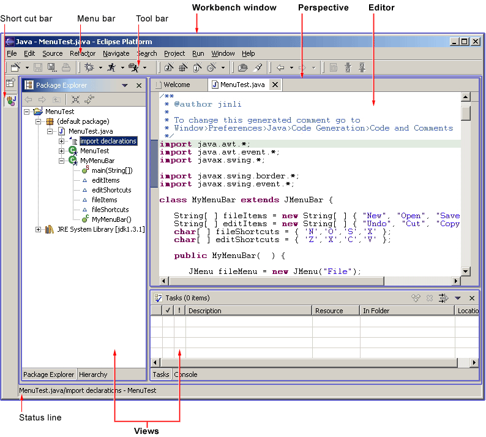
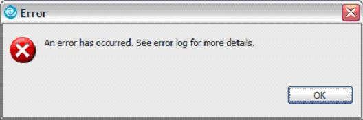
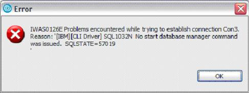
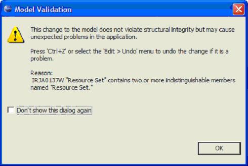

= Eclipse UI Guidelines
include::_settings.adoc[]

UI Best Practices Working Group
{version}

__' This document is a working draft. Version 2.1 is the base with 3.x
updates indicated with "(3.x update)".__'

*Nick Edgar, Kevin Haaland, Jin Li and Kimberley Peter, with
contributions from members of the
link:http://wiki.eclipse.org/User_Interface_Best_Practices_Working_Group[User Interface Best
Practices Working Group]*

*Last major revision: November 2007* +
*Convertion into Asciidoc: September 2016*

NOTE: Please use the
https://github.com/eclipse-platform/ui-best-practices/discussions[discussion
page] to add comments instead of embedding them in this document.

:toc:

== Notice
Your feedback can influence the ideas and guidelines described here. If
you have suggestions, please provide us with your feedback on the
mailto:platform-ui-dev@eclipse.org?subject=UI%20Guidelines%20v2.1%20Feedback[UI
mailing list] or on the
https://github.com/eclipse-platform/ui-best-practices/discussions[discussion
page].

== UI Checklist
The xref:top_ten_lists.adoc[Top Ten Lists] is a shortlist of the most relevant
and easy to apply Eclipse **User Interface Guidelines**. 
Start by using xref:top_ten_lists.adoc[this list], referring to the linked guideline items for details, 
then use the xref:eclipse_ui_full_checklist.adoc[Full Checklist] for additional guidance. 
For comments please use the 
https://github.com/eclipse-platform/ui-best-practices/issues[UI Best Practices GitHub Issues].

== Introduction
In this document the Eclipse user interface guidelines are defined.

Eclipse is a universal tool platform - an open, extensible IDE for
anything, but nothing in particular. The real value comes from tool
plug-ins that "teach" Eclipse how to work with things - Java™ files, Web
content, graphics, video - almost anything you can imagine. Eclipse
allows you to independently develop tools that integrate with other
people's tools so seamlessly, you won't know where one tool ends and
another starts. The very notion of a tool, as we know it, disappears
completely.

The platform is very flexible and extensible, but this flexibility has a
serious drawback. In particular, there is no way within the program to
ensure user interface consistency between the registered components
within the platform. This document attempts to reconcile this problem,
by defining standard user interface guidelines for the creation of new
components. If these guidelines are adopted within your own tools, it
will lead to greater consistency with the platform and other tools, and
an easier learning curve for your customers.

These guidelines are intended for use by designers and implementors of
an Eclipse user interface extension.

=== The Workbench

To start out, let's take a look at the Eclipse workbench user interface,
and the various components within it.

The workbench is a collection of windows. Each window contains a menu
bar, a toolbar, a shortcut bar and one or more perspectives.

A perspective is a visual container for a set of views and content
editors. The views exist wholly within the perspective and are not
shared, but any opened content editors are shared across perspectives.
If two or more perspectives have the same view opened, they share the
same instance of the view although its layout may differ in the
perspectives. For perspectives in different Workbench windows, neither
editors nor views are shared. A perspective is like a page within a
book. It exists within a window along with any number of other
perspectives and, like a page within a book, only one perspective is
visible at any time.

The Workbench's main menu bar usually contains the File, Edit, Navigate,
Project, Window, Help top-level menus. Other top-level menus that are in
between the Edit and Project menu are typically context specific, based
on the current active perspective, front most editor (whether active or
not), and active view..

In the File menu you will find a New submenu, which contains menu items
for Project, Folder, and File creation. The File menu also contains menu
items for Import and Export, which are used to import files into the
Workbench, and export them out again. In the Edit menu, you will find
familiar commands like Cut, Copy, Paste, and Delete. These commands are
known as global commands, and target the active part. In other words, if
the Delete command is invoked with the Navigator active, the actual
implementation is performed by the Navigator. In the Project menu, you
will find project related commands such as Open project, Close project
and Rebuild project are available. In the Run menu, you will find
commands related to running and debugging application code, and
launching external tools such Ant scripts. In the Window menu, you will
find the Open Perspective submenu to open different perspectives to suit
to needs of your development tasks. You will find perspective layout
management menu items. You will also find the Show View submenu to add
views to the current Workbench window. In addition, you will find the
Preferences menu item, which is used to modify the functional
preferences of the Workbench.

As a plug-in developer, you can contribute new views, editors, wizards,
menu, and tool items to the platform. These contributions are defined
using XML, and once registered, integrate seamlessly with the components
which already exist in the platform.

=== Projects, Folders and Files

Eclipse can be used to create many different kinds of content - Java
files, Web content, graphics, video - almost anything you can imagine.
These objects are stored as regular files within the Eclipse workspace.
The workspace consists of one or more top level projects. Each project
contains a collection of folders and files. These objects are known as
__resources__.

== Getting Started

For most developers, an introduction to the platform can be
overwhelming, and you may ask "where do I get started?". Here are a few
basic guidelines which will help you.

This document is intended for UI designers and developers. With this
audience in mind, we can talk about the two main layers of any
application: the model layer and the user interface layer. In the model
layer of Eclipse, known as the Workspace, is a collection of resources
(projects, folders and files). The user interface, or the Workbench,
defines the presentation for those resources.

As a UI developer, you will also have a model and a presentation. If we
assume that your goal is to make the model visible, through some
presentation, most developers will start out by adding a new view or
editor to the workbench.

In Eclipse, an editor is used to contain the primary content, such as a
document or data object, which users interact with. In every case, this
content is the primary focus of attention and a reflection of the
primary task. To illustrate this concept, let's look at some common
examples.

To do Java programming, the primary task is to create, edit, and debug
Java code. The primary focus is the Java code, so an editor is used to
interact with that code. The navigator, outline, and properties view
exist to support the primary task, but rarely hold your attention for an
extended period of time while you are writing Java code.

To read email, the primary task is to create, send, read, and reply to
email. The primary focus is a particular email message, so an editor is
used to view or reply to an email message. A view may be used to select
an email message to read, and open an editor.

To communicate using instant messaging, the primary task is the
conversation. The primary focus is a particular conversation, so an
editor is used to carry on that conversation. A view may be used to list
people with whom you can initiate a conversation.

To browse the Web, the primary task is reading. The primary focus is a
particular Web page, so an editor is used to browse the Web page.

In each case, the primary task determines the primary focus of
attention. As the primary focus of attention, it deserves a primary
position in the UI (as an editor), and can contribute commands to the
workbench's main menu bar and toolbar.

A view may be used to save your favorite links, and reopen them. At any
time, you may decide to edit the page you are looking at. This causes a
new editor to open. Views are used to support the primary task. You use
them to navigate a hierarchy of information, open an editor, or view
properties for the active part. Each view may have its own local toolbar
and local menu bar.

Once you have added a view or editor, an interesting question arises.
Where did this model come from? In Eclipse, most data is created using a
creation wizard. You may want to add a creation wizard too. And once an
object exists, you may need a way to edit the properties for that object
using a properties page, or the properties dialog.

All of these ideas will be discussed, in detail, in the following
sections.

== Content

- xref:top_ten_lists.adoc[*Quick Checklists and Top Ten Does and Dont's*] +
  Shortlist of the most relevant and easy to apply Eclipse User Interface 
  Guidelines and their violations. 
   
- xref:general_ui_guidelines.adoc[*General UI Guidelines*] +
  General guidelines for developing Eclipse based user interfaces and Eclipse 
  extensions.   

- xref:ui_graphics.adoc[*UI Graphics*] +
  Guidelines for developing and using UI graphics (i.e. icons, images, banners).   

- xref:component_dev.adoc[*Component Development*] +
  Guidelines for the correct usage of diverse Eclipse UI components, such as 
  commands, dialogs, wizards, editors, views, perspectives, windows, properties,
  and widgets.   

- xref:standard_components.adoc[*Standard Components*] +
  Guidelines for the standard components which ship with Eclipse.   

- xref:flat_look_design.adoc[*Flat Look Design*] +
  Design alternative for implementing content editors.   

- xref:tao_of_resource.adoc[*The Tao of Resource*] +
  Resources as the common medium for integration between plugins and external 
  tools.   

- xref:accessibility.adoc[*Accessibility*] +
  Guidelines for making UI accessible for different user groups with different 
  needs.   

- xref:best_practices.adoc[*Best Practices*] +
  Examples of best practices for designing and implementing some common user 
  interactions within the Eclipse platform.   

- xref:eclipse_ui_full_checklist.adoc[*Checklist for Developers*] +
  Collection of all Eclipse Eclipse User Interface Guidelines.

== Glossary

*Command*::
  A __command__, which is invoked by a user to carry out some specific
  functions, may appear as an item in a menu, or an item in a toolbar.
  In reflection of this, it has attributes for the menu or tool item
  label, tooltip, and image. As a plug-in developer, you can contribute
  commands to the window menu bar and toolbar, or to individual views
  and editors. Contribution to the window is performed using an __action
  set__, a set of task oriented commands which the user can show or
  hide. Contribution to a view or editor is performed using individual
  command.
 
*Bookmarks View*::
  A view used to browse the bookmarks in the workbench.
  
*Editor*::
  An editor is a visual component within a workbench page. It is
  typically used to edit or browse a document or input object. The input
  is identified using an `IEditorInput`. Modifications made in an editor
  part follow an open-save-close lifecycle model (in contrast to a view
  part, where modifications are saved to the workbench immediately).

*File*::
  An object in the workspace, analogous to files in the file system.
  
*Folder*::
  A container for files in the workspace.
  
*Navigator View*::
  A view used to browse the files in the workspace
  
*Outline View*::
  A view, commonly used to view the outline of the active editor.
  
*Perspective*::
  A perspective is a visual container for a set of views and editors
  (parts). These parts exist wholly within the perspective and are not
  shared. A perspective is also like a page within a book. It exists
  within a window along with any number of other perspectives and, like
  a page within a book, only one perspective is visible at any time.
  
*Platform*::
  A generic framework for the integration of tools.
  
*Preferences*::
  A Preference Page is used to edit the preferences for a feature in the
  platform.
  
*Project*::
  A group of files and folders within the workspace. Each project maps
  to a corresponding user specified directory in the file system.
  
*Properties View*::
  A view, typically used to browse the properties for an object in the
  active editor or view.

*Properties Dialog*::
  A dialog for editing the properties of an object.

*Property Page*::
  A page within a Properties Dialog.

*Resource*::
  The generic name for projects, folders and files.
  
*Tasks View*::
  A view used to browse the tasks, errors, and warnings within the
  workspace.

*View*::
  A view is a visual component within a workbench page. It is typically
  used to navigate a hierarchy of information (like the workspace), open
  an editor, or display properties for the active editor. Modifications
  made in a view are saved immediately (in contrast to an editor part,
  which conforms to a more elaborate open-save-close lifecycle).*Wizard*::
  A Wizard is typically used to create new resources, import resources,
  or export resources.
  
*Workbench*::
  The Workbench provides the user interface structure for Eclipse. The
  purpose of the Workbench is to facilitate the seamless integration of
  tools. These tools contribute to extension points defined by the
  Workbench. The Workbench is responsible for the presentation and
  coordination of the user interface.
  
*Workspace*::
  The various tools plugged in to the Eclipse Platform operate on
  regular files in the user's workspace. The workspace consists of one
  or more top level projects, where each project maps to a corresponding
  user specified directory in the file system. Each project contains a
  collection of folders and files.

== Acknowledgement

Screenshots contributed to Eclipse.org and used in this document,
originate from plugins released or under development by the following
teams:

* Java Development Tooling, Eclipse Subproject
* WebSphere® Studio Application Developer, IBM Corporation
* Rational XDE Professional, IBM Corporation.

By agreeing to share selected elements of their user interface designs
(both positive and negative), we feel that these teams have helped make
the UI guidelines stronger.

'''

 Version 2.1 February 2004Copyright© 2001 - 2004 International Business Machine Corporation.Java and all Java-based trademarks and logos are trademarks or
registered trademarks of Sun Microsystems, Inc. in the United States,
other countries, or both.Microsoft, Windows, Windows NT, and the Windows logo are trademarks of
Microsoft Corporation in the United States, other countries, or both.

'''

== Eclipse v3.x UI Guidelines Updates (appended)

(This section needs to be integrated into the above document.)

The following is a draft of ongoing Eclipse v3.x UI Guideline updates.

=== General UI Guidelines

==== Common Error Messages

===== Summary

Use the common structure of error messages to help users diagnose and
recover from errors. This will increase user’s self-sufficiency and
reduce support costs for Eclipse-based products.

===== Problem Description

Across Eclipse-based products, error messages are displayed
inconsistently. This inconsistency makes it difficult for users to
understand error conditions, and to diagnose and recover from problems.

===== Best Practice

Eclipse-based products should help users to diagnose the underlying
problem when one of our error messages is displayed. We need to
consolidate, transform or coordinate errors bubbled up through various
sub-systems or dependent components. For example, users would currently
see a (cryptic) SQL error message when they have provided an incorrect
userid or password for a SQL query. In this case, users would have no
idea how to fix this problem or where to look for possible solutions. In
the ideal scenario, if our tools coordinate or transform the error code
returned from DB2, and inform users that there's a problem with the
supplied userid or password, we would provide a good experience for our
users. We should generally leverage the symptom database for diagnoses
and error recovery. One possible approach for the error message
transformation or coordination is this: leverage the common error
message logging facility. That is, use CBE infrastructure in code to log
all error or warning conditions.

*[ TODO: need more detailed info on the Eclipse v3.3 error message
infrastructure...TBD ]*

*Apply the four components of the format for common error messages, to
make these messages easily understood by users and to ensure
consistency.* Each error message should include the following four main
components:

 - message ID
 - message text
 - explanation
 - action 
 
The *message ID* provides a quick means to distinguish one message from
another. The *message text* briefly describes the problem. The
*explanation* includes the reason that the message was generated and the
condition that caused the message. The *action* suggests ways to resolve
the problem. Error messages are intended for end users; with this in
mind, we should transform programmatic error text into
user-comprehensible description in most cases.

*For error messages shown in the user interface (UI), do not show the
message’s ID, but make it accessible.* UI error messages are intended
for end users, not developers. Therefore we should not intimidate end
users with a (cryptic) message ID that add no immediate value to their
understanding of the error condition. However, we should make the unique
message ID accessible in the detailed explanation of the message, so
that users can search on the Web using the message ID, or submit the ID
to IBM’s support team for further assistance.

*Log each error message shown in the UI to a log file also.* Error or
warning messages shown to end users in the UI should also be logged in a
file, so that these messages can be traced at a later time for diagnosis
and recovery. The CBE infrastructure provides a logging facility for
this purpose.

*For error messages shown in the Console view or logged in files, show
the message ID as the first item and make it a hyperlink to additional
information.* Error messages displayed in the Console view should
continue to show the message ID as the first item, but it should be a
hyperlink to additional information, so that users can diagnose a
problem quickly.

*For error messages shown in the Problems view, exploit the QuickFix
feature to offer solutions to users.* Since limited space is available
in the Problems view, for errors or warnings shown in that view, we
should exploit the QuickFix feature to offer solutions to users where
possible.

===== Tips and Tricks

- When it is not feasible to consolidate, transform or coordinate every
error bubbled up through the various sub-systems or dependent
components, focus work effort on the errors frequently encountered in
typical user scenarios.
- Obtain a list of top PMRs from our support team, and address those
errors as a first priority.
- Leverage the symptom database, information developers and user
experience designers to transform error text into meaningful and
understandable descriptions for users.
- Use contextual information in the Eclipse IDE workbench, such as
currently enabled capabilities, or current user role or persona (e.g.,
Java developer), to scope the error text.

===== Good Examples

*Sample Error Messages in Our Products*

Here are some sample error messages from IBM’s products, to illustrate
the inconsistency among messages and the user’s challenge in
understanding error conditions.

*Here are the good examples*

[ TBD - screen captures ]

*Related Information*

TBD

=== Component Development

==== Limit Context Menus

===== Summary

Remove extra items from context menus on objects in editors and views.

===== Problem Description

A context menu provides a quick and convenient way to give a user access
to a great deal of functionality. Unfortunately, it is tempting to add
too much functionality to an object’s context menu. The resulting menus
can become overly long and complicated, which slows down the efficiency
of a user’s work with the product. Moreover, it is possible to create
the same context menu for all objects, regardless of type, within an
editor or view. Such uniformity deprives a user of subtle feedback about
which type of object they are currently working with. Contextual
feedback is needed for a user to have a clear sense of the functionality
of each object type.

===== Best Practice

There are at least three ways to trim an object’s context menu, so that
it will be quick to scan and well targeted at the object.

First, remove menu items that don’t apply to the object at all. This may
sound obvious, but in a complicated product environment, it is easy for
unrelated items to creep into a context menu. Of course, a menu item
that doesn’t apply could be grayed out. But if it never applies, it’s
better to remove the item entirely. For example, it would be confusing
to have a “Run as” item on the context menu of a C++ header (.h) file in
a navigator-style view, since run operations really apply to code
instead.

Second, remove items that apply to only the view or editor as a whole.
While a user may find it convenient to access these items from an
object, it is better to have a “lean and mean” context menu instead –
one that is uncluttered and focuses attention on the object at hand.
Access to actions related to the view or editor as a whole are better
handled by right clicking on the white space outside any object (or by
clicking on the view menu). The user will get a better sense of the view
or editor as a whole, without any confusion about what menu item lives
where. For example, view preferences should not be on the context menu
for an object in that view, but rather on the context menu outside any
object (or in the view menu).

Finally, remove items from an object’s context menu that apply to other,
nearby objects, but not to the specific one in question. The resulting
menus will make more sense to the user, as the actions logically
appropriate to the object will be there, but not actions logically
appropriate to some other type of object. For example, it would be
confusing to have a “Close Project” item on the context menu of a Java
method shown in an explorer view, since import operations apply at the
project level instead.

===== Tips and Tricks

Sometimes there is value in adding a view-specific item to an object’s
context menu, if the action of the menu item can be customized in some
way for the object. For example, a generic “New” menu item might open up
a new editor pre-populated with item(s) related to the selected object.
Be sure to keep the item order on a context menu as similar as possible
for different types of object. This similarity will maximize consistency
for the user.

In cases where it is not possible to reduce the number of items on a
large context significantly, consider using submenus to refactor some
top-level items to the second level.

===== Good Examples

Figure 1: a context-dependent menu tailored for a package in the Outline
View.

Figure 2: a context menu tailored for a class in the Outline View.

Figure 3: a context-independent menu for the Outline View.

===== Related Information

This issue is addressed in the Eclipse UI Guidelines 2.1, in the section
titled “Component Development - Editors” (Guidelines 6.11-6.13).
