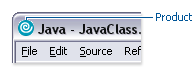
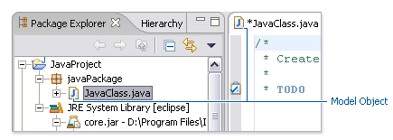
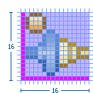

== UI Graphics

=== Overview

The following guide covers user interface (UI) graphics for Eclipse-based tools. 
All visual user interface elements created for Eclipse-based tools follow a 
common style called the *_Eclipse visual style_* or **_Eclipse style_**. Any 
product, tool, or plug-in based on the https://www.eclipse.org[Eclipse] Workbench
should follow these guidelines to help ensure consistency of visual user 
interface elements. Consistency includes visual style, meaning, and 
implementation conventions.

==== Audience

These guidelines are for anyone creating Eclipse style user interface
graphics or seeking best practices for their use. This is not a how-to
guide, but you will find instructions for some tasks and a number of
resources to assist in making the graphics. If you are a designer, you
will be interested in the Design, Specifications, and Implementation
sections. If you are a Developer, the Specifications and Implementations
sections will be of most value to you.

=== Design

This section provides guidance and tools for creating Eclipse style
icons and wizard graphics.

==== Style & Design

This section covers style characteristics and gives guidance for
designing effective Eclipse user interface graphics including topics
such as metaphor, composition, lighting, color and more.

Before beginning to design Eclipse-style icons or wizard banner
graphics, first check if the concept or visual elements have been
covered already. Refer to the xref:#consistency_reuse[Consistency
& Reuse] and xref:#common_elements[Common Elements] sections for these
elements. If designing an icon or wizard graphic from the start,
consider the underlying concept and how it can best be represented.
There might be an existing metaphor to appropriately convey the concept.

===== Metaphor

The purpose of a metaphor is to create meaning. A metaphor will be
meaningful if it is based on ideas the audience is already familiar
with, and if it fits conceptually with the content and context. It
should be clear, easily learned, and readily distinguishable. For
example, project and file folders are used in the Eclipse-based
workspace the same way they are used in the real world to organize and
store project-related information. Since many concepts already have
associated metaphors, use the existing metaphors, and when the concept
allows, create new representations that extend the metaphor.

===== Icons

====== Style characteristics

The icons should have a clean elegant feel with rich but subtle color
and lighting. They are rendered as if viewed directly from in front, but
have the illusion of three dimensions. This affect is achieved by using
color gradients and an implied light source from the top. A kind of
ambient light is also used to illuminate different parts of each icon,
either to bring out its shape or to emphasize a certain aspect of the
image. Other key features include color gradient outlines to define
edges and strong identifiable shapes with as few combined elements as
possible.

Lighting::
+
For most elements, lighting is achieved with simple vertical
  gradients. The gradients go from a lighter color at the top of the
  element to a darker color at the bottom. This approach gives subtle
  form and illuminates basic elements such as files, folders, and other
  rectilinear shapes. For spheres, triangles and more complex forms, an
  additional reflective light source is added near the base of the
  element to give it volume and to ground it in its environment.
+
image:images/des_styl_char1.png[des_styl_char1]
image:images/des_styl_char2.png[des_styl_char2]

Outlines::
Each element within an individual icon features a single pixel
  keyline. Solid color lines define the top and bottom edges of the
  element, and gradients define the sides. To reinforce the light source
  from the top, the keyline color goes from light at the top to dark
  color at the bottom. The gradient along the sides bridges these light
  and dark colors.
+
The color of the outline will vary according to the color of the
  individual element. In the example below, the file has a dark
  grayish-blue base and a light ochre color top. This is a standard
  color outline for this type of object. You will see that other
  elements use standard color outlines as well. Read more about standard
  colors under Color below, and use the xref:#common_elements[Common
  Elements] design resource for reusable elements.
+

Style differences between types::
+
*_View_* (includes Perspective and Fast View), *_Model Object_*
  (includes Table), **_Object Overlay_**, **_Progress Indicator_**, and
  *_Diagram_* icons have more saturated color and higher contrast than
  Toolbar, Local Toolbar, and Palette icons. It is important these icons
  stand out as focal points in the user interface because they are key
  indicators of the model. Since there are no tooltips associated with
  object type icons, they are less, or not, accessible to persons with
  low or no vision. Increased saturation and contrast helps compensate
  for this.
+
**_Toolbar_**, **_Toolbar Wizard_**, **_Local Toolbar_**, and
  *_Palette_* icons have a more subtle approach to color and contrast
  than their object-based counterparts. These icons are more subtle
  because they are reliably present in the user interface and should not
  be distracting. Tooltips for these types of icons make them accessible
  to persons with low or no vision. Additionally, the use of color for
  the outlines, instead of black, means the images are not lost if
  people choose to work in a high-contrast (usually black) accessibility
  mode.
+
A subset of core reusable elements illustrate this distinction best:
  Project, File, and Database elements each have a rich saturated
  version for the treeview and a light subtle version for the toolbar
  and local toolbar. Look for these differences in other icons within
  the link:#Common_Elements[Common Elements] files.
+
Here are the Project, File, and Database icons rendered as model
  objects:
+
image::images/des_styl_types_obj.png[des_styl_types_obj]
+
Here are the same icons rendered in the more low-key toolbar style:
+
image::images/des_styl_types_tool.png[des_styl_types_tool]

====== Composition
Aim for simplicity. Bring focus to the primary function or object within
an icon by using different visual cues, such as color, contrast,
lighting, size and location to differentiate elements. To improve
clarity and reduce visual noise, avoid using too many elements within
any given icon.

The location of individual elements in an icon can have an impact on its
meaning and recognition value. People learn, recognize, and expect
patterns: using a consistent location for visual elements, when
possible, establishes a pattern that is useful for identifying the
object type or function of an individual or set of icons.

Actions::
Actions in toolbar and local toolbar icons tend to be on the left of
  the icon and identify a command that will be performed on an object or
  set of objects. For example, the following icon represents "Deploy
  Script" on the toolbar. The action "deploy" is represented by a green
  arrow on the left of the script object: + 

+
However, not all actions are located on the left. To convey the
  intended meaning of a concept or to accommodate the context of the
  icon in the user interface, diverging from convention is sometimes
  required. Here are some actions that are notable exceptions to the
  action-on-the-left convention:
+
*_Create_* or *_New_* is represented by a sparkle in the upper-right
  corner to denote the creation of a sparkling "new" object. The
  sparkle, though an object itself, is a metaphor for creating something
  new. Its location in the icon space is precisely 1 pixel down from the
  top and flush with the right edge of the 16 x 16 icon space. Using
  this exact location ensures a clean uncluttered presentation when seen
  across a number of "new" action icons on the toolbar or in the menu.
  For example: +
image:images/des_styl_create2.png[des_styl_create2]
+
**_Import_**, when associated with an object, is represented by an
  arrow in the bottom-right corner facing downward and to the right.
  Location and direction are important here to convey that an object
  will be imported from another location into the workbench. Note that
  its counterpart, **_Export_**, follows the action-on-the-left
  convention with an arrow in the bottom-left corner because this
  location and direction is appropriate for denoting that an object will
  be exported from the workbench to another location. +

+
*_Open_* is represented by a curved arrow in the upper-right corner of
  the icon. The location, shape, and direction of the arrow indicate
  that the object is being opened. This action is used mostly on book-
  or file-type objects. For example: +

+
*_Pin_* is represented by a pushpin on the right of the object. The
  "Pin Fast View" icon is located on the right side of a view title bar.
  The location of the icon and the action within the icon indicate the
  side where the view will be pinned—on the right. Because of this
  location, the pin is pointing inward toward the object to be pinned.
  Placing the pin on the left would not work as well given the context
  and literal action of the icon. + 
image:images/des_styl_pin.png[des_styl_pin]

Objects::
Objects are stacked vertically, often in large number, within
  treeviews and lists. Because of this stacking, attention to the
  alignment of objects within the icon design space is important. This
  is particularly true of repeated objects that use the same elements.
  For example, a file or folder used as a base for a series of model
  object images, should be located in the same place within the 16 x 16
  pixel icon space in all of the images within the series. To illustrate
  the difference between aligned and not aligned objects, first, here is
  an example showing the base element—in this case the yellow folder—not
  aligned the same throughout a series of icons. The result is a choppy,
  harder to scan treeview or list: +

+
Second, here is an example showing the same base folder element
  aligned throughout the set. The result is a clean, easier to scan
  treeview or list: +

States::
States are the result of a direct of indirect action on an object.
  Once an action is taken on an object, the object reflects that action
  by showing its state. This state is generally shown on the right side
  of the icon. For example, invoking the action "Run on Server" will
  show the server running in the Servers view with a green arrow run
  action on the right side of the server object. +
image:images/des_styl_state-start.png[des_styl_state-start]
+
Stopping the server will show the blue square stop action on the right
  of the server object. +

====== Color Palette & Themes

An entire set of graphical elements, such as icons, wizards and user
assistance graphics, requires a consistent, family-like appearance
across the user interface (UI); contrarily, individual and sub-families
of graphics require differentiation. Color choices can either bring
unity or cause distraction.

Eclipse supports 24 bit color depth, which means that colors used to
create UI graphics can come from outside the defined 8 bit, or 256 color
Eclipse-style palette. However, using the Eclipse-style palette as the
base for applying color to your graphics will help ensure a visual fit
within the Eclipse environment.

To achieve a consistent appearance in graphics across the UI, use a
common color palette as the basis for creating your graphical elements.

Eclipse-based graphics tend to use a common or dominant set of colors:
  Blue and yellow are the base colors, with green, red, brown, purple,
  and beige used for signifying specific object types or functions. Here
  is the palette, with a number of examples of how its different colors
  are used.

image::images/des_colour_pal.png[des_colour_pal]

The *_Eclipse-style palette_* contains the core and dominant colors
  used in Eclipse-based icons, wizard banner graphics, and user
  assistance graphics. You can download the palette in the
  https://github.com/eclipse-platform/eclipse.platform.images/tree/master/org.eclipse.images/tools/eclipse-style_palette.aco[".aco"],
  https://github.com/eclipse-platform/eclipse.platform.images/tree/master/org.eclipse.images/tools/tools/eclipse-style_palette.ai[".ai"]
  and
  https://github.com/eclipse-platform/eclipse.platform.images/tree/master/org.eclipse.images/tools/eclipse-style_palette.gpl[".gpl"]
  file format.

image::images/des_styl_blueyellow.png[des_styl_blueyellow]

The two dominant colors, *_blue_* and **_yellow_**, bring harmony to
  the overall presentation of the user interface. Themselves
  complementary, blue and yellow form a base on which to apply accent
  colors. These few examples show blue and yellow as the common base for
  different icons, and how other accent colors have been applied to help
  convey a concept.

image::images/des_styl_green.png[des_styl_green] 

*_Green_* is often used to indicate that something is being run or
  initiated, and as a common accent color. The actions "run" and "play"
  are prime examples of how the color green is applied to support a
  concept.

image::images/des_styl_red.png[des_styl_red]

*_Red_* is used to indicate an error or to signal an alert, but red is
  also used in real-world objects that are typically red.

image::images/des_styl_brown.png[des_styl_brown]

*_Brown_* is used less than the other colors mentioned, but it is
  generally associated with specific types of objects: the Java
  "package", "bundle", and the "Enterprise Java Bean (EJB)".

image::images/ddes_styl_purple-alt.png[ddes_styl_purple-alt]

*_Purple_* is associated with “Web Site" or "Site Project", plugin
  "fragment", and Java "Interface”.

image::images/ddes_styl_beige.png[ddes_styl_beige]

*_Beige_* is associated with "template" and "generic" objects. While
  not limited to these two object types, beige is usually reserved for
  placeholder or unrealized objects.

====== Tips and Tricks

. *Use color from existing graphics* to quickly make graphics that are 
  consistent with the Eclipse style without having to use the palette directly, 
  select colors from existing Eclipse-based icons and wizards.

. *Consider the background* when designing an icon, keep in mind the background 
  color it will sit on. The various browsers and operating systems allow custom 
  window   backgrounds that people can set according to their own preferences. 
  It is not always possible to know if an icon will be used in different places 
  in the user interface, but generally, the background will be either white or a
  warm or cool mid-tone grey. Whether it is white or grey will depend on the 
  icon type. **_Model Object_**, **_Object Overlay_**, and *_Diagram_* icons are
  usually on a white background, whereas **_Toolbar_**, **_Toolbar Wizard_**, 
  **_Local Toolbar_**, and *_Palette_* icons usually sit on a mid-tone grey 
  background.
+
To achieve the best quality of color and edge treatment, test your
  icons across all known targeted operating system theme backgrounds.
  Modify the icons where needed to work well on most, if not all, of the
  backgrounds. Here is an example of testing a View icon with the
  different operating system theme selection colors, and a set of
  Toolbar icons on a number of known backgrounds: +
image:images/des_bkgd_color.png[des_bkgd_color]
+
Antialiasing the edges is suitable if you know the background color.
  Since knowing the background color is not always possible, using
  medium to dark pixels on the edges will help ensure that the icon
  works well on most backgrounds. Using lighter edge pixels can result
  in poor quality, rough looking edges that do no blend well to the
  background. This is especially true of rounded shapes on dark
  backgrounds. The following example illustrates the effect of using
  lighter pixels on a round icon that sits on a medium to dark color
  background: +
image:images/des_styl_bg1.png[des_styl_bg1]
+
This example shows the same icon on the same background, but with
  darker edge pixels: +
image:images/des_styl_bg2.png[des_styl_bg2]
+
In some special cases, a single icon may appear on multiple
  backgrounds and will need to be designed specifically for each case.

. *Download the palette* + 
You can download the palette in the
https://github.com/eclipse-platform/eclipse.platform.images/tree/master/org.eclipse.images/tools/eclipse-style_palette.aco[".aco"],
https://github.com/eclipse-platform/eclipse.platform.images/tree/master/org.eclipse.images/tools/eclipse-style_palette.ai[".ai"],
and
https://github.com/eclipse-platform/eclipse.platform.images/tree/master/org.eclipse.images/tools/eclipse-style_palette.gpl[".gpl"]
file format.
+
To load the palette in Adobe Photoshop, open the "Swatches" palette
  and choose "Load Swatches..."; then navigate to where you saved the
  https://github.com/eclipse-platform/eclipse.platform.images/tree/master/org.eclipse.images/tools/eclipse-style_palette.aco
  "eclipse-style_palette.aco"] palette.
+
To load the palette in Adobe Illustrator, first save the
https://github.com/eclipse-platform/eclipse.platform.images/tree/master/org.eclipse.images/tools/eclipse-style_palette.ai["eclipse-style_palette.ai"]
palette in the Adobe Illustrator > Presets > Swatches folder. If you
have Adobe Illustrator already open, you will need to restart it after
adding this file. Once you restart Illustrator, go to Windows > Swatch
Libraries and choose the "eclipse-style_palette.ai" palette from the
list.
+
To use the 
https://github.com/eclipse-platform/eclipse.platform.images/tree/master/org.eclipse.images/tools/eclipse-style_palette.gpl[".gpl"] palette in The GIMP open the "Palettes" dialog and choose
  "Import Palette" entry from the context menu. 
+
The
  https://github.com/eclipse-platform/eclipse.platform.images/tree/master/org.eclipse.images/tools/eclipse-style_palette.gpl[".gpl"]
  file format can also be used in Inkscape. Just copy the palette file
  into the user's profile into the "/~/.config/inkscape/palettes"
  folder.
+
Save your images with the palette as a base
+
In Adobe Photoshop, when an image is complete and ready to be saved to
  GIF, index the image to "exact" color. This indexing preserves all of
  the colors the graphic was created with, including any colors you have
  added that are not contained in the base palette.
+
In The GIMP, simply Save As PNG.
+
Related Information::
  This information replaces that provided in the 
  https://www.eclipse.org/articles/Article-UI-Guidelines/Index.html[Eclipse UI 
  Guidelines, Version 2.1], in the section titled “Visual Design – Icon 
  Palettes” (Guidelines 2.2-2.4):
+ 
The GIMP User Manual is available online at: https://www.gimp.org/docs/

===== Wizard Banner Graphics

====== Style characteristics

Like the Eclipse-style icons, wizard banner graphics have a clean
presentation that is achieved by using rich but not overpowering color,
a one-point perspective to show the elements clearly, subtle color
gradients and soft lighting techniques to give the images a subtle
three-dimensional form. Wizard banner graphics have the attribute of
being larger than the icons, which allows for application of a more
intricate, illustrative rendering style with more complex lighting.

Lighting::
Lighting for the wizard banner graphics can be a simple unidirectional
  source or a complex multidimensional source, depending on the shape of
  the elements in the graphic. Unlike the icons, where the light source
  tends to come directly from above, the wizard graphics are lit mainly
  from the top left, have variable lighting that is tailored to each
  graphic, and have the added visual dimension of a cast shadow. The
  three-dimensional look is achieved by using color blends and gradients
  in Adobe Illustrator to render the highlights, mid-tones, shadows, and
  reflected light. +     

Shadow::
For rectilinear objects, such as folders and files, an additional
  light source is implied from the left-front of the graphic, casting a
  shadow to the right of the graphic. This shadow is angled backward—to
  the right-back—at 45 degrees. When designing these types of graphics,
  consider the space the shadow will require by locating the graphical
  elements on the left side of the designated image area. 
+   
image::images/des_styl_wiz_shadow1.png[des_styl_wiz_shadow1,title="fig:des_styl_wiz_shadow1"]
+
Spherical objects have a different shadow treatment than their
  rectangular counterparts. The shadow is positioned directly below the
  object and is elliptical in shape. The sphere touches the shadow,
  which has the effect of grounding the sphere to the surface below. Use
  this type of shadow for spherical and flat-bottomed round objects,
  such as the "Java Method" sphere and "Service" bell, which are
  centered in the designated image area. + 
image:images/des_styl_wiz_shadow2.png[des_styl_wiz_shadow2] 
+ 
Floating objects have a similar shadow to spherical objects in that
  the shadow is also elliptical in shape and positioned below the
  object. However, unlike the shadow for spherical objects, it does not
  touch the object. The object floats above the surface and casts a
  shadow directly below it. Use this type of shadow for elements that
  are centered and floating within the designated image area. 
+ 
image::images/des_styl_wiz_shadow3.png[des_styl_wiz_shadow3,title="fig:des_styl_wiz_shadow3"]

Outlines::
Each element within an individual wizard graphic has a keyline to
  define its outer edges. Solid color lines define the top and bottom
  edges of the element. Gradients define the sides, going from a dark
  color at the bottom to a light color at the top. This approach applies
  to most common objects. However, there are many wizard graphics that
  are defined with flat color instead of gradients. Whether a gradient
  or flat color is used, choose an outline color that works well with
  the color of the element it defines. This is usually mid-tone color
  related to the dominant color used within the element. The following
  examples use established outline treatments and colors. Standard
  outline colors exist for many elements. To read more about the
  standard colors, see Color below, and use the
  link:#_common_elements[Common Elements] design resource for reusable
  elements.
+
Here is an example of a gradient used to define the edges of a wizard
  graphic: + 
image:images/des_styl_wiz_outline1.png[des_styl_wiz_outline1,title="fig:des_styl_wiz_outline1"]
+
Here is an example of a flat outline used to define the edges of a
  wizard graphic: + 
image:images/des_styl_wiz_outline2.png[des_styl_wiz_outline2,title="fig:des_styl_wiz_outline2"]

====== Composition

Composition of elements within wizard graphics follows most of the same
practices described for icons. There are a few wizard-specific
compositional concerns to be aware of for actions, objects, and states:

[horizontal]
Actions:: in wizard banner graphics are generally shown in the same
  location as they are in the icon that launches them. A notable
  exception is the "create" sparkle, which is not shown at all in the
  wizard banner image. When in the toolbar wizard, the action is to
  create a specific kind of object. However, once in the wizard, the
  object is in the process of being created so the action is no longer
  necessary.

Objects,:: when overlapping, need to be clearly separated to ensure a
  legible image. The technique used in wizard banner graphics is to put
  a light glow around the front-most object.

States:: of objects, once in the wizard, change to what the state will
  be once the object is created. The most common example of this is the
  folder state: it is closed when in a toolbar wizard icon, but open
  when in a wizard banner graphic because it will be open once in a
  treeview or list view.

====== Color

Wizard graphic colors are based on the icons that launch them. The
colors used to create a toolbar wizard icon, for instance, should be the
same colors used to create its wizard banner counterpart. To download
and use the color palette for creating wizard graphics, see the
*xref:#color_palette_themes[Color Palette & Themes]* section above
under Icons.

As with the icons, wizard banner graphics fall under a limited set of
color categories. These color categories are established for most
elements and should be reused for like elements to maintain consistency,
meaning, and identity. The following examples show how the different
categories of color are applied to wizard banner graphics.

image::images/des_styl_wiz_blueyellow.png[des_styl_wiz_blueyellow]

*_Blue_* and **_yellow_**, as with the icons, are the two dominant
  colors and are used as a basis for many user interface graphics.

**_Green_**, as with the icons, is often used to indicate that
  something is being run or initiated, and as a common accent color. The
  actions "run" and "play" are primary examples of how green is applied
  to support the concept.

**_Red_**, as with the icons, is used to indicate an error or to
  signal an alert. It is also used for images that are typically red,
  such as a thermometer.

image::images/des_styl_wiz_brown.png[des_styl_wiz_brown]

**_Brown_**, as with the icons, is used to a lesser extent than the
  other colors noted, but it is generally associated with very specific
  types of objects. These objects are the Java "package", "bundle", and
  the "Enterprise Java Bean (EJB)".

image::images/des_styl_wiz_purple.png[des_styl_wiz_purple]

**_Purple_**, as with the icons, is associated with Java "Interface",
  plugin "fragment", and "Web Site" or "Site Project".

**_Beige_**, as with the icons, is associated with "template" and
  "generic" objects. While not limited to these two object types, beige
  is usually reserved for placeholder or unrealized objects.

Background color::
The background for wizard banners is part of the final graphic. It is
  a light blue curvilinear element that does not vary. However, the
  background color of the banner area does vary from one operation
  system and theme to another.
+
Previous to Eclipse 3.3, all wizard banner graphics were in GIF
  format, which meant that the blue curvilinear element blended to a
  white background that was part of the final cut image. This worked
  well on standard Windows and OSX themes that have a white banner
  background, but not on Linux flavors that have a grey banner
  background. Fortunately, Eclipse now supports the PNG graphic format
  and all Eclipse Project (SDK) wizard banner graphics have been
  converted to PNG so that graphic blends to whatever background color
  it sits on.

TIP: [[guideline2.1]]*Guideline 2.1 (3.x update)* +
Follow the visual style established for Eclipse UI graphics.

TIP: [[guideline2.2]]*Guideline 2.2 (3.x update)* +
Use a common color palette as the basis for creating graphical elements.

==== Consistency & Reuse

This section encourages consistency and reuse of existing graphical
elements, and shows the core icon and wizard concepts currently in the
tools.

In the development of the Eclipse style graphical elements, a visual
language was formed to describe a variety of concepts in the user
interface. These concepts are now represented by a large selection of
tiny visual signs that many have come to know through using
Eclipse-based tools.

In order to ensure a consistent visual experience, a common
understanding of concepts across the tools, and to minimize confusion,
we encourage you to re-use Eclipse-style graphical elements whenever
possible.

===== Re-using graphical elements

A great many icons and wizard graphics have already been created in the
Eclipse visual style, so there is a good chance that the elements you
might need already exist. Samples of existing core concepts for icons
and wizard graphics are shown below. Each of these elements carries with
it a specific meaning, so care should be taken when using them to ensure
consistent meaning is maintained. A more extensive collection of common
visual elements can be found on the xref:#common_elements[Common
Elements] page.

===== Core icon concepts

image::images/des_cons_core-icons.png[des_cons_core-icons]

Click link:media/core_icon_concepts.zip[*here*] or on the image above to
download the "core_icon_concepts.psd".

===== Core wizard graphic concepts

image::images/des_cons_core-wiz.png[des_cons_core-wiz]

Click link:media/core_wizard_concepts.zip[ *here*] or on the image above to
download the "core_wizard_concepts.ai" and the
"core_wizard_concepts.psd" files.

TIP: [[guideline2.3]]*Guideline 2.3* +
Re-use the core visual concepts to maintain consistent representation
and meaning across Eclipse plug-ins.

==== Common Elements

This section provides a library of graphical elements that have already
been developed for Eclipse-based tools. This extensive selection of
common elements provides not only a base for creating new icons and
wizard graphics, but for reusing existing ones as they are. Used in
conjunction with the core concepts shown in the Consistency & Reuse
section, this library will enable efficient creation of graphical
elements and promote consistency throughout the user interface.

===== Icon elements

image::images/des_common_icons.png[des_common_icons]

Click link:media/common_icon_elements.zip[ *here*] to download the
  “common_icon_elements_eclipse-proj.psd” for Eclipse Project icons and
  the "common_icon_elements_eclipse-tools.psd" file for a subset of
  icons related to Eclipse-based tools.

===== Wizard elements

Click link:media/common_wizard_elements.zip[ *here*] to download the
  "common_wizard_elements.ai" vector-based file for designing wizard
  banner graphics and the "common_wizard_elements.psd" raster-based file
  for cutting them.

TIP: [[guideline2.4]]*Guideline 2.4* +
Re-use existing graphics from the Common Elements library or other
Eclipse-based plugins.

==== States
This section describes the use of enabled and disabled icons in the user
interface. It also provides instructions and an automated action set for
creating the disabled state of your enabled color icons, a useful tool
when producing a large volume of icons.

===== Icon States

This section describes the use of enabled and disabled icons in the user
interface. It also provides instructions and an automated action set for
creating the disabled state of your enabled color icons, a useful tool
when producing a large volume of icons.

====== Enabled state
The enabled icon state is the color version of all toolbar, toolbar
wizard, and local toolbar icons. This state indicates that a command
is active and available for use. Information on creating the enabled
color version of these icons can be found under
*link:#_style_design[Style & Design]* above.

====== Disabled state
The disabled icon state is a dimmed version of the enabled color
  toolbar, toolbar wizard, and local toolbar icons. This state indicates
  that a command is inactive and not available for use. The following
  image shows a set of disabled toolbar icons beside the enabled state.
  Note that the disabled versions are not strictly grayscale, they
  retain a hint of color from the original icon. This is achieved by
  adjusting the saturation and lightness as you will see in the
  automated action below:

image::images/des_states_enab-disab.png[des_states_enab-disab]

NOTE: It is important to implement the graphical versions of the
  disabled state for toolbar and local toolbar icons. The quality and
  legibility of algorithmically rendered disabled icons is poor and they
  are not consistent with the majority of other tools that use the
  graphical versions.

====== Creating the disabled icon state
To create this state, you will use the
  "eclipse_disabledrender_R3V6.atn" action in the Eclipse-style Actions
  palette. Click link:media/eclipse-style_actions.zip[*here*] to download
  the Eclipse-style Actions.

1.  Load the "eclipse_disabledrender_R3V6.atn" into the the Adobe
Photoshop Actions palette.
2.  Use the marquee tool to select all the enabled versions of the
toolbar and local toolbar icons you plan to create a disabled state for.
3.  Next, hold the control key and hit the left or right arrow key once,
then let go of the control key and hit the opposite arrow key to bump
the images back into their exact initial position.
4.  Start the "Create Disabled State" action by clicking on the "play"
arrow at the bottom of the Actions palette. A copy of the color icons
will be created and a series of changes will be made to the copies to
make them look disabled. It happens quickly so if you want to
deconstruct it, you will need to enable the dialog boxes to show while
you run the action. These toggles on located on the left side of the
Actions palette.
5.  Once the disabled state is made, there is usually some minor
adjustments required. We recommend you go through each icon and tweak
any pixels that don't look right and to give a consistent treatment to
similar elements.

Here is what the "Create Disabled State" action looks like in the
  Actions palette:

image::images/des_states_disabled-atn.png[des_states_disabled-atn,title="fig:des_states_disabled-atn"]

====== Toggled states
The toggled state is used on toolbars, local toolbars, and in menus.
  On toolbars and local toolbars, a toggle is represented by a button
  with two physical positions—up and down—which define a state, most
  commonly “on” and “off”. Icons on a toggle button, like the tool tips
  that accompany them, should persist from one state to the next. The
  only thing that changes is the position of the button. For example:

image::images/des_states_toggles.png[des_states_toggles]

Sometimes a toggle is not a simple on/off state. For example, there
  might be two different ways information can be displayed in a view. In
  this case, two buttons with two separate icons are required. The
  buttons sit beside one another on the local toolbar and when one is
  on, the other is off.

====== Opened and closed folder states
In the treeview, ideally, folders would be closed when the -/+ widget
  beside the folder icon is in a closed state, as in [+], and opened
  when the -/+ widget beside the folder icon is in an opened state, as
  in [-]. Because Eclipse does not animate opened and closed folder
  states in the treeview, project folders and regular folders are closed
  on the toolbar and local toolbar, but open in wizard banners and in
  treeviews. Here is the reasoning:

On the toolbar, a closed folder represents one that has not been
  created yet.
     In a wizard banner, an open folder represents one that will be created
  in the form of a model object in the treeview.
     In the treeview, an open folder represents one an existing and active
  folder.

One notable exception to open folders in the treeview is when used to
  represent a “group”, as is the case with high-level project groupings
  in the Project Explorer View. These are shown with closed folders.

image::images/des_states_folders.png[des_states_folders]

NOTE: All instructions for creating visual elements are based on using
Adobe Photoshop 7.0 and above and Adobe Illustrator 9.0 and above. If
you use earlier versions of these tools, the instructions may not work
exactly as described.

TIP: [[guideline2.5]]*Guideline 2.5* +
Create and implement the graphical versions of the disabled state for
toolbar and local toolbar icons.

==== Templates

This section provides design files for producing different types of user
interface graphics. A description of the templates and guidance on how
to work with them is provided to help you get started quickly and
working effectively.

All design templates link:media/eclipse3.0_ui_design_resources.zip[*here*].

This section provides design files for producing different types of user
interface graphics. A description of the templates and guidance on how
to work with them is also provided to help you get started quickly and
working effectively.

Maintaining the simple structure of the templates will facilitate easy
file sharing and efficient production of a large set of graphics for one
tool.

===== Icon Design Template

. *Populating the template:* Fill out the
link:media/eclipse3.0_ui_design_resources.zip[*icon_design_template.psd*]
file with the names of all known required icons separated by type, for
example view, toolbar, and model object. Feel free to add or remove rows
as you need them. Each plug-in should have its own separate Photoshop
document (PSD). If you have access to old icon files, these can be
placed into the **orig**. (original) column as a reference or starting
point.

. *Designing the icons:* Before beginning to design Eclipse-style
icons or wizard banner graphics, first check if the concept or visual
elements have been covered already. See the
xref:#consistency_reuse[Consistency and Reuse] and
xref:#common_elements[Common Elements] sections.
+
Create initial passes of your ideas, and then place them in the
template. Up to five different concepts for any given icon can be placed
in the version cells provided, i.e., columns **A**, **B**, **C**, *D*,
and **E**.
+
When you are satisfied with the results, mark the icons you think are
the strongest candidates with boxes on the *preferred (black)* layer,
and send to the requester for feedback in the form of a flattened GIF
image.

. *Revising the original concept:* It is likely that revisions to the
first pass will be required. If there is room, revised icons can be
placed in the version cells next to the first pass ones. If you run out
of cells or need to erase any previous icon concepts, but do not want to
lose them forever, save a new version of the design file and make space
for new ideas by removing the icons that are not likely to be used.
+
Once the icons have been approved, move the chosen images to the cut
column. To ensure they are positioned properly within the allotted
screen space, turn on the cut layer (pink) in the PSD. For guidance on
size and placement of different types of icons, see the
xref:#icon_size_placement[Icon Size and Placement] section.

. *Creating the disabled versions:* See the link:#_states[States]
section for instructions on creating the disabled state for Toolbar and
Local Toolbar icons.

. *Cutting the icons:* See the link:#_cutting_actions[Cutting Actions]
section for instructions on cutting the final images for delivery.

. *Marking revised icons:* It is likely that even after the icons
have been cut and delivered to the developer, further revisions will be
required or entirely new icons may be requested. To keep track of which
icons and their instances need to be cut or re-cut, a red box can be
placed around each, using the *cut or re-cut (red)* layer.

===== Wizard Design Template

. *Populating the vector-based template:* Fill out the vector-based
template 
link:media/eclipse3.0_ui_design_resources.zip[vector-wizard_design_template.ai] 
with the names of all required wizard
banner graphics. As with the Icon Template, you can add or remove rows
to suit the number of graphics you will be creating. If you have access
to the related toolbar wizard icon file, add it to the file as a primary
starting point. If you have access to old wizard graphics, these can be
placed into the **orig**. (original) column as a secondary starting
point.

. *Designing the wizard banner graphics:* Before beginning to design
Eclipse-style wizard banner graphics, first check if the toolbar icon
that launches the wizard has been created already. This will provide the
basis of your design. Also, check if any of the visual elements that
will be part of the wizard graphic have been created already in Adobe
Illustrator. See the xref:#consistency_reuse[Consistency and Reuse]
and xref:#common_elements[Common Elements] sections for existing
elements.
+
The concept for a wizard banner should be closely aligned with, if not
identical to, the toolbar wizard icon that launches the wizard dialog.
Create an initial pass of each image on the *New Wizard graphics* layer,
following the wizard banner stylistic treatment detailed in the
xref:#style_design[Style & Design] section. As with the icons, more
than one pass on the design may be required before coming to the final
design.
+
When you are satisfied with the results, create a JPEG version of the
template and send it to the requestor for feedback. Be sure to include
the toolbar icon that corresponds to the wizard banner graphic as a
reference.

. *Transferring vector-based images to the PSD template:* Once the
graphics are approved and ready to be cut, you will need to transfer
them from the AI template to the PSD template. In the AI template, turn
off all layers, except **New Wizard graphics**.Select *File > Save for Web* from the menu. The settings you will need
for this part of the transfer are shown here:
+
image::images/des_temp_png_pref.png[des_temp_png_pref]
+
The PNG-24 file is temporary and is used to transfer high quality images
from the AI file to the PSD file where you will use an action palette to
cut the files.

. *Populating the PSD template* : Fill out the
link:media/eclipse3.0_ui_design_resources.zip[eclipse_wizard_design_template.psd] template with Layer Sets for each
wizard banner graphic. Each Layer Set should have a single layer for the
PNG-formatted wizard image. Add Layer Sets as you need them.
+
Open the temporary PNG file and transfer the wizard graphics, one per
layer, to the corresponding Layer Set in the PSD file. Once all of your
wizard graphics are transferred, Save the file. You are ready to cut.

. *Cutting the wizard banner graphics:* See the
xref:#cutting_actions[Cutting Actions] section for instructions on
cutting wizard banner graphics.

TIP: [[guideline2.6]]*Guideline 2.6* +
Use the design templates for creating and maintaining UI graphics to
facilitate easy file sharing and efficient production of a large set of
graphics.

=== Specifications

This section details technical information you will need to design and
prepare your Eclipse-style graphics for implementation.

==== File Formats

This section lists and describes the graphic file formats used for the
different graphic types.

===== GIF - Graphics Interchange Format

GIF images are raster-based, can have transparency, and tend to use a
small amount of memory and disk space. Each GIF file contains a color
palette of up to 256 individual colors. This format is most suited to
images that use flat colors or have a limited number of colors. It is
not a suitable format for photographic images.

GIF files use lossless compression, but that may be misleading. A GIF
image is not necessarily identical to original image. Because GIF images
can contain a maximum of 256 colors, images that contain greater than
256 colors must be reduced to 256 colors through quantization (and
optionally, dithering) to approximate the original colors. It is not
necessary to quantize or dither GIF icons that are 16 x 16 pixels
because such icons contain only 256 pixels. The GIF file palette
limitation is, however, something to be aware of when creating larger
images.

===== PNG - Portable Network Graphics

PNG is a bitmapped image format that employs lossless data compression.
PNG was created to improve upon and replace the GIF format, as an
image-file format not requiring a patent license. PNG is pronounced
"ping" (/pɪŋ/ in IPA), but can be spoken "P-N-G" (as described at
https://en.wikipedia.org/wiki/PNG). One of the great values of PNG format
is its support for alphas or transparency, allowing bleed through of the
background on which these graphics sit.

PNG is used for the following types of graphics in Eclipse-based
tooling:

* Product
* View (includes Perspective and Fast View)
* Toolbar (includes Toolbar Wizard)
* Local Toolbar
* Model Object
* Object Overlay (includes Underlay)
* Wizard Banner
* Table
* Palette
* Diagram (exceptions noted below under SVG)
* Progress Indicator
* Miscellaneous (there might be exceptions)

===== SVG - Scalable Vector Graphics format

SVG is a language for describing both two-dimensional and animated
vector-based graphics in XML. One of its distinguishing attributes is
its scalability: One size of an image will scale nicely to unlimited
sizes. While there is great potential in using SVG for user interface
graphics, especially on palettes and in diagrams, it currently has
limited use in the tooling.

SVG is used for the following types of graphics in Eclipse-based
tooling:

* Diagram (Action Bar only)

In designing graphics for SVG output, use a minimal number of elements
in each image, especially for small 16 x 16 icons. This will help ensure
image clarity, and fewer elements will keep the file size small.

===== BMP - Bit map format

BMP is the standard Microsoft Windows raster image format.

BMP is used for the following types of graphics in Eclipse-based
tooling:

* Pointer
* Cursor

===== ICO - Icon format

ICO format is used on the Microsoft Windows operating system and is
required for product install and launch icons, including desktop,
treeview, and menu icons.

ICO is used for the following type of graphics in Eclipse-based tooling:

* Product icons (Windows)

===== ICNS - Mac Icon format

* Product icons (Mac)

===== XPM - X PixMap format

XPM is an ASCII image format that supports transparent color. This image
format is used on Linux and is required for product install and launch
icons, including desktop, treeview, and menu icons.

XPM is used for the following type of graphics in Eclipse-based tooling:

* Product icons (Linux)

TIP: [[guideline2.7]]*Guideline 2.7* +
Use the file format specified for the graphic type.

==== Graphic Types

This section describes the different types of graphics that are used in
Eclipse-based tools, and where they are located within the user
interface.

The Eclipse style graphics have been categorized into separate types so
that each can be optimized for its specific location. The majority of
interface graphics are 16 x 16 pixels in size, though there are some
graphic types that come in additional or unconventional sizes suited
specifically to their use. Details on size and placement of the image
see the next subsection on xref:#icon_size_placement[Icon Size &
Placement]. The following graphic types are described below:

===== Product
The Product icon, also known as the Application icon, represents the
  branding of the product and is always located on the far left of the
  window title bar before the perspective, document, and product name.
  These icons are also used to launch the product from the menu or from
  a desktop or treeview shortcut, and as product identifiers in the
  About screen. Since these icons are intended for use in specific
  places, they are not meant for use on toolbars or in the user
  interface in general.

[horizontal]
Format:: ICO (Windows), ICNS (Mac), XPM (Linux)

===== Perspective
Perspective icons represent different working environments called
  "Perspectives". Each perspective is a set of views and content editors
  with a layout conducive to the tasks associated with that environment.
  The perspective icons allow the user to quickly switch between
  different opened perspectives. By default, these icons are located in
  the top right of the user interface to the right of the main toolbar,
  and have a horizontal orientation. They can also be docked on the top
  left just below the toolbar, keeping a horizontal orientation, or on
  the left of the navigator view with a vertical orientation.

[horizontal]
Type:: View
Folder name:: view16
Size:: 16 x 16 pixels
Format:: PNG

===== Fast View
Fast View icons allow users to quickly display different views that
  have been created as fast views. These icons are by default located in
  the bottom left of the user interface and have a horizontal
  orientation. They can also be docked with a vertical orientation on
  the left of the navigator view, or on the far right of the user
  interface.

[horizontal]
Type:: View
Folder name:: view16
Size:: 16 x 16 pixels
Format:: PNG

===== Toolbar
Toolbar icons are located on the main toolbar across the top of the
  workbench. They represent actions, and will invoke a command, either
  globally or within the editor.

[horizontal]
Type:: Toolbar
Folder names:: etool16 and dtool16
Size:: 16 x 16 pixels
Format:: PNG

===== Toolbar Wizard
Toolbar wizard icons are found on the main toolbar across the top of
  the workbench as well as in the New wizard dialog list. Selecting one
  of these icons will launch a wizard. The most common type of toolbar
  wizard is for creating "new" objects or resources. These are easily
  recognized by their gold sparkle in the upper right corner of the
  icon. The other common type of toolbar wizard is for generating files.
  These icons are distinguished by two stacked files in front of a
  diskette.

image::images/spec_type_toolwiz.png[spec_type_toolwiz]

[horizontal]
Type:: Toolbar
Folder names:: etool16 and dtool16
Size:: 16 x 16 pixels
Format:: PNG

===== View
View icons are found on the left side of the titlebar of each view
  within the workbench. These icons indicate each view’s function or the
  type of object a view contains.

image::images/spec_type_view.png[spec_type_view]

[horizontal]
Type:: View
Folder name:: view16
Size:: 16 x 16 pixels
Format:: PNG

===== Local Toolbar
Local toolbar icons are found to the right of the view icon on the
  titlebar of each view within the workbench. They represent actions,
  and invoke commands on objects in only that view. Local toolbar type
  icons are also used in all menus, including main, pull down, and
  context menus.

image::images/spec_type_lcltool.png[spec_type_lcltool,title="fig:spec_type_lcltool"]

[horizontal]
Type:: Local Toolbar
Folder names:: elcl16 and dlcl16
Size:: 16 x 16 pixels
Format:: PNG

===== Model Object
Model Object icons are found in tree views, list views, and on editor
  tabs within the workbench. They represent objects and sometimes
  states, but not actions. Examples of model object icons are project
  folders and file types. Note that objects selected in the navigator
  view, such as the Package Explorer in the Java Perspective, have a
  one-to-one relationship with the file open in the Editor View, i.e.,
  the same icon is used in both the navigator view and the Editor tab.
  In contrast, in the Outline View, the model object selected is not
  shown in the Editor, but the selection itself is shown in both the
  Outline View and the source code within the Editor.

One-to-one relationship between model object in treeview and icon in
  Editor tab

Model object in Outline View is not shown in the Editor, but the
  selection is shown in both views

image::images/spec_type_icon-ol-edit.png[spec_type_icon-ol-edit]

[horizontal]
Type:: Model Object
Folder name:: obj16
Size:: 16 x 16 pixels
Format:: PNG

===== Object Overlay (and Underlay)
Object overlay icons are decorator elements that are used in tree or
  list views. They are appended to model object icons as signifiers of
  an object type, status, attribute, transition state, multiplicity or
  some sort of change. Underlays are a special type of underlay that go
  under the model object. Like the overlay, they signify some kind of
  change about the model object they append to.

There are six main types of overlays:

. *Project Nature* or *Type* +
These overlays are displayed in the Navigator and the Package views.
  They are completely superimposed on the model object at the top right
  corner of the 16 x 16 icon space.
+
Only a few project nature overlay icons have been created to prevent
  crowding in the interface. Project nature overlays quickly identify
  the various types of projects that can be contained in the Navigator
  and mirroring views.
+
The white keyline border is applied around the image to enhance
  legibility.
+
*Example:* +
image:images/spec_type_ovr-proj-type.png[spec_type_ovr-proj-type]
+
[horizontal]
Type:: Object Overlay
Folder name:: ovr16
Size:: 7 x 8 pixels
Format:: PNG

. *Auxiliary* or *_Status_* +
These overlays are displayed in all tree views. This type of overlay
  is completely superimposed on the model object at the bottom left
  corner of the 16 x 16 icon space.
+
The auxiliary overlay quickly identifies the status of an object.
  Examples of auxiliary overlays are warning, error, failure, and
  success.
+
*Example:* +
image:images/spec_type_ovr-aux-status.png[spec_type_ovr-aux-status]
+
[horizontal]
Type:: Object Overlay
Folder name:: ovr16
Size:: 7 x 8 pixels
Format:: PNG

. *Java* or *_Attribute_* +
These overlays are displayed in the Outline, Hierarchy, and Package
  views. The Java overlays are appended to the model object icon, so
  they extend the 16 x 16 icon space. They are placed to the right of a
  model object icon, overlapping the 16 x 16 model object space by 3
  pixels. A maximum of 3 java overlays can be put on the model object.
+
The order in which an overlay appears depends on the order in which it
  has been assigned. In designing Java overlays, it is important to make
  sure the base object icon can support the addition of overlays without
  compromising readability. Note that there are two Java overlays that
  always display at the bottom right corner of the model object:
  Synchronize overlay synchronized (method) and Run overlay run (class).
+
Java overlays identify attributes of an object. Examples include
  static, final, abstract, and synchronized.
+
NOTE: In the Hierarchy and Outline views, the Java overlays are
  appended to the right of the model object as shown in the first
  example below, but in the Package view they are stacked over the model
  object, as shown in the second example.
+
*Examples:*
+
--
- Hierarchy and Outline Views:

- Package View:

--
+
[horizontal]
Type:: Object Overlay
Folder name:: ovr16
Size:: 7 x 8 pixels
Format:: PNG

. *Version Control* or *_Transition-state_* +
These overlays are displayed in the Navigator view and in the
  Structure View of the Merge Editor in EGit. When they are displayed in
  the Navigator view, the overlay is completely superimposed on the
  model object at the right of the 16 x 16 icon space.
+
When the version control overlays are displayed in the Structure View
  of the Merge Editor in EGit, they are appended to the model object, so
  they extend the 16 x 16 space. They are placed to the right of a model
  object icon, overlapping the 16 x 16 model object space by 3 pixels.
  In EGit there is a maximum of 2 overlays on the right of the object.
+
Version control overlays identify a transition state of an object.
  Examples of these overlays are incoming, outgoing, in conflict, added,
  deleted, and changed.
+
*Examples:*
+
--
- Navigator View:
image:images/spec_type_ovr-teamsamp1.png[spec_type_ovr-teamsamp1,title="fig:spec_type_ovr-teamsamp1"]
- Structure View:
image:images/spec_type_ovr-teamsamp2.png[spec_type_ovr-teamsamp2,title="fig:spec_type_ovr-teamsamp2"]
--
[horizontal]
Type:: Object Overlay
Folder name:: ovr16
Size:: Typically 7 x 8 pixels, though some are larger
Format:: PNG

. *Multiplicity* +
These overlays are displayed in the treeview of a generator model file
  in the Eclipse Modeling Framework (EMF). These represent
  relationships, such as one to one or one to many within the model.
  This type of overlay spans the width of the model object icon and is
  located at its base so that it does obscure too much of the underlying
  object.
+
*Example:*
+
image::images/spec_type_ovr-multsamp.png[spec_type_ovr-multsamp]
[horizontal]
Type:: Object Overlay
Folder name:: ovr16
Size:: 16 x 6 pixels image size but a final cut size of 16 x 16
  pixels
Format:: PNG

. *Underlays* +
These are displayed under model objects in the treeview of some tools.
  They signify some kind of change about the object, such as version
  control or generated code. Underlays are typically square in shape,
  with a 2 pixel radius on each corner, and are light in color so they
  are clean and not overstated when seen multiple times in a treeview.
+
*Example:*
+
image::images/spec_type_ovr-undersamp.png[spec_type_ovr-undersamp]
[horizontal]
Type:: Object Overlay
Folder name:: ovr16
Size:: 16 x 16 pixels
Format:: PNG

=====  Table
Table icons are a type of model object icon used specifically in
  tables as labels, status indication, or to give additional information
  about the items they accompany in a table row. Although these icons
  are a type of model object, they are created smaller than regular
  model objects in order to fit in the table row without distortion or
  crowding the space.

Table icons shown in context

image::images/spec_type_table_op1.png[spec_type_table_op1]
[horizontal]
Type:: Table
Folder name:: obj16
Size:: They are designed in the 16 x 16 pixel space, but the actual
  image size is no greater than 15 x 14 pixels.
Format:: PNG

=====  Palette
Palette icons are located on the palette and most commonly accompany
  diagrams or some editable canvas space. In this context, palette icons
  are either objects that may be added to the canvas, or tools that may
  be used to manipulate objects or draw lines or shapes on the canvas.

Palettes are also used to host reusable elements, such as the Snippets
  view, which contains code snippets for reuse. In this context, double
  clicking on a snippet will either add the snippet directly to the
  source code or invoke an intervening dialog box, which provides the
  user choices about the snippet before it is inserted into their source
  code within the editor. Some code snippets can also be dragged and
  dropped directly into the source code.

Palette icons shown in context +

[horizontal]
Type:: Palette
Folder name:: pal
Size:: Size varies depending on the context of the palette. The
  default size is 16 x 16 pixels but can be changed by the user to "Use
  large icons", which are 24 x 24 pixels in size. There are also rare
  cases where 32 x 32 pixel icons are used on the palette.
Format:: PNG

=====  Diagram
Diagram icons come in two subtypes: Canvas and Action Bar. Canvas
  icons are used in the diagram or canvas area. These icons commonly
  represent object types, but can also be used to mark content type or
  to show formatting in the preview mode of an editor. The size of a
  canvas icon depends on its purpose and context. Action Bar icons sit
  on a kind of "mini palette" within the diagram. This mini palette is
  contact sensitive and will be shown only when the cursor hovers over
  or selects a certain type of object in the diagram. For example,
  'fields' and 'types' in a UML Diagram.

Diagram icons shown in context +
image:images/spec_type_diagram.png[ spec_type_diagram]
[horizontal]
Type:: Diagram
Folder name:: dgm
Size:: Canvas icons may be 16 x 16, 24 x 24, or 32 x 32 pixel in
  size. There are also instances of 15 x 15, 12 x 12, and 10 x 10 pixel
  icons in some Web Tooling diagrams. 15 x 15 and 10 x 10 icons are used
  in site navigation diagrams, and 12 x 12 icons are used in the editor
  preview mode to show content types and formatting.
Format:: PNG is used for all diagram graphics, except Action Bar
  icons, which are SVG.

===== Progress Indicator
The progress indicator icon is located in lower right of user
  interface to the right of the actual progress indicator, which shows
  the linear progress of a process. As shown in the following image, the
  icon is also a button that will open the Progress View.

Progress indicator icon shown in context +
image:images/spec_type_progress.png[ spec_type_progress]
[horizontal]
Type:: Progress Indicator
Folder name:: progress
Size:: 16 x 16 pixels
Format:: PNG

===== Pointer and Cursor Mask
Pointer icons are cursors and each requires a cursor mask. The cursor
  mask is an inverted image, or a complete mask, of the pointer.

Pointer and cursor mask examples

image::images/spec_type_cursor_mask.png[ spec_type_cursor_mask,title="fig: spec_type_cursor_mask"]

[horizontal]
Types:: Pointer and Cursor Mask
Folder name:: point
Size:: 32 x 32 pixels
Format:: BMP

===== Wizard Banner
Wizard banner graphics are located on the right side of the wizard
  banner. They visually represent the outcome of the wizard, such as a
  new Java class.

New Java class wizard graphic shown in context +
image:images/spec_type_wiz.png[ spec_type_wiz]

[horizontal]
Type:: Wizard Banner
Folder name:: wizban
Size:: 75 x 66 pixels
Format:: PNG

TIP: [[guideline2.8]]*Guideline 2.8* +
Use the appropriate graphic type in the location it is designed for
within the user interface.

==== Icon Size & Placement
This section shows the final cut size of each of the different types of
icons, as well as what the placement and drawing area is within the
allotted space.

The majority of Eclipse style icons are designed within an area of 16 x
16 pixels. That is the final cut size of the image. Within that area, a
15 x 15 pixel space is reserved for the image itself, leaving both a
vertical and horizontal line of empty pixels to allow for proper
alignment of the image within the user interface. In the size and
placement images below, the light blue represents the image area and the
bright pink represents the empty pixel area.

If the height and width of the image are an even number of pixels
smaller than 16 x 16 pixels, it is a rule of thumb to center the image
within the 16 x 16 space. For example, a 14 x 14 pixel image will have a
single row of empty pixels on all four sides.

Exceptions to the common 16 x 16 image size are also detailed below. All
sizes are indicated with width before height.

===== Product

Product icons occupy the full space allotted for all five sizes: 16 x
  16, 24 x 24, 32 x 32, 64 x 64, and 72 x 72 pixels. This shows how the
  16 x 16 product icon fills the entire space:

[cols="1,1"]
|=======================================================================
|*Image size in allotted space* 
|*Sample image in place*
|image:images/spec_size_prod16.png[spec_size_prod16,title="fig:spec_size_prod16"]
|image:images/spec_size_prod16samp.png[spec_size_prod16samp,title="fig:spec_size_prod16samp"]
|=======================================================================

===== Perspective and Fast View

The maximum image size is 16 x 16 pixels, but 15 x 15 is recommended.
  If the image is 15 x 15 or smaller, the empty pixels must be on the
  right and bottom, as shown here.

Image size in allotted space

[cols=","]
|=======================================================================
|*Image size in allotted space* 
|*Sample image in place*
|
|image:images/spec_size_perspsamp.png[spec_size_perspsamp,title="fig:spec_size_perspsamp"]
|=======================================================================

===== View

The maximum image size is 16 x 16 pixels, but 15 x 15 is recommended.
  If the image is 15 x 15 or smaller, the empty pixels must be on the
  left and bottom, as shown here.

[cols=","]
|=======================================================================
|*Image size in allotted space* 
|*Sample image in place*
|
|image:images/spec_size_viewsamp.png[spec_size_viewsamp,title="fig:spec_size_viewsamp"]
|=======================================================================

===== Toolbar, Toolbar Wizard, and Local Toolbar
The maximum image size is 16 x 16 pixels, but 15 x 15 is recommended.
  If the image is 15 x 15 or smaller, the empty pixels must be on the
  left and top, as shown here.

[cols=","]
|=======================================================================
|*Image size in allotted space* 
|*Sample image in place*
|image:images/spec_size_tool.png[spec_size_tool,title="fig:spec_size_tool"]
|
|=======================================================================

===== Model Object
The maximum image size is 16 x 15 pixels, but 15 x 15 is recommended.
  Model Object icons must be no greater than 15 pixels high. The empty
  pixels must be on the left and bottom, as shown here.

[cols=","]
|=======================================================================
|*Image size in allotted space* 
|*Sample image in place*
|image:images/spec_size_obj.png[spec_size_obj,title="fig:spec_size_obj"]
|
|=======================================================================

===== Object Overlay (and Underlay)
Most object overlay icons are a maximum image size of 7 x 8 pixels,
  always centered. There are some exceptions to this size, two of which
  are covered here: the "multiplicity" overlay and the "underlay". The
  multiplicity overlay spans the width of the model object to a maximum
  of 16 pixels wide and 6 pixels high. The underlay is a maximum size of
  15 x 16 pixels, though commonly they are a square 15 x 15 pixels in
  size so they are uniform when seen multiple times in the treeview.

Overlay icons should have an outer white keyline surrounding the image
  to clearly separate them from the model object icons that they over
  lay. If there is not enough space to add the white keyline all the way
  around the overlay image, then add the white pixels on only the side
  that will be overlapping the model object. This can be determined by
  finding out what type of overlay it is. See the Graphic Types
  subsection for a sample and description of the different types of
  overlays. For information on how each of the overlays is positioned on
  the model object, see the subsection on Positioning in the UI.

Standard object overlay with a maximum image size of 7 x 8 pixels:

[cols=""]
|=======================================================================
|*Image size in allotted space*
|image:images/spec_size_ovr.png[spec_size_ovr,title="fig:spec_size_ovr"]
|=======================================================================

Example of a standard Project Nature—**Type**—object overlay in place:

[cols=","]
|=======================================================================
|*Image size in allotted space* 
|*Sample image in place*
|image:images/spec_size_ovr-proj.png[spec_size_ovr-proj,title="fig:spec_size_ovr-proj"]
|image:images/spec_size_ovr-projsamp.png[spec_size_ovr-projsamp,title="fig:spec_size_ovr-projsamp"]
|=======================================================================

Example of a standard Auxiliary—**Status**—object overlay in place:

[cols=","]
|=======================================================================
|*Image size in allotted space* 
|*Sample image in place*
|image:images/spec_size_ovr-aux.png[spec_size_ovr-aux,title="fig:spec_size_ovr-aux"]
|image:images/spec_size_ovr-auxsamp.png[spec_size_ovr-auxsamp,title="fig:spec_size_ovr-auxsamp"]
|=======================================================================

Example of a standard Java—**Attribute**—object overlay in place:

[cols=","]
|=======================================================================
|*Image size in allotted space* 
|*Sample image in place*
|image:images/spec_size_ovr-java.png[spec_size_ovr-java,title="fig:spec_size_ovr-java"]
|image:images/spec_size_ovr-javasamp.png[spec_size_ovr-javasamp,title="fig:spec_size_ovr-javasamp"]
|=======================================================================

Example of a standard Version Control—**Transition**-state—object
  overlay in place:

[cols=","]
|=======================================================================
|*Image size in allotted space* 
|*Sample image in place*
|image:images/spec_size_ovr-vers.png[spec_size_ovr-vers,title="fig:spec_size_ovr-vers"]
|
|=======================================================================

Example of two stacking Version Control object overlays in place:

[cols=","]
|=======================================================================
|*Image size in allotted space* 
|*Sample image in place*
|image:images/spec_size_ovr-cvs.png[spec_size_ovr-cvs,title="fig:spec_size_ovr-cvs"]
|image:images/spec_size_ovr-cvssamp.png[spec_size_ovr-cvssamp,title="fig:spec_size_ovr-cvssamp"]
|=======================================================================

*Multiplicity* object overlay with a maximum image size of 16 x 6
  pixels:

[cols=","]
|=======================================================================
|*Image size in allotted space* 
|*Sample image in place*
|image:images/spec_size_ovr-mult.png[spec_size_ovr-mult,title="fig:spec_size_ovr-mult"]
|image:images/spec_size_ovr-multsamp.png[spec_size_ovr-multsamp,title="fig:spec_size_ovr-multsamp"]
|=======================================================================

*Underlay* with a maximum image size of 16 x 15 pixels, but 15 x 15 is
  recommended. The empty pixels must be on the left and bottom, as shown
  here:

[cols=","]
|=======================================================================
|*Image size in allotted space* 
|*Sample image in place*
|image:images/spec_size_ovr-under.png[spec_size_ovr-under,title="fig:spec_size_ovr-under"]
|image:images/spec_size_ovr-undersamp.png[spec_size_ovr-undersamp,title="fig:spec_size_ovr-undersamp"]
|=======================================================================

===== Table

The maximum image size is 15 x 14 pixels. Table icons must be no
  greater than 14 pixels high. The empty pixels must be on the top,
  bottom, and left, as shown here.

[cols=","]
|=======================================================================
|*Image size in allotted space* 
|*Sample image in place*
|image:images/spec_size_table.png[spec_size_table,title="fig:spec_size_table"]
|image:images/spec_size_tablesamp.png[spec_size_tablesamp,title="fig:spec_size_tablesamp"]
|=======================================================================

===== Palette
*Standard small (16 x 16) palette icon:* The maximum image size is 16
  x 15 pixels, but 15 x 15 is recommended. Palette icons must be no
  greater than 15 pixels high. The empty pixels must be on the left and
  bottom, as shown here.

[cols=","]
|=======================================================================
|*Image size in allotted space* 
|*Sample image in place*
|image:images/spec_size_pal16.png[spec_size_pal16,title="fig:spec_size_pal16"]
|image:images/spec_size_pal16samp.png[spec_size_pal16samp,title="fig:spec_size_pal16samp"]
|=======================================================================

*Standard large (24 x 24) palette icon:* The maximum image size is 24
  x 23 pixels, but 23 x 23 is recommended. Palette icons must be no
  greater than 23 pixels high. The empty pixels must be on the left and
  bottom, as shown here.

[cols=","]
|=======================================================================
|*Image size in allotted space* 
|*Sample image in place*
|image:images/spec_size_pal24.png[spec_size_pal24,title="fig:spec_size_pal24"]
|image:images/spec_size_pal24samp.png[spec_size_pal24samp,title="fig:spec_size_pal24samp"]
|=======================================================================

*Large (32 x 32) palette icon:* The maximum image size is 30 x 30
  pixels with the image centered. The empty pixels are on all four sides
  of the image.

[cols=","]
|=======================================================================
|*Image size in allotted space* 
|*Sample image in place*
|image:images/spec_size_pal32.png[spec_size_pal32,title="fig:spec_size_pal32"]
|image:images/spec_size_pal32samp.png[spec_size_pal32samp,title="fig:spec_size_pal32samp"]
|=======================================================================

===== Diagram
*Small (10 x 10) canvas icon:* The maximum image size is 10 x 10
  pixels. The image fills the space as required.

[cols=","]
|=======================================================================
|*Image size in allotted space* 
|*Sample image in place*
|image:images/spec_size_dgm10.png[spec_size_dgm10,title="fig:spec_size_dgm10"]
|image:images/spec_size_dgm10samp.png[spec_size_dgm10samp,title="fig:spec_size_dgm10samp"]
|=======================================================================

*Small (12 x 12) canvas icon:* The maximum image size is 12 x 12
  pixels. The image fills the space as required.

[cols=","]
|=======================================================================
|*Image size in allotted space* 
|*Sample image in place*
|
|image:images/spec_size_dgm12samp.png[spec_size_dgm12samp,title="fig:spec_size_dgm12samp"]
|=======================================================================

*Small (16 x 16) canvas icon:* The maximum image size is 16 x 15
  pixels, but 15 x 15 is recommended. The empty pixels must be on the
  left and bottom, as shown here.

[cols=","]
|=======================================================================
|*Image size in allotted space* 
|*Sample image in place*
|image:images/spec_size_dgm16.png[spec_size_dgm16,title="fig:spec_size_dgm16"]
|image:images/spec_size_dgm16samp.png[spec_size_dgm16samp,title="fig:spec_size_dgm16samp"]
|=======================================================================

*Large (24 x 24) canvas icon:* The maximum image size is 24 x 23
  pixels, but 23 x 23 is recommended. The empty pixels must be on the
  left and bottom, as shown here.

[cols=","]
|=======================================================================
|*Image size in allotted space* 
|*Sample image in place*
|image:images/spec_size_dgm24.png[spec_size_dgm24,title="fig:spec_size_dgm24"]
|
|=======================================================================

*Large (32 x 32) canvas icon:* The maximum image size is 32 x 32
  pixels, but 30 x 30 is recommended with the image centered. The empty
  pixels are on all four sides of the image.

[cols=","]
|=======================================================================
|*Image size in allotted space* 
|*Sample image in place*
|image:images/spec_size_dgm32.png[spec_size_dgm32,title="fig:spec_size_dgm32"]
|image:images/spec_size_dgm32samp.png[spec_size_dgm32samp,title="fig:spec_size_dgm32samp"]
|=======================================================================

===== Progress Indicator

The maximum image size is 16 x 15 pixels, but 15 x 15 is recommended.
  Progress indicator icons must be no greater than 15 pixels high. The
  empty pixels must be on the left and bottom, as shown here.

[cols=","]
|=======================================================================
|*Image size in allotted space* 
|*Sample image in place*
|image:images/spec_size_prog.png[spec_size_prog,title="fig:spec_size_prog"]
|
|=======================================================================

===== Pointer and Cursor Mask

The final size of the pointer and cursor masks is 32 x 32 pixels. The
  actual image size of the pointer is usually fewer than 20 x 20 pixels,
  often 16 x 16 pixels, but can also fill the entire 32 x 32 space.
  There are no empty pixels in the pointer and cursor mask images. Both
  are filled completely with black and white, with the mask being the
  opposite of the pointer or masking it out entirely.

Pointer and cursor mask image sizes shown in the 32 x 32 pixel space:

[cols=","]
|=======================================================================
|*Image size in allotted space* 
|*Sample image in place*
|image:images/spec_size_point.png[spec_size_point,title="fig:spec_size_point"]
|image:images/spec_size_pointsamp.png[spec_size_pointsamp,title="fig:spec_size_pointsamp"]
|=======================================================================

===== Wizard Banner
All wizard banner graphics are designed to fit within a specified
  screen space of 75 x 66 pixels on the right side of the wizard banner.

The actual size of each graphic will vary depending on the elements
  involved, but will generally be around 67 x 50 pixels in size.

Within the banner space allocation, there is no firm rule for where to
  place the wizard graphic. Generally, the graphic is centered
  vertically, and off-center to the left horizontally.

image:images/spec_size_wiz.png[spec_size_wiz,title="fig:spec_size_wiz"]

image:images/spec_size_wizsamp.png[spec_size_wizsamp,title="fig:spec_size_wizsamp"]

TIP: [[guideline2.9]]*Guideline 2.9* +
Follow the specific size specifications for each type of graphic.

TIP: [[guideline2.10]]*Guideline 2.10* +
Cut the graphics with the specific placement shown to ensure alignment
in the user interface.

=== Implementation

This section provides automated cutting actions, and conventions for
file and folder naming and structure.

==== Cutting Actions

This section describes the macros for cutting icons, icon overlays, and
wizard banner graphics to get them ready for implementation.

In the process described here for creating icons, we use the term 'cut'
to mean the action of generating the individual .png files for each
icon. This term refers to the fact that the icons are created in a
single original .psd file that contains all the icons for a given
product (the icon_template.psd file), and then the individual icons are
'cut' out of the file into individual files.

To increase the speed and efficiency of cutting hundreds of icons at a
time, a series of cutting actions has been created that, when run in
Adobe Photoshop, will automatically guide you through the cutting
process for each icon in a matter of seconds. All you need to do is
start the action and when prompted, name and save each icon into its
proper folder.

To use these actions, click here to download the
media:eclipse_cutting_R3V6.zip[eclipse_cutting_R3V6.atn] file, and then
load it into the Actions Palette.

===== Cutting 16 x 16 Pixel Icons

1.  Make sure that the pink cut layer is turned on, in the psd file.
2.  Play the Dupe and Flatten_main file action to create a new, flat
file. (See A in the Detailed View of Cutting Actions below)
3.  Using the Marquee tool at a fixed size of 16 x 16 pixels, select the
first icon to be cut.
4.  Play the eclipse icon cuts_16s action. The action will then
automatically move through the cutting process. (See B-F below)
5.  When prompted, provide a name for the icon in lower case and click
Save to save it as a Compuserve .png in the folder you specify. (See G)
6.  When you click OK to finish saving the image as either a Normal or
Interlaced .png file, the action then automatically moves the marquee
selection down to the next icon and begins the process all over again.
(See H) + 
+
To ensure the last step works properly, make sure the pink cut square
  for each icon is spaced exactly as specified in the
  icon_design_template.psd.

====== Detailed View of Cutting Actions

image::images/imp_cut_icons.png[imp_cut_icons]

===== Cutting 7 x 8 Pixel Object Overlay Icons

Follow the steps as laid out above, except cut the icon at 7 x 8 pixels,
using the Eclipse icon cuts_overlays action.

===== Cutting Wizard graphics

1.  Ensure that the wizard psd has a path called "wizard cut path" under
*Paths* tab.
2.  Play the Dupe and Flatten_main file action to create a new, flat
file.
3.  Ensure that the layer called "soft curves" is visible.
4.  Ensure that each wizard graphic is in a layer set.
5.  Select the top layer set where you want to being cutting and ensure
all other layer sets are not visible.
6.  Play the Wizard Dupe and crop action to create a new file that is
cropped to 75 x 66 pixels. (See A-C below)
7.  Play the Wizard cut action. The action will then automatically move
through the cutting process from top to bottom in the layers palette.
(See D below)
8.  When prompted, provide a name for the icon in lower case and click
Save to save it as a Compuserve .png in the folder you specify. (See E)
9.  When you click OK to finish saving the image as either a Normal or
Interlaced .png file, the action then automatically delete the current
layer set, and moves to the next one and begins the process all over
again. (See F) +
+
To ensure the last step works properly, make sure each wizard graphic
  is contained in a layer set folder.

====== Detailed View of Cutting Actions

image::images/imp_cut_wizards.png[imp_cut_wizards,title="fig:imp_cut_wizards"]

TIP: [[guideline2.11]]*Guideline 2.11* + 
Use the cutting actions provided to increase the speed and efficiency of
cutting a large number of graphics.

==== Naming Conventions

This section describes the Eclipse standard for file naming and
guidelines for using suffixes that will help others quickly identify the
graphic type or function.

We recommend that you work with your development contact to establish
file names for each graphic before you begin design work, using the
following guidelines:

===== Abbreviations

The file name should be an abbreviation of the full icon name, for
example, the name for the Create DTD Wizard icon might be abbreviated to
"CrtDTD".

===== Case

All file names must be in lower case, for example, CrtDTD becomes
"crtdtd".

===== Character length

File names should be 10 characters or fewer whenever possible.
Underscores count as a character.

===== Suffixes

The file name should end with a suffix that describes its location or
function in the user interface, for example, "crtdtd_wiz.png". See the
table below for suffix suggestions.

===== Multiple sizes

Icons that have multiple sizes within one folder, such as multiple
palette icon sizes, are differentiated by adding the icon size to the
suffix. For example, file_pal, file_pal24, file_pal32, where
*_pal represents the default 16 x 16 pixel size and the *_pal24 and
*_pal32 represent larger sizes of the same icon.

===== Suggestions for File Naming Suffixes

image::images/name-conv-tabl.jpg[name-conv-tabl.jpg]

TIP: [[guideline2.12]]*Guideline 2.12* +
Abbreviate file name instead of using the full icon name, e.g., New
Interface becomes "newint".

TIP: [[guideline2.13]]*Guideline 2.13* +
Use lower case characters in your file names, e.g., DTD becomes "dtd".

TIP: [[guideline2.14]]*Guideline 2.14* +
Use 10 characters or fewer in your file names if possible (underscores
count as a character).

TIP: [[guideline2.15]]*Guideline 2.15* +
Use a file name suffix that describes its location or function in the
tool, e.g., newint_wiz, or its size in the case of icons that require
multiple sizes.

TIP: [[guideline2.16]]*Guideline 2.16* +
Keep the original file names provided.

==== Folder Structure

This section provides the Eclipse standard for folder names and
structure for storing and implementing graphics within your plugin.

Once your graphics are ready for implementation they should be cut and
saved into the folder naming and structure system described below. This
system is based on the Eclipse plug-in folder naming and structure. When
you compress your files for delivery using this system, they can be
easily uncompressed directly into the intended plugin.

1. The name of the first level folder depends on where the plugin
  resides:
+
--
  * Eclipse Project components use the *org.eclipse.componentname.ui*
convention for plugin names.
  * Eclipse Tools components use the *org.eclipse.subprojectname.componentname.ui* convention for plugin
names.

  * IBM components use the *com.ibm.etools.componentname.ui* convention for plugin names.
--
+
Substitute the name of the plugin, for example "debugger", for
    "componentname", and the name of the subproject, such as "wst" for
    "subprojectname".
+
To read more about plugin names in Eclipse, see the
https://help.eclipse.org/latest/index.jsp?topic=%2Forg.eclipse.platform.doc.isv%2Freference%2Fmisc%2Fnaming.html&resultof%3D%2522%256e%2561%256d%2569%256e%2567%2522%2520%2522%256e%2561%256d%2565%2522%2520%2522%2563%256f%256e%2576%2565%256e%2574%2569%256f%256e%2522%2520%2522%2563%256f%256e%2576%2565%256e%2574%2522%2520[Eclipse
Platform Naming Conventions] help page.

2. Each plugin that contains user interface graphics requires an
  *icons* folder.

3. Within the *icons* folder, there are separate folders with names
  that indicate the state, type, and in some cases size, of the icons
  within, as described below:
+
--
  * The first letter of Toolbar and Local toolbar folder names indicates
the icon state. Use the letter d for disabled, or *e* for enabled.

  * The next 3 to 8 letters signify the icon type: diagram (dgm), local
toolbar (lcl), toolbar (tool), model object (obj), object overlay (ovr),
palette (pal), pointer (point), product (prod), progress indicator
(progress), view and perspective (view), and wizard banner (wizban).

  * The last two digits of the folder name are intended to indicate the
size of the icons within. However, only a small number of folders show
size in the name. These names will persist, but all folder types may now
contain multiple sizes of images, such as 16 x 16 and 24 x 24 pixel
versions of palette icons. The link:#_naming_conventions[Naming
Conventions] subsection addresses file naming for multiple sizes within
one folder.
--
+
The following image shows a complete folder structure for a plug-in:
+

+
image::images/imp_folderstruct_tabl.png[imp_folderstruct_tabl]

===== Notes:

1. For some legacy plug-ins, inside the *icons* folder, there is a
folder called **full**, which then contains these icon type folders.
Find out from your development contact if this extra folder is required.

2. We recommend that you do not use the *dnd* folder name as it used by
development for drag and drop elements. These are cursor mask icons for
moving views within the application.

TIP: [[guideline2.17]]*Guideline 2.17* +
Follow the predefined directory structure and naming convention.

TIP: [[guideline2.18]]*Guideline 2.18* +
Keep the original directory names provided.

TIP: [[guideline2.19]]*Guideline 2.19* +
Minimize duplication of graphics within a plugin by keeping all graphics
in one, or few, first level user interface directories.

TIP: [[guideline2.20]]*Guideline 2.20* +
Use the active, enabled, and disabled states provided.

